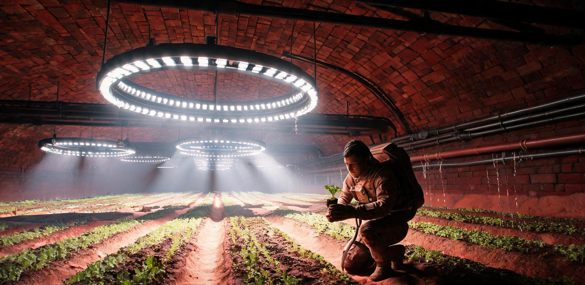

# 新海安温室首作作物生长与产量报告(落地历4年)

**文号:** 海垦字〔落地4〕第017号
**密级:** 内部公开
**主送:** 新海安居务会全体委员、公证书保管厅
**抄送:** 第一温室作业组、医食保障处、船载档案分库

---

## 一、缘起与依据

依《比邻星b晨昏线宜居带地表拓荒与永久避风设施分配法（第一版）》，第一温室（编号GH-1，位于新海安洼地南缘、覆土3.5米）之用地与用水权益经居务会按分配法核准登记，为定居点食源供给之首要设施。GH-1于落地历2年第7周期完成气密调试，落地历3年起分批播种；种源全部出自船载种子库落地历3年移交批次（比拓生〔落地3〕第047号清单首批），随下降器先期窗口抵地表温室过渡库。本报告汇总落地历3年第1周期至落地历4年第2周期（共5个种植周期）之基质、光照、产量数据，并附首株作物命名记录及失败批次存档。

温室选址说明:比邻星耀斑事件频率为太阳的约20倍(船载巡天数据,航程末期复核),地表瞬时紫外通量在主耀斑期间可超地球基准40倍。GH-1以就地风化层与烧结砖拱顶屏蔽,舱内气压维持0.8标准大气压,昼夜循环按公证书附则「历法以26.2小时为一日」执行光照程序。

## 二、基质配置

船载脱水有机基质有限(总量41吨,不可再生),本地替代为唯一出路。落地历3年起采用三层配比:

| 层次 | 构成 | 说明 |
|---|---|---|
| 表层(8cm) | 风化层细粒(粒径<0.5mm)65% + 船载基质30% + 生物炭5% | 风化层经酸洗除高氯酸盐,洗液盐分回收 |
| 中层(20cm) | 粉碎烧结砖40% + 堆肥(人粪尿+秸秆)60% | 堆肥周期不足,第3周期前依赖船载菌剂 |
| 底层 | 粗砾排水层 + 滴灌管网 | 水循环利用率91.3%,低于设计值95%(见第六节) |

本地风化层铁氧化物含量高,pH经酸洗后稳定在6.1–6.4。微量元素钼、硼依赖船载储备,按当前消耗速率可支撑至落地历11年,已列入居务会预警清单。

## 三、光照程序

比邻星为M5.5型红矮星,峰值辐射位于近红外,光合有效辐射占比低且被耀斑扰动,温室遂采用全封闭人工光照,不引自然光。LED配比:660nm红光45%、450nm蓝光20%、730nm远红光10%、白光补全25%。日积分光量(DLI)设定:叶菜类14 mol·m⁻²·d⁻¹,薯类20。能耗占定居点总发电量的38.7%,为主要用能单元,聚变堆负荷调度表另附。

## 四、产量数据(落地历3–4年)

| 批次 | 作物 | 面积(m²) | 周期(日) | 产量(kg) | 活苗率 | 折合kg/m²/年 | 对照地球CEA |
|---|---:|---:|---:|---:|---:|---:|---|
| GH1-P1 | 生菜(船载种,改良) | 120 | 31 | 214 | 97.4% | 21.0 | 达标78% |
| GH1-P2 | 小白菜 | 120 | 38 | 261 | 96.1% | 20.9 | 达标81% |
| GH1-P3 | 马铃薯(微型薯繁) | 300 | 96 | 1,042 | 88.6% | 13.2 | 达标64% |
| GH1-P4 | 大豆 | 200 | 71 | 失败 | — | — | 见第五节 |
| GH1-P5 | 小麦(矮秆系) | 400 | 112 | 489 | 84.2% | 4.0 | 达标52% |
| GH1-P6 | 樱桃萝卜(第2周期补播) | 40 | 28 | 58 | 98.0% | 18.9 | 达标85% |
| GH1-P7 | 豌豆苗(芽苗复种) | 60 | 21 | 96 | 94.3% | 27.8 | 达标92% |

折产公式:产量×365.25÷(面积×周期日)。薯类与小麦单位产出偏低,主因堆肥成熟度不足及授粉振动设备仅一台轮用;补播两行利用第2周期空档架位,不占用主粮面积。鲜产合计已使定居点新鲜食源自给率由落地历3年初的2%升至落地历4年第2周期末的11.4%。

## 五、失败批次记录(存档不销毁)

1. **GH1-P4大豆批次,全损。** 根瘤菌(船载冻干)在本地基质中定殖率仅3%,疑与风化层残留微量高氯酸盐洗脱不完全有关。214株全部黄化绝收。处置:植株焚化回收灰分,基质整体更换,酸洗流程由2遍增至4遍。教训列入《温室操作规程》修订二版第14条。
2. **GH1-P1批次次生损失。** 第19日滴水栓堵塞致17m²生菜根系缺氧,损产约三成。原因为本地细粒随回水迁移沉积,已加装两级旋流过滤。
3. **小麦赤霉样病变2例**,病原PCR未匹配地球已知菌种,亦非船载库记录。样本三份封存于生物隔离柜,编号BIO-Q-07,结论:待定。此处如实记录,不作推断。

## 六、土壤改良与灌溉水源注记

**土壤改良。** 酸洗流程自第4周期起由2遍增至4遍后,表层细粒高氯酸盐残留降至检出限以下;基质表层细粒占比试行由65%上调至70%的试验批次已列入第6周期。堆肥成熟度不足为主因短板:第4周期起引入船载菌剂续代扩培,堆温55℃以上保持时间由9日增至14日,碳氮比回落至18–22,薯类与小麦下季单产预期上调。授粉振动设备第二台已列入制造排程,预计落地历4年第3周期到岗。

**灌溉水源。** 水源双路:本地冰碛融水1号井(日出水约14立方米)与循环回收水按1:4混配;水循环利用率91.3%,低于设计值95%,损耗主项为基质蒸发与酸洗冲洗排放,已列入第6周期管路改造议题。酸洗废液盐分回收率78%,回收盐类入化工车间盐库,月均约0.6吨,不随冲洗水外排。

**种源。** 本报告全部批次种源出自船载种子库落地历3年移交批次(比拓生〔落地3〕第047号清单首批,主粮1,847批次/豆科油料923批次/蔬菜药用3,208批次之先期-A2批次),其中生菜种源即「海安一号」母本同批;本地留种42粒已入种质库(见下节),为脱离船载补给之本星第一笔种质资产。

## 七、首株作物命名事件记录

落地历3年第1周期第31日,首株本地长成之生菜(GH1-P1,株号0001)经居务会决议,不随地球品种名。依《新海安公证书》第三条第三款:全区坑基与避风洞窟一律归全体拓荒者共同体所有,严禁私下进行货币转让、租赁或金融抵押——本地所生新物同此归属,命名权不属任何私人,遂由居务会集体决议,命名为**「海安一号」**。命名仪式出席者47人(占定居点人口之六成),株体按传统分食,人均约4克,味道据在场者回忆「偏苦,但无人剩叶」。留种42粒,编号存入种质库,系本星第一笔本地种质资产。

## 八、结语

落地四年,定居点食源自给率11.4%,距居务会「落地历20年食源自给七成」之规划目标,进度略前于基准线。然微量元素储备、堆肥产能、病原未决三事,均为存续级隐忧。本组不敢以「初捷」二字上报,谨以数据陈情。

**签署:**
第一温室作业组组长 沈青禾(印)
医食保障处复核 欧阳劭(印)
新海安居务会核准 轮值委员长 陈望沙(印)

**用印:** 新海安居务会农垦章(朱文)
**存档:** 船载档案分库甲字第3柜 / 公证书保管厅副本壹份
**落地历4年第2周期第9日**

---

## 图片提示词

地下温室深处,一名农艺师蹲在垄间手托一株生菜,环形LED灯带自头顶照亮无垠作物阵列延伸至画面外,风化土与滴灌管的粗粝质感,大画幅电影感。

Ultra-wide establishing shot, a lone agronomist in worn fabric overalls crouches between crop rows holding a single lettuce seedling, the tiny figure dwarfed by an endless subterranean greenhouse whose LED ring arrays and vaulted regolith-brick ceiling stretch beyond all frame edges; single hard light source from overhead horticultural LED strips casting long shadows across textured alien soil, coarsered-brown Martian-like regolith, condensation on polymer drip lines, dust motes in the beam; heavy physical materials, shot on IMAX 65mm, Hasselblad medium-format clarity, cinematic depth, muted red-green palette, monumental scale contrast.

## 修订记录（元层，非世界内容）

- 2026-08-17：生菜折产19.9改21.0（214×365.25÷(120×31)）；公证书误引两处改真实条款——缘起处改引上位法《比邻星b晨昏线宜居带地表拓荒与永久避风设施分配法（第一版）》（温室用地/用水依据），命名处改引公证书第三条第三款真实内容（共同体所有→集体决议命名），结语「公证书所定」改「居务会规划」；第二节「见第五节」悬空引用改「见第六节」；扩写：折产表加活苗率列并补樱桃萝卜/豌豆苗两行（折产18.9/27.8已复核），新增「土壤改良与灌溉水源注记」节（酸洗4遍、堆肥菌剂扩培、双路水源、种源互文比拓生〔落地3〕第047号）；canon_check 更新。
