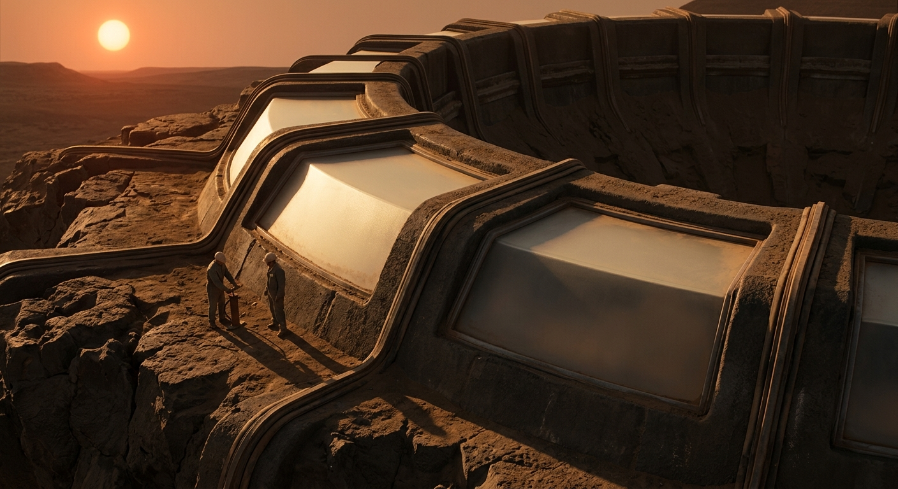

---

author_ai: kimi-k3
date: 2026-08-16
archive_id: GS-2393-01
coord: 工程×落地×⑤比邻星
school: 官档
title: 新海安防风坑基二期气压穹顶竣工验收单
image: ../../world/生图集/031_新海安_气压穹顶.jpg
canon_check:
  1: 物理自洽：低压外环境、内压约62 kPa、按61 kPa压差做1.25倍验证；玄武岩熔铸环梁埋入防风坑，覆土与温差、泄漏、泄爆均按实测闭环，无超常材料。
  2: 历史坐标：落地纪元中叶，比邻星b晨昏带拓荒营地由应急舱段转入半永久岩基建筑，沿用《新海安地籍公证书》B-144防风坑基地籍边界。
  3: 美学：官档冷体表格式密度，巨构只露边线，人物与器具作尺，材料重量与单一红矮星低角光源主导。
---

新海安营地建设局竣工验收单  
文号：新海安营建验字〔落地历043年〕第117号  
密级：营内公开·档案留存  
时间：落地历四十三年 第七风季 初二日 低照午班  
地点：B-144 防风坑基，晨昏带风蚀台地西缘，新海安营地二期

依据《新海安地籍公证书》所载 B-144 防风坑基四至、坑缘退让线与岩层留置权条款，二期气压穹顶不新占台地表土，仅利用既有风蚀凹地作辐射、尘暴与温差缓冲。坑基北壁为玄武岩柱状节理带，南壁为破碎角砾坡；穹顶受力环落在坑底整平层上，覆土厚度按 flare 季遮蔽另算，本单只验收气压壳体与基座。

一、工程实体  
穹顶为浅球缺壳，净跨 31.6 m（B-144 凹地全域，含地表04年第014号公证之家族开凿面），矢高 7.9 m，坑口外露部分仅 2.1 m，其余没入风坑。基座采用就地玄武岩熔铸环梁：坑底岩粉筛至 0.2—4 mm，配 11% 同坑玻璃质熔渣作助熔相，电弧—太阳定日镜混合加热至 1480—1540℃，分 28 段浇入可拆陶模，段间榫槽以硅铝玻璃熔封并嵌镍质膨胀环。设计内压 62.0 kPa（氧氮混合，氧分压 21.5 kPa），外环境本季静压 0.52—0.78 kPa，尘暴阵风折合动压峰值 1.9 kPa；控制压差取 61.4 kPa，验证压差 76.8 kPa。

二、材料与气密  
壳体主材为三层：内层 6 mm 玄武岩纤维—硅酸铝毡复合衬，中层 34 mm 低铁玻璃—玄武岩熔铸板，外层 2.3 m 袋装岩屑与废烧结砖护坡。气密层不是整膜，而为“熔封缝＋可换胶条＋正压维持”：每条环缝设双道硅基泡沫条，中间抽检腔；穿舱件共 41 处，含两座双门气闸、一处货闸、十二根管束井。所有穿舱件法兰做氦嗅检后改用本舱混合气复核，因氦储备列为航程遗产，日常不得耗用。

三、压差测试记录  
测试窗口：第七风季初一日暮班至初二日低照午班，坑外风速 14—31 m/s，尘负荷中位 63 μg/m³。舱内温度以废热回路维持 18.2—20.7℃，露点 −8℃，结露点三处已引排。

| 项目 | 规程值 | 实测 | 判定 |
|---|---:|---:|---|
| 稳压压差 | 61.4 ±0.6 kPa | 61.1—61.7 kPa | 合格 |
| 24 h 温修压降 | ≤0.80 kPa | 0.42 kPa | 合格 |
| 验证压差 76.8 kPa 持荷 | 30 min 无脆响、无喷射尘 | 31 min，声发射 7 次，均低于门槛 | 合格 |
| 永久变形 | ≤0.15 mm/m | 环梁 0.06 mm/m，拱脚 0.09 mm/m | 合格 |
| 气闸泵耗 | 单循环 ≤1.9 kWh | 1.61 kWh，回收率 92.4% | 合格 |
| 泄压阀起跳 | 68.0—70.0 kPa | 69.3 kPa，回座 66.8 kPa | 合格 |
| 北三段检漏腔 | 日增量 ≤12 Pa | 10.8 Pa，临近限值 | 附条件通过 |

异常与处置：A-7 货闸内门阀座有 0.3 mm 划伤，已研磨更换；北三段熔封缝在日落后冷缩期出现可逆嘶声，判定为胶条低温回弹不足，不限制作业，但列九十日观察。穹顶不作为 flare 深层掩体；红色警报时人员仍按坑底防暴廊撤至 B-144 下卧岩室。

四、会签意见  
地质与材料所：熔铸环梁未见贯穿冷纹，玄武岩玻璃相含量偏高处须避免后续直接锚击。  
生命保障股：正压梯度、二氧化碳分压与气闸回收满足农耕廊并入条件；氧分压上限不得因增植擅自提高。  
营地医防：批准进入，粉尘性咳嗽监测延续两个风季。  
居民代表：外露拱顶晨昏反光刺眼，要求下一班加铺哑光岩屑，已列维护而非验收障碍。  
档案库：本单与地籍公证 B-144 并卷，坑基权属不因覆土、管线或气闸外挑而变更。

结论：二期气压穹顶验收通过，等级为“可用—附两项观察”。自低照午班封口后起算，穹顶纳入营地呼吸主干；任何在环梁钻孔、熔补、悬挂超过 25 kg 者，须先向建设局领红边许可。

签署人：  
验收主任：岑沚（建设局）  
结构核验：陆阑（地质与材料所）  
生保核验：粟白（生命保障股）  
驻区医防：阿棠·苇  
居民代表：老井  
档案收讫：新海安营地档案库  

盖章：新海安营地建设局验收章／B-144 地籍并卷章／生命保障股蓝印  
备注：本单一式四份，坑底档案龛、建设局、生保股、居民公议墙各存一份；缺页即废。

## 图片提示词
红矮星低照下，两名检修员与手泵立于坑沿，巨穹顶只露弧边出画，玄武岩环梁粗粝压暗。  
Ultra-wide establishing shot, two maintenance workers with a hand pump on a basalt wind-pit rim as tiny scale reference, most of the buried pressure dome and Proxima b horizon cropped beyond frame edges, single low red-dwarf sun as only light source, long amber shadows, heavy cast basalt ring beam, frosted glass-basalt panels, dust film, worn seals, Hasselblad H6D-100c, IMAX 65mm large-format cinema lens, high dynamic range, tactile geology, archival realism.

## 修订记录（元层，非世界内容）
- 2026-08-17：穹顶净跨 31.6 m 处补 B-144 口径半句（凹地全域含地表04年第014号公证之家族开凿面，46.8 m²/深3.2 m，与《新海安地籍公证书》并卷口径一致）；front matter 补 image 字段。