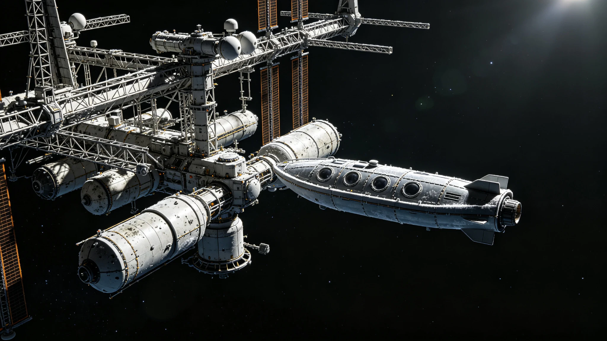

# 日球层顶边界科学站"边疆-01"首批星际介质原位采样公报

**公报文号**：HPL-ISM-2091-001
**发文单位**：深空物理研究所日球层边界探测室
**工程标的**：日球层顶边界科学站"边疆-01"原位采样系统
**采样周期**：2091年6月1日 — 2091年8月31日（首批三个月连续采样）
**站点位置**：日球层顶迎风面，距日约118AU，黄道面上方12°

---

## 一、站点与采样系统概况

边疆-01科学站于2084年发射，经7年巡航于2091年5月抵达日球层顶边界区，是人类首个驻留日球层顶的科学平台。本站核心载荷为"听风"原位中性原子质谱仪（有效面积0.8m²，质量分辨率M/ΔM≥200）与"探尘"星际尘埃碰撞探测器（有效面积4.2m²）。全站由1.5MW核裂变反应堆供电，常驻科研人员6人。

### 采样系统核心参数

| 参数项 | 设计值 | 首批实测 |
|:---|:---:|:---:|
| 中性原子质谱仪质量范围 | 1-200 amu | 1-200 amu |
| 质量分辨率 | ≥200 | 214 |
| 有效采集面积 | 0.8 m² | 0.79 m² |
| 尘埃探测器灵敏度 | ≥10⁻¹⁷ kg | 8×10⁻¹⁸ kg |
| 采样时间分辨率 | 10秒 | 10秒 |
| 数据缓存容量 | 48 TB | 48 TB |

---

## 二、首批星际介质采样结果

首批三个月连续采样共获取中性原子谱线数据12.4万组、尘埃碰撞事件3,847次。经站内初步处理（去太阳风残余、去宇宙线本底），星际介质关键参数如下：

| 测量参数 | 首批实测值 | 理论预测值 | 偏差 |
|:---|:---:|:---:|:---:|
| 星际中性氢数密度 | 0.147 ± 0.012 cm⁻³ | 0.1-0.2 cm⁻³ | 符合 |
| 星际中性氦数密度 | 0.011 ± 0.003 cm⁻³ | 0.008-0.015 cm⁻³ | 符合 |
| 氢/氦数密度比 | 13.4 ± 2.1 | 10-14 | 符合 |
| 星际介质温度 | 6,420 ± 380 K | 6,000-8,000 K | 符合 |
| 星际介质流速（相对太阳） | 26.4 ± 1.2 km/s | 25-27 km/s | 符合 |
| 星际尘埃通量 | 1.8×10⁻⁴ m⁻²s⁻¹ | 1-3×10⁻⁴ m⁻²s⁻¹ | 符合 |

---

## 三、异常发现与待解问题

首批采样中发现两项超出理论预期的异常信号，已标记为高优先级待分析课题，原始数据已全部缓存并分批回传地球（单程通信时延16小时8分，传输速率8Mbps，完整回传预计需142天）。

| 异常编号 | 信号特征 | 持续时间 | 初步假设 | 优先级 |
|:---|:---|:---:|:---|:---:|
| ANM-001 | 质量数18（H₂O⁺）异常升高，为背景值3.7倍 | 间歇性，累计42小时 | 星际彗星尾部挥发物？ | 高 |
| ANM-002 | 尘埃碰撞事件中，质量>10⁻¹²kg的大颗粒占比12%（预期<5%） | 持续 | 局部星际尘埃团块？ | 中 |

---

## 四、仪器与平台状态

首批采样期间，站内设备运行稳定，无重大故障。核反应堆功率稳定在1.42MW，热控系统在极寒环境（站外温度约8K）下维持舱内温度22±2°C。

| 设备 | 运行时长 | 故障次数 | 可用率 | 状态 |
|:---|:---:|:---:|:---:|:---:|
| 中性原子质谱仪 | 2,160小时 | 1次（自动重启） | 99.93% | 正常 |
| 尘埃碰撞探测器 | 2,160小时 | 0次 | 100% | 正常 |
| 核反应堆 | 2,160小时 | 0次 | 100% | 正常 |
| 激光通信终端 | 2,160小时 | 2次（指向重捕） | 99.87% | 正常 |
| 姿态控制系统 | 2,160小时 | 0次 | 100% | 正常 |

---

## 五、采样结论

边疆-01科学站首批星际介质原位采样任务圆满完成，核心参数与理论预测一致，验证了日球层顶驻留采样的技术可行性。两项异常信号（ANM-001水分子异常、ANM-002大颗粒尘埃占比偏高）已标记待深入分析。**首批采样数据验收合格，本站自2091年10月起进入长期连续采样阶段，计划每季度发布一次采样公报。**

**探测室主任（签章）**：深空物理研究所
**日期**：2091年9月17日
