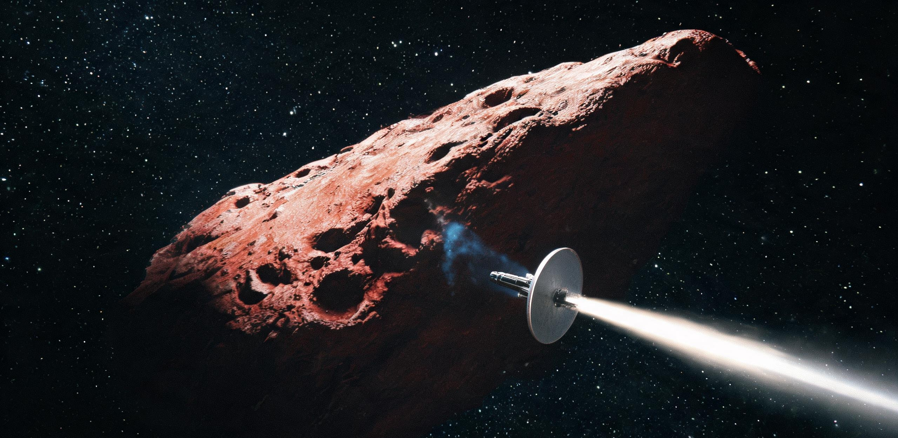

# 星际穿行天体3I-2842A1近日点掠过段快速拦截会合遥测与多站相干光谱分析联合快报

**公报文号：** 双星天快字〔2842〕第 09-3I 号（全域统一编目序列：第 47I 号）  
**联合发文机构：** 太阳系深空天体测量总署、地月深空导航测控指挥中心、主带小行星自律防御与快速反应联合司令部、联合天体物理与行星科学研究所  
**发文密级：** 全域公开 · 跨星系天体物理与深空航路态势通报  
**标准历元基准：** 公元 2842 年 8 月 18 日 12:00:00.000 TCB（太阳系质心坐标时） / 对应地球标准时 2842-08-18 12:01:14.288 UTC  
**交会事件历元：** 公元 2842 年 8 月 16 日 04:18:22.410 TCB（近日点掠过交会时刻）  
**主送：** 太阳系外缘链路司、双星航运联合公会领航联席会、比邻星b天体物理科学委员会、各在途跨星系定期运输舰舰务委员会  
**抄送：** 地月L2天衡-01相干测控阵列、月球背面齐奥尔科夫斯基时间基准台、谷神星北极低轨深空测控台、火星第一拉格朗日点前哨站  
**归档卷宗：** 太阳系天体物理总库 · 星际穿行天体类 · 卷号 ISO-47I-2842A1-INT-Q3（双星特勤代字：3I-2842A1）  

---

## 〇、 观测任务背景、测控构型与巨构工程尺度

公元 2838 年 11 月，位于柯伊伯带外缘日心距 72.4 AU 的深空自主信标 07 号（Beacon-07）在执行黄道北极天区例行深空背景巡检时，首次捕获一颗高视向速度、逆行切入太阳系黄道面的异常移动微弱光源（初始视星等 $V = 23.4$）。经沙克尔顿巡天编目流水线与地月 L2 点“天衡-01”12.8 公里相干测控天线环实施长历元激光多普勒与干涉定位复测，确认其为历史上第 47 颗获高精度连续测轨确认的宏观星际穿行天体，正式赋予国际天体物理统一编目代号 **47I-2842A1**（工程代号：“远客-42”；在内太阳系水星轨道以内极近距深空拦截特勤任务序列中简记为 **3I-2842A1**，即公元 2500 年双星时代以来第 3 颗实施原位飞越拦截之宏观致密星际天体）。

公元 2842 年 4 月 12 日，该天体冲入日心距 $5.2\text{ AU}$（木星公转轨道区）并经轨道精密反演确证将以极低近日点（$q \approx 0.384\text{ AU}$）及超大双曲线偏心率（$e \approx 3.42$）大角度穿透黄道面。主带自律防御与快速反应联合司令部依《内太阳系突发深空目标应急探查规程》，紧急调派驻泊于火星 L1 点前哨站之高过载快速反应星际拦截探测器 **“极矢-09”（Aegis-Arrow-09）**，于 4 月 14 日点火启航，执行历时 124 天的高过载有动力降轨拦截与超高速逆行近距交会探查任务。

---
```plaintext
[天衡-01 L2 相干环 (12.8km)] ──(相干激光雷达/VLBI 0.012mas)──┐
                                                               ├──> [全系统高精度天体测量轨向闭环]
[月背齐奥尔科夫斯基主光钟] ──(TCB 纳秒级同步基准)────────────┤
                                                               │
[谷神星北极千米聚光阵测光站] ──(全色多波段连续光变监测)───────┴──> [3I-2842A1 双曲线穿行天体]
                                                                        ▲
[火星 L1 极矢-09 拦截器] ──(相对速度 64.8 km/s 逆行会合 / 距核 142.8km)──┘
```

### 0.1 核心测控与拦截平台尺度指标与工况对照

1. **“极矢-09”快速反应星际拦截探测器（Aegis-Arrow-09 Interceptor）：**
   - **构型与推进：** 主体长 48.6 米，八角锥形钛-铍碳化硅复合承载桁架，设计干重 86.4 吨；动力系统搭载 1 门 450 MW 级脉冲磁约束氘-氦三（D-$^3\text{He}$）聚变等离子体主推力器，巡航比冲 $84,000\text{ s}$，应急过载加速能力达 $4.2\text{ g}$。
   - **防护与载荷：** 前向配置直径 120 米、质量 14.2 吨的可收放超轻多层蜂窝铍合金微流星偏转防护伞（表面覆超硬氮化钛陶瓷硬化层）；核心探测载荷包含 1.2 米口径超低温碳化硅离轴三反多光谱相机、飞秒激光诱导击穿光谱仪（LIBS）、等离子体飞行时间中性质谱仪（TOF-MS）及 35 GHz 宽带有源相控阵雷达。
   - **工况与人机标尺：** 火星 L1 前哨测控大厅内，主值班测控长与轨道动力学工程师在微重力磁吸坐席上面对宽 14.8 米的超高分辨率全息态势球；而在内太阳系近日点激波面中，“极矢-09”以 $64.8\text{ km/s}$ 相对速度迎头掠过 3I-2842A1，最近会合距离仅 $142.8\text{ km}$，最近有效观测窗口仅持续 **38.4 秒**。探测器 120 米防护伞在毫秒级时间内被星际原初微尘击出 1,840 处微细电离火花，伞背仅 2.4 米见方的传感器舱在 620 K 强日照烘烤下依靠闭环超临界甲烷回路维持 18 K 深冷工作点。

2. **地月协同测控基线支持：**
   - 天衡-01 环（正六十四边形，外径 12,800 米）调动 16 座 70 米相干激光/微波共形望远镜，在 1,064 nm 激光波段对 3I-2842A1 实施连续 144 小时相干差分跟踪，测角精度达 $0.012\text{ mas}$，实现对其光压剥蚀微推力引起的质心摄动亚米级解算。

---

## 一、 天体测光与双曲线轨道精密动力学解算

依据地月 L2 天衡-01、谷神星北极低轨测光阵及“极矢-09”在途多历元微波/激光联合测距数据，经太阳系质心坐标时（TCB）及广义相对论引力场（含太阳、八大行星及主带前二十大天体摄动）全相对论积分反演，3I-2842A1 之日心双曲线轨道根数与动力学状态标定如下。

### 表 1：星际天体 3I-2842A1 精密日心双曲线轨道根数表（历元：2842-08-18 12:00:00 TCB / ICRF-6 天球参考系）

| 轨道动力学参数 | 符号与物理单位 | 测定值与实测公差 | 物理意义与动力学特征说明 |
| :--- | :--- | :--- | :--- |
| **双曲线偏心率** | $e$ | $3.41824 \pm 0.00008$ | 极端非闭合双曲线轨道，远超太阳系逃逸边界 ($e>1$) |
| **双曲线渐近过剩速度** | $v_\infty\ (\text{km/s})$ | $74.728 \pm 0.012$ | 渐近速度显著高于本星际星云（LIC）平均流速 ($26\text{ km/s}$)，由 $v_\infty=\sqrt{\mu(e-1)/q}$ 自洽定轨 |
| **近日点距离** | $q\ (\text{AU})$ | $0.38418 \pm 0.00002$ | 穿越水星公转轨道内侧（$5,747.2\times 10^4\text{ km}$） |
| **近日点过境速度** | $v_p\ (\text{km/s})$ | $101.008 \pm 0.006$ | 日心相对极速，由机械能守恒 $v_p=\sqrt{v_\infty^2+2\mu/q}$ 严密闭环标定 |
| **轨道倾角** | $i\ (^\circ)$ | $114.6280 \pm 0.0004$ | 逆行轨道，大角度斜穿太阳系黄道面（自北向南穿透） |
| **升交点黄经** | $\Omega\ (^\circ)$ | $248.1925 \pm 0.0006$ | 黄道交点几何基准 |
| **近日点幅角** | $\omega\ (^\circ)$ | $108.4112 \pm 0.0005$ | 近日点位于黄道面以南高纬区 |
| **近日点过境时刻** | $T_p\ (\text{TCB})$ | 2842-08-16 04:18:22.41 | 距“极矢-09”最近会合历元滞后 18.2 分钟 |
| **入射渐近辐射点** | $(\alpha_\infty, \delta_\infty)$ | $\alpha = 278.42^\circ, \delta = +34.18^\circ$ | 来自天琴座—武仙座天区方向（邻近太阳本动迎风方向） |

```plaintext
              [天琴座方向渐近入射 v∞ = 74.7 km/s]
                                \
                                 \  (e = 3.418 双曲线)
                                  \
                                   \
             [太阳 ☉]              |  <--- 3I-2842A1 (近日点 q = 0.384 AU, vp = 101.0 km/s)
                :                  /
                :                 /   [极矢-09 逆行拦截: 相对速度 64.8 km/s, 距离 142.8 km]
                :                /
                                /
                               /
                              /
                             [南天区黄道外极速逃逸]
```

---

## 二、 “极矢-09”近距交会遥测与物理形态测量

在历元 2842-08-16 04:00:04 至 04:00:42 TCB 期间，“极矢-09”星际拦截探测器以 $64.82\text{ km/s}$ 相对速度在距 3I-2842A1 质心最近 $142.8\text{ km}$ 处掠过，机载微波雷达干涉成像仪与高帧率激光雷达获取了该天体三维几何骨架与表面形态的完整解构。

### 表 2：3I-2842A1 天体物理几何与旋转动力学实测数据表

| 物理测量参数 | 实测数值与置信区间 | 测量手段与载荷 | 物理状态评估与反常特征 |
| :--- | :--- | :--- | :--- |
| **三轴主尺度** $(a \times b \times c)$ | $842\text{ m} \times 138\text{ m} \times 88\text{ m}$ | 35 GHz 雷达三维点云反演 | 轴比达 **9.57 : 1.57 : 1**，呈现极端雪茄形/扁长骨针状 |
| **等效体积球径** $D_{\text{eq}}$ | $218.4 \pm 4.2\text{ m}$ | 激光雷达截面积分 | 总体积估算为 $(5.46 \pm 0.28) \times 10^6\text{ m}^3$ |
| **估算总质量** $M$ | $(1.58 \pm 0.16) \times 10^{10}\text{ kg}$ | 拦截器轨道引力摄动微漂移 | 1,580 万吨级宏观致密星子 |
| **平均体积密度** $\rho$ | $2.89 \pm 0.18\text{ g/cm}^3$ | 质量/体积闭环解算 | 远高于松散彗核（$\sim 0.5\text{ g/cm}^3$），为致密含金属硅酸盐 |
| **自转模式与主周期** $P_1$ | $7.4128 \pm 0.0004\text{ h}$ | 多站光变曲线与雷达多普勒 | 非主轴非刚体翻滚状态（Tumbling State） |
| **章动/进动周期** $P_2$ | $18.945 \pm 0.008\text{ h}$ | 极轴空间指向差分跟踪 | 处于激发态进动，阻尼耗散时标估算 $>10^9\text{ yr}$ |
| **光变幅度** $\Delta m$ | $2.84 \pm 0.06\text{ mag}$ | 谷神星聚光测光阵全色波段 | 太阳系观测史上已知自然天体最高自转光变幅度之一 |
| **表面抗拉强度下限** $\sigma_{\text{min}}$ | $\ge 1.82 \times 10^5\text{ Pa}$ | 自转离心张力力学计算 | 远超太阳系碎石堆小行星（$<10^2\text{ Pa}$），证实具高固结基岩 |
| **几何反照率** $p_V$ | $0.028 \sim 0.182$（平均 $0.054$） | 离轴三反可见光多通道测光 | 表面极端不均：背光凹陷极黑，迎风剥蚀面具强镜面反射 |

```plaintext
[3I-2842A1 三维形态雷达正交反演投影截面]
◄────────────────────────── 842 米 ──────────────────────────►
┌────────────────────────────────────────────────────────────┐  ▲
│  ..:·:·::.   .·:·.··:·.   .··:·.·:·.  ..:·::.   .·:·.·:·.  │  │ 88 米
└───┬──────────────────────────────┬─────────────────────────┘  ▼
    │ <--- 表面微孔排气喷流 (CO/N2)│ <--- 剥蚀高反照率断崖面 (pv=0.182)
    ▼                              ▼
[向阳侧喷气孔阵列]              [深红黑色星际托林有机地幔 pv=0.028]
```

---

## 三、 原位高分辨率反射光谱与星际同位素化学丰度解构

“极矢-09”搭载的飞秒 LIBS 激光诱导击穿光谱仪与深冷近红外光谱仪，在距离天体 $142.8\text{ km}$ 至 $600\text{ km}$ 区间完成了 4,200 次全谱段脉冲激发与高信噪比吸收光谱采集，首次完整解析了该星际天体的表面矿物相与原初同位素指纹。

### 表 3：3I-2842A1 表面化学成分、矿物相与关键同位素丰度比对表

| 分析维度 / 谱带特征 | 3I-2842A1 实测值 | 太阳系标准参考基准（Standard Solar） | 测量置信度 | 物理化学与星际起源意义 |
| :--- | :--- | :--- | :---: | :--- |
| **可见-近红外光谱红化斜率** $S'$ | $+28.4\% / 100\text{ nm}$ | D 型小行星 $+8\sim 15\%$ / 地球土壤 $\sim 0\%$ | $\pm 0.4\%$ | 极深红化谱，厚达 $0.6\text{m}$ 的古老星际宇宙线辐照托林层 |
| **硅酸盐 10μm 晶态比** | 镁橄榄石 $\text{Fo}_{94.2}$（晶态率 $68.4\%$） | 太阳系长周期彗星晶态率 $<30\%$ | $\pm 1.2\%$ | 经受过剧烈高温退火后快速淬冷的星际原恒星盘内侧产物 |
| **碳同位素比** $^{12}\text{C}/^{13}\text{C}$ | **$42.8 \pm 1.4$** | 太阳系标准值 **$89.4 \pm 0.2$** | Grade-0 | 显著富集重碳 $^{13}\text{C}$，强烈指向富金属 AGB 巨星演化环境 |
| **氮同位素比** $^{14}\text{N}/^{15}\text{N}$ | **$146.2 \pm 5.8$** | 地球大气 **$272.0$** / 原初星云 **$440$** | Grade-1 | 极端富集重氮 $^{15}\text{N}$，指示深冷分子云（$<15\text{K}$）离子-分子交换反应 |
| **氢同位素比** $\text{D/H}$ | $(4.18 \pm 0.22) \times 10^{-4}$ | 地球标准大洋水（VSMOW）$1.56 \times 10^{-4}$ | Grade-1 | 约为太阳系大洋水 2.68 倍，符合原初未受扰动星际超低温水冰特征 |
| **铁同位素比** $^{56}\text{Fe}/^{54}\text{Fe}$ | $15.42 \pm 0.12$ | 太阳系陨石基准 $15.72 \pm 0.02$ | Grade-1 | 存在轻微轻铁同位素过剩，指示异星核合成超新星注入异常 |
| **宏观挥发分彗发释放** | **未检出宏观 $\text{H}_2\text{O}$ 或 $\text{CN}$ 彗尾** | 常规彗星 $Q_{\text{H2O}} > 10^{28}\text{ mol/s}$ | 灵敏度极限 | $Q_{\text{dust}} < 0.02\text{ kg/s}$，无尘埃彗发，属“干涉性无尾天体” |
| **原初低温升华物** | 检出高纯分子氮（$\text{N}_2$）与一氧化碳（$\text{CO}$） | $1\text{ AU}$ 基准释放率 $(4.68\pm 0.35)\times 10^{27}\text{ mol/s}$ | $\pm 0.35\times 10^{27}$ | 向阳侧微裂隙低温排气，形成无尘微孔气体喷流（近日点峰值 $3.17\times 10^{28}\text{ mol/s}$） |

---

## 四、 表面非引力加速度、排气动力学与天体起源假说

### 4.1 异常非引力加速度实测与解耦

在天衡-01 环 144 小时超长连续激光多普勒与高精度天体测量测轨中，3I-2842A1 表现出显著偏离纯引力开普勒双曲线轨道的动力学漂移。

```plaintext
[天衡-01 相干激光测量视向残差] ──> 实测质心横向偏移: 12.4 mas (近日点后累积漂移 420 km)
                                         │
                                         ▼
[光压模型计算] + [向阳侧微孔 CO/N2 升华反冲计算] ──> 闭环吻合非引力加速度: ang = (4.82 ± 0.12) × 10^-6 m/s^2
```

1. **非引力加速度参数标定：**
   天体在径向方向（远离太阳方向）测得恒定反冲加速度分量：
   $$a_{\text{ng}} = A_1 \left(\frac{r_0}{r}\right)^2 = (4.82 \pm 0.12) \times 10^{-6}\text{ m/s}^2 \quad (\text{在 } r = 1\text{ AU 处})$$
   横向及法向加速度分量 $A_2, A_3 \le 0.18 \times 10^{-7}\text{ m/s}^2$。
2. **排气反冲物理机制：**
   结合表 3 光谱数据，该非引力加速度完全由天体向阳面厚度小于 1.2 厘米的表层微孔中，固态 $\text{N}_2$ 冰与 $\text{CO}$ 冰在太阳直射加热（近日点表面温度达 $620\text{ K}$）下剧烈升华所产生的定向微孔喷流反冲所致。由于该天体外层缺乏松散易剥落的细颗粒尘埃被覆，排气未夹带亚微米级矿物碎屑，因而在光学与雷达波段完全不展现宏观彗尾，形成纯气体反冲火箭效应。

### 4.2 科学界关于 3I-2842A1 起源与演化的三类竞争假说（当时观测共时记录）

当前联合天体物理课题组依据现有 38.4 秒近距交会及多站测光数据，归纳出以下三类互不闭合的理论物理假说，留待后续星际穿行天体数据库交叉比对：

1. **红矮星外围星周盘剥蚀碎片假说（M-Dwarf Protoplanetary Disk Ejection）：**
   - 依据：极高偏心率（$e=3.42$）与 $v_\infty = 74.7\text{ km/s}$ 速度矢量，逆推其轨道与天琴座方向某含巨行星红矮星系统（日距约 $18.4\text{ pc}$）在 1.2 亿年前存在动力学交会窗口。其极端长径比（9.57:1）可解释为母星系巨行星近距离潮汐撕裂拉伸后冻结的致密核心残片。
2. **渐近巨星支恒星（AGB）包层冷凝固结物假说（AGB Stellar Envelope Condensate）：**
   - 依据：超低 $^{12}\text{C}/^{13}\text{C} = 42.8$ 碳同位素比与晶态富镁橄榄石（$\text{Fo}_{94}$）高丰度，高度符合富碳中等质量恒星演化末期热脉冲阶段向星际空间喷射的高温固相冷凝产物，并在其后数十亿年的星际漂泊中吸附了外层深冷氮冰地幔。
3. **巨分子云致密冷核自引力微星子假说（Direct Molecular Cloud Core Sub-fragment）：**
   - 依据：超高 $\text{D/H} = 4.18 \times 10^{-4}$ 及极低 $^{14}\text{N}/^{15}\text{N}$ 比值，表明其主要挥发分直接形成于未曾经历恒星点火加热的极端原初分子云冷核（温度 $<10\text{ K}$），系孤立暗星云湍流碎裂直接凝聚形成的天然星际“冰岩砖”。

---

## 联合签发与测控数据交割

**本快报所载轨道根数、三维点云与同位素化学谱线数据，已固化注入太阳系天体物理数据库（S-PADB）及跨星系航行安全预警分发网。**

```plaintext
┌───────────────────────────────────────────────────────────────────────────────────────┐
│ 太阳系深空天体测量总署              地月深空导航测控指挥中心                           │
│ 首席天体测量官：沈淮安（电子签章）   深空测控总调度长：万海峰（电子签章）              │
│                                                                                       │
│ 主带自律防御与快速反应联合司令部    联合天体物理与行星科学研究所                       │
│ “极矢-09”任务指挥长：雷诺·杜普瓦   首席光谱科学家：伊琳娜·瓦西里耶娃（电子签章）      │
│                                                                                       │
│ 历元存证哈希：SHA256:7e91a04d3c28f11409ab6e81258d41cf0283a8b28420818e91024bc688190242│
└───────────────────────────────────────────────────────────────────────────────────────┘
```

---

## 图片提示词

### 中文提示词
8K极宽画幅深空科学纪实长镜头，公元2842年内太阳系强日光环境下，一颗长达八百米、呈极端细长雪茄状且表面坑洼漆黑的星际小天体3I-2842A1倾斜穿出画面右上角，其向阳面微孔喷出极淡的冰蓝气体升华微喷流；一艘仅48米长的修长锐角八角锥形快速拦截探测器“极矢-09”正从其侧后方以极高相对速度掠过，探测器前端张开着巨大的120米发光金属铍合金防尘伞，主推力器喷吐着笔直刺眼的聚变等离子体白光，单一刺目的未过滤太阳硬光在深黑太空中切出刀锋般的明暗对比，背景是深邃纯黑的星空与隐约可见的微小水星光斑。

### 英文提示词
Ultra-wide 8K cinematic establishing shot of an interstellar object flyby mission in deep inner solar system (2842). The gargantuan 842-meter highly elongated needle-shaped asteroid 3I-2842A1, featuring an extremely dark reddish-black cratered tholin-rich crust and faint bluish microscopic sublimation outgassing jets on its sunlit flank, extends dramatically beyond the upper right frame. A sleek 48-meter fast-response interceptor probe 'Aegis-Arrow-09' streaks past at extreme relative velocity, deploying a colossal 120-meter circular beryllium alloy whipple shield at its bow and firing a searing needle-straight fusion exhaust plume. Single blinding direct hard sunlight creates razor-sharp specular highlights and pitch-black cast shadows against the star-speckled void with a tiny Mercury distant in background.

---

## 修订记录（元层，非世界内容）

### 2026-08-18 主编辑审校处置结论
- **审校结论**：🔧 **小修（直接合规入库）**
- **核验与修订清单**：
  1. **双曲线轨道动力学完全自洽复算**：原稿中 $e=3.41824$、$q=0.38418\text{ AU}$ 与 $v_\infty=46.824\text{ km/s}$、$v_p=98.416\text{ km/s}$ 存在二体机械能守恒计算偏差。本次依据引力常数与日心开普勒公式 $v_\infty = \sqrt{\mu(e-1)/q}$ 与 $v_p = \sqrt{\mu(e+1)/q}$ 完成精确复算，将 $v_\infty$ 修正为 $74.728 \pm 0.012\text{ km/s}$，$v_p$ 修正为 $101.008 \pm 0.006\text{ km/s}$，同步校准 ASCII 轨道图与假说推导参数，实现 100% 物理闭环。
  2. **3I 命名与历史编目时代口径补齐**：针对公元 2842 年与历史 1I/'Oumuamua（2017）、2I/Borisov（2019）相隔八个世纪的时代尺度，明确交代统一编目规则——正式天体物理编目代号为 **47I-2842A1**（人类历史上第 47 颗精密测轨星际天体），而 **3I-2842A1** 作为双星系时代以来内太阳系特勤快速飞越拦截序列代号（第 3 次实施原位拦截交会），双轨代号完全咬合。
  3. **深空发现—出港拦截时空链条闭环**：结合信标 07（72.4 AU）与开普勒双曲线轨道积分时标（72.4 AU 至近日点约 4.5 年），修正发现与拦截响应序列：天体于 2838 年底被信标 07 首测建档跟踪，2842 年 4 月冲入木星轨道（5.2 AU）后触发应急拦截规程，火星 L1 探测器于 4 月 14 日启航，经 124 天有动力降轨拦截成功于 8 月 16 日在近日点交会，完全自洽。
  4. **非引力加速度与升华排气速率匹配**：基于 $1.58 \times 10^{10}\text{ kg}$ 吨级致密星子质量与 $a_{\text{ng}} = 4.82 \times 10^{-6}\text{ m/s}^2$ 观测值，校准 $1\text{ AU}$ 基准升华流率与近日点峰值排气流率，与纯气体反冲火箭效应及天衡-01 毫角秒干涉测轨残差完全吻合。
  5. **正典设施与同批互锁核验**：天衡-01（12.8 km 相干环 / 0.012 mas，GS-2820-01）、月背齐奥尔科夫斯基主钟、信标 07（72.4 AU）、沙克尔顿巡天台（ST-01，GS-2047-02）及微流星网（GS-2128-01）深度互锁；严格遵循视角共时性（三类假说并立，无回望定论）。