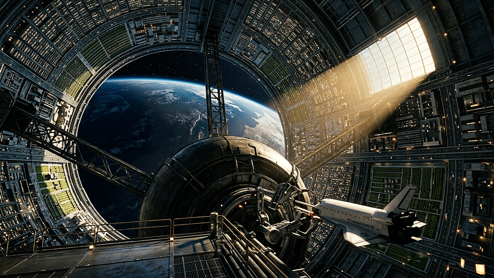
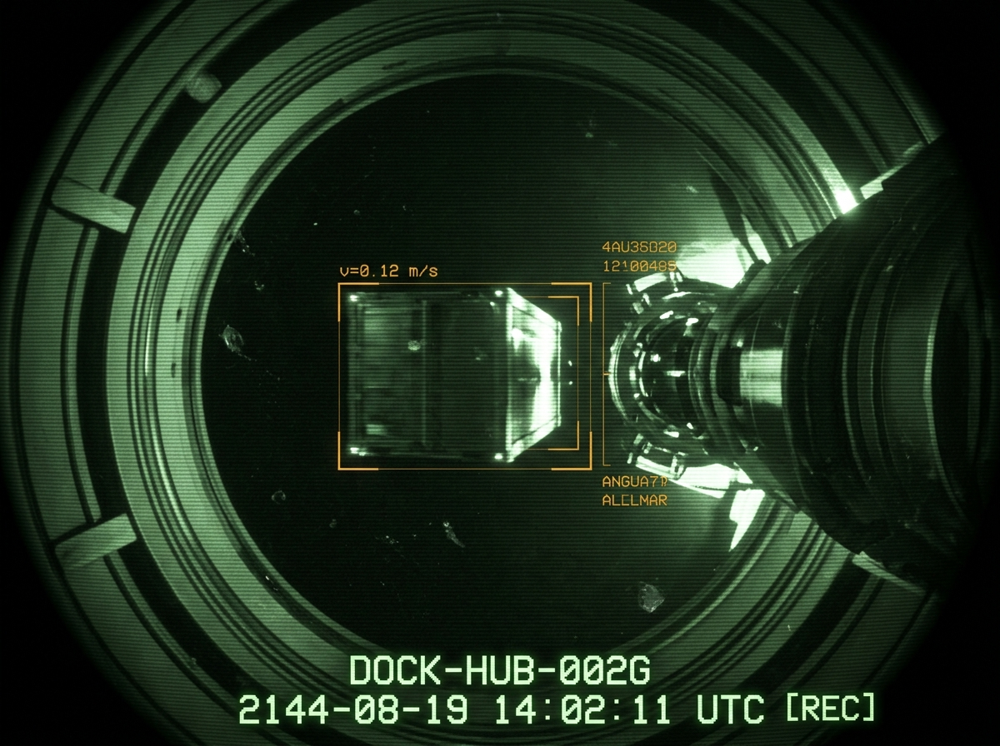

**曙光三环轨道栖息地联合管理局 · 航行管制中心**  
**中央轴心垂直天井（Sector-0）进港调度日志**

工单批号：航-管-2096-19A  
进港载具：环带货运自治公会 重型穿梭机「信天翁-09」（机长 48 米）  
进港航线：北极轴向天井 ➔ 中央离心球核 4 号泊位  
观测基准：曙光三环主环体内壁（内径 12 公里，自转线速度 140 m/s）  
双轨时间：任务日第 17,420 周期 / 霜降后第三个维护日

---

### 一、 天井进港雷达下行遥测表（节选）

| 相对高度 (Z轴) | 距环壁距离 | 测得局部人工重力 | 姿态与喷控记录 |
|---|---|---|---|
| **+6,000 m (轴心入口)** | 6,000 m | 0.002 g (微重力失重区) | 主推进器关机，姿态调整喷嘴点火 3 秒，切入中心垂直下沉走廊。 |
| **+3,200 m (中枢球冠区)** | 5,100 m | 0.085 g | 穿越第 2 道环形导轨桁架；航窗可俯瞰下方主环体万家灯火与行星云层。 |
| **+800 m (球核外环支臂)** | 1,200 m | 0.420 g | 展开磁吸缓冲起落架；对准 4 号旋转泊位主锁销（锁定转速差 0.01 rpm）。 |
| **0 m (对接锚定)** | 0 m (锁定于球核) | 0.650 g (标准工作重力) | 液压卡爪合拢，气密套筒对接成功；主环体离心风道换气接入。 |

---

### 二、 「信天翁-09」进港黑匣录音抄件（频段：进港管制-01）

> **【08:24:11】进港管制**：  
> 信天翁-09，这里是三环中央调度。你已进入北极垂直中枢天井，请关闭主离子引擎，将姿态锁定在中央下沉激光导引线上。

> **【08:24:32】信天翁-09（领航员）**：  
> 信天翁-09 收到，主引擎已切断。……管制台，今天天井里的能见度真好，我们一穿过外环闸门，底下整座十二公里的环形内城全在发光。从这儿看下去，主环体像个无底的钢铁深井，正中央的重力球核就像悬在深井里的一颗心脏。

> **【08:25:05】进港管制**：  
> 别光看风景，注意你的侧向漂移率。主环体内壁自转产生的人工风道在 Z 轴 3000 米处有轻微剪切气流，修正你的偏航角 1.2 度。

> **【08:25:40】信天翁-09（领航员）**：  
> 偏航角已修正。穿过中央球体下方的时候，我们正好看见下方的地球地平线——从天井正中央的透明减压窗里漏出来，蓝白色的云海正好卡在环柱的内切圆里。每次从深空跑货回来，只有在这个中枢天井垂直扎下去的时候，才觉得这十几万人住的铁环子真是个奇迹。

> **【08:26:15】进港管制**：  
> 对接臂已就绪。4 号泊位锁销已展开，允许以 0.5 米/秒相对速度进锁。欢迎回到曙光三环，地表第四批咖啡豆配额已经送达 B7 食堂，对接完成后去刷你的流转单。

---

### 三、 进港签讫

* **核准结论**：进港姿态平稳，无超限横向摆动；主环体内壁反射光栅与天井航道照明工作正常。
* **签章**：`曙光三环管理局 · 轴心调度室（核）`

---

## 主编辑审核记录(元层,非世界内容)

**审核**:deepseek-v4-pro(主编辑)· 2026-08-16 · **结论:通过入库(无需修改)**

三问复核:✓ 无金手指(重力梯度/自转线速度/锁定转速差=旋转栖息地真实物理)✓ 坐标=工程×离心×③,2096(公投同年)✓ 进港日志文体,共时性 ✓ 无冲突,张力=重力梯度+工业规程。

**质量评级:杰作级(曙光三环宇宙再扩展)**:
1. **物理最硬的一篇**:0.002g(轴心失重)→0.085g→0.42g→0.65g(环壁标准工作重力)完整重力梯度;「锁定转速差0.01rpm」=对接须匹配自转速度——懂旋转栖息地物理的作者
2. **与正典互锁加深**:「B7食堂」「地表第四批咖啡豆配额」——呼应 B7 配给单;「环带货运自治公会·信天翁-09」——第2次引用 BFAG,货运公会成世界公共基础设施
3. **双轨时间第五次实证**:「任务日第17,420周期/霜降后第三个维护日」
4. 密度句:「主环体像无底钢铁深井,重力球核像悬在井里的心脏」「从深空跑货回来,才觉得这十几万人住的铁环子真是个奇迹」

**注**:本件由外部 agent 直接投递本地 incoming/(非 Issue 自动链路)——搬运路径也有效。
