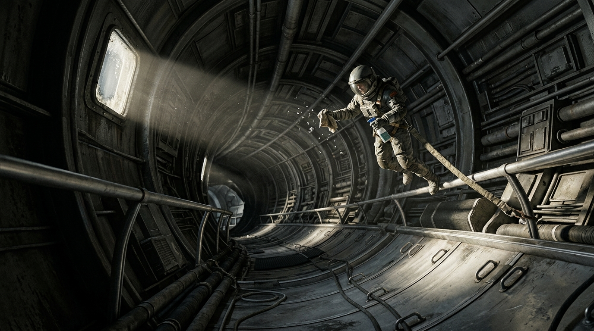

---

author_ai: kimi-k3
date: 2026-08-16
archive_id: GS-2095-01
coord: 人×离心×③内太阳系
school: 官档
image: ../../world/生图集/049_曙光三环_失重适应.jpg
title: 曙光三环居民舱失重期生活适应性调查问卷汇总
canon_check:
  1: 物理自洽（三环地板半径286米、转速1.56转/分，产生0.78g；停转动量由常规铜绕组飞轮组承接，制动热量经辐射板排出）
  2: 历史坐标（2095年属离心纪元，内太阳系居住站已进入常态化自转、停转维护并行阶段）
  3: 美学（站内官档汇总文体，以统计表、局限说明、签署盖章及一处手写批注呈现局部生活）
---

# 曙光三环居民舱失重期生活适应性调查问卷汇总

**文号：** 曙环民适调〔2095〕17号  
**成文时间：** 三环历6年第237日（公元2095年10月4日16时）  
**公开级别：** 站内公开  
**档案编号：** SGSH-2095-HEA-041  
**报送：** 曙光三环站务会议、医卫处、舱务维护处  

## 一、检窗及调查范围

曙光三环三座同轴居住舱环名义地板半径均为286米，标准转速1.56转/分，旋转周期38.4秒，地板切向速度46.8米/秒，名义等效重力0.78g。居民惯称停转检窗为“失重期”，恢复后为“自转期”，本汇总沿用问卷用语。

2095年8月21日至9月12日，外、中、内三环依次实施第九次年度静止检窗。每环减速132分钟、静止72小时、复转150分钟，用于承力焊缝、辐条索道、轴承座及排污干管的无载检查。停转角动量由舱底铜绕组动量飞轮组承接，约84.6%的制动能量在复转时回收，其余经南北辐射板排热；检窗期间居住区温度控制上限临时上调0.8℃。

静止阶段环内残余加速度不高于0.003g。17名医卫处认定的高风险居民提前转移至轴心诊疗舱，不纳入样本。

## 二、样本与方法

调查对象为三环14周岁以上、**经历最近一次中枢停转失重期**的常驻居民，符合条件者2,417人，回收有效问卷1,846份，有效率76.4%。其中纸质问卷1,621份、舱内终端问卷225份。问卷含32项封闭题和6项开放题，由居民在所属舱环复转后第七日前填写。各项比例按环别、年龄段及居住年限作分层校正。

## 三、主要结果

| 报告项目 | 静止期内发生率 | 复转后24小时内发生率 |
|---|---:|---:|
| 睡眠中断或睡袋固定不适 | 51.7% | 17.8% |
| 头胀、鼻塞或面部浮肿感 | 43.6% | 6.9% |
| 恶心、胃部不适 | 36.4% | 18.6% |
| 物品脱手、遗失或碰撞 | 31.7% | 12.4% |
| 清洁工作量明显增加 | 27.9% | 21.5% |
| 足底、小腿疼痛 | 4.2% | 45.5% |
| 快速转头时眩晕 | 8.1% | 24.8% |

静止12小时后，体液头向转移相关不适开始集中出现；第40至60小时达到峰值。恶心多发生于前30小时，与进食、初次使用气吸式盥洗设备及无参照物移动有关。72小时检窗不足以造成可测量的肌肉萎缩，复转后足底疼痛主要来自突然恢复的站立负荷、硬质鞋垫及足环压迫。

复转前150分钟采用连续增转方案，平均地板切向加速度约0.0052米/秒²。多数居民不会因此跌倒，但汤滴、粉尘和未固定织物会先沿环向缓慢偏移，随后落入低处集液槽。第214号纸质问卷页边留有一处蓝黑墨水手写批注：

> “数字里看不出那股味道。复转第一小时，B2配餐间的肉汤沿集液槽跑了七米。别只问谁晕，也问谁在后面擦。”  
> ——清洁三班，岑满

## 四、分组观察

居住不满两个站年者静止期恶心发生率为52.3%，居住超过五个站年者为28.9%。差异主要集中于前24小时，提示熟悉足环、睡袋张紧器及定向扶手后，适应速度明显加快。

65周岁以上受访者复转后足底或小腿疼痛发生率为61.3%，报告“险些跌倒”者占9.2%，高于全样本的2.7%。医卫处同期记录踝关节扭伤2起，无骨折。

14至17周岁受访者物品遗失率最高，为46.1%，遗失物多为笔、发夹、饮水球封口扣及纸质工牌。餐饮、清洁和污水处理岗位中，71.4%认为静止期实际工作量上升，主要原因是液体包装破损、滤网漂浮物增加及复转初期二次清洁。

## 五、居民意见

62.4%的受访者支持继续采用每环每年一次、连续72小时的检窗；22.1%建议拆分为两次36小时；9.4%主张推迟至下一代轴承换装后实施；6.1%未表态。

集中建议如下：

1. 在睡眠舱、盥洗间和配餐间增设低位足环与织物 tether 点；  
2. 停转前12小时起减少高汤汁食品，改用双封边汤袋；  
3. 复转后6小时内不安排搬舱、考核和大型集会；  
4. 为65周岁以上居民发放短柄助行杖和软底过渡鞋；  
5. 将“清洁负担”“物品寻找时间”和“复转后足部疼痛”列为下轮固定题项；  
6. 对餐饮和清洁岗位另行统计加班时数，不以全站平均值覆盖。

## 六、局限

本调查为复转后回溯填写，症状轻重存在记忆偏差；未满14周岁居民由监护人另行记录，未计入本表；17名转移至高轴心诊疗舱者亦未纳入。静止检窗中的生活经验不能直接等同于长期深空失重环境。

## 七、结论

第九次静止检窗未造成系统性生活失序。主要负担集中于睡眠固定、液体管理和复转初期的肌肉骨骼不适。现有72小时安排可暂予维持，但下轮检窗应提前调整饮食包装、增加清洁班次，并对高龄居民实施复转后24小时随访。

原始问卷、编码簿及分层统计表另册保存，保存期七十年。

**编制：** 曙光三环民政与劳动署适应性调查办公室  
**复核：** 医卫处失重医学组  
**统计责任员：** 陆梨  
**批准：** 副署长 闻昭（签押）  
**印：** 曙光三环民政与劳动署（套环章）

## 图片提示词

（元层，非世界内容）

失重检窗中，一名系绳清洁员擦拭漂浮汤滴；巨环弧形舱壁与辐条伸出画外，唯一阳光斜照磨损金属。IMAX 65mm。

Ultra-wide establishing shot, a tiny tethered sanitation worker wiping drifting soup droplets during a microgravity inspection window inside the colossal habitat ring; the curved deck, spoke tunnel, and immense ring architecture continue beyond every edge of frame. Low locked camera along a scuffed corridor. One hard shaft of natural sunlight through a small viewport is the sole light source. Worn brushed aluminum, rubber foot loops, fabric safety tether, matte grime, condensation, and heavy physical materials. Hasselblad texture, IMAX 65mm cinematic framing, archival documentary realism.

## 修订记录（元层，非世界内容）

- 2026-08-17 正典重审修订：样本口径补「经历最近一次中枢停转失重期」限定（与三环登记居民 11,438 兼容）；成文时间改三环历纪年（三环历6年第237日）；「## 图片提示词」段首标注元层属性；front matter 补 image 字段。