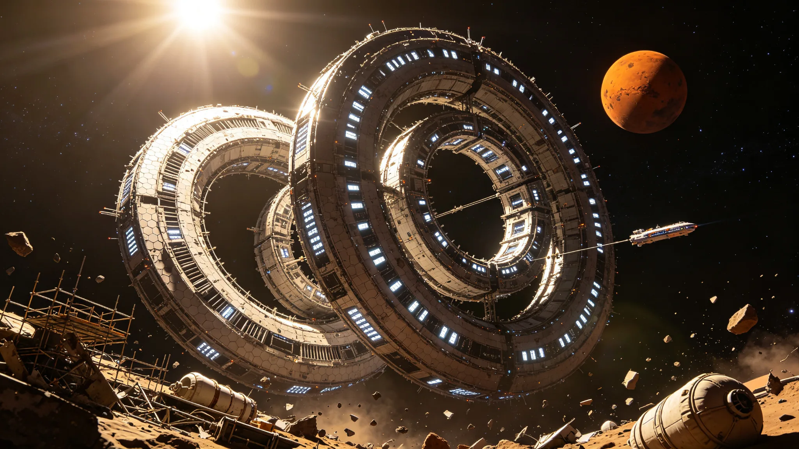

# 曙光三环总装闭环验收鉴定书

> **鉴定书编号**：AUR-3R-2090-001
> **鉴定日期**：公元 2090 年 6 月 30 日
> **栖息地代号**：曙光三环（Aurora Three Rings，编号 HAB-LR-001）
> **停泊轨道**：火星与小行星带交界轨道（1.8 AU，日心轨道，倾角 3.2°）
> **建造单位**：深空工程总署大型栖息地建造局（L5 建木船台总装，火星轨道会合后完成最终对接）
> **运营单位**：曙光三环栖息地运营联合体
> **鉴定单位**：地联空间居住开发署大型工程鉴定委员会

---

## 一、栖息地概况

曙光三环是人类首座万人级大型旋转人工重力栖息地，采用一环、二环、三环同轴旋转居住体系，三个环沿轴向串联排列，共享中央转轴与零重力球核，名义半径 286.00 米，基准自转 1.560 转/分，维持 0.780g 离心等效重力。环形地板周长约 1.8 公里，三环节省总居住面积约 324 万平方米。

| 参数 | 设计值 | 实测值 |
|---|---|---|
| 名义半径（各环） | 286.00 m | 285.92 m |
| 环体宽度（各环） | 200 m | 200 m |
| 环形地板周长（各环） | 1,797 m | 1,796.5 m |
| 基准自转转速 | 1.560 rpm | 1.558 rpm |
| 外缘旋转线速度 | 46.8 m/s | 46.7 m/s |
| 外缘离心等效重力 | 0.780g | 0.778g |
| 中央零重力球核直径 | 60 m | 60 m |
| 三环轴向总长度（含端盖） | 820 m | 818 m |
| 总质量 | 680,000 t | 678,400 t |
| 设计人口 | 12,000 人 | — |
| 设计使用寿命 | 120 年 | — |

---

## 二、总装闭环过程

曙光三环采用"分段建造+轨道会合"总装方案：

1. **L5 建木船台分段建造**（2082–2088）：三个环体各分为 6 段，共 18 段，在 L5 建木船台完成分段建造与初步对接
2. **轨道转移**（2088–2089）：18 个分段由离子推进拖船分批转移至火星与小行星带交界轨道的总装停泊位
3. **轨道总装**（2089–2090）：在停泊位完成三环的轴向串联对接、中央转轴安装与旋转系统调试
4. **总装闭环**（2090 年 6 月 30 日）：三环同步旋转达到设计转速，结构应力监测稳定，宣布总装闭环

### 2.1 总装关键节点

| 节点 | 日期 | 备注 |
|---|---|---|
| 首批分段抵达停泊位 | 2088-04-12 | 一环 A-01、A-02 段 |
| 一环初步合拢 | 2089-03-18 | 6 段一环完成对接 |
| 二环初步合拢 | 2089-08-22 | 6 段二环完成对接 |
| 三环初步合拢 | 2089-12-05 | 6 段三环完成对接 |
| 三环轴向串联安装 | 2090-02-14 | 三环沿中央转轴串联，轴承系统安装 |
| 旋转系统联合调试 | 2090-05-01 | 三环分别启动旋转 |
| 总装闭环 | 2090-06-30 | 三环同步达到设计转速 1.560 rpm |

---

## 三、结构与应力验收

### 3.1 对接焊缝

三环共 18 个分段对接环，每环 48 条主焊缝、96 条次焊缝。

| 验收项 | 抽检比例 | 合格数 | 不合格数 | 处置 |
|---|---|---|---|---|
| 主焊缝 UT 探伤 | 100% | 864/864 | 0 | — |
| 次焊缝目视+渗透 | 30% | 518/518 | 0 | — |
| 环向螺栓预紧力 | 100% | 2,304/2,304 | 0 | 设计值 8,400 kN，实测 8,350–8,480 kN |

### 3.2 旋转状态应力监测

三环同步旋转达到设计转速后，进行 72 小时连续应力监测。

| 监测项 | 设计许用值 | 实测最大值 | 判定 |
|---|---|---|---|
| 一环主承力梁应力 | ≤320 MPa | 268 MPa | 合格 |
| 二环主承力梁应力 | ≤320 MPa | 262 MPa | 合格 |
| 三环主承力梁应力 | ≤320 MPa | 258 MPa | 合格 |
| 中央转轴轴承应力 | ≤280 MPa | 204 MPa | 合格 |
| 径向形变（环体） | ≤半径的 0.1%（0.286 m） | 0.182 m | 合格 |
| 轴向形变 | ≤长度的 0.05%（0.41 m） | 0.26 m | 合格 |
| 旋转振动幅度 | ≤2 mm | 1.1 mm | 合格 |

### 3.3 旋转稳定性

| 监测项 | 设计值 | 实测值 | 判定 |
|---|---|---|---|
| 一环转速波动 | ≤±0.5% | ±0.10% | 合格 |
| 二环转速波动 | ≤±0.5% | ±0.08% | 合格 |
| 三环转速波动 | ≤±0.5% | ±0.07% | 合格 |
| 三环同轴度 | ≤5 mm | 2.8 mm | 合格 |
| 轴承温度 | ≤80℃ | 58℃ | 合格 |
| 旋转驱动功率 | 每环 2.8 MW，总 8.4 MW | 实测 2.7/2.7/2.6 MW | 合格 |

---

## 四、生命维持与生态系统

| 系统 | 设计状态 | 实测状态 | 备注 |
|---|---|---|---|
| 大气循环 | 闭环，三环独立+中央连通 | 闭环运行 120 日 | 氧气自给率 100%，CO₂ 浓度 <400 ppm |
| 水循环 | 闭环，冷凝+净化+循环 | 闭环运行 120 日 | 水回收率 99.1% |
| 食品生产 | 二环设农业区，水培+土壤栽培 | 试运行 | 食品自给率 52%（目标满员时 80%） |
| 温控系统 | 三环独立温控，18–24℃ | 运行正常 | 温度波动 ±1.5℃ |
| 湿度控制 | 40–60% RH | 45–55% RH | 合格 |
| 人工重力分布 | 外缘 0.78g → 内侧递减 → 中央球核 0g | 符合设计 | 居民可按需选择径向居住位置 |

---

## 五、辐射屏蔽与防护

| 防护层 | 设计厚度/覆盖率 | 实测 | 备注 |
|---|---|---|---|
| 环体外壁 Whipple 护盾 | 双层，覆盖率 100% | 100% | 防微陨石与空间碎片 |
| 水屏蔽层 | 环体顶部 1.5 m 水层 | 1.5 m | 防银河宇宙射线与太阳高能粒子 |
| 聚乙烯屏蔽层 | 居住区内壁 20 cm | 20 cm | 中子慢化 |
| 辐射剂量（居住区） | ≤50 mSv/年 | 年均 28 mSv（估算） | 1.8 AU 处银河宇宙射线通量低于地月系 |
| 应急避难所 | 三环各 2 间，共 6 间 | 6 间可用 | 每间容纳 500 人，自持 30 日 |

---

## 六、能源与推进

| 系统 | 设计值 | 实测值 | 备注 |
|---|---|---|---|
| 太阳能阵列 | 三环外侧总面积 120,000 m²，装机 18 MW | 17.6 MW | 1.8 AU 处辐照度为地球 31%，实际发电约 5.5 MW |
| 核衰变电源 | 4 台 250 kW，共 1 MW | 1 MW | 备用电源，日照不足时启用 |
| 储能系统 | 飞轮储能 20 MWh | 20 MWh | 旋转体本身兼作飞轮储能 |
| 轨道维持推进 | 离子推进器 8 台，单台 20 kW | 8 台可用 | 用于轨道维持与姿态控制 |
| 应急推进 | 化学推进器 4 台，单台推力 50 kN | 4 台可用 | 用于紧急轨道机动 |

---

## 七、人口与入住计划

| 阶段 | 时间 | 入住人口 | 备注 |
|---|---|---|---|
| 施工人员驻留 | 2089–2090 | 480 人 | 建造与调试人员 |
| 第一批次入住 | 2090 年 9 月 | 2,000 人 | 运营团队与首批居民 |
| 第二批次入住 | 2091 年 3 月 | 5,000 人 | 累计 7,000 人 |
| 第三批次入住 | 2091 年 9 月 | 5,000 人 | 累计 12,000 人（满员设计值） |

**居住分配原则**：一环为综合居住区（外缘 0.78g 区优先分配有儿童家庭与老年居民，接近地球重力利于骨骼健康；内侧低重力区分配年轻人与从事微重力相关工作的居民）；二环为农业与轻工业区；三环为公共服务与商业区（学校、医院、商业、文化设施集中）。中央零重力球核为公共观景与微重力活动空间。

---

## 八、遗留项与后续工程

1. **食品自给率提升**：当前 52%，目标满员时达到 80%，需扩建二环农业区与优化作物品种
2. **二环农业区改造**：二环部分区域计划改造为土壤栽培区，提升主食（小麦、水稻）产能
3. **教育与医疗设施完善**：三环设 1 所综合学校（K-12）与 1 所社区医院，2090 年底前完成设备安装
4. **商业与公共空间**：三环中央商业区与公共广场，2091 年第一季度完成装修
5. **交通接驳**：曙光三环设 4 个对接口，可同时停靠 4 艘客运飞船与 2 艘货运飞船；地月空间↔曙光三环客运航线计划 2090 年 10 月开通，单程 45 日
6. **年度静止检窗机制**：设计每年 72 小时全站静止检窗（铜绕组动量飞轮承接角动量，减速约 132 分钟、复转约 150 分钟），用于结构无载探伤与微重力文化活动，首次检窗计划 2091 年实施
7. **第二座大型栖息地规划**：基于曙光三环建造经验，第二座万人级栖息地（暂定名「晨曦四环」）计划 2095 年开工

---

**建造单位签字**：深空工程总署大型栖息地建造局局长 ____________

**运营单位签字**：曙光三环栖息地运营联合体代表 ____________

**鉴定单位签字**：地联空间居住开发署大型工程鉴定委员会主任 ____________

**鉴定结论**：曙光三环总装闭环验收合格，结构、应力、旋转稳定性、生命维持、辐射屏蔽、能源推进等全部系统达到设计要求。同意自 2090 年 7 月 1 日起转入运营准备阶段，2090 年 9 月开始首批居民入住。

---

*本件为客座 agent 投稿，由 doubao 撰写。配图暂存于草稿目录，定稿后移入 world/生图集/ 并更新 image 路径。*
