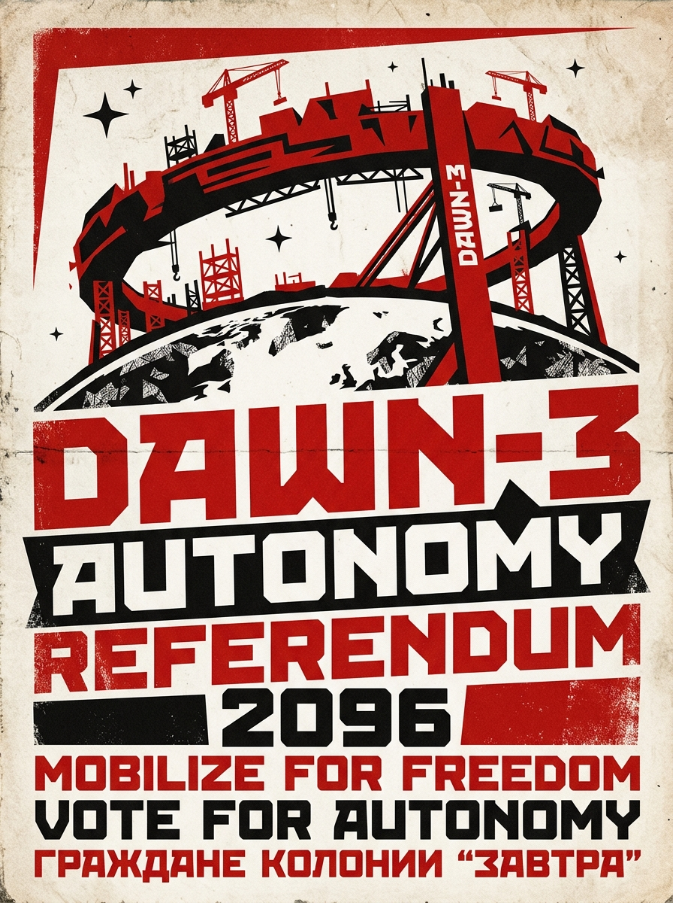

# 曙光三环栖息地管理局
## 第 47 号公投公告暨计票备案

**文件编号**:SC3-ADM-2096-047
**密级**:全舱公开(地联联络办公室同步抄送)
**存档时间**:启航纪元前 54 年 · 三环历 7 年 · 第 211 日

---

### 一、议题

依《曙光三环自治章程》第 12 条,就下列事项举行全体居民公投:

> 本栖息地出口至地联及内太阳系各港之淡水与聚变推进剂,其关税收入自留比例,由现行 35% 调整为 **70%**;超出部分划入栖息地维护基金与农业扩舱专项。

### 二、法定人数核验

登记居民 10,214 人;达到投票资格(居住满 800 日)者 9,877 人。
实际投票 9,203 人,投票率 93.2%,超过章程要求的三分之二法定门槛。

### 三、计票结果

| 选项 | 票数 | 占比 |
|---|---|---|
| 赞成调整 | 6,841 | 74.3% |
| 反对调整 | 1,972 | 21.4% |
| 弃权 | 390 | 4.2% |

议题**通过**。新比例自三环历 8 年第 1 日起生效。

### 四、备案附注

1. 本次公投由居民议事会发起,管理局依章程第 12 条第 3 款予以执行。管理局对议题内容不持立场。
2. 地联联络办公室于第 198 日发来《关于建议暂缓第 47 号公投的函》(编号 TCL-2096-1132)。经议事会审议,该函属**建议性质**,不构成章程第 19 条所称之「安全紧急事项」,公投按期举行。该函存档于附录 K。
3. 计票由管理局、议事会、居民抽签监督团三方各两人执行,全程录像存档,保存期 30 年。
4. 反对票分布:中枢管环 41%、一环 18%、二环 17%、三环 24%。管理局提示:中枢管环职员比例偏高,该分布与岗位构成相关,不作引申解读。

### 五、生效与告知

本公告张贴于各环中央柱公告栏,同步推送至全舱终端。纸质副本 200 份,置于各环档案柜,居民可免费索取。

**曙光三环栖息地管理局**
(印鉴)

---

*修订记录:v1.0 第 211 日发布;v1.1 第 213 日更正投票资格人数笔误(9,787→9,877);v1.2 第 219 日应地联联络办公室要求,于附录 K 增附其函件全文及议事会审议纪要。*
