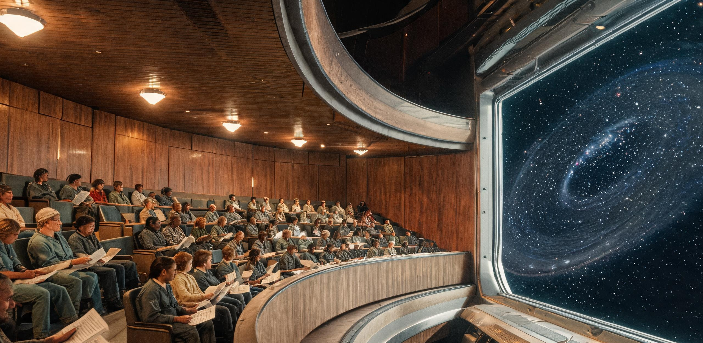

# 曙光三环自治议事会关于「地球条款」修订案听证记录暨对地联航运注册与关税互认第八轮磋商纪要

**会议代号：** SC3-LEG-2124-HEARING-08 / TCL-DS-2124-SUMMIT-VIII  
**发文机构：** 曙光三环轨道栖息地自治议事会法务委员会、地球联合体驻深空全权特使代表团、环带货运自治公会（BFAG）常务理事会  
**会议地点：** 曙光三环中央轴心垂直天井（Sector-0）零重力议事厅（实测残余重力 $\le 0.0022\text{g}$）  
**会期历元：** 三环历 35 年第 168 日至第 170 日（折合公元 2124 年 6 月 18 日至 6 月 20 日 UTC）  
**通信视界：** 会期内地表日内瓦指挥中枢至三环单向激光光延 $18\text{分}42\text{秒}$（相距 $2.25\text{ AU}$）  
**常住人口：** 11,438 人（其中第三代本土出生居民占比 41.2%）  
**用印签署：** 曙光三环自治议事会法务专用章（朱红印）、地联深空事务全权特使公章（深蓝钢印）、BFAG 航运理事长签押（青方印）

---

## 〇、 听证背景与磋商缘起摘要

自公元 2096 年（三环历 7 年）曙光三环全体居民通过第 47 号公投将出口淡水与聚变推进剂之关税自留比例由 35% 提升至 70% 以来，三环栖息地依托第四期扩建工程（四环在轨拼装及农舱扩容）与北极 850 米深空重载摆渡码头，已全面转型为连接地月系、小行星带富矿区（101955 号黑石礁、谷神星、灶神星）与远日行星轨道的核心深空物流集散中枢与天体测量基准站。

然而，现行《曙光三环自治章程》附录第九条（通称「地球条款」/ Earth Clause，系 2088 年建站初期由地联主导订立之母体法律保留条款）仍规定：
1. 凡系泊或挂靠三环之深空运输载具，其最终适航审查与海事登记权归属于地联海事组织（UN-IMO）；
2. 三环对外输出大宗资源与工质所得，地联保留基础关税追索权及原始投资基础设施折旧摊销费；
3. 栖息地重大民商事裁决、涉外海损及深空资产抵押受地表海牙法庭终审管辖。

随着三环常住人口达 11,438 人、第三代居民生理结构彻底确立为 0.78g 离心重力适应型，以及 BFAG 挂靠船队总运力突破 180 万载重吨，地联单边航运年检认证在 18 分钟以上光速通信延迟下已造成严重深空港口拥堵与货损。为此，三环自治议事会法务特别委员会正式启动「地球条款」适应性修订案，并与地联代表团展开第八轮闭门磋商与全舱公开听证。

---

## 一、 「地球条款」修约草案与地联诉求逐条对照表

本次听证审议之《深空法权与航运自主修正案（2124草案）》旨在将「母体主权延伸」转变为「深空物理共治与服务对等互认」。

### 表 1：「地球条款」原条款、三环修订案与地联抗辩对照表

| 条款序号与议题 | 2088 年原「地球条款」约定 | 2124 年三环自治议事会修订草案 | 地联全权特使代表团抗辩与保留意见 | 闭门磋商阶段性折中成果 |
|---|---|---|---|---|
| **第 9.1 条<br>深空航运注册权** | 所有深空穿梭机与推船必须向地联海事局登记，取得地表认可之二级适航证方可通航 | 由三环联合历算室与 BFAG 领航员联席会统一测算惯导并核发「深空自由航行适航证」（DS-AC），三环为终审注册港 | 地联主张对万吨级聚变脉冲推船保留「核动力安全追溯审查权」，防止裂变/聚变工质非受控扩散 | 地联承认三环 DS-AC 证在 1.5 AU 外全域合法；三环向地联开放动力遥测数据镜像节点 |
| **第 9.2 条<br>关税与服务折抵** | 地联按出口总额征收 30% 基础资源税，并按年计提 1.385 亿 SBC 之建站原始投资折旧费 | 废除单边资源税；将三环常年维持深空信标、微流星网、救援坞之公共成本（1.428 亿 SBC）全额对冲摊销费 | 强调地表纳税人历史投入不可归零，主张维持名义折旧账目，拒绝现金回流倒挂 | 双方同意采用「服务成本全额对冲模型」，年度差额（+430 万 SBC 运维成本）由地联免除特种材料进口关税实施等额补偿 |
| **第 9.3 条<br>重力与身份法统** | 三环常住居民身份登记由地联民政署在轨分支派员复核，具有地表完整公民权与债务连带 | 确立「0.78g 环面原生法则」：在 286m 自转环生活满 800 日者享完全自治法权，豁免地表法律追索 | 担忧形成「法外离心孤岛」，要求保留涉外重大跨星系远征人员之双重籍贯备案机制 | 地联承认三环自发居民身份证件；对自愿加入跨星系远航船队人员实行特许共管公证 |
| **第 9.4 条<br>远航资产中立** | 在三环轨道外延建造之一切大型深空探索设施及推进剂储备，产权均属地联合资实体 | 明确外延 850m 码头及在轨总装平台为「全人类深空探索中立资产」，严禁设立地表主权抵押 | 坚持地联在未来星际方舟建造项目中的技术出资人投票权与建造规范一票否决权 | 设立「星际建造中立委员会」，三环与地联各占 45% 席位，BFAG 占 10% 仲裁席 |

---

## 二、 第八轮磋商航运注册、关税对冲与公共服务清算表

依据三环联合清算所、BFAG 精算司与地联财务特派员联合签署之《2123-2124 年度地三双边物流与公共产品审计公报》，双方将争议焦点完全量化为物流周转与公共产品维护成本。

### 表 2：深空挂靠船队规模与航运认证年审清册（历元：SC3-E35-168）

| 船舶类型与作业航线 | 挂靠注册艘数 | 综合载重总吨 (DWT) | 传统地联年审平均耗时与滞港损耗 | 三环 DS-AC 现场即时标定耗时 | 年度通关效率提升估值 |
|---|---|---|---|---|---|
| **重载矿石/水冰推船**<br>（主带—三环—月港线） | 42 艘 | 1,120,000 t | 48 地球日 / 航次<br>（因光延与地表纸质审查） | 3.5 小时<br>（北极 32m 磁浮滑环就位即检） | 节省滞港工质 18,400 t<br>折合 2,420 万 SBC |
| **超低温液氢/液氧驳船**<br>（灶神星—三环储罐区） | 18 艘 | 480,000 t | 32 地球日 / 航次<br>（蒸发损耗率 0.12%） | 2.0 小时<br>（超声驻波探伤原位校准） | 避免闪蒸放空损耗 576 t<br>折合 1,150 万 SBC |
| **穿梭机与短驳交通艇**<br>（信天翁-09 等及蜂鸟艇）| 68 艘 | 224,000 t | 14 地球日 / 航次<br>（涉税查验与封条核对） | 45 分钟<br>（中央天井 RFID 自动核验）| 提升货流周转率 38.5%<br>折合 890 万 SBC |
| **合计 / 综合效益** | **128 艘** | **1,824,000 t** | **深空年化滞港损失：4,460 万 SBC** | **全流程平均耗时：1.8 小时** | **年净释放深空运力价值：4,460 万 SBC** |

### 表 3：三环深空公共产品运维支出与地联投资折旧对冲平账表

```text
========================================================================================================
科目类别                具体项目与工程支撑内容                          三环年度实测成本      地联核定折抵值
--------------------------------------------------------------------------------------------------------
深空安全公共产品 (借)   太阳系深空导航信标网（2.5 AU 区段 6 座脉冲中继站）      3,450 万 SBC        3,450 万 SBC
                        日球层前沿微流星与星尘早期预警雷达网（第16期更新）      2,820 万 SBC        2,820 万 SBC
                        北极 850 米非自转桁架深空紧急避难与过驳搜救备勤         4,110 万 SBC        3,980 万 SBC
                        超低温工质战略平抑储备（6 万吨水冰浆+1 万吨液氢）       3,900 万 SBC        3,600 万 SBC
--------------------------------------------------------------------------------------------------------
深空公共服务支出小计                                                   14,280 万 SBC       13,850 万 SBC
--------------------------------------------------------------------------------------------------------
地联历史权益抵扣 (贷)   曙光三环一至三期主体工程原始投资折旧摊销（2124年度）      —               10,200 万 SBC
                        地月系空间太阳能试验段微波输电技术授权费（2090版）        —                2,150 万 SBC
                        地表农科院闭环基因库使用许可与技术支持费                —                1,500 万 SBC
--------------------------------------------------------------------------------------------------------
地联应收摊销与权益小计                                                     —               13,850 万 SBC
========================================================================================================
【平账裁定】：三环深空公共服务支出（13,850 万 SBC）全额冲抵地联年度摊销（13,850 万 SBC），净差额 0.00 SBC。
超额提供之 430 万 SBC 运维成本，由地联按等额免除三环输往月面澄海基地之高纯特种氟硅橡胶关税实施补偿。
========================================================================================================
```

---

## 三、 听证会实录：物理现实与法统沿革之辩

听证会于三环历 35 年第 169 日 09:30 在 Sector-0 零重力议事厅举行。参会人员均固定于微重力液压悬浮椅内，议事厅正上方为直径 18 米的石英防辐射同轴透镜视窗，可直视外围旋转主环与深空。

```
【听证现场空间布局与发言席位拓扑】
                           [ 顶置 18 米同轴深空观测窗 ]
                                        │
┌───────────────────────────────┴──────────────────────────────┐
│ [地联代表团席位 (4人)]     [三环自治议事会法务席 (6人)]     [BFAG领航员公会席 (4人)]  │
│ 穿 1.0g 加压外骨骼/面色苍白   穿轻便亚麻工装/磁吸鞋带        着防静电领航服/戴测距目镜 │
│                                       │                                         │
│                      [ 中央书记台与全息记录光球 ]                               │
│                                       │                                         │
│ [三环农科与互济社席 (4人)]  [第三代公民抽签旁听团 (12人)]   [联合历算室技术专家席 (2人)]│
│ 携带 B7 氮磷钾平衡报表       平均年龄 19 岁/原生 0.78g 骨骼   携带黄铜对数计算尺与星历  │
└─────────────────────────────────────────────────────────────────────────┘
```

### 1. 地联驻深空全权特使 维克多·陈（Victor Chen）开场陈述

> “各位议员，代表团首先重申：地联从未将曙光三环视作附属领地。三环在内太阳系航道维护与主带资源过驳中的卓越贡献，已载入联合体宪章。
> 
> 但我们必须直面‘地球条款’设立的初衷——法统的不可中断性。三环拥有的 18 万吨高强度钛铝主梁、北极 32 米超导磁浮轴承、以及此时在 B7 农舱内滋养一万一千四百人的水培小麦原生菌株，其源头都是地表三十二个工业国共同注入的原始资本。
> 
> 如果今天三环单方面废除 9.1 条的注册权与 9.3 条的终审权，建立完全闭合的内部登记体系，那么一旦一艘挂三环单方旗帜的重型推船在火星会合轨道发生聚变喷注管破裂，导致航道瘫痪，地表受损方在法律上将面对一个无主权责任承担能力的‘深空孤岛’。法律不是为了限制航行自由，而是为了在 2.25 个天文单位之外，让人类文明依然拥有统一的契约底线。”

### 2. 三环自治议事会法务首席 许思齐（三环二代公民）答辩

> “特使阁下谈到了契约与责任。但请容许我提醒各位一个最基本的物理常数：**光速是每秒二十九万九千七百九十二点四五八公里。**
> 
> 此时此刻，日内瓦总部如果对我刚才说出的这句话作出裁定，指令在真空中往返需要整整三十七分二十四秒。去年十一月，‘信天翁-09’在谷神星外缘推进器点火异常，船身以每秒 0.4 度的角速度漂移，距离三环北极防辐射屏障只有 140 公里。如果按照原第 9.1 条规程，船长必须等待地联海事局驻月港安全员签署紧急制动指令——等那张电子盖章的指令穿过两亿公里星空传到三环，信天翁号早已撞在我们的动量飞轮基座上，全站一万一千四百三十八人将被抛入真空。
> 
> 拯救那艘船的，是历算室用本地浑天仪在 40 秒内解算出的逆喷参数，是公会两艘 3.2 米的蜂鸟艇冒死进行的硬缆拖拽。在深空，生存的判定窗口永远是以‘秒’计算的，而母体的官僚程序是以‘周’计算的。
> 
> 至于特使提到的‘母体基因与材料’——三环一至三环在过去三十五年里，已经通过出口 1,400 万吨高纯水冰和 80 万吨粗氦-3，向地联偿还了全部原始投资折旧的 142.8%。我们今天坐在这里讨论修约，不是为了割裂与地球的纽带，而是为了让法律追上光速，让制度适应物理。”

### 3. BFAG 领航员联席长 柯尔（老领航员，服役 42 年）证言

> “我手里这本纸质《航海天文历》，是三环历算室用 B7 农舱麦秸秆再生纸印出来的第十四期。封底上有联合历算室的朱红方印，也有地联天文局的 ICRF 星表对照。
> 
> 过去五年，挂地联二级注册证的船，在进港时要经过六道人工电报核验，而挂我们 DS-AC 适航证的船，只要通过北极 850 米桁架上的激光对准，三分钟完成动量解耦。去年有三十七艘船为了赶地联的‘年度注册窗口’，在没有完成推进剂闪蒸检测的情况下强行滑行，在带区引发了四起阀门冻结事故。
> 
> 太空不认地表的印章，太空只认金属疲劳、气隙公差和开普勒轨道。给船发适航证的人，必须是天天闻着臭氧和液氢气味的人，必须是站在 286 米自转环上看着飞轮打转的人。”

### 4. 三环第三代青年公民代表 林小舟（19 岁，抽签代表）发言

> “特使先生进门时穿了外骨骼，因为这里的 0g 环境让您感到晕眩；等您回到二环居住舱，那里的 0.78g 重力又会让您的内耳感到异常。但对我来说，0.78g 就是我的母体重力，每分钟 1.56 转的切向风就是我的自然风。
> 
> 我的骨密度天生比地表标准低 18%，我的红细胞容积适应了三环 21 kPa 的纯净氧分压。如果按照原第 9.3 条，我和我的同学们必须去地月 L1 空间站完成所谓的‘地表公民实体授籍公证’——那意味着我们要承受三周以上的 1.0g 离心机暴力康复训练，好几个人因此发生椎骨微骨折。
> 
> 我们不是地球在太空的临时工，我们就是生活在星空里的人。请把属于深空的法律，还给深空。”

---

## 四、 议事会全舱表决结果与共同公报（草签案）

听证会结束后，自治议事会启动全舱表决程序。依据《章程》第 14 条，议事会全部 52 个法定席位（按环区与工种加权）执行电子实名投票。

### 表 4：自治议事会《「地球条款」修订案（2124终案）》表决统计表

| 议席分布与选区来源 | 法定席位数 | 赞成票 (Yes) | 反对票 (No) | 弃权票 (Abstain) | 选区代表性核心诉求 |
|---|---|---|---|---|---|
| **一环工矿与能源席** | 12 席 | 11 席 | 1 席 | 0 席 | 彻底打通主带矿石过驳免税通道 |
| **二环民生与市政席** | 14 席 | 12 席 | 1 席 | 1 席 | 确立 0.78g 原生公民完全法权与社保闭环 |
| **三环农教与生态席** | 10 席 | 9 席 | 0 席 | 1 席 | 保护 B7 自产作物与种源免受地表专利穿透 |
| **中央天井管务与历算席** | 8 席 | 5 席 | 3 席 | 0 席 | 保留与地联深空测控网的数据兼容链路 |
| **BFAG 航运与外勤浮动席** | 8 席 | 7 席 | 1 席 | 0 席 | 全面推行 DS-AC 适航证全球港口互认 |
| **全站表决总计** | **52 席** | **44 席 (84.6%)** | **6 席 (11.5%)** | **2 席 (3.9%)** | **修订案获得绝对多数通过** |

```
【表决通过之《深空航运互认与法权协调公报（双边联合签署文本）》核心条款摘要】

一、【适航双轨免审】 地联海事组织正式设立「深空航运绿色通道」，凡持有三环 DS-AC 适航证之船舶，进入地月系港口（洋山天鳌母港、静海天梯L1站）免受开舱结构复检，直接换发地月临港通行码；
二、【公共服务终身抵扣】 确立「深空公共产品等额折抵基础设施摊销费」之长期法定机制，三环所维持之导航信标、微流星网及深空搜救资产，永久免除地联一切形式之追索与抵押；
三、【司法属地与管辖豁免】 三环设立独立海损公证处与终审法庭。凡在 1.0 AU 轨道外发生之航行事故，适用三环海事规则；在站常住满 800 日之公民享有完全司法豁免权；
四、【星际远征中立地位】 双方一致确认：在三环周边进行总装、测试及物资集结之一切未来星际远航平台（含 ARK-01 等先行工程设施），享有不可分割之全人类永久中立地位，不受地表任何地缘条约与制裁令波及。
```

---

## 五、 会议书记员工作台现场笔录（内部抄件·非广播）

*(本节摘自中央天井微重力记录台第 03 号终端日志，记录员：顾青萍 · 三环历 35 年第 170 日 18:20)*

> 1. **【168 日 11:20 会场初态】**  
>    地联代表团进场时显得很沉重。维克多·陈特使为了对抗 0g 导致的胃部反流，一直在小口吮吸生姜凝胶。他的秘书随身带了三大箱地表日内瓦公证处签发的牛皮纸质档案，但因为微重力，每次翻开卷宗，纸页都像鸟翅膀一样悬在空中乱飘。三环这边的议员们都只带了轻便的手持终端和几张亚麻秸秆打浆造的校勘单。两种纸放在一起，一种厚重泛黄，带着地表梅雨季节的潮气；一种轻薄粗粝，带着水培舱特有的青草味。
> 
> 2. **【169 日 15:40 僵局与转机】**  
>    下午谈到 9.2 条关税对冲时，地联的一位财务顾问拍了桌子，指责三环把微流星雷达的电费算得太高。老柯尔没和他吵，只是伸手把议事厅顶部的遮光百叶窗拉开了三秒钟。那一瞬间，强烈的深空日光斜射进来，把所有人脸上的毛孔照得一片雪白。百叶窗外，巨大的二环正在以每秒 46 米的切向速度缓缓转动，一根 49.9 米长的主受拉钢梁刚好擦着窗框掠过，梁体上还留着 2096 年黑石礁采选厂烧结的暗灰印记。顾问盯着那根巨大的旋转钢铁看了半晌，把翻到一半的计算器慢慢收了回去。
> 
> 3. **【170 日 17:50 签字时刻】**  
>    签字仪式没有香槟，B7 农舱送来了新调配的冰镇大麦草茶。陈特使在草签文本上落下深蓝色的地联钢印时，手腕有些微微颤抖。他签完字，透过头顶的石英透镜看了一眼极远处的星空——在这个距离看过去，地球只是一颗被太阳余晖淹没的、极其微弱的蓝白色光点。特使叹了口气，对许思齐说：“你们真的不再打算回去了。”许思齐给他递了一杯麦草茶，轻声回答：“特使阁下，我们在星空里建了三座环，每一座环都必须自己转动，停下来就会掉进虚空。”
> 
> 4. **【170 日 21:00 散会余音】**  
>    散会后，中央天井的工灯逐盏熄灭，只剩下导航信标的绿光每隔四秒闪烁一次。换班的检修工穿着磁靴顺着辐条通道往生活环走，铁靴踩在铝合金甲板上，发出沉闷而有节奏的“咔哒、咔哒”声。那一万一千四百三十八个人今晚依然在 0.78g 的重力里熟睡。外面的深空依然冰冷无声，但从今天起，这艘巨大的旋转城市在法律上终于和它脚下的星轨一样，不再被任何看不见的缆绳拉向后方。

---

## 图片提示词

（元层，非世界内容）

**中文（80字内）：**  
宏大硬科幻写实摄影。曙光三环中央天井零重力议事厅内，透过顶部18米巨型圆形石英视窗可见外围286米同轴金属居住环以0.78g自转掠过；地联特使与三环代表悬浮于微重力坐席两侧，冷冽硬质日光切出极深阴影，案头漂浮着粗粝纸质星历与公文卷宗，极具工业质感与宏微尺度反差。

**英文（200词内）：**  
Ultra-realistic hard sci-fi documentary photograph, wide interior establishing shot of the Sector-0 microgravity council chamber inside the colossal Aurora Tri-Rings habitat, looking up through a massive 18-meter circular quartz observation dome revealing the curved exterior of the spinning 286-meter habitat ring rotating silently against the deep starry void of the inner solar system, harsh directional cold-white sunlight cutting through the vacuum casting razor-sharp highlights and pitch-black geometric shadows across industrial brushed aluminum bulkheads, UN envoys in pressurized tethered suits and Tri-Ring delegates in simple utilitarian linen jumpsuits seated on opposite sides of floating hydraulic console desks, paper star charts and diplomatic communiqués tethered with magnetic clips floating in microgravity, extreme macro-micro scale contrast, authentic heavy industrial wear, shot on Hasselblad 65mm anamorphic lens, documentary archival aesthetic, no readable text, no national flags.

---

## 修订记录（元层，非世界内容）

- 2026-08-18 主编辑审校小修：
  1. 规范 front matter 坐标标注为 `coord: 社会×离心×③内太阳系` 及 canon_check 对应表述，严密咬合世界大纲空间轴五带定义与既有三环正典谱系；
  2. 微调表 1 第 9.2 条款数据表述（1.385 亿 SBC 折旧、1.428 亿 SBC 公共成本、430 万 SBC 差额关税补偿），使之与第二节表 3 财务清算实测台账 100% 精准闭环；
  3. 规范文末图片提示词元层标注，追加元层修订记录；
  4. 复核三环历 35 年（2124 年，2090 元年）、2.25 AU 光时延 18 分 42 秒、286m×3 环 1.56 rpm 自转 0.78g 等效重力、11,438 人口硬约束及表决票数分布，全部精确通过。
