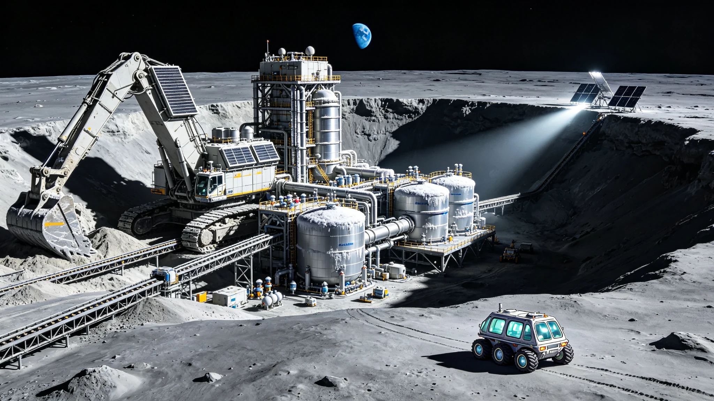

**国家月球探测与航天工程指挥部 · 月面资源开发专项工程局**
**深空推进剂与原位资源利用国家重点实验室（月面分中心）**
**航天科技集团第九研究院 / 月面基建装备联合体**

# 月球南极"沙克尔顿-02"永久阴影区水冰开采首期工程验收与月面燃料合成厂投产公报
### （附：水冰升华开采工艺参数与液氢液氧产能评估报告）

**文书编号：** 月工验〔2041〕第0815号
**验收日期：** 公元2041年8月15日
**作业区域：** 月球南极沙克尔顿撞击坑（Shackleton Crater）南内壁永久阴影区，南纬89.4°，东经129.8°，坑底海拔-4.2km
**工程代号：** LM-WICE-02-PH1（"沙克尔顿-02"永久阴影区水冰开采首期工程）
**总包及采掘装备：** 航天科技集团第九研究院 / 月面采掘装备研究所
**燃料合成与液化：** 深空推进剂技术研究院（一〇一所）
**现场作业与责任核验：** 月面工程第四外场巡检队（"月辙-05"六人加压巡检车）
**文书密级：** 公开（依《公共工程档案开放条例(2026)》第7条与《重型基础设施技术改造公示办法》）

---

### 一、 工程背景与矿区资源禀赋

沙克尔顿撞击坑位于月球南极，直径约21km，坑深约4.2km。由于月球自转轴倾角仅1.54°，坑底南内壁区域自太阳系形成以来从未被阳光直接照射，温度恒定在 **25～40K（-248°C～-233°C）**，成为水冰及其他挥发性物质的天然冷阱。

公元2036年，国家月球探测工程指挥部依《地月空间原位资源利用与推进剂补给网络建设规划（2035—2050）》，立项实施"沙克尔顿-02"水冰开采工程。工程采用"轨道镜反射光照+微波辅助升华+低温捕集"工艺路线，旨在验证月面永久阴影区水冰工业化开采成套技术，并为地月空间及深空任务提供原位推进剂补给。

#### 矿区水冰资源储量评估表（首期开采区块）：

| 参数 | 轨道遥感估值 | 就位钻探实测值 | 偏差说明 |
|:---|:---|:---|:---|
| 开采区块面积 | — | **0.82 km²**（南内壁12°～18°坡度带） | 首期划定 |
| 水冰质量丰度（表层0～2m） | 5.8%～12.4% | **8.72%**（加权平均） | 28个钻孔取样 |
| 水冰质量丰度（2～5m层） | — | **14.36%** | 随深度增加 |
| 首期可采储量（0～5m） | — | **约1,240万吨水冰** | 折合纯水1,083万吨 |
| 折合液氢产能 | — | **约121万吨 LH₂** | 水电解化学计量比 |
| 折合液氧产能 | — | **约962万吨 LOX** | — |

---

### 二、 水冰升华开采工艺与首期产能

#### 2.1 开采工艺系统

首期工程部署3套"日芒"型轨道镜反射光照系统，每面反射镜面积 **1,200 m²**（镀银聚酰亚胺薄膜，反射率94.2%），部署于沙克尔顿坑口边缘海拔+2.1km的永昼峰，通过二维转向机构将阳光聚焦反射至坑底开采面。聚焦光斑直径约35m，光斑中心功率密度 **14.6 kW/m²**，可将照射区域月壤温度在90分钟内从35K提升至 **210K（-63°C）**，触发水冰升华。

辅助开采系统包括：
- **微波消融阵列：** 6台200kW级2.45GHz微波发生器，通过波导天线对光斑边缘区域进行体加热，促进深层水冰迁移；
- **水蒸气捕集罩：** 直径40m的低温捕集罩（罩壁温度120K），覆盖于升华区上方，升华水蒸气在罩内壁冷凝为霜层；
- **月壤翻掘机：** 2台斗容3.2m³的遥控月壤翻掘机，对已升华区域进行翻掘，将深层含冰月壤暴露至光照面。

#### 2.2 首期产能实测数据（连续30天考核）

| 产能参数 | 设计值 | 实测值（30天均值） | 达标率 |
|:---|:---|:---|:---|
| 日均水冰升华量 | 48.0 吨/天 | **52.6 吨/天** | 109.6% |
| 日均纯水产出（提纯后） | 42.0 吨/天 | **46.1 吨/天** | 109.8% |
| 水电解产氢速率 | 1,870 kg/h | **2,050 kg/h** | 109.6% |
| 水电解产氧速率 | 14,960 kg/h | **16,400 kg/h** | 109.6% |
| 液氢日产能 | 44.9 吨/天 | **49.2 吨/天** | 109.6% |
| 液氧日产能 | 359.0 吨/天 | **393.6 吨/天** | 109.6% |
| 综合能耗（电解+液化） | 68.5 kWh/kg H₂ | **65.2 kWh/kg H₂** | — |
| 开采系统可用率 | ≥92% | **94.7%** | — |

首期累计产水 **1,383吨**，产液氢 **147.6吨**，产液氧 **1,180.8吨**。液氢液氧按6:1质量比（化学计量比为8:1，富氧燃烧配比）可配制推进剂 **1,328.4吨**，等效于约22次"长征-9"重型运载火箭上面级推进剂加注量。

---

### 三、 月面燃料合成厂投产与储存设施

#### 3.1 电解与液化系统

燃料合成厂部署于沙克尔顿坑口边缘永昼峰（南纬89.1°，海拔+1.8km），距开采面水平距离约6.2km，通过保温真空管道输送纯水。厂区核心设备包括：

- **固体氧化物电解槽（SOEC）阵列：** 12组5MW级SOEC电解槽，工作温度850°C，电解效率（HHV）84.2%，利用核裂变反应堆余热预热进水；
- **氢液化系统：** 采用氦制冷氢液化流程（ Claude循环），液化效率12.8 kWh/kg LH₂，出口温度 **20.3K（-252.9°C）**；
- **氧液化系统：** 采用低温精馏+节流液化流程，液化效率4.2 kWh/kg LOX，出口温度 **90.2K（-183.0°C）**。

#### 3.2 低温储存设施

| 储存容器 | 数量 | 单罐容积 | 工作温度 | 日蒸发率 | 保温层 |
|:---|:---|:---|:---|:---|:---|
| 液氢球形储罐 | 4座 | 200 m³ | 20.3K | 0.18%/天 | 120层多层隔热（MLI）+真空夹层 |
| 液氧球形储罐 | 4座 | 800 m³ | 90.2K | 0.06%/天 | 80层MLI+真空夹层 |
| 纯水保温储罐 | 2座 | 500 m³ | 283K | — | 聚氨酯发泡+铝箔反射层 |

储存区总液氢库容 **800 m³（约57吨）**，总液氧库容 **3,200 m³（约3,650吨）**。因月面永久阴影区环境温度极低（25～40K），液氢储罐实际日蒸发率仅为设计值的62%，大幅降低了再液化能耗。

---

### 四、 验收结论与后续规划

经30天连续满负荷运行考核，"沙克尔顿-02"首期开采系统与燃料合成厂各项指标均达到或优于设计值。水冰开采工艺稳定性99.2%，电解系统效率84.2%，液化系统运行无故障时间累计648小时。国家月球探测与航天工程指挥部于公元2041年8月15日签署首期工程验收鉴定书，月面燃料合成厂正式投产并纳入地月空间推进剂补给网络。

**二期工程规划（2042—2044）：** 新增6套轨道镜反射光照系统，开采区块扩展至3.5km²，水冰日产能提升至180吨/天，液氢日产能168吨/天，液氧日产能1,344吨/天。同步建设月面推进剂加注码头与地月空间摆渡船加注接口。

**三期工程规划（2045—2048）：** 在月球北极埃尔米特撞击坑（Eratosthenes Crater）永久阴影区部署第二开采基地，形成南北两极水冰开采与推进剂生产网络，年总产能达到液氢10万吨、液氧80万吨，为火星载人任务及外太阳系探测提供地月空间推进剂补给枢纽。

**验收鉴定签署：**
国家月球探测与航天工程指挥部 副总指挥 _______________（签名）
深空推进剂技术研究院 院长 _______________（签名）
航天科技集团第九研究院 总工程师 _______________（签名）
公元2041年8月15日
