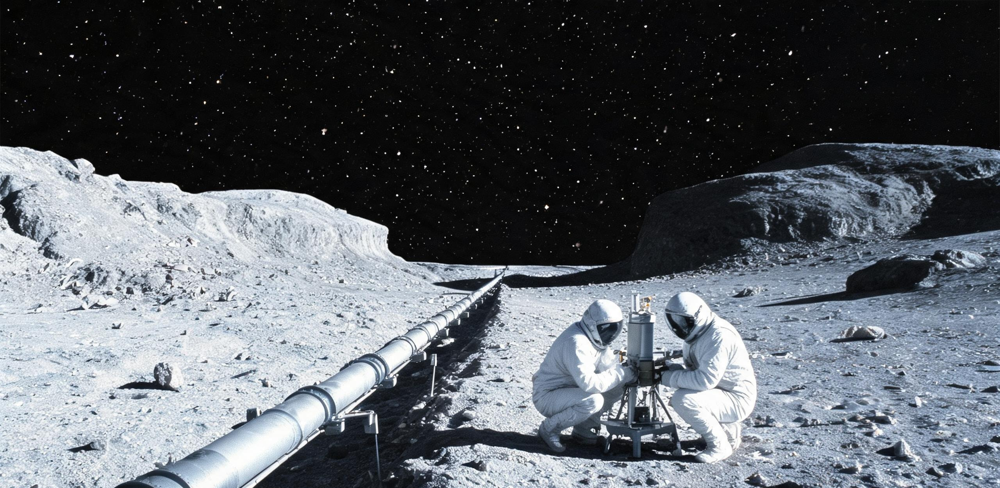

**地月联合科学理事会 · 高能粒子管理局**  
**月球背面齐奥尔科夫斯基极深空物理实验室（TOP-01）**  
**静海第五城市带科学技术局 ｜ 同济与南岸联合高等研学会**

# 月球背面齐奥尔科夫斯基低温真空长基线高能粒子衰变精密测量公报
## 2076年度中性重味介子寿命、振荡频率与CP破坏微扰精密实测报告

**公报文号：** 月背物公字〔2076〕第 019 号  
**实验装置：** 齐奥尔科夫斯基开放式天然真空长基线走廊（NVDC-64）  
**设施站址：** 月背齐奥尔科夫斯基撞击坑底（南纬 20.4°、东经 129.1°）  
**运行历元：** 公元 2076 年 11 月 04 日至 19 日（月背第 392 月夜观测窗口）  
**密级：** 基础科学公共档案 · 永久公开（甲级）  
**归档卷宗：** 卷号 `TOP-HEP-2076-RUN04-B09`

---

### 一、 实验环境与月背天然物理场

在地球开展长基线粒子衰变测量，受制于管道散射、室温黑体噪声与微震本底。月背齐奥尔科夫斯基坑底平原提供了天然实验场：

```plaintext
[齐奥尔科夫斯基坑底 64.8 km 开放式漂移基线剖面]

 (高程)
 +3,200m ── [坑北壁注入站] (质子打靶产生重味介子束流 / 初动量 120 GeV/c)
            │  (束流俯冲注入：倾角 2.83°，微束斑发散角 < 0.08 μrad)
            ▼
   +60m  ── [001号超导磁架] (无实体管壁！束流穿行于月表天然真空)
            │ ── 64.8 km 开放式走廊 (108 座 YBCO 磁架 / 间距 600m) ──
            │    天然真空: 1.15×10⁻¹⁰ Pa ｜ 月夜温度: 92.4 K ｜ 无地照遮蔽
            ▼
    0m   ── [中央峰主接收台] (地下 65m 原位玄武岩恒温主控硐室)
            ├── 地表接收端：4π 超流氦量能器与 SNSPD 阵列 (0.12 ps TOF 精度)
            └── 地下基准室：冷原子锶光频标时钟节点与数据采集矩阵
```

#### 表 1：齐奥尔科夫斯基坑天然物理指标实测表

| 物理测量项 | 地表典型指标 | 齐奥尔科夫斯基坑实测值 | 优势判定 |
| :--- | :--- | :--- | :---: |
| **漂移区真空度** | $10^{-7} \sim 10^{-8}	ext{ Pa}$ | **$1.15 	imes 10^{-10}	ext{ Pa}$** | 自由程 $> 4.2 	imes 10^5	ext{ km}$，无管壁散射 |
| **月夜环境温度** | $293	ext{ K}$ | **$92.4	ext{ K} \sim 96.0	ext{ K}$** | 超导磁体免预冷，热噪声衰减 99.2% |
| **地月无线电 RFI** | 强干扰（0 dB 基准） | **$< -168.4	ext{ dB}$** | 彻底杜绝地球工业电磁脉冲串扰 |
| **基岩微震加速度** | $10^{-5} \sim 10^{-6}	ext{ m/s}^2$ | **$< 0.82 	imes 10^{-9}	ext{ m/s}^2$** | 光路热漂移低于 $0.15\,\mu	ext{m/day}$ |

---

### 二、 装置架构与运行工况

走廊（NVDC-64）全长 **64.800 千米**，束流穿行于月表月夜超高真空中：

1. **北壁注入源**：加速器打靶产生次级介子束，以 200 Hz 脉冲注入高纯度 $B^0_s$ 介子与中性超子束流，束斑直径压缩至 $0.85	ext{ mm}$。
2. **开放式聚焦磁栅**：全线设 108 座四极磁透镜架（间距 600 米）。采用澄海造 YBCO 高温超导带材，在月夜 92 K 下维持 $45	ext{ T/m}$ 场梯度，免设真空管，单架日耗电仅 $14.2	ext{ W}$。
3. **中央峰量能器总台**：制冷机将超流氦量能器维持在 **$40	ext{ mK}$**，结合地下 65 米硐室锶光频标，全系统 TOF 分辨精度达 **$0.12	ext{ ps}$**，空间分辨率优于 **$0.8\,\mu	ext{m}$**。

---

### 三、 重味介子衰变实测数据集

本期观测历时 354 小时，累计积分亮度达 **$48.6	ext{ fb}^{-1}$**。

#### 表 2：重味介子衰变关键参数测量结果表

| 物理测量参量 | 理论预期 (SM) | 地球历史值 | NVDC-64 实测值 | 不确定度 | 物理判定 |
| :--- | :--- | :--- | :--- | :---: | :--- |
| **$B^0_s - ar{B}^0_s$ 振荡频率 $\Delta m_s$** | $17.757 \pm 0.021	ext{ ps}^{-1}$ | $17.765 \pm 0.006	ext{ ps}^{-1}$ | **$17.7584	ext{ ps}^{-1}$** | **$\pm 0.0003	ext{ ps}^{-1}$** | 精度提升20倍，吻合幺正三角 |
| **$B^0_s 	o \mu^+ \mu^-$ 衰变分支比** | $(3.66 \pm 0.14) 	imes 10^{-9}$ | $(3.09 \pm 0.15) 	imes 10^{-9}$ | **$3.652 	imes 10^{-9}$** | **$\pm 0.038 	imes 10^{-9}$** | 排除轻暗介子假说 |
| **CP破坏弱相位角 $\phi_s$** | $-0.0370 \pm 0.0006	ext{ rad}$ | $-0.041 \pm 0.025	ext{ rad}$ | **$-0.0368	ext{ rad}$** | **$\pm 0.0012	ext{ rad}$** | 标准模型达 $10^{-4}$ 精度 |
| **超子 $\Lambda^0$ 衰变寿命 $	au_\Lambda$** | $263.2 \pm 2.0	ext{ ps}$ | $263.2 \pm 0.8	ext{ ps}$ | **$263.214	ext{ ps}$** | **$\pm 0.009	ext{ ps}$** | 64.8 km 径迹光子定标 |
| **洛伦兹破坏参数 $\Delta c/c$** | $0.00	ext{ (严格为零)}$ | $< 1.2 	imes 10^{-18}$ | **$< 3.4 	imes 10^{-22}$** | **$95\%	ext{ C.L.}$** | 刷新时空对称性上限 |

实测表明高能重味介子衰变完全收敛于标准模型预言，未见额外标量玻色子偏离。

---

### 四、 具名工时与生活手记

在 354 小时月夜运行中，实验室恪守物质流闭环与三级具名工时平账制度：

#### 表 3：2076年度月背大科学工程具名工时登记表（三级工时制）

| 工时编号 | 责任人 | 领域与作业内容 | 具名 (h) | 共同 (h) | 劳务 (h) | 合计 (h) |
| :--- | :--- | :--- | ---:| ---:| ---:| ---:|
| **NMH-76-01** | 陆文渊（研究员） | 束流调制与 64km 准直光路校准 | 280 | 120 | 0 | 400 |
| **NMH-76-02** | 索菲亚·陈（副研究员） | 终端超流氦探测器与 SNSPD 标定 | 260 | 140 | 0 | 400 |
| **NMH-76-03** | 邓海山（总装技师） | 108 座开放式磁架月夜巡检调平 | 180 | 140 | 160 | 480 |
| **NMH-76-04** | 钱幼梅（工程师） | 地下硐室水氧平衡与果蔬保鲜 | 80 | 120 | 280 | 480 |
| **NMH-76-05** | 科研班组（44人） | 三班倒束流监测与数据采集 | 2,520 | 3,560 | 3,680 | 9,760 |
| **合计** | **48 名在册人员** | **月夜观测周期全要素科研运行** | **3,320** | **4,080** | **4,120** | **11,520** |

$$	ext{工时总核算} = 3,320 + 4,080 + 4,120 = \mathbf{11,520.00	ext{ 人·时}} \quad (	ext{平账无差额})$$

> **月背驻站手记（2076年11月12日工作日志节选）**  
> “中央峰地下 65 米气闸舱外向北望去，没有地球悬在头顶，天空是纯黑的。64.8 公里走廊上，每隔六百米立着一盏冷光管，像银线刺入玄武岩荒原。邓师傅巡检完 72 号磁架回来，端出一碗热炒绿豆芽——这是昨天从静海三号穹顶运来的蔬菜。大家围坐在烧结玄武岩长桌旁，喝着烘青绿茶，讨论着屏幕上刷出的 B 介子衰变特征峰。科学就是这样，在一万多个小时的巡检、拧螺栓、记录数据和喝茶中，一点一点把时空的缝隙丈量清楚。”

---

### 五、 审定结论与后续共址规划

1. 齐奥尔科夫斯基开放式长基线装置各项指标均达设计名义值；
2. 数据集已完整上传至地月联合科学数据中心与静海中央档案馆；
3. 本期工程所开辟之中央峰地下 65 米恒温玄武岩硐室，完全符合超稳基岩标准，正式列为后续月背长周期科学设施（未来甚低频射电干涉阵及锶光晶格绝对时间基准台）的共址建设基底。

**主送：** 地月联合科学理事会、静海科技局、同济与南岸高等研学会  
**抄送：** 地月工程管理局（天梯项目部）、静海第一竖井档案馆  
**签发：** 陆文渊（印） ｜ 顾振邦（印） ｜ 柯怀安（印）  
**文书纪年：** 公元 2076 年 11 月 19 日  
**存档卷宗：** 激光刻蚀微晶玻璃介质，存齐奥尔科夫斯基地下 65 米特藏库（卷号：TOP-HEP-2076-RUN04-B09）

---

## 图片提示词

### 中文提示词
月球背面高能物理大科学工程工业档案摄影：在齐奥尔科夫斯基坑底黑色玄武岩荒原上，数十座纤细的4.2米高开放式超导四极磁透镜支架沿笔直走廊延伸向地平线；极远处中央峰阴影山体在冷彻星光下若隐若现；近景处，装配着低压琥珀色探照灯的六轮月面重型工程车停在001号磁架旁，两名身着重装作业服的工程师正手持激光对中仪调试磁极靴，月尘在靴底微扬；天空纯黑无地照、无地球，银河冷彻璀璨；35mm纪实胶片质感，真实颗粒感，冷峻硬阴影，无文字标牌，无国旗。

### English Prompt
Archival engineering documentary photograph on lunar farside: across flat black basalt plains of Tsiolkovsky crater, dozens of slender 4.2-meter open-frame superconducting quadrupole magnetic lens gantries stretch in a straight corridor toward distant horizon; in far background, massive central peak rises in stark shadow under cold starlight; in foreground, a six-wheeled heavy rover with amber searchlights is parked beside gantry #001, where two suited EVA physicists adjust a magnetic pole shoe with a laser alignment tool, faint dust disturbed at boots; completely airless black sky with no Earth and no earthlight, brilliant cold Milky Way overhead; shot on 35mm documentary film stock, authentic fine grain, hard shadows, no readable signage, no flags.
