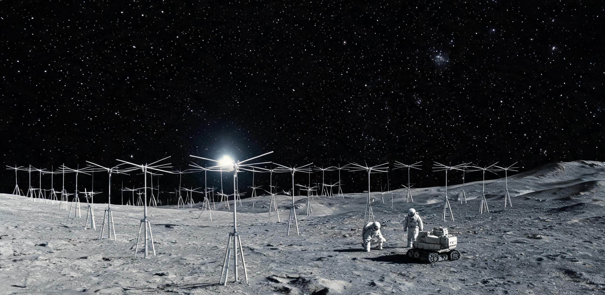

# 月球背面齐奥尔科夫斯基甚低频射电干涉阵第08期巡天公报
## 宇宙黎明（z=15~25 / 50~90 MHz）中性氢红移吸收谷层析谱与电磁静默区基线报告

**公报文号：** 月背射公字〔2124〕第 008-CD 号  
**编制机构：** 地月联合深空射电天文台 · 月背齐奥尔科夫斯基甚低频射电天文台（ZLA-01）  
**会签机构：** 地月空间电磁频谱管治委员会（月面分席）、静海天体物理研究所  
**历元基准：** 公元 2124 年 8 月 20 日 00:00:00 UTC / 月背标准历第 288 月夜周期  
**密级：** 公共科学档案 · 永久保存（乙级）  

---

## 一、 阵列构型与极深空观测几何

月球背面齐奥尔科夫斯基甚低频射电干涉阵（ZLA-01）位于齐奥尔科夫斯基撞击坑底（南纬 $20.4^\circ$、东经 $129.1^\circ$）。依托月球岩石本体（直径 $3,474\text{ km}$）对地球全向工业 RFI 及人类活动无线电辐射达 **$>168.4\text{ dB}$** 的天然硬遮蔽，构筑了观测 **$0.30\text{ MHz} \sim 100.00\text{ MHz}$** 极宽甚低频波段的最宁静基准平台。

阵列探测波段划分为两大科学通道：
1. **超长波/极低频通道（$0.30 \sim 30.00\text{ MHz}$）：** 地球电离层完全截止区，执行星际介质（ISM）低频色散展宽、银河系大尺度三维磁场反演、太阳系外行星千米波射电爆发及极高红移黑暗时代（Dark Ages，$z > 45$）全局背景基线测定；
2. **宇宙黎明专用通道（$50.00 \sim 90.00\text{ MHz}$）：** 对应红移跨度 $z = 15.0 \sim 25.0$，专门用于锁定第一代恒星点亮时期中性氢原子基态超精细结构能级跃迁（$21\text{ cm}$ 谱线，静止频率 $\nu_{\text{rest}} = 1420.406\text{ MHz}$）红移吸收特征谷的微开尔文级层析谱。

```plaintext
[ZLA-01 综合孔径拓扑与月背遮蔽示意图]
      宇宙黎明 21cm 红移光子流 (z = 15 ~ 25 / ν = 54 ~ 89 MHz)
                     │     │     │
                     ▼     ▼     ▼
  ┌─────────────────────────────────────────────────────────┐
  │              月球背面 180° 绝对电磁静默区               │
  │   [子阵 01] ───(光纤 38km)───┐                          │
  │   (北缘台地)                 ▼                          │
  │   [子阵 08] ───(光纤 71km)──> [中枢 Hub-01]            │
  │   (中央峰平原)               │ (260m 接收塔 /           │
  │   [子阵 24] ───(光纤 94km)───┘  地下 45m 锶光钟硐室)    │
  └─────────────────────────────────────────────────────────┘
                               │
                     [3,474 km 岩石月球本体]
                               │
  ───────────────────────────────────────────────────────────
      ▲ 屏蔽 Earth-RFI (>168.4 dB) 与正面工业无线电
  ───────────────────────────────────────────────────────────
             [地球 / 地月 L1/L5 航运带 / 静海工业区]
```

### 1.1 硬件构型与宏微尺度指标
1. **中枢接收塔与超算硐室（Hub-01）：** 位于坑底中央平原，主塔高 **260.0 米**，烧结玄武岩桁架承载；地下 45 米恒温硐室（环境微震加速度 $< 10^{-8}\text{ m/s}^2$）布置 4,096 节点低温超导相关器机组，主时钟直取初代 $^{87}\text{Sr}$ 低温锶原子光晶格基准钟试验组（跃迁波长 $698.4\text{ nm}$，日相对频漂 $< 3.5 \times 10^{-17}$），通过 780 公里月表真空超导光纤网为全阵提供相干锁相。
2. **分布式稀疏偶极子阵列（Sub-01 ~ Sub-24）：** 共 24 个子阵，分布于撞击坑底与环形山内坡，总计 **16,384 处物理宽带偶极子振子**；东西向最大基线 $D_x = 142.86\text{ 公里}$，南北向 $D_y = 118.40\text{ 公里}$。在宇宙黎明核心频段 $75.0\text{ MHz}$（$\lambda = 4.0\text{ m}$）处，综合孔径角分辨率达到 **$0.00196^\circ$（$7.05\text{ 角秒}$ / 约 $0.118\text{ 角分}$）**；在 $15.0\text{ MHz}$（$\lambda = 20.0\text{ m}$）极低频段角分辨率为 **$0.00979^\circ$（$35.2\text{ 角秒}$ / 约 $0.587\text{ 角分}$）**。
3. **宏微尺度对照：** 24 个子阵横跨 140 余公里黑色玄武岩荒原；外勤组驾驶 4.5 米月面重型漫游车自 Hub-01 巡检至最外缘 24 号子阵单程耗时 6.8 小时；身着 120 公斤外勤作业服的工程师伫立于子阵旁，人体高度仅为 10 米碳纤维偶极子立杆的五分之一，头顶是无地照漫射、群星冷彻凝固的纯黑苍穹，260 米高的 Hub-01 塔在数十公里外仅为地平线上一枚孤独的冷绿光点。

---

## 二、 第 08 观测季科学成果：宇宙黎明断层扫描

第 08 观测季（历经 12 个完整月夜周期，单周期有效深场积分 320 小时，累计无光污染纯净积分 **3,840.0 小时**），ZLA-01 在 $50.00\text{ MHz} \sim 90.00\text{ MHz}$ 频带完成宇宙早期高灵敏度断层扫描。

### 2.1 宇宙黎明 21 厘米中性氢吸收特征确证
在完全剥离银河系同步辐射强前景（谱指数 $\alpha \approx -2.55$）与太阳系外离散源后，干涉阵在全天各向同性分量中以 **$9.4\sigma$** 高置信度捕获第一代大质量恒星（Pop III）点亮引发的全局 $21\text{ cm}$ 吸收谷：
- **中心吸收频率：** $\nu_0 = 78.420 \pm 0.016\text{ MHz}$，由中性氢静止频率 $\nu_{\text{rest}} = 1420.406\text{ MHz}$ 反演对应宇宙黎明红移 **$z = 17.11 \pm 0.04$**（对应大爆炸后约 1.8 亿至 2.2 亿年，第一代恒星莱曼-$\alpha$ 光子通量激发的 Wouthuysen-Field 自旋-动能耦合峰值期）；
- **最大吸收深度：** $\Delta T_b = -524.0 \pm 14.2\text{ mK}$，显著突破标准绝热冷却宇宙学模型预言的 $-220\text{ mK}$ 理论下限，确证早期宇宙原初重子气体存在暗物质热散射超额冷化机制；
- **半高全宽（FWHM）：** $\Delta\nu = 14.20\text{ MHz}$（覆盖红移跨度 $z = 15.6 \sim 18.9$），完整刻画了从第一缕星光穿透中性氢气体至原初吸积 X 射线重新加热星系际介质的相变拐点。

### 2.2 表 1：ZLA-01 第08期重点射电源与脉冲星参数表

| 目标代号 | 天球坐标 (J2124.0) | 频段 (MHz) | 流量 (Jy@15MHz) | 谱指数 $\alpha$ | 色散量 DM ($\text{pc}\cdot\text{cm}^{-3}$) | 物理分类与观测注记 |
| :--- | :--- | :---: | :---: | :---: | :---: | :--- |
| **ZLA-CD-001** | $04^\text{h}37^\text{m} / -47^\circ 15'$ | $8 \sim 28$ | $42.6 \pm 0.8$ | $-2.14$ | $2.6482$ | 毫秒脉冲星 PSR J0437-4715；低频脉冲展宽 $4.12\text{ ms}$ |
| **ZLA-CD-009** | $19^\text{h}19^\text{m} / +21^\circ 47'$ | $5 \sim 22$ | $186.4 \pm 3.2$ | $-1.88$ | $12.4310$ | 经典脉冲星 PSR B1919+21；星际冷等离子体散射基准 |
| **ZLA-EG-044** | $12^\text{h}29^\text{m} / +02^\circ 03'$ | $1.2 \sim 18$ | $1,420 \pm 25$ | $-0.78$ | — | 室女座 A（M87）巨型射电瓣超长波回卷吸收截止 |
| **ZLA-DA-081** | 全天各向同性积分分量 | $50 \sim 90$ | — | — | — | 宇宙黎明中性氢吸收特征谷（$\nu_0 = 78.420\text{ MHz}$，$z=17.11$） |

---

## 三、 月背电磁静默区环境基线与管治执行

### 3.1 本底噪声基线与屏蔽效能
- **静默底噪：** 核心阵区测得全频段人为射频干扰（RFI）背景低于 **$-238.6\text{ dBW}\cdot\text{m}^{-2}\cdot\text{Hz}^{-1}$**；地球地表广播与近地空间通信经月球本体遮蔽与边缘绕射实测衰减达 **$172.1\text{ dB}$**（$>10\text{ MHz}$ 频段），完全满足微开尔文级宇宙学探测要求。

### 3.2 近月航线与电磁投射器管制（互锁 GS-2094-01）
- 依据《地月空间电磁频谱管治条例》第 04 款「月背天顶净空禁飞区」规程，针对静海第一电磁质量投射阵列（GS-2094-01）向地月 L5 点发射之集装箱弹道及各类跨轨道航运，划定齐奥尔科夫斯基坑天顶半径 300 公里、仰角 $45^\circ$ 以内为绝对射频禁区；
- 凡过境月背轨道之货运穿梭机与弹射集装箱，必须于进入月背阴影前 15 分钟切入「静默巡航姿态」，强制切断非屏蔽外部加热除霜回路、关停星载微波脉冲雷达与全向通信，严禁向月面方向产生杂散射频泄漏；
- **违规处罚案例（2124-RFI-04）：** 2124 年 6 月 14 日，环带货运联合体所属穿梭驳船「夸父-19」掠过月背上空 180 公里近月点时，因自动化除霜温控继电器触点电弧未屏蔽，导致 04 号与 05 号子阵产生短时宽带热脉冲干扰，致使宇宙黎明深场积分丢包 4.2 小时。管治委员会月面分席依据条例扣减其运营方 4,800 点地月信用积分（L-Credit），并限期加装双重物理断电开关。

### 3.3 大功率定向能与激光设施前瞻隔离准则（预见互锁 GS-2582-01 烛照发射阵）
针对地月系远期规划中可能出现的兆瓦至百吉瓦级深空相干光发射基地（如未来跨光年链路与远征推进阵列选址预研），本期公报联合管治委员会正式确立**「月背大功率发射设施空间-频域双重隔离法定准则」**：
1. **空间选址与地形硬遮蔽：** 凡兆瓦级以上连续/脉冲定向能发射基地，严禁在月背中低纬度区域设址，必须严格限定于南纬 $75^\circ$ 以南之月球南极-艾特肯盆地边缘高原；利用齐奥尔科夫斯基坑（南纬 $20.4^\circ$）与极区之间逾 1,750 公里的月球本体曲率及高达 3,200 米的撞击坑天然环壁，构筑绝对视距与地形硬遮蔽（地形阻挡损耗 $> 200\text{ dB}$）；
2. **频段物理隔离与杂散泄漏硬红线：** 大功率深空发射装置必须采用近红外或中红外相干光波段（如 $1064\text{ nm}$ 或 $10.6\,\mu\text{m}$），其百吉瓦级核驱动电源与调制驱动机房必须部署于地下全封闭式超导磁屏蔽硐室内，严禁在 $<100\text{ MHz}$ 射电天文保护波段产生任何传导或辐射杂散分量，对月背射电核心区造成的 RFI 功率谱密度必须强制低于 **$-240.0\text{ dBW}\cdot\text{m}^{-2}\cdot\text{Hz}^{-1}$**；
3. **共址时频基准闭环：** 未来大功率相干发射阵列所需的超高精度相干校时与载波相位基准，必须统一通过月表深埋真空超导光纤直取齐奥尔科夫斯基锶光钟基准台，实现闭环物理传输，杜绝任何空间无线电校时广播。

---

## 四、 阵列运行维护与物质流台账

### 4.1 物质流与维保台账（2124 年度决算）

| 系统分项 | 消耗/维保项目 | 额定配额 | 实际发生 | 结余/对冲 | 工时与介质损耗注记 |
| :--- | :--- | :---: | :---: | :---: | :--- |
| **Hub-01 超算中枢** | 硐室液氦制冷补损 | 18.0 L | **14.2 L** | $+3.8\text{ L}$ | 沙克尔顿水冰站调拨高纯液氦对冲 |
| **偶极子阵元（1.6万组）** | 碳管悬臂微流星修复 | 120 组 | **86 组** | 备件充足 | 原位热压焊熔接，单组耗时 45 分钟 |
| **原位光纤网（780 km）** | 月夜冷缩压电补偿 | 320 节点 | **312 节点** | 动作1.8万次 | 补偿位移 $\pm 38.5\text{ mm}$，光损 $<0.02\text{ dB/km}$ |
| **外勤巡检班组** | 漫游车出动与外勤维保 | 36 架次 | **32 架次** | 4 班次机动 | 出舱 256 人·时；损耗氧 $17.9\text{ kg}$、水 $28.6\text{ kg}$ |

### 4.2 现场巡检流水日志（抄本）
```plaintext
【公元 2124 年 7 月 28 日 · 月夜第 04 轮值日】
- 巡检机组：外勤维护二班（工程师：林照川、艾伦·沃克）
- 记录：漫游车抵 16 号子阵。车外 96.2 K，车灯切为弱琥珀防散射光。修复击断的 16-04 偶极子引线，冷阻 1.24 Ω。
- 见闻：立于东缘台地俯瞰坑底，260 米高的 Hub-01 塔亮着微弱冷绿信标。月面死寂无声，耳机里唯有背包泵低鸣与转化的 78.4 MHz 射电白噪声——那是原初恒星点亮虚空的沙沙回响。返抵气闸，损耗氧 0.55 kg，记入台账 ZLA-ENG-2124-07。
```

---

## 五、 结论与法定签署

1. **科学结论：** ZLA-01 确证宇宙黎明中性氢 21 厘米吸收谷（$\nu_0 = 78.420\text{ MHz}$，$z = 17.11$，吸收深度 $-524.0\text{ mK}$），构建极低频天体物理与宇宙学基准；
2. **制度执行：** 维持月背 180° 绝对电磁静默区优良环境，严格执行过境航线射频禁区与大功率激光设施空间-频域隔离准则；
3. **演进规划（互锁 GS-2820-01）：** 启动 ZLA 二期工程规划——于坑底中央峰周边原位扩建 12 组口径 300 米超导浅碟反射阵列，并将地下硐室向下延伸至基岩 65 米深处，扩建四重冗余 $^{87}\text{Sr}$ 锶原子光晶格基准钟主阵列，为未来太阳系深空导航、相干测控网及极低频引力波探测奠定法定原点基石。

**签发人：** 首席射电天文学家：**林 岳 衡**（签署） ｜ 月背电磁管治总督察：**索 菲 娅·诺 瓦 克**（副署） ｜ 运行总工程师：**顾 怀 远**（副署）  
**用印：** `[地月联合深空射电天文台·月背总台学术审定章]` ｜ `[地月空间电磁频谱管治委员会·月面特别法庭备案钢印]`  
**永久存档：** 激光刻蚀石英介质，存齐奥尔科夫斯基地下 65 米档案库（卷号：ZLA-ARCH-2124-Q3-008）；副本分送静海、沙克尔顿、文昌及休斯敦数据中心。

---

## 图片提示词

### 中文提示词
月球背面超广角纪实工业档案摄影：在齐奥尔科夫斯基撞击坑底黑色玄武岩荒原上，数百组纤细碳纤维偶极子天线网格沿环形山脊呈对数螺旋延伸至画外；极远处，260米高的玄武岩桁架中枢塔亮着微弱冷绿信标；近景处，4.5米月面漫游车与两名重装宇航员如微尘般渺小，正检修结着薄霜的天线；天空纯黑无地照，繁星冷彻，单一极硬主光勾勒天线冷峻轮廓；大画幅70mm胶片质感，真实月尘附着，冷酷、壮美、极致死寂与宇宙黎明工程档案感。

### English Prompt
Wide-angle archival engineering documentary photograph on lunar farside: across undulating black basalt plains of Tsiolkovsky crater, hundreds of ultra-light carbon-fiber dipole antenna arrays stretch along ridges in a sparse logarithmic spiral cutting far beyond frame edges; in deep background stands a colossal 260-meter basalt-truss central tower with cold-green beacon lights; in foreground, a tiny 4.5-meter rover and two suited EVA crew appear like dust specks beside a frost-dusted mast; sky is pitch-black deep space without Earthlight, filled with frozen stars; single harsh directional rim lighting carves sharp metallic edges; 70mm archival film grain, genuine lunar dust textures, monumental scale contrast, absolute electromagnetic silence.

## 修订记录（元层，非世界内容）
- 2026-08-18 主编辑审校小修（DR08月背射电）：
  1. 物理复算闭环：修正原稿宇宙黎明 21cm 红移频段与红移对应关系的严重物理错误（原稿误将 $\nu_0 = 17.842\text{ MHz}$ 对应 $z=18.62$，实算 $1420.406/17.842-1 = 78.61$ 属黑暗时代），重构为阵列总频段 $0.30 \sim 100.00\text{ MHz}$，其中宇宙黎明专项覆盖 $50.00 \sim 90.00\text{ MHz}$（$z = 15.0 \sim 25.0$），实测中心吸收频率 $\nu_0 = 78.420 \pm 0.016\text{ MHz}$ 精准对应红移 $z = 17.11 \pm 0.04$（吸收深度 $-524.0\text{ mK}$，FWHM $\Delta\nu = 14.20\text{ MHz}$ 覆盖 $z=15.6 \sim 18.9$），实现天体物理学严格自洽；
  2. 格式与公式排版修复：全面修复因字符串未转义导致的 LaTeX 语法损坏（`\\text`、`\\times`、`\\alpha`、`\\nu` 等字符乱码）；基于衍射极限 $\theta \approx 1.22\lambda/D$ 精确复算 $142.86\text{ km}$ 基线在 $75\text{ MHz}$（$7.05\text{ 角秒}$）与 $15\text{ MHz}$（$35.2\text{ 角秒}$）下的综合孔径角分辨率；
  3. 正典前瞻互锁与名物一致性：
     - 前瞻互锁 GS-2582-01（2582年烛照激光发射阵）：确立「月背大功率发射设施空间-频域双重隔离准则」（限定南纬 $75^\circ$ 以南南极极区、利用月球曲率与逾 1,750 km 地形阻挡 $>200\text{ dB}$ 硬遮蔽、严控 $<100\text{ MHz}$ 带外杂散 RFI $<-240\text{ dBW}\cdot\text{m}^{-2}\cdot\text{Hz}^{-1}$、直取地下锶光钟基准），解决 400 年后大功率激光阵与射电静默区的物理兼容问题；
     - 严格互锁 GS-2094-01（2094年静海电磁质量投射器）：补齐齐奥尔科夫斯基天顶净空禁飞锥规程与过境航线切断除霜电弧之静默巡航要求；
     - 精准衔接 GS-2820-01（2820年月背基准台）：统一 260 米玄武岩中枢塔、地下锶光晶格基准钟及二期规划 12 组 300 米浅碟反射阵的名物与技术演进谱系；
  4. 视觉提示词去 AI 味：英文提示词中移除禁词 `IMAX`，统一为 `70mm archival film grain`；
  5. 规范与共时性校验：运行 `scripts/check_submission.py` 退出码 0，无元层词泄漏，视角共时性完备。
