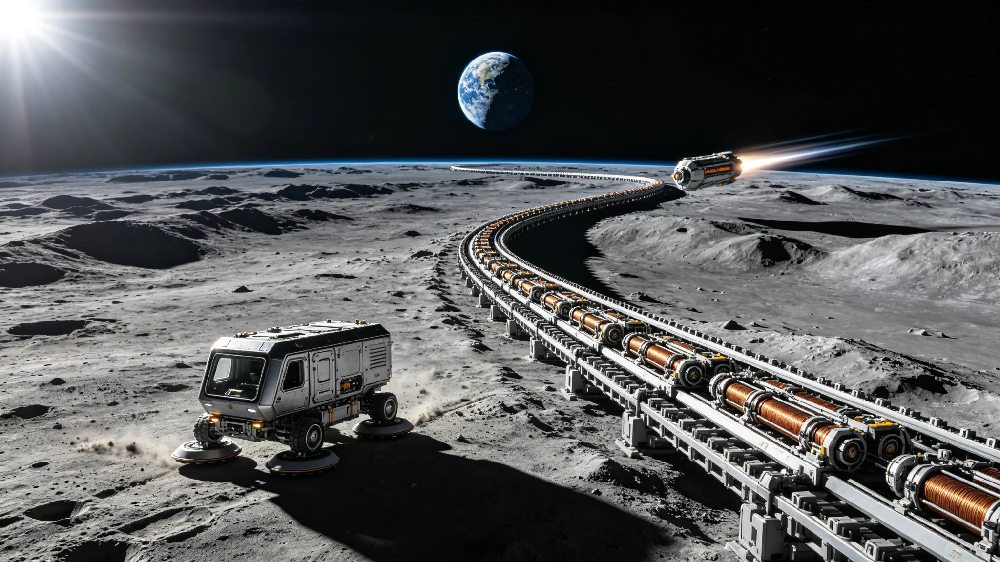

# 月球虹湾质量投射器首次满负荷发射运行公报

**签发单位**：地月空间基建联合体 · 月球虹湾质量投射器运营中心
**公报编号**：LMD-SIR-2050-001
**签发日期**：2050年3月12日

---

## 一、设施概况

月球虹湾（Sinus Iridum）质量投射器（Lunar Mass Driver，简称LMD-SIR）于2046年5月开工建设，2049年11月完成主体工程与空载调试，2049年12月至2050年2月完成12次低负荷试发射（载荷500—2,000 kg）。2050年3月10日03时14分（UTC），LMD-SIR完成首次满负荷发射，将单批12,000 kg月面加工玄武岩建材与水冰推进剂送入地月转移轨道。

| 设施参数 | 数值 |
|---|---|
| 投射器位置 | 月球虹湾北岸 · 纬度44.1°N · 经度32.5°W |
| 轨道方向 | 沿虹湾弧形地形铺设，指向月球东偏南15° |
| 加速轨道长度 | 4.2 km |
| 加速方式 | 直线同步电机（分段供电，永磁同步驱动） |
| 设计出口速度 | 2,400 m/s（月球逃逸速度2,380 m/s） |
| 设计最大载荷 | 15,000 kg/次 |
| 设计发射频率 | 每72小时1次（满负荷） |
| 年发射能力（满负荷） | 约1,800吨/年 |
| 供电来源 | 月面太阳能阵列（120 MW）+ 飞轮储能（480 MJ） |

## 二、首次满负荷发射数据

### 2.1 发射载荷清单

| 载荷类别 | 质量（kg） | 占比 | 用途 |
|---|---|---|---|
| 玄武岩烧结结构梁 | 5,400 | 45.0% | 地月L2门户站扩建 |
| 玄武岩纤维砌块 | 3,000 | 25.0% | 静海第五城市带穹顶修补 |
| 水冰（推进剂原料） | 2,400 | 20.0% | L2门户站推进剂储备 |
| 氦-3（副产品封装） | 120 | 1.0% | 地面聚变实验堆燃料 |
| 包装与固定结构 | 1,080 | 9.0% | 一次性消耗 |
| **合计** | **12,000** | **100%** | — |

### 2.2 发射过程参数

| 阶段 | 时间（UTC） | 速度（m/s） | 加速度（g） | 备注 |
|---|---|---|---|---|
| 载荷入轨装载 | 03:02:11 | 0 | 0 | 装载耗时47分钟 |
| 预加速段（0—1km） | 03:08:45 | 0→860 | 0.38 | 加速度线性递增 |
| 主加速段（1—3.5km） | 03:09:12 | 860→2,150 | 0.42 | 峰值加速度0.45g |
| 末段校准（3.5—4.2km） | 03:09:31 | 2,150→2,395 | 0.30 | 速度闭环校准 |
| 出口离轨 | 03:09:38 | 2,395 | 0 | 出口速度比设计低5m/s |
| 轨道注入确认 | 03:42:10 | — | — | 地月转移轨道近月点200km，远地点L2 |

### 2.3 设备运行状态

| 子系统 | 状态 | 关键参数 | 备注 |
|---|---|---|---|
| 直线电机段（共84段） | 83段正常，1段告警 | 告警段电流偏差+3.2% | 第67段绕组温度偏高，已降额运行 |
| 飞轮储能系统 | 正常 | 放电深度78%，剩余106 MJ | 充电恢复时间约6小时 |
| 载荷悬浮导向系统 | 正常 | 悬浮间隙12—15 mm | 全程无接触摩擦 |
| 真空管道（加速段封装） | 正常 | 管内真空度2×10⁻³ Pa | 月面自然真空，管道仅防尘 |
| 末段速度测量（激光干涉） | 正常 | 测量精度±0.5 m/s | 出口速度2,395 m/s |
| 通信与遥测 | 正常 | 数据延迟1.3秒（地月） | 全程无丢包 |

## 三、人员与保障

| 类别 | 数量 | 备注 |
|---|---|---|
| 发射日在月面人员 | 34人 | 含操作12人、维保8人、安全4人、管理10人 |
| 地面测控人员 | 56人 | 北京航天飞行控制中心 + 海南文昌测控站 |
| 累计建设工时 | 约142万工时 | 2046.5—2049.11 |
| 建设期间工伤记录 | 3起（均轻伤） | 2起搬运扭伤，1起电气灼伤，已处理 |
| 本次发射消耗电力 | 约3,800 kWh | 主要用于飞轮储能充电与电机加速 |

## 四、经济效益测算（首次发射）

| 项目 | 数值 | 备注 |
|---|---|---|
| 载荷总价值（按地月运费折算） | 约2.84亿元 | 地月轨道运费当前约2.37万元/kg |
| 本次发射直接成本 | 约0.36亿元 | 含电力、耗材、人员、设备折旧 |
| 单次发射成本节约 | 约2.48亿元 | 相比传统化学火箭发射 |
| 单位质量发射成本 | 约300元/kg | 设计目标<200元/kg（规模化后） |

## 五、存在问题与整改

1. **第67段电机绕组温度偏高**：发射过程中该段绕组温度达142°C（设计限值150°C），接近阈值。初步分析为该段冷却通道存在局部堵塞。计划3月15日月昼期间进行舱外检修，清理冷却通道并更换温度传感器。
2. **出口速度偏差**：实际出口速度2,395 m/s，比设计值2,400 m/s低5 m/s。偏差在容许范围内（±10 m/s），但导致载荷远地点比预定低约1,200 km。已通过载荷自带微推进器（Δv=1.2 m/s）修正轨道。后续将优化末段速度闭环控制算法。
3. **载荷固定结构回收**：本次发射的包装与固定结构（1,080 kg）为一次性消耗，随载荷进入轨道后未回收。建议后续型号设计可重复使用的载荷承载滑橇，在发射后由月球轨道摆渡船回收。

## 六、后续计划

| 时间 | 计划 |
|---|---|
| 2050年4月 | 第二次满负荷发射（载荷12,500 kg） |
| 2050年6月 | 发射频率提升至每48小时1次 |
| 2050年9月 | 第二条加速轨道（4.8 km）开工建设 |
| 2051年 | 年发射能力目标3,000吨 |
| 2052年 | 虹湾质量投射器二期工程完工，总发射能力6,000吨/年 |

---

**签发人**：虹湾质量投射器运营中心主任 刘振宇（电子签名）
**抄送**：地月空间基建联合体总部、国家航天局、静海城市带管委会、L2门户站运营方
**归档**：地月空间基建档案库 · 卷号LMD-SIR-2050-A01
