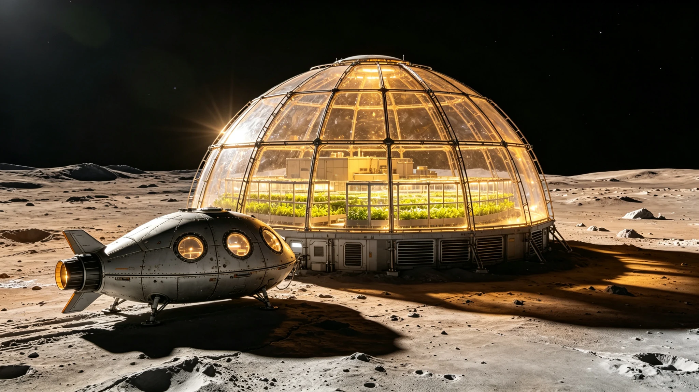

# 柯伊伯带天体"天涯-01"永久定居点首期穹顶竣工公报

**外缘定居工程局 · 柯伊伯带资源开发指挥部**
**文件编号：** 外定柯竣字〔2190〕第007号
**工程代号：** 天涯-01永久定居点首期穹顶（TIANYA-01-DOME-I）
**天体编号：** 2014 MU69-B（暂定名"天涯"），日心距42.7AU

---

## 一、工程概况

天涯-01定居点选址于柯伊伯带接触双星天体较大子星南极盆地，利用冰岩基体天然辐射屏蔽条件，建造直径120米石英承压穹顶，作为人类在40AU以远首个永久有人驻留定居点。工程自2183年开工，历时七年，累计就地取材冰岩建材约84,000吨。

## 二、穹顶设施参数

| 分项 | 设计指标 | 实测值 | 验收结论 |
|---|---|---|---|
| 穹顶直径 | 120m | 119.8m | 合格 |
| 内部可用高度 | 32m | 31.7m | 合格 |
| 承压等级 | 101.3kPa内压 | 1.5倍保压试验通过 | 优良 |
| 石英透光率 | ≥62%（可见光） | 64.3% | 优良 |
| 辐射屏蔽等效 | ≥15m水当量 | 16.2m（含冰岩覆盖层） | 优良 |
| 聚变堆供电 | 800kWe | 并网792kWe | 合格 |

## 三、生态闭环首期运行数据

| 系统 | 设计能力 | 首期实测 |
|---|---|---|
| 水培藻舱产氧 | 120人·需求量 | 满足86人需求 |
| 水循环回收率 | ≥98.5% | 98.2%（待优化） |
| 食物自给率 | 首期40% | 37%（叶菜+藻类） |
| 温控区间 | 18—26°C | 19.5—24.8°C |
| 空气成分 | N₂/O₂=78/21 | 77.6/21.2，CO₂ 0.38% |

## 四、驻留编制与物资储备

首期定居点编制32人，其中工程运维14人、生态农业8人、科研6人、医监2人、行政2人。物资储备含冻干主粮12吨、医药物资全套、聚变堆燃料芯块8组，自持周期18个月。

## 五、遗留项与后续计划

遗留项：水循环系统蒸馏器结垢速率高于预期，需每季度清洗；穹顶东侧石英板接缝处有微渗漏，已注胶临时处理，2191年停压检修。

二期工程（第二穹顶连接段与地下冰窖扩建）已获立项，计划2193年开工。定居点远期规划容纳300人，成为柯伊伯带资源开发与深空航行中继的有人节点。

**外缘定居工程局验收委员会**
**2190年9月8日**
