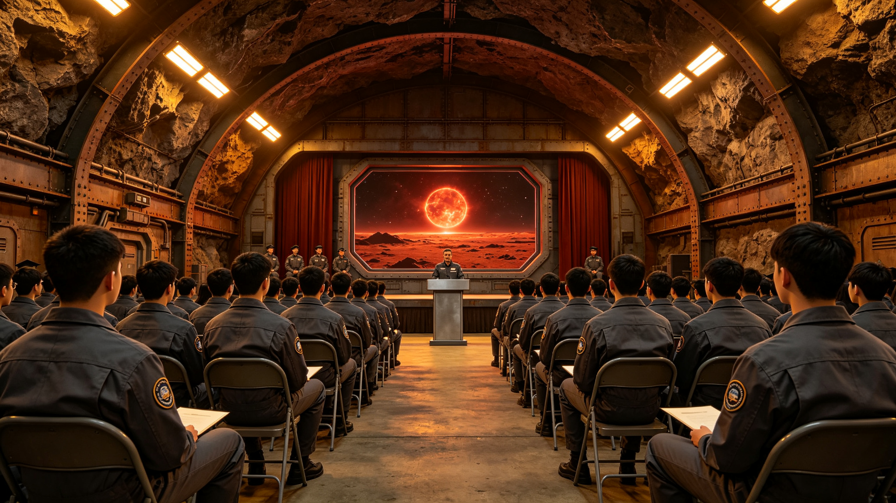

# 比邻星b"新海安"大学首批本土培养毕业生授籍公报与职业分配清册

**公报文号：** `EDU-PX-2485-GRAD01`
**发布机构：** 比邻星b新海安大学 · 教务处 · 职业分配办公室
**授籍日期：** 2485年06月28日
**分配生效日期：** 2485年07月15日

---

## 一、新海安大学概况

新海安大学于2475年经最高评议会第92次全会批准筹建，2477年完成校舍建设（利用东曦地下城掘进技术开凿的地下教学区，建筑面积18,000m²），2479年正式招生。首届学生于2479年09月入学，学制6年（含1年顶岗实习），2485年06月完成全部学业。

大学设5个学院：工程学院、科学学院、医学院、农学院、管理学院。首批入学142人，完成学业138人（退学2人、休学2人），毕业率97.2%。所有毕业生均为比邻星b本土出生、本土完成全部教育（初等学校6年+中等学校6年+大学6年），是首批从未在太阳系接受教育的高等教育毕业生。

## 二、学业考核与授籍

毕业生须完成：课程学分（最低180学分）、毕业设计/论文、顶岗实习（不少于1,800工时）、体能与心理评估。考核结果：

| 等级 | 人数 | 占比 | 说明 |
|:---|:---:|:---:|:---|
| 优秀（GPA≥3.7） | 21 | 15.2% | 可优先选择岗位 |
| 良好（3.0≤GPA<3.7） | 68 | 49.3% | 正常分配 |
| 合格（2.0≤GPA<3.0） | 46 | 33.3% | 正常分配 |
| 补考合格 | 3 | 2.2% | 分配至基础岗位 |

授籍仪式于2485年06月28日在新海安大学中央集会厅举行，由大学校长和最高评议会代表共同颁发毕业证书和职业资格证书。仪式不设演讲，仅宣读毕业生名册和分配方案。

## 三、各学院毕业生分布

| 学院 | 专业 | 毕业人数 | 男 | 女 |
|:---|:---|:---:|:---:|:---:|
| 工程学院 | 地下工程 | 24 | 16 | 8 |
| 工程学院 | 地热能源工程 | 18 | 11 | 7 |
| 工程学院 | 材料工程（玄武岩纤维方向） | 12 | 7 | 5 |
| 科学学院 | 行星地质 | 14 | 8 | 6 |
| 科学学院 | 异星生物学 | 10 | 4 | 6 |
| 科学学院 | 大气与气候科学 | 8 | 5 | 3 |
| 医学院 | 临床医学 | 16 | 7 | 9 |
| 医学院 | 航天医学与辐射防护 | 8 | 4 | 4 |
| 农学院 | 水培农业与植物生理 | 14 | 6 | 8 |
| 农学院 | 食品工程 | 6 | 3 | 3 |
| 管理学院 | 公共管理与工分核算 | 8 | 4 | 4 |
| **合计** | — | **138** | **75** | **63** |

## 四、职业分配清册

分配原则：①专业对口；②各定居点人才需求平衡；③个人意愿（前3志愿）；④成绩优先（优秀生优先选择）；⑤艰苦地区（南冕）志愿优先且享受工分补贴（+15%）。

### 4.1 按定居点分配

| 定居点 | 分配人数 | 占比 | 主要岗位 |
|:---|:---:|:---:|:---|
| 新海安（第一定居点） | 52 | 37.7% | 大学教职、研究所、中心医院、管理机构 |
| 望北（第二定居点） | 28 | 20.3% | 地热站、水培农场、地方医院、工程维护 |
| 东曦（第三定居点） | 31 | 22.5% | 地下工程扩建、建材生产、地质勘探 |
| 南冕（第四定居点） | 19 | 13.8% | 地热供暖运维、极夜医疗、地下农业 |
| 轨道船坞（天工-01/02） | 5 | 3.6% | 船舶维修、轨道工程、燃料加注 |
| 流动岗位（科考/巡检） | 3 | 2.2% | 深海科考队、大气观测站、地质巡测 |
| **合计** | **138** | **100%** | — |

### 4.2 按行业分配

| 行业 | 人数 | 占比 |
|:---|:---:|:---:|
| 工程建设与维护 | 42 | 30.4% |
| 医疗健康 | 24 | 17.4% |
| 农业与食品 | 20 | 14.5% |
| 科学研究 | 18 | 13.0% |
| 能源（地热/电力） | 14 | 10.1% |
| 教育 | 10 | 7.2% |
| 管理与行政 | 7 | 5.1% |
| 其他 | 3 | 2.2% |

### 4.3 重点岗位分配（部分）

| 姓名 | 专业 | 成绩 | 分配单位 | 岗位 | 起薪（工分/月） |
|:---|:---|:---:|:---|:---|:---:|
| 陈砌 | 地下工程 | 优秀 | 东曦建设指挥部 | 掘进工程师 | 1,850 |
| 林藻 | 异星生物学 | 优秀 | 异星生物安全局 | 研究员 | 1,800 |
| 温流 | 地热能源工程 | 优秀 | 南冕地热站 | 主任工程师 | 1,950（含极夜补贴） |
| 何苗 | 水培农业 | 优秀 | 望北水培农场 | 技术主管 | 1,750 |
| 苏健 | 临床医学 | 优秀 | 新海安中心医院 | 住院医师 | 1,800 |
| 韩岩 | 行星地质 | 良好 | 地质勘探局 | 勘探队员 | 1,550 |
| 赵氧 | 大气科学 | 良好 | 大气观测中心 | 观测员 | 1,500 |
| 马纤 | 材料工程 | 良好 | 新海安建材厂 | 工艺工程师 | 1,600 |
| 伊万·热 | 地热能源 | 良好 | 望北地热站 | 运维工程师 | 1,550 |
| 萨拉·康 | 临床医学 | 良好 | 南冕医疗站 | 全科医师 | 1,725（含极夜补贴） |

（完整138人分配清册存于新海安大学教务处档案柜，编号EDU-2485-ROSTER-01，本公报仅列重点岗位10人。）

## 五、待遇与保障

- **起薪：** 大学毕业生起薪1,500—1,950工分/月（视岗位和地区），高于中等教育毕业生（900—1,200工分/月）
- **住房：** 各定居点优先分配标准居（52m²），已婚者可申请家庭居（78m²）
- **极夜补贴：** 南冕岗位享受+15%工分补贴和每年30天晨昏带疗养假
- **轨道岗位补贴：** 天工船坞岗位享受+10%补贴和每6个月一次地表轮换
- **继续教育：** 工作满3年后可申请硕士阶段学习（新海安大学2488年开设硕士项目）
- **服务期：** 毕业生须在分配岗位服务满5年，期间不得自行调动（特殊情况经审批）

## 六、教育质量评估

教务处对首批毕业生进行了综合评估：

| 评估维度 | 结果 | 对比基准（船载教育体系毕业生） |
|:---|:---|:---|
| 专业理论知识 | 达标率94.2% | 96.8% |
| 实践操作能力 | 达标率91.3% | 88.5% |
| 异星环境适应力 | 达标率98.6% | 82.1% |
| 团队协作 | 达标率96.4% | 94.7% |
| 心理稳定性 | 达标率95.7% | 89.3% |

本土培养毕业生在实践操作和异星环境适应力方面优于船载教育体系毕业生，但在专业理论深度上略有差距（主要原因是教材和师资尚在积累中）。大学已制定改进计划：2486年起引进太阳系高校远程课程资源，2488年建立教师交流制度。

## 七、后续规划

- 2485年09月：第七届学生入学（计划招生180人）
- 2486年：增设"行星改造工程"和"原生生态学"两个新专业
- 2488年：开设硕士研究生项目，首批招生30人
- 2490年：东曦分校筹建（服务第三、第四定居点）
- 2500年目标：累计培养高等教育毕业生1,500人，覆盖各定居点关键岗位

*新海安大学校长：* 教育才
*教务处主任：* 书卷
*职业分配办公室主任：* 分工
*最高评议会代表：* 陈守塬（列席）

> *授籍日志：* 名册宣读完，138个年轻人站起来，穿着统一的深灰色工作服，没有帽子，没有礼服。老教校长把最后一张毕业证书递出去，对记录员说："从今天起，这颗星球上有了自己培养的工程师、医生、农学家。他们没见过地球，没坐过世代飞船，他们生在这里，长在这里，学在这里。以后这颗星球的路，要靠他们自己修了。"集会厅的通风机轻轻响着，窗外是红矮星暗红色的光。
