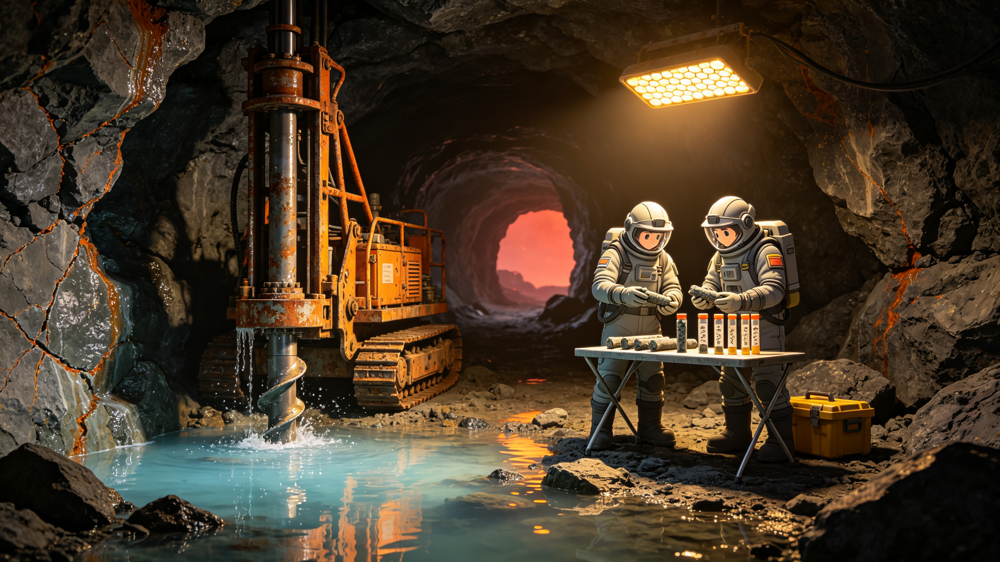

# 比邻星b"望北"定居点地下蓄水层首期勘探公报与水质矿物成分鉴定书

**公报文号：** `HYD-PX-2368-AQU01`
**发布机构：** 比邻星b望北筹建处 · 水文地质勘探组
**勘探周期：** 2367年09月—2368年05月

---

## 一、勘探概况

望北定居点首期规划常住人口6,000人（含建设期施工人员1,200人），日均需水量估算为480m³（饮用80m³、卫生150m³、水培农业180m³、工业及其他70m³）。地表无常年径流，永昼侧冰川融水距谷底14km且输水管道需穿越强风蚀区，工程代价过高。经方案比选，确定以地下裂隙含水层为主要水源，融水输水为远期备用。

首期勘探共布置钻孔5口，呈"L"形沿谷底断裂带分布，孔距400—800m。钻探设备为"穿山甲-00"型岩芯钻机（直径150mm，最大钻深600m），全封闭加压履带底盘，操作人员2人/班。

## 二、钻孔成果

| 孔号 | 孔深(m) | 初见水位(m) | 稳定水位(m) | 涌水量(m³/h) | 含水层岩性 |
|:---|:---:|:---:|:---:|:---:|:---|
| W-01 | 312 | 186 | 172 | 4.2 | 碎裂玄武岩裂隙带 |
| W-02 | 285 | 164 | 151 | 6.8 | 角砾岩—玄武岩接触带 |
| W-03 | 348 | 203 | 188 | 12.4 | 主断裂破碎带（宽14m） |
| W-04 | 256 | 142 | 130 | 3.1 | 致密玄武岩稀疏裂隙 |
| W-05 | 390 | 221 | 205 | 8.7 | 隐爆角砾岩带 |

W-03孔为主供水孔，位于谷底主断裂带，钻进至287m处遭遇涌水，初始涌水量18m³/h，含砂量较高（约3.2%），经洗井72小时后含砂量降至0.04%，稳定涌水量12.4m³/h。

抽水试验（降深12m，持续72小时）显示：W-03孔影响半径约420m，渗透系数K=1.8m/d，储水系数S=3.2×10⁻⁴。按单井12m³/h计，5口井合计可稳定供水35.2m³/h，即845m³/日，满足首期需求并有76%余量。

## 三、地下水赋存机制

望北谷底为复合断裂谷，永昼侧大气降水（年均降水量约340mm，集中于红矮星升落季）沿玄武岩柱状节理和断裂破碎带下渗，在谷底深部汇聚形成裂隙—孔隙复合含水层。地下水流向总体由永昼侧向永夜侧，水力坡度约1.2%。同位素分析（δ¹⁸O=−6.8‰，δD=−48‰）确认水源为现代大气降水补给，无化石水或岩浆水混入。

地下水温14.2℃（W-03孔井口实测），不受地热异常影响（一号地热井位于谷底北侧800m，深度3,200m，与浅部含水层之间隔有约200m致密玄武岩隔水层）。

## 四、水质矿物成分鉴定

**鉴定机构：** 第一公社环境监测站 · 水质分析实验室
**采样日期：** 2368年04月18日—22日（W-03孔，连续5日每日采样）
**检测项目：** 47项

### 4.1 物理指标

| 项目 | 检测值 | 限值（饮用） | 判定 |
|:---|:---:|:---:|:---|
| 色度 | 3度 | ≤15度 | 合格 |
| 浑浊度 | 0.8 NTU | ≤5 NTU | 合格 |
| 嗅和味 | 无 | 无异常 | 合格 |
| pH | 7.8 | 6.5—8.5 | 合格 |
| 电导率 | 842 μS/cm | — | — |
| 总硬度（CaCO₃计） | 312 mg/L | ≤450 mg/L | 合格 |

### 4.2 主要离子成分

| 阳离子 | mg/L | 阴离子 | mg/L |
|:---|:---:|:---|:---:|
| Ca²⁺ | 78.4 | HCO₃⁻ | 286 |
| Mg²⁺ | 24.1 | SO₄²⁻ | 68.2 |
| Na⁺ | 52.6 | Cl⁻ | 41.3 |
| K⁺ | 8.7 | SiO₂ | 34.5 |
| Fe²⁺/Fe³⁺ | 0.42 | F⁻ | 0.82 |

水化学类型为HCO₃—Ca·Mg型，与地球玄武岩地区地下水特征一致。

### 4.3 特殊关注项

| 项目 | 检测值 | 限值 | 判定 |
|:---|:---:|:---:|:---|
| 总溶解固体（TDS） | 526 mg/L | ≤1000 mg/L | 合格 |
| 硫酸盐 | 68.2 mg/L | ≤250 mg/L | 合格 |
| 氯化物 | 41.3 mg/L | ≤250 mg/L | 合格 |
| 氟化物 | 0.82 mg/L | ≤1.5 mg/L | 合格 |
| 硝酸盐（以N计） | 2.1 mg/L | ≤10 mg/L | 合格 |
| 亚硝酸盐 | 0.003 mg/L | ≤0.02 mg/L | 合格 |
| 氨氮 | 0.04 mg/L | ≤0.5 mg/L | 合格 |
| 总有机碳（TOC） | 0.62 mg/L | — | — |
| 重金属（Pb/Cd/Hg/As/Cr） | 均低于检出限 | 各有限值 | 合格 |
| 总α放射性 | 0.08 Bq/L | ≤0.5 Bq/L | 合格 |
| 总β放射性 | 0.21 Bq/L | ≤1.0 Bq/L | 合格 |

**微生物指标：** 总菌落数12 CFU/mL（限值≤100），总大肠菌群未检出（100mL水样），耐热大肠菌群未检出。未发现疑似异星微生物形态（暗视野显微镜400×观察，样品经0.2μm滤膜富集后镜检，无异常颗粒）。

### 4.4 鉴定结论

W-03孔地下水经简易处理（曝气除铁+多介质过滤+紫外线消毒）后可达饮用标准。铁含量0.42mg/L略高于推荐值（0.3mg/L），需设置曝气除铁工序。硫酸盐和总硬度偏高，长期饮用需关注，但在安全限值内。水培灌溉可直接使用，无需软化。

## 五、水源保护与监测

划定W-03孔为中心、半径300m为一级水源保护区，区内禁止施工排污、固体废物堆放及地热钻井。W-01、W-05孔为二级保护区（半径150m）。

建立长期监测制度：每日人工监测水位、水温、涌水量；每周实验室检测pH、电导率、浊度、铁、微生物；每月全分析（47项）。红矮星耀斑后48小时内加测一次水质全分析（关注放射性指标波动）。

## 六、存在问题

1. W-04孔涌水量偏低（3.1m³/h），该区域裂隙不发育，建议作为观测井使用，不纳入供水井组。
2. 主断裂带导水性强，存在地表污染物快速下渗风险，水源保护区围栏及防渗层须于2368年10月前完工。
3. 地下水补给区位于永昼侧高地，该区域目前无常驻监测点，建议2369年增设2口补给区观测井。
4. 5口井同时抽水时存在井间干扰风险，建议实际运行时采用4用1备轮换制度。

*望北筹建处主任：* 陈守塬
*水文地质勘探组首席：* 马尔塔·席尔瓦
*水质鉴定实验室主任：* 何清源

> *勘探日志：* W-03孔洗井结束那天，水从管口喷出来，在头灯底下泛着点蓝。老马接了一杯，没敢喝，先递给仪器。仪器嘀了一声，她看了看读数，又看了看杯子，说："这水比我们船上循环了八十年的水干净。"然后她真喝了一口，皱了皱眉："就是硬，洗不出泡沫。"
