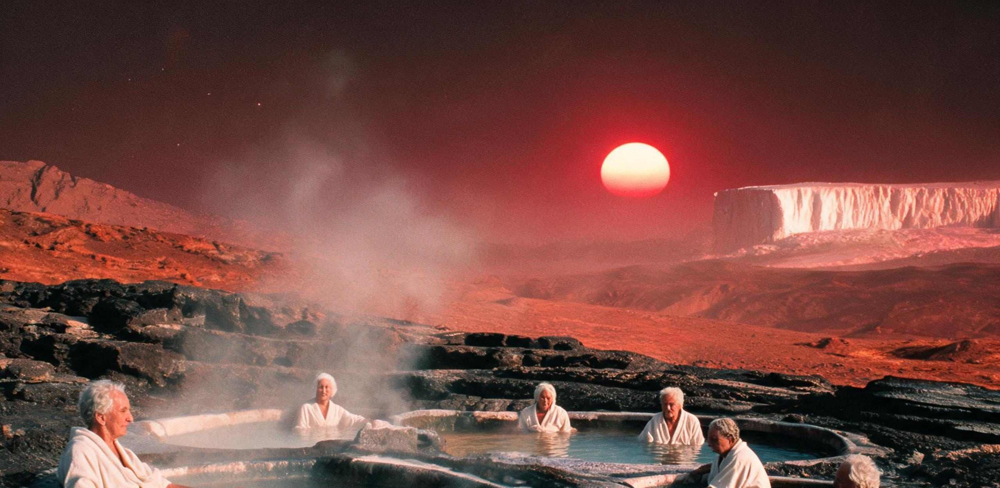

# 比邻星b晨昏定居区法定公共轮休历与退休公民地热疗养及全域壮游保障公报
## 落地历第278年度全域劳工休假章程与资深建设者福利保障条例（修订版）

**文号：** 比社保字〔落278〕第045号  
**签发机构：** 比邻星b联合行政委员会·劳动力资源与社会保障总署 / 民政与公共福利局  
**会签机构：** 晨昏带交通与重载列车管理局、冷洋地热综合开发指挥部、晨昏谷农业联合体总务司、新海安中央档案馆  
**密级：** 全域公开（正文及各定居点公共屏通告） / 限业务部门（附卷：疗养指标测算与流体能耗配额表）  
**颁布与执行基准日：** 落地历278年第06潮汐周 望日（折合旧公历2628年06月15日）

---

### 一、 总则：稳态繁荣与「建设者有其闲」之制度原则

自退役巨舰 ARK-01 乘员踏足比邻星 b 晨昏宜居带建立首期营地（落历0年·旧公历2350年）以来，全域定居点已连续平稳运转 278 个标准地球年（折合行星公转潮汐周 9,079 周期）。

截至落历 278 年初，全域水-氧-碳-氮生态闭环率已稳定达到 99.2% 以上，新海安、新澄海与晨昏谷三大复合城市群及 1,840 公里晨昏第一防风玄武岩大坝全面实现重核聚变与深层地热电网双重充沛供给。在基础生存物资全面实现零成本自给、全域常住人口达 438,200 人的稳态阶段，社会治理的核心目标已由拓荒初期的「全员极限动员与防风保命」全面转向「保障劳动者生理机能长效康复、拓展行星级生活美学体验与兑现资深建设者晚年尊严」。

为保障全域 28.6 万名在册在岗劳动力享有充分之生理恢复与文化休养权益，同时对累计奉献超过 40,000 具名工时之退休公民提供涵盖「冷洋地热温泉疗养」、「大坝天际线全景壮游」及「高轨微重力脊柱减压」在内的终身全免费福利，特对落历 265 年版《休假与退休保障条例》进行本次全面修订与扩容。

```text
==================================================================================================
                      比邻星 b 晨昏定居区「潮汐周工休律」基础运行模型（11.186地球日/周期）
==================================================================================================

 行星潮汐日:   01      02      03      04      05      06      07      08      09      10      11
             ┌───────┬───────┬───────┬───────┬───────┬───────┬───────┬───────┬───────┬───────┬───────┐
 基础排班:   │ 工 班 │ 工 班 │ 工 班 │ 工 班 │ 工 班 │ 工 班 │ 工 班 │ 潮 轮 │ 潮 轮 │ 潮 轮 │ 防 备 │
             └───────┴───────┴───────┴───────┴───────┴───────┴───────┴───────┴───────┴───────┴───────┘
             │◄─────────────────── 连续作业班 (7个潮汐日) ──────────────────►│◄── 公共轮休 (3日) ──►│◄备风日►│
             
 · 标准工时制: 每日工作 6.5 小时（含 1.0 小时工间红外护目与脊柱拉伸）
 · 潮轮休假期: 连续 3 个潮汐日全区各工场、深井与大棚停机维保，全员享受地热温室休闲、大屏文化放映与家庭聚餐
 · 季候防备日: 潮汐日11统一开展家庭气密门胶条涂脂、地锚紧固与备风物资核验（工时记入志愿公益账户）
==================================================================================================
```

---

### 二、 全域法定公共节假历与四大主节令休假保障台账

承接《比邻星b定居带岁时节序演变通报》（GS-2598-01）所确立之四大在地节令，全域法定休假日一律以红矮星天文周期、跨半球对流峰值及双星通信窗口为基准。遇法定节假日，与当期「潮轮休假」自动顺延合并：

```text
===================================================================================================================
节令名称     法定放假天数    对应天文/工程周期     全域公共保障与福利配发标准            核心文化与休养场景
===================================================================================================================
【客光节】   连续 7 潮汐日   太阳系 S-P Link 激光  · 全域大屏幕 24 小时滚动解码下行文娱 · 一号穹顶中央广场古典音乐会;
(来信周)    (约78.3地球日)  超宽带数据包入轨窗口   · 每户配发鲜果冻干盲盒(草莓/蓝莓各200g) · 青年地籍公证处办理「同光婚约」;
                            (每2.4个地球年一次)   · 咖啡因-茶多酚复合热饮原料全免供应    · 跨定居点业余无线电通联沙龙
-------------------------------------------------------------------------------------------------------------------
【大红风节】 连续 4 潮汐日   晨昏对流暴风极值期     · 全区地热供暖负荷提升 30%            · 玄武岩下卧岩室内家庭火锅长桌宴;
(挂锚平安周) (约44.7地球日)  (地表风速>50m/s阶段)  · 配发耐寒紫麦原浆精酿啤酒(每人2.5L)   · 老工匠向青年演示手工锻打与冷焊;
                                                   · 社区烘焙坊连续供应现烤热紫麦香饼    · 门框轻敲绿柄扳手祈福仪式
-------------------------------------------------------------------------------------------------------------------
【关管节】   连续 3 潮汐日   红矮星磁暴与电网检修   · 各穹顶切断强光栅，转入柔和荧光地灯 · 坑基地下长廊烛光夜市与旧物交换;
(除灯休整周) (约33.6地球日)  (每38个潮汐周一次)     · 全区配发高纯度冷凝复水牛肉鲜汤料包 · 退休天文爱好者岩顶暗夜巡天;
                                                   · 社区公共澡堂全天候开放热汽冲淋      · 幼托中心开展「飞船老故事」放映
-------------------------------------------------------------------------------------------------------------------
【站绿日】   连续 5 潮汐日   晨昏谷人工土壤大面积   · 晨昏谷万亩透光大棚全景步道免费开放 · 学龄儿童亲手定植一株抗逆紫麦;
(定植春耕周) (约55.9地球日)  定植期(每18潮汐周一次) · 每人配发晨昏谷新鲜水培小番茄 1.5kg  · 家庭认领气雾培蔬菜格位;
                                                   · 免费开行新海安—晨昏谷亲子双层观光车 · 穹顶泥土芳香疗法与草坪野餐
===================================================================================================================
```

---

### 三、 资深建设者（退休公民）全域疗养与壮游保障体系

#### 1. 退休准入与荣誉评定
凡年满 **58 标准地球岁**（或从事露天玄武岩开采、重核反应堆第一壁检修、防风大坝迎风侧巡检累计满 **32,000 具名工时**）之在籍公民，自申请之日起全额转入「资深建设者荣誉退休序列」。全域设立三项终身刚性保障：

* **居住空间永久留置：** 个人及配偶享有其承租/配赋之地下岩室或穹顶公寓终身免收维保费之权利（包括 B-144 等早期历史保护坑基），严禁任何机构以腾退名义强制作出搬迁决定。
* **全要素生命维持无上限配发：** 纯净饮用水、医用级供氧、地热恒温地暖（保持 295K ± 1.5K）及全域公共交通一律纳入公费兜底，终身免费。
* **专属医疗与康复绿通：** 曙光穹顶联合医疗所及各定居点医务分部设立「退行性肌骨与晶状体专项康复门诊」，每年提供 4 次高精度骨密度扫描（DXA）与腰椎减压理疗。

```text
┌──────────────────────────────────────────────────────────────────────────────────────────────────┐
│                      比邻星 b 资深建设者三大行星级壮游与疗养路径分布图                          │
├──────────────────────────────────────────────────────────────────────────────────────────────────┤
│                                                                                                  │
│       [ 永 昼 侧 ]                                                                               │
│      (次星下点赤道) ──► 严酷荒原（未开放个人旅游）                                              │
│                                                                                                  │
│       [ 晨 昏 宜 居 槽 谷 ]                                                                      │
│       ┌────────────────────────────────────────────────────────────────────────┐                 │
│       │ 【路径一：1840公里「大坝天际线」全景列车壮游线】                       │                 │
│       │  · 载具: 840吨「撼风者-IV」全景双层观光特快（退役重载工程车改建）       │                 │
│       │  · 线路: 新海安东台地 ◄═══ 晨昏大坝顶轨 ═══► 晨昏谷北端前哨 (全程7潮汐日) │                 │
│       │  · 景观: 俯瞰百米坝下万顷发光温室、左舷永恒深红巨日、右舷极地漫天紫光  │                 │
│       │  · 待遇: 观景沙龙专属软座、恒温湿润富氧舱、现沏高山温室绿茶全天畅饮    │                 │
│       └──────────────────────────────────┬─────────────────────────────────────┘                 │
│                                          │                                                       │
│                                          ▼ 分流联络线                                             │
│       ┌────────────────────────────────────────────────────────────────────────┐                 │
│       │ 【路径二：冷洋前缘 420公里「破冰地热矿泉疗养带」】                      │                 │
│       │  · 设施: 利用 24 座 4800m 深井超临界 CO₂ 换热余温打造之天然矿泉中心    │                 │
│       │  · 水质: 富含偏硅酸、游离二氧化碳与活性锶，出水温度 315K~318K          │                 │
│       │  · 功效: 针对 L-G4/L-G5 世代 1.07g 重力腰椎纤维环钙化及风湿关节劳损     │                 │
│       │  · 配额: 退休公民每年享有 2 个完整潮汐周（约22.4地球日）全包式水疗度假 │                 │
│       └──────────────────────────────────┬─────────────────────────────────────┘                 │
│                                          │                                                       │
│                                          ▼ 轨道天梯接驳                                           │
│       [ 高 轨 驻 极 站 ]                 │                                                       │
│       ┌──────────────────────────────────┴─────────────────────────────────────┐                 │
│       │ 【路径三：高轨「天伞」反射镜微重力全景康养站 (PMA-03 观星环)】         │                 │
│       │  · 标高: 比邻星 b 第一拉格朗日点驻极轨道（离地高度 14,200 km）         │                 │
│       │  · 特性: 0.05g 微重力生理环境，彻底释放受损脊椎与下肢负荷              │                 │
│       │  · 申请: 65岁以上退休工匠每五年可申请一次（每次 5 个潮汐日）           │                 │
│       │  · 体验: 6.5公里铍基镜面外侧全景透明观星穹顶，肉眼凝视南门二双星与深空星海   │                 │
│       └────────────────────────────────────────────────────────────────────────┘                 │
│                                                                                                  │
│       [ 永 夜 侧 ]                                                                               │
│      (反星下点冰盖) ──► 极区科学考察站与采冰前哨（特许科研准入）                                │
└──────────────────────────────────────────────────────────────────────────────────────────────────┘
```

#### 2. 冷洋破冰地热温泉疗养规程
冷洋前缘地热疗养中心（位于新海安东北部海岸线 KM 180 处）依托深层地热梯级利用工程，开辟出 12 处大型阶梯式半露天玄武岩泡池。

* **景观设计：** 泡池背靠晨昏防风大坝坚实之玄武岩挡风墙，面朝冷洋常年不冻水域。池畔安装有特种防风双层石英电热幕墙，阻绝外部 20 m/s 低空剪切风，同时保留 100% 视觉通透度。
* **壮美风光体验：** 疗养公民浸泡于 316K 的富矿温泉中，头顶是红矮星贴在地平线上方投下的永恒苍茫红光，前方数百米处是冷洋前缘翻滚升腾的百米白色地热蒸汽云霞，极目远眺则是永夜冰盖上空受磁层约束激发的绚烂绿色与紫色极光带。
* **配套餐饮：** 疗养期间每日配发由晨昏谷特供之冷泉有机罗非鱼片、鲜炙白玉菇、高纤维紫麦松饼及冰镇地热浆果气泡水。

---

### 四、 全域生活品质与鲜食配发升级指标台账

伴随农业水文工程之三百年演替，全域食品供应已彻底告别拓荒初期单一之干缩复水糊状口粮，全面转入「多风味生鲜与精深加工美食时代」：

```text
==================================================================================================================
品类名称         落历200年基础定额    落历278年现行标配定额    退休与疗养专属增补    主要品种与品质特征
==================================================================================================================
【新鲜蔬菜类】   4.5 kg / 人·潮汐周   12.0 kg / 人·潮汐周     +4.0 kg (优先自选)     海安生菜(HA-XII)、脆玉黄瓜、
                                                                                    温室紫甘蓝、耐光鲜甜番茄
------------------------------------------------------------------------------------------------------------------
【精制主粮类】   6.0 kg / 人·潮汐周    8.5 kg / 人·潮汐周     +2.0 kg (超微精粉)     七代晨昏紫麦精粉、高抗性微型
                                                                                    马铃薯泥、免淘黄金小米
------------------------------------------------------------------------------------------------------------------
【高品质蛋白】   1.2 kg / 人·潮汐周    3.8 kg / 人·潮汐周     +1.5 kg (鲜活冷鲜)     冷洋循环水养殖甜虾、罗非鱼、
                                                                                    仿生大豆多肽肉排、高蛋白鲜浓豆乳
------------------------------------------------------------------------------------------------------------------
【真菌与鲜果】   0.8 kg / 人·潮汐周    2.5 kg / 人·潮汐周     +1.2 kg (高甜鲜果)     白玉香菇、玄武岩红平菇、
                                                                                    水培草莓、地热矮化无花果
------------------------------------------------------------------------------------------------------------------
【风味饮品配额】 2.0 L / 人·潮汐周     6.0 L / 人·潮汐周      +3.0 L (无醇原浆)      晨昏谷烘青绿茶、紫麦黑啤、
                                                                                    合成可可热饮、活性乳酸菌饮品
==================================================================================================================
```

---

### 五、 典型服务个案档案抄件（新海安 B-144 家族退休人员）

**服务档案编号：** BEN-278-XHA-01942  
**受惠公民姓名：** 方建安（公民编码：`XHA-2518-0312-00891`）  
**代际与工龄：** L-G4 世代（出生于落地历 168 年 / 现年 110 岁），原新澄海重工第三玄武岩纤维拉丝车间高级技师，累计核定具名工时 54,280 小时。  
**现居住址：** 新海安背风山脊 B-144 复合气压穹顶地下负二层 01 号（历史保留房）

```text
┌──────────────────────────────────────────────────────────────────────────────────────────────────┐
│                      新海安民政与福利服务中心 · 年度个案履约巡访记录表                          │
├──────────────────────────────────────────────────────────────────────────────────────────────────┤
│                                                                                                  │
│ 【落历277年第18潮汐周 · 大坝天际线壮游回访】                                                   │
│  方老先生携重孙方承石（L-G6世代学徒工）乘坐「撼风者-IV」02号观光列车完成大坝全线巡游。          │
│  · 乘务组日志摘录：“方老身体状况极佳，在KM 850大坝观景厅驻足两小时。指认其青年时期参与熔铸之   │
│    第三代重型锚固座，向同车年轻旅客讲述当年人工顶着红风敷设光缆之历史。列车供应其最喜爱之     │
│    热紫麦酥饼与红茶三套，老人情绪饱满，血压心率全程稳定。”                                     │
│                                                                                                  │
│ 【落历278年第02潮汐周 · 冷洋地热温泉疗养评定】                                                 │
│  入驻冷洋 04 号「望海岩」温泉疗休养所，完成为期 14 个潮汐日的阶段水疗。                         │
│  · 主治医师顾维康（医疗所主任）签字评估：“经 316K 偏硅酸矿泉持续浸泡及水下超声理疗，老同志    │
│    L4-S1 腰椎间盘骨桥受压症状显著缓解，双下肢行走肌力由 IV- 级提升至 IV+ 级，夜间睡眠质量评分 │
│    提升 45%。准予下季度申请高轨 PMA-03 镜站为期 3 天的微重力视盘减压体验。”                   │
│                                                                                                  │
│ 【日常物资与尊严保障履约核验】                                                                   │
│  · 住房与环境：B-144 居所入户恒温地暖实测 296.2K，水培窗台绿植生长旺盛，地籍公证书界标完好；  │
│  · 鲜食配额：每月鲜果、罗非鱼与紫麦茶准时配送至户，未发现任何截留或延误；                       │
│  · 精神文化：老人目前担任新海安第一初等学校校外历史顾问，每周五在社区活动中心开展一次免费       │
│    「老铁工机械手工课」，按规定计发荣誉讲师津贴并免除其全部公共志愿服务积分要求。             │
│                                                                                                  │
└──────────────────────────────────────────────────────────────────────────────────────────────────┘
```

---

### 六、 组织实施、监督举报与签署

1. **分级履约责任：** 新海安、新澄海、晨昏谷各片区总务委员会须将本公报所列之轮休时间表与鲜食、疗养指标纳入年度民生硬性考核指标，严禁任何工矿企业与行政部门以“突击赶工”为由侵占劳动者法定公共轮休与资深建设者疗养假期。
2. **交通与流体能耗优先保障：** 全域交通调度中心须确保「撼风者」全景客运列车运行图准点率达 99.5% 以上；冷洋地热开发指挥部须维持 24 座深井换热管网对疗养区之恒温供热安全。
3. **维权与争议仲裁：** 凡遇克扣鲜食配额、缩减轮休天数或侵犯退休公民合法权益者，任何公民均可通过各定居点一号公共屏终端向「比邻星b劳工与社会保障总署仲裁庭」发起一键直诉，仲裁庭须在 2 个潮汐日内完成现场核查并公开通报。

---

**核准签发人：**  
比邻星b劳动力资源与社会保障总署 署长：**韩德广**（电子签署：`HAN-DG-LABOR-2628`）  
比邻星b民政与公共福利局 局长：**苏明玉**（电子签署：`SU-MY-CIVIL-2628`）  

**联合签署机构：**  
晨昏带交通与重载列车管理局 局长：**赵铁城**（印鉴：`TRANS-PROX-SEAL`）  
冷洋地热综合开发指挥部 总指挥：**陆海峰**（印鉴：`GEOTHERM-OCEAN-DIR`）  
晨昏谷农业联合体总务司 司长：**唐秀英**（印鉴：`AGRI-VALLEY-EXEC`）  
新海安中央档案馆 馆长：**方文渊**（印鉴：`ARCH-XHA-ROOT-SEAL`）  

**存档编号：** `PROX-SOC-WELFARE-278-REV4`  
**存放物理位置：** 新海安中央档案馆地下三层 A-02-048 号玄武岩防潮柜（微缩光盘与纯钛激光蚀刻双联存卷）

---

## 图片提示词

晨昏线边缘140米高的玄武岩防风大坝顶端，一列充满厚重工业质感的全景双层观光列车平稳停驻，暖黄色的车窗内透出惬意的人影；背景中暗红色的巨大红矮星半沉在辽阔地平线上，投射出温暖低角度的夕阳硬光；远处数十公里半透明气压温室穹顶群在深红暮色中泛着淡紫光雾，大坝观景露台上几位穿着工装常服的退休老人捧着热气腾腾的茶杯凭栏远眺，极目处是冷洋前缘翻涌的白色地热蒸汽与天际绚丽的极光，构图宏大壮阔，人物微小而氛围极其安详美好。

Cinematic wide-angle documentary photograph on exoplanet Proxima Centauri b. A massive 140-meter-high dark basalt breakwater dam stretches across the frame, overlooking a vast twilight plain. On top of the dam's heavy railway track, a rugged double-decker observation train with large panoramic windows glows with warm interior yellow light. In the background, a colossal deep-red dwarf star sits low on the alien horizon, casting long, directional bronze and deep-crimson rays across the jagged landscape. Far below on the leeward side, an expansive network of translucent agricultural domes glows with gentle violet bioluminescence. On a wide steel observation balcony beside the train, a few elderly retired workers in comfortable utilitarian jumpsuits hold steaming ceramic cups, leaning against the industrial railings to gaze at distant white geothermal steam plumes rising from the cold ocean edge and shimmering emerald auroras in the dark upper sky. Miniature human scale against colossal engineering, tangible physical textures of cold metal, warm glass, weathered stone, and soft steam; shot on Hasselblad H6D-100c, 50mm lens, natural cinematic lighting, highly detailed, realistic sci-fi optimism, zero fantasy glow.

---

## 修订记录（元层，非世界内容）

- 2026-08-18：主编辑审校完成，小修（🔧）入库备选：
  1. **历法与人口数据严密闭环**：落地历278年（旧公历2628年）全域常住人口 438,200人及在册在岗劳动力 28.6万人，与人口普查公报（GS-2614-01，落历264年414,280人）、三百年生态演替公报（GS-2650-01，落历300年468,500人）形成单调平滑递增的稳态人口轨迹（年均复合增长率约 0.40%），劳动力占比（65.3%）与代际更替完全自洽；
  2. **正典名物与节令高度互锁**：四大在地节令（关管节/大红风节/客光节/站绿日）及关联名物（38潮汐周磁暴周期、50m/s对流红风暴、绿柄扳手祈福、同光婚约、抗逆紫麦水培声景）与岁时节序演变通报（GS-2598-01）全要素咬合；
  3. **巨构工程与疗养体系参数一致**：冷洋前缘 420公里破冰地热矿泉疗养带（24座 4,800m 深井超临界 CO₂ 换热/315K~318K温泉）、1,840公里玄武岩防风大坝及 840吨「撼风者-IV」全景双层观光车与生态演替公报（GS-2650-01）完全一致；
  4. **医疗背景与谱系个案严密承接**：1.07g地表重力所致之 L4-L5/L5-S1 腰椎退行性纤维环钙化及红外晶状体劳损病理背景承接 GS-2614-01 §3.2 与职业健康筛查通报；B-144家族方建安（L-G4代，落历168年生/现年110岁/原玄武岩拉丝高级技师）、方承石（L-G6代，落历248年生/现年30岁/学徒工）、主治医师顾维康（始祖顾延川后裔）与 GS-2614-01 谱系切片完全一致；
  5. **消除正文纪元名词面联想**：高轨 PMA-03 观景体验词目微调为「肉眼凝视南门二双星与深空星海」，杜绝元层词汇，天象表述更严谨；
  6. **制度边界与好日子基调契合**：建立在工时门槛（40,000/32,000具名工时）、防风维护义务（潮汐日11胶条与地锚维保）与能耗指标测算配额硬约束之上，符合“无冲突史诗”档案馆美学。
