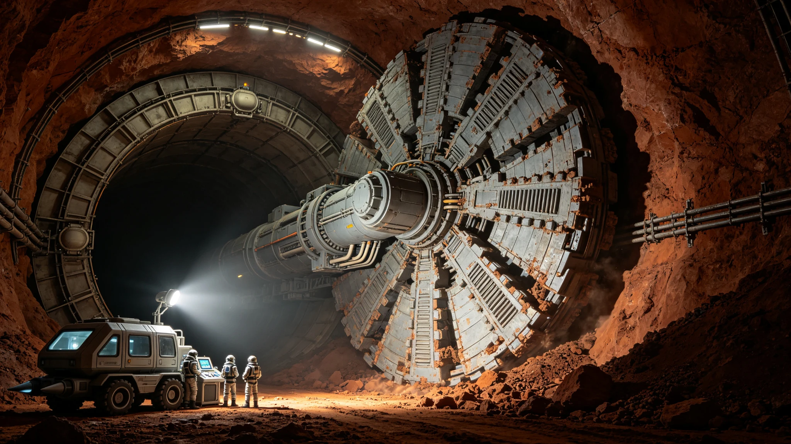

# 比邻星b第三定居点"东曦"地下城市首期掘进公报

**公报文号：** `ENG-PX-2430-SUB01`
**发布机构：** 比邻星b地下工程联社 · 东曦建设指挥部
**掘进周期：** 2429年01月—2430年09月

---

## 一、项目概况

"东曦"为第三定居点，选址"望北"以东22km玄武岩台地地下。与前两定居点依托天然熔岩管不同，采用全人工地下掘进，规划总面积4.2km²，最大埋深120m，分三期。首期目标：主隧道3.8km、中央枢纽大厅1座（8,000m²）、居住舱120间、公用设施舱8间、地表入口气闸站2座。

## 二、设备与进度

两台直径8.6m盾构式掘进机"穿山甲-01/02"，由"天工-01"在轨总装后降轨运输。土压平衡式，刀盘驱动4,500kW，设计进尺8—12m/日。

| 隧道 | 长度 | 用途 | 进度 | 日均进尺 |
|:---|:---:|:---|:---:|:---:|
| T-01主隧道 | 1,800m | 交通+管线 | 100% | 9.2m |
| T-02主隧道 | 1,200m | 交通+居住接入 | 100% | 8.7m |
| T-03支隧道 | 480m | 居住舱群A | 75% | 7.8m |
| T-04支隧道 | 320m | 公用设施 | 100% | 9.5m |
| 中央枢纽大厅 | Ø42m×18m | 集会+换乘 | 60% | — |

主隧道网络于2430年09月15日全线贯通，比计划提前23天。

---

## 三、地质异常

掘进遭遇异常6处：破碎带（注浆加固，延误4天）、地下涌水12m³/h（堵水，6天）、橄榄岩脉偏硬（换滚刀，2天）、高地应力岩爆2次（应力释放孔，5天）、火山碎屑岩遇水软化（短步距快凝注浆，3天）、枢纽大厅顶部裂隙（锚索加固，8天）。埋深50m处最大主应力14.2MPa，岩爆均为轻微级，无伤亡。

## 四、出渣与后续

首期出渣18.6万m³，全部破碎筛分利用：管片骨料33%、防风堤填筑26%、路面铺装17%、岩棉原料13%、暂存11%。玄武岩纤维生产线2430年06月投产，年产1,200吨。

2430年10月启动T-03剩余段，2431年03月完成枢纽大厅扩挖，2432年首批400户约1,200人入住。

*东曦建设指挥部总指挥：* 韩掘
*地下工程联社首席工程师：* 艾莉森·怀特

> *掘进日志：* T-01和T-02贯通那天，中间留了两米岩柱人工凿通。凿通瞬间两边的人隔着尘土互相照手电，有人喊了一嗓子，声音在隧道里嗡嗡传。老韩摸着还带余温的管片说："这地方比上面稳。上面有风，有耀斑，有红矮星那张老脸。下面什么都没有，就是石头。石头好，石头不骗人。"
