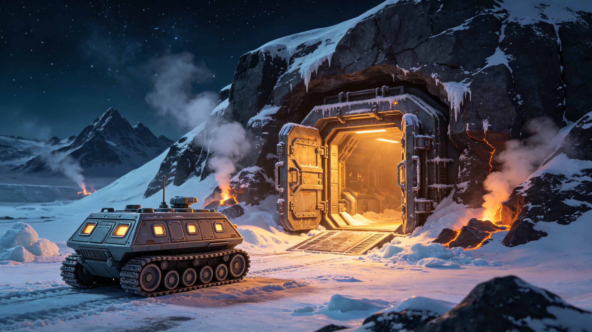

# 比邻星b第四定居点"南冕"高纬度极夜带地下城市首期掘进公报与地热供暖设计书

**公报文号：** `ENG-PX-2445-SUB02`
**发布机构：** 比邻星b地下工程联社 · 南冕建设指挥部
**掘进周期：** 2443年06月—2445年01月
**设计书版本：** Rev.C（2444年11月审定）

---

## 一、项目概况

"南冕"为第四定居点，选址于比邻星b永夜面高纬度区（南纬72°），距晨昏带约1,800km。该区域为永久极夜带，红矮星始终位于地平线以下，地表无任何自然光照。选址依据：

| 选址因素 | 南冕预选区参数 | 判定 |
|:---|:---|:---|
| 地表温度 | −78℃至−62℃（年均−69℃） | 极端寒冷，必须地下居住 |
| 常年风速 | 8—15m/s（下坡风），极端28m/s | 地下可完全规避 |
| 地温梯度 | 61℃/km（高于全球均值41℃/km） | 地热资源丰富 |
| 基底岩性 | 致密玄武岩（抗压168MPa） | 适宜地下掘进 |
| 地下冰含水层 | 地下40—120m见地下冰，可融水利用 | 水源有保障 |
| 距最近定居点 | 距望北1,820km | 需独立能源与水源 |

南冕采用全地下城市方案，规划总面积6.8km²，最大埋深180m，分四期。首期目标：主隧道4.2km、中央枢纽大厅1座（12,000m²）、居住舱200间、公用设施舱12间、地表入口气闸站3座、地热井2口。规划首期常住人口3,000人。

## 二、掘进工程

### 2.1 设备与方法

采用两台直径9.2m盾构式掘进机"穿山甲-03/04"（由天工-02船坞在轨总装后降轨运输），土压平衡式，刀盘驱动5,200kW，设计进尺6—10m/日。因极夜带地表无昼夜变化，掘进实行三班连续作业（每班8小时），仅在设备维保和地质异常时暂停。

### 2.2 进度

| 隧道 | 长度 | 用途 | 进度 | 日均进尺 |
|:---|:---:|:---|:---:|:---:|
| N-01主隧道 | 2,200m | 交通+管线主干 | 100% | 8.1m |
| N-02主隧道 | 1,400m | 交通+居住接入 | 100% | 7.6m |
| N-03支隧道 | 600m | 居住舱群A | 82% | 6.9m |
| N-04支隧道 | 420m | 公用设施 | 100% | 8.4m |
| N-05地热井隧道 | 380m | 地热站接入 | 100% | 9.2m |
| 中央枢纽大厅 | Ø48m×22m | 集会+换乘+商业 | 55% | — |

主隧道网络于2445年01月22日全线贯通，比计划提前11天。

### 2.3 地质异常

掘进遭遇异常9处：

| 异常 | 位置 | 描述 | 处理 | 延误 |
|:---|:---|:---|:---|:---:|
| 地下冰层 | N-01 K0+420 | 厚8m纯冰层，−12℃ | 加热掘进+隔水衬砌 | 6天 |
| 破碎带 | N-02 K0+860 | 碎裂玄武岩，涌水2m³/h | 注浆加固+排水 | 5天 |
| 高地应力岩爆 | N-01 K1+240 | 埋深65m，岩爆2次 | 应力释放孔+钢拱架 | 4天 |
| 辉绿岩脉 | N-04 K0+180 | 偏硬，刀盘磨损加快 | 更换滚刀 | 2天 |
| 地热异常 | N-05 K0+310 | 岩温48℃（高于预期） | 加强通风降温 | 3天 |
| 其他4处 | 各处 | 小断层、遇水软化等 | 常规处理 | 合计5天 |

埋深70m处最大主应力16.8MPa，岩爆均为轻微—中等级，无伤亡。地下冰层的发现为定居点提供了备选水源（融水），已在N-01隧道设融水取水口。

### 2.4 出渣利用

首期出渣22.4万m³，全部破碎筛分利用：管片骨料31%、地表防风堤填筑28%、路面铺装16%、岩棉原料14%、暂存11%。南冕地表防风堤（环绕3座气闸站）已利用出渣填筑完成，堤高4.5m，顶宽3m。

## 三、地热供暖设计书

### 3.1 热资源

南冕预选区地温梯度61℃/km，设计地热井深度2,800m，预计井底温度186℃，热储层为碎裂玄武岩（埋深2,200—2,800m），渗透率35—80mD。

| 井号 | 深度 | 用途 | 设计流量 | 预计井口温度 |
|:---|:---:|:---|:---:|:---:|
| GT-01 | 2,820m | 生产井（采热） | 80m³/h | 172℃ |
| GT-02 | 2,850m | 回灌井（回水） | 80m³/h | — |

采用"对井采灌"模式：GT-01采出高温热卤水，经换热器换热后，低温回水由GT-02回灌至热储层，实现闭式循环、零排放。

### 3.2 供热系统

**总热负荷估算（首期3,000人）：**

| 负荷项 | 热功率(MWt) | 占比 |
|:---|:---:|:---:|
| 居住舱供暖 | 6.8 | 38% |
| 公用设施供暖 | 3.2 | 18% |
| 热水供应 | 2.4 | 13% |
| 冰雪融化（气闸站+通道） | 1.8 | 10% |
| 水培温室供暖 | 2.6 | 15% |
| 工业用热 | 1.0 | 6% |
| 合计 | 17.8 | 100% |

设计供热能力24MWt（含35%余量），地热井额定热功率28MWt，可满足首期需求并预留二期扩容。

**供热管网：** 采用三级换热系统：
- 一级回路：地热井—首站换热器（高温卤水，172℃→65℃，闭式循环）
- 二级回路：首站—各区域换热站（热水，95℃→55℃，闭式循环）
- 三级回路：区域换热站—末端（热水，55℃→35℃，辐射地板+风机盘管）

管网全部采用架空敷设（地下隧道内支架安装），保温层厚度100mm（聚氨酯+铝箔反射层），热损失率≤3%。

### 3.3 发电方案

地热资源同时用于发电。配置螺杆膨胀发电机组2台（单台1,200kWe），总装机2,400kWe，利用一级回路余热（172℃卤水）发电后再进入供热换热器。发电效率约11%，年发电量约1,800万kWh，可满足南冕首期用电需求的约72%，不足部分由储能电池+备用柴油机补充。

### 3.4 极端工况保障

- **地热井故障：** 若单井故障，另一井可维持60%供热能力（限非必要负荷），同时启动备用燃油锅炉（2台×4MWt，储油量可供30天）
- **全站停电：** 地热循环泵配置UPS（可维持30分钟），同时柴油发电机（500kWe）在30秒内启动
- **极寒天气：** 地表气闸站设双重门+热风幕，门外温度−78℃时门内维持+18℃，温差96℃
- **长期停运：** 若地热系统需大修，居住舱可降至最低维持温度+8℃（人员穿保暖服），可持续14天

## 四、照明与心理适应

南冕为永久极夜环境，无自然光照。设计采用模拟昼夜节律的人工照明系统：

- 居住舱：主照明可调色温（2700K—6500K），模拟"日出—正午—日落"节律（虽然地表无太阳，但维持人体生物钟）
- 公共区域：高色温（5000K）高照度（300lux），模拟"白天"
- 中央枢纽大厅设"虚拟天窗"（LED大屏，播放红矮星升降延时影像，从晨昏带实时传输）
- 每人每日推荐光照暴露≥2小时（高照度），以预防季节性情感障碍（SAD）

首期配备心理医生1名，每月进行一次群体心理健康评估。

## 五、后续计划

- 2445年06月：N-03剩余段完工，中央枢纽大厅扩挖完成
- 2445年09月：地热井GT-01/GT-02完钻，供热系统调试
- 2446年03月：首批500户约1,500人入住
- 2446年12月：首期全部200间居住舱交付，3,000人满员
- 2447年启动二期工程（居住舱群B+C，新增4,000人容量）

*南冕建设指挥部总指挥：* 韩掘
*地下工程联社首席工程师：* 艾莉森·怀特
*地热供暖设计负责人：* 温岩

> *掘进日志：* N-01和N-02贯通那天，中间留了两米岩柱人工凿通。凿通的时候两边的人隔着尘土互相照手电。老韩摸了摸管壁，温度计显示地下78米处岩温+14℃。他对记录员说："上面零下七十多度，黑得连星星都看不清几颗。下面十四度，有灯，有热水，有人气。我们在这颗星球的后脑勺上挖了个洞，住进来了。"通风机嗡嗡地响，把地表的极寒挡在几百米厚的石头外面。
