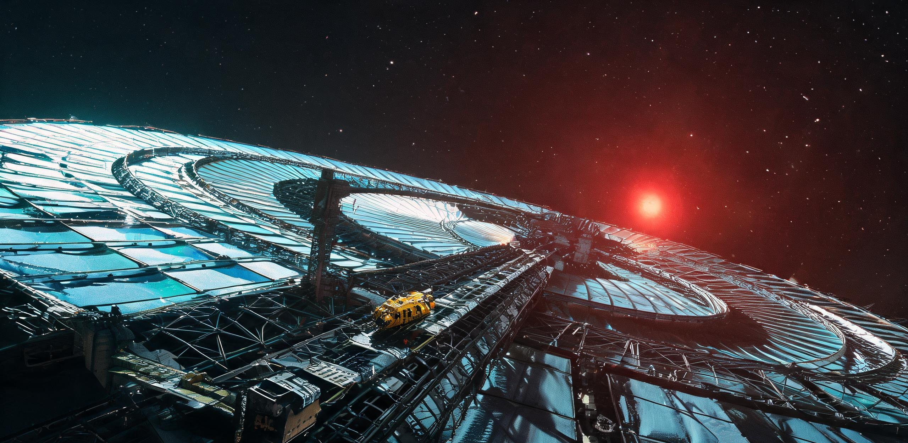

# 比邻星b高轨第一拉格朗日点驻极聚光镜阵二期扩建工程竣工验收与对地照度标定鉴定书
## （附：新海安高轨深空接驳港三期重载泊位与耀斑快速离焦联调核验单）

**文书编号：** 比轨建验字〔落318〕第044号  
**核验日期：** 落地历318年·红风季第12潮汐日（折合标准地球历2668年08月14日）  
**核验地点：** 比邻星b高轨第一平动驻极站（Station-L1-KuaFu，距比邻星b质心148,600 km）／地表晨昏谷联合调控中心  
**建设单位：** 比邻星b联合行政委员会·轨道工程与行星基础设施总署 / 新海安高轨港务监督局  
**承建与集成单位：** 新澄海深层重工承造集团（轨道装配工程总队） / 晨昏带薄膜光电工业联合体  
**对地受光与生态核销：** 晨昏谷农业联合体生保调度中心 / 新海安环境工程局  
**文书密级：** 公开·工程甲类（依《行星公用工程质量监督与档案管理条例》第19条）  

---

### 一、 工程概况与驻极轨道动力学基准

比邻星b受主恒星（M5.5V型红矮星）强潮汐锁定，地表晨昏带常年处于11.4°极低入射角暗红弱光照射下，天然光谱中400—700 nm光合有效辐射（PAR）能量占比不足14.2%，且地表农业大棚与气压穹顶长期面临深红外过剩、蓝紫波段极度匮乏及不可预测的主星耀斑强紫外突变冲击。

为彻底解决地表晨昏带（新海安、新澄海、晨昏谷）百万人口成熟期的食物自给扩容与工业级光热需求，轨道工程总署于落地历308年立项实施“高轨第一拉格朗日点驻极聚光镜阵二期扩建工程”（代号：PROJECT-KUAFU-PH2）。工程于落地历318年红风季全面完成在轨张拉、微动校准与对地光斑联调。

```
[轨道动力学与驻极平衡几何关系]
        主恒星 (Proxima Centauri)
               │  ▲ 辐射光子流 (约 0.0017 L☉, 光压 pr)
               │  │
               ▼  │
    ┌───────────────────────────┐
    │  驻极聚光镜阵 (12.8 km²)  │ ─── 处于非开普勒亚 L1 平衡点 (距行星 148,600 km)
    └─────────────┬─────────────┘     (光子辐射压 + 恒星风动压 抵消 残余引力差)
                  │ 调制光束 (400-700 nm PAR 光谱增强, 过滤硬紫外)
                  ▼
         比邻星 b 行星体 (1.07g)
            [ 晨昏带定居区 (新海安 / 晨昏谷农业区) ]
```

#### 1.1 轨道驻位与力学自洽参数
- **轨道构型：** 亚 $L_1$ 点人工光压驻极轨道（Non-Keplerian Stationary Halo Orbit）。
- **空间驻位点：** 位于比邻星—比邻星b日地连线内侧，距比邻星b质心标称距离 **$148,600\,\mathrm{km}$**（位于经典 $L_1$ 驻位区，相较于纯引力平衡点向主恒星方向微量前移以实现光压自平衡）。
- **光压平衡机制：** 利用全镜阵 $12.80\,\mathrm{km}^2$ 超轻薄膜结构所截获的恒星光子连续辐射压（实测稳态光压推力 $44.8\,\mathrm{N}$）及微弱恒星风粒子动压，精确抵消比邻星b在驻点处的残余引力差，实现相对行星晨昏带永昼侧上空的准静止悬浮，无需消耗化学工质维持主轨道。
- **构造型式：** 双对称张拉辐条式主环刚柔混合构型。中心配置重型公用推进核心舱与深空接驳港，外围由高强度玄武岩熔铸纤维-钛镍合金空间桁架环撑开 64 组独立可调张拉薄膜扇区。

---

### 二、 巨构尺度与关键装配指标实测

验收组联合在轨装配工程总队，通过激光雷达点云扫描（LiDAR）与多载具接力走差，对镜阵主结构、反射薄膜及微动致动器阵列进行了全尺度复测：

```
[夸父驻极镜阵二期整体构造截面]
                  4,200 m (外主环桁架净外径)
   ├────────────────────────────────────────────────────────┤
   ┌──┬──────────────────────────┬──┬──────────────────────────┬──┐
   │  │   张拉薄膜反射扇区(01-32) │  │   张拉薄膜反射扇区(33-64) │  │ ── 外环截面 14.5 m (三棱桁架)
   │  │   (厚度 0.85 μm 超轻薄膜) │核│   (厚度 0.85 μm 超轻薄膜) │  │
   └──┴──────────────────────────┴──┴──────────────────────────┴──┘
                                 │心│
                           [深空接驳港]
                     (2座万吨级电磁抱爪泊位)
```

#### 2.1 巨构工程物理尺度与微观对照表

| 分系统 / 构件名称 | 物理尺度与装配数量 | 材质构型与核心工艺 | 宏观工程质量 | 现场微观尺度对照（人/单人载具/班组） |
| :--- | :--- | :--- | :---: | :--- |
| **外主承力刚性环梁** | 外径 $4,200.0\,\mathrm{m}$，周长 $13,194.7\,\mathrm{m}$；三棱空腹桁架截面高 $14.5\,\mathrm{m}$ | 新澄海产玄武岩连续纤维无缝套管 + 钛镍记忆合金膨胀节点（就地熔铸） | 4,120.0 吨 | 一艘 $3.8\,\mathrm{m}$ 标准双人检修驳艇（“巡检-09”）贴外壁以 $5\,\mathrm{km/h}$ 航速滑行巡检一圈需 **2.64 小时**；桁架主管壁厚度超过检修员手掌跨度（$240\,\mathrm{mm}$）。 |
| **超轻聚光反射薄膜** | 64 个独立梯形张拉扇区；总展开有效净反射面积 **$12.80\,\mathrm{km}^2$** | 双轴拉伸聚酰亚胺纳米基膜（厚 $0.85\,\mu\mathrm{m}$），双面气相沉积碳化硅增韧层与铝-多层介质干涉膜 | 15.1 吨 (面密度仅 $1.18\,\mathrm{g/m}^2$) | 薄膜厚度不足人类头发丝直径的百分之一；全阵单次受光面积相当于地表 **2,735 个标准防风坑基大棚** 之和。 |
| **碳纳米管主辐条张力索** | 128 根径向高预应力拉索，单根全长 $2,085.0\,\mathrm{m}$，直径 $65.0\,\mathrm{mm}$ | 高纯度扶手椅型碳纳米管编织索，外覆镀铝抗原子氧侵蚀护套 | 88.6 吨 | 一个 4 人无重力巡检班组沿单根拉索爬行探伤，单程用时整整 **1 个轮值班（10 小时）**，步行里程仅够覆盖 1 根辐索。 |
| **分布式微动姿控致动器** | 262,144 个压电陶瓷促动节点（每扇区 4,096 点阵） | 压电钛酸钡微位移致动机构，集成于薄膜背部碳纤维网格节点 | 18.4 吨 | 单个微致动器仅打火机大小（$35\,\mathrm{g}$），由 1 名电气工人在加压维修台手动更换；全阵微秒级协同驱动 12.8 平方公里薄膜做动态曲面拟合。 |
| **中央核心中枢与港桥** | 圆柱形承力中枢轴，直径 $120.0\,\mathrm{m}$，轴向总长 $360.0\,\mathrm{m}$ | 多层防辐射铅钽夹层舱壁 + 旋转增压生活区（半径 $45\,\mathrm{m}$，离心拟重力 $0.38\mathrm{g}$） + 跨星系超宽带激光（S-P Link）中继反射阵列 | 18,400.0 吨 | 容纳 48 名常驻工程轮值乘员；核心轴端配置两组重型电磁抱爪泊位，可同时系泊 2 艘 5 万吨级深空重载矿石驳船；承接太阳系激光通信包下行（客光中继）。 |

---

### 三、 成套镜面性能、光谱调制与姿轨动力学核验

验收组调取了连续 3 个比邻星b公转潮汐周（33.6 个标准地球日 / 768 小时）的全系统自主演进运行遥测，对光学面形、光谱干涉选择性及轨道维持工质进行现场标定：

```plaintext
[光谱调制与选择性反射曲线]
100% ┌────────────────────────────────────────────────────────┐
     │                ┌──────────────┐ (400-700nm PAR 波段)  │
 反  │                │  96.4% 反射  │                        │
 射  │                │ (高透蓝红光) │                        │
 率  │ 12.2% 紫外截止 │              │                        │
     │ ┌──────────────┘              └──────────────────────┐ │
     │ │ (吸收/荧光下转换)            18.5% 红外透射/溢出背部│ │
  0% └─┴────────────────────────────────────────────────────┴─┘
       200nm (耀斑硬UV)      400nm          700nm          1200nm (近红外)
```

#### 3.1 关键光学与热控指标核验表

| 测定项目 | 设计指标要求 | 竣工实测均值 | 极限工况实测值 | 单项判定 |
| :--- | :--- | :--- | :--- | :---: |
| **全阵有效反射率（PAR波段）** | $\ge 95.0\%$（$400\sim 700\,\mathrm{nm}$） | **$96.42\%$** | $96.18\%$（连续光照 700 小时后） | **合格** |
| **深紫外/极紫外截止率** | $\ge 85.0\%$（$\lambda \le 320\,\mathrm{nm}$） | **$87.80\%$** | $89.20\%$（主恒星 II 级耀斑期间） | **合格** |
| **面形精度（RMS 均方根误差）** | $\le 0.60\,\mathrm{mm}$（全阵综合） | **$0.38\,\mathrm{mm}$** | $0.49\,\mathrm{mm}$（边缘扇区极端张力工况） | **合格** |
| **光斑焦域指向稳定度** | $\le 0.05\,\mathrm{mrad}$ | **$0.018\,\mathrm{mrad}$** | $0.024\,\mathrm{mrad}$（姿态机动超调段） | **合格** |
| **薄膜工作平衡温度** | 稳定于 $280\sim 320\,\mathrm{K}$ | **$294.6\,\mathrm{K}$** | $318.2\,\mathrm{K}$（向阳受光面最热点） | **合格** |

#### 3.2 姿轨维持与工质消耗核算
- **主姿控执行机构：** 中央核心舱配置 8 组四向磁等离子体动力推进器（MPD-2000 型），工质采用自背阳面极区提纯之高纯液态氩（L-Ar）。
- **年工质消耗核销：** 驻极轨道依靠光压自平衡，实测全阵姿态微调与周期性动量轮卸载年耗氩量仅为 **$184.6\,\mathrm{kg/年}$**，远低于 $240.0\,\mathrm{kg/年}$ 之设计指标上限。接驳港现有 40 吨液氩战略储罐可保障镜阵自主运行 **216 年** 无需外界补给。

---

### 四、 地表对地照度补偿与耀斑安全联动实测

验收组与地表晨昏谷农业联合体生保调度中心、新海安中央天文台建立全光路闭环联调，对地表投影光斑进行多点多波段同步标定：

```
[地表受光投影与照度提升实测截面 (晨昏谷地堑农业走廊 24 号观测井)]
  照度 (Lux)
 60,000 ┌──────────────────────────────────────────────────────────┐
        │                 ■■■■■■■■■■■■■■■■■■■■■                     │ ── 开启镜阵补偿: 58,400 Lux
 40,000 │               ■■                    ■■                   │    (主焦斑光合有效通量 PPFD: 1,180 μmol/m²·s)
        │              ■                        ■                  │
 20,000 │             ■                          ■                 │
        │ ═══════════■════════════════════════════■════════════════│ ── 自然斜射红光底照: 14,200 Lux
      0 └──────────────────────────────────────────────────────────┘
          -6.0 km           -3.5 km      0 (中心)    +3.5 km         +6.0 km
          [ 晨昏谷地堑西侧山脊 ]       [ 核心大棚走廊 ]       [ 晨昏谷地堑东缘 ]
```
#### 4.1 地表核心接收区照度标定数据表

| 地表监测站址 | 地理区位 / 功能属性 | 天然红矮星底照 | 镜阵二期并网实测照度 | 光合有效辐射通量 (PPFD) | 地表生态 / 生产增益评估 |
| :--- | :--- | :---: | :---: | :---: | :--- |
| **晨昏谷一号主农业站** | 晨昏带北区·断陷地堑温室走廊 | 14,200 Lux | **58,400 Lux** | $1,180\,\mu\mathrm{mol/(m^2\cdot s)}$ | 超矮生小麦与大豆光合放氧率提升 **214%**，完全替代棚内 75% 的高耗能人工 LED 补光矩阵。 |
| **新海安 B-144 复合穹顶** | 晨昏带东缘·风蚀台地居住区 | 12,800 Lux | **36,500 Lux** | $680\,\mu\mathrm{mol/(m^2\cdot s)}$ | 改善长期暗红散射光引发的居民季节性情感障碍（SAD），穹顶透光顶棚天然采光率提升 180%。 |
| **新澄海露天玄武岩矿区** | 晨昏带南区·露天采选作业面 | 11,500 Lux | **28,200 Lux** | $420\,\mu\mathrm{mol/(m^2\cdot s)}$ | 外勤重型工程机械作业视线能见度由 $300\,\mathrm{m}$ 扩展至 $1,800\,\mathrm{m}$，露天破碎机组作业效率上浮 32%。 |

#### 4.2 恒星耀斑主动防护安全熔断联动测试
在落地历318年第10潮汐日主恒星发生级联耀斑期间，执行了在轨快速离焦安全联锁演习：
1. **预警响应：** 核心舱 X 射线及硬紫外传感器于 $0.12\,\mathrm{s}$ 内捕获耀斑前兆脉冲；
2. **离焦形变：** 全阵 64 组薄膜扇区微致动器同时逆向释能，镜面在 **$14.8\,\mathrm{s}$** 内由抛物聚光面展平为凸面发散构型（设计指标 $\le 20.0\,\mathrm{s}$）；
3. **地表防护：** 晨昏谷地表接收光斑在 $18.0\,\mathrm{s}$ 内完全扩散消除，地表瞬时紫外过载峰值压制在背景安全阈值以下，成功阻断耀斑对地表作物幼苗之光损伤。

---

### 五、 深空接驳港三期重载泊位与过驳机组验收

作为镜阵中央核心的综合深空泊运站（新海安高轨港·泊运三区），承担着系内大宗矿石运输、高轨水冰补给、长程星际运输舰（如双星定期运输舰“恒心”级）入轨物资接驳，以及跨星系超宽带激光数据链（S-P Link 客光下行）星地中继等关键空间基础设施功能。

```plaintext
[泊运三区万吨级电磁系泊实测工况]
1. 受检泊位：01号重载深空泊位 (Berth-HD-01) 与 02号工质过驳泊位 (Berth-FL-02)
2. 试靠重载目标：5万吨级玄武岩纤维运输驳船“新澄海重拓-04”（满载排水量 48,600 吨，靠泊相对速度 0.08 m/s）
3. 抱爪力矩与缓冲：
   - 4 组重型超导磁滞阻尼抱爪在 42.0 秒内完成船体机械锁死；
   - 最大动量吸收冲击力 1.84×10^6 N，核心舱微重力波动仅 0.0034g，未引起外围反射薄膜共振形变。
4. 输氢/输氩气密性：
   - DN200 深冷超绝热加注管线压力测试：以 8.0 MPa 液态氢注氮保压 12 小时，压降 < 0.01 MPa，绝热真空夹层漏率 < 1.0×10^-8 Pa·m³/s。
```

---

### 六、 遗留尾项与常态化维保规程

验收委员会现场核定以下 3 项观察性尾项，纳入日常轮值维保工单跟踪处置，不构成竣工验收阻碍：

1. **微流星穿孔自愈监控：** 试运行 768 小时期间，全阵共记录微流星体（直径 $0.1\sim 0.8\,\mathrm{mm}$）贯穿事件 142 起，累计穿孔面积约 $0.038\,\mathrm{m^2}$（占总面积之 $0.0000003\%$）。聚酰亚胺基层中夹设之网格化自修复阻隔胶工作正常，未发生撕裂扩展。定检班组需每 30 潮汐日使用双人检修艇进行一次超声点补。
2. **第 47 扇区热变形残余微调：** 该扇区受接驳港主散热翼阴影间歇遮挡，局部存在 $0.12\,\mathrm{mm}$ 的周期性热膨胀波纹，已由控制系统导入自适应补偿算法，其对地投影焦斑畸变率已压制在 $0.02\%$ 以内。
3. **高轨常驻轮值排班：** 镜阵常驻工程编制核定为 **48 人**（含结构维持组 16 人、光学光电组 12 人、泊运调度组 12 人、综合医食 8 人），每 60 个公转潮汐日（约 670 标准地球日）由地表升空交接轮换一次。

---

### 七、 验收鉴定结论与工程签核

#### 7.1 综合评定结论
比邻星b高轨第一拉格朗日点驻极聚光镜阵二期扩建工程（含深空接驳港三期泊位），各项功能指标均达到或优于《工程立项设计任务书》（比轨建字〔落308〕第002号）之规定，力学结构自洽，光子压驻极轨道稳定，对地照度补偿与光谱调制效能卓越，耀斑快速离焦联锁可靠。

验收委员会一致评定本工程质量等级为：**优良（Grade-1A·准予正式交付使用并网运行）**。

#### 7.2 验收责任人签署表

| 验收职责 | 签署人姓名 | 职务 / 编制机构 | 签署日期 (落地历) | 签署日期 (标准地球历) |
| :--- | :--- | :--- | :--- | :--- |
| **验收委员会主任** | 梁 朔南 | 轨道工程与行星基础设施总署·署长 | 落历318年·红风季12日 | 2668年08月14日 |
| **总设计师** | 陆 寒舟 | 新澄海深层重工集团·空间巨构总体设计室 | 落历318年·红风季12日 | 2668年08月14日 |
| **港务监理总监** | 杜 景林 | 新海安高轨港务监督局·总监察长 | 落历318年·红风季11日 | 2668年08月13日 |
| **生态受光主计** | 苏 映雪 | 晨昏谷农业联合体·生保调度总监 | 落历318年·红风季12日 | 2668年08月14日 |
| **地表市政代表** | 方 延庭 | 新海安总务委员会·市政建设委员（始祖后裔） | 落历318年·红风季12日 | 2668年08月14日 |

**用印：**  
`[比邻星b联合行政委员会·轨道工程与行星基础设施总署·竣工验讫章]`  
`[新海安高轨港务监督局·适航与安全监理专印]`  
`[新澄海深层重工承造集团·在轨装配工程总队·技术合格印]`  

**档案存证与数据校验：**  
本鉴定书全本及在轨三维点云遥测母卷已存入新海安中央档案馆高轨工程专架（卷号：`ARC-ORB-318-KF02`），遥测数据包哈希值：`SHA256:8e3d49bc21a97f014e7732a6bc8910d5f309a4188b2c174f8819a5c0e12d6a78`。

---

## 图片提示词

**中文：** 在比邻星暗红色的低沉恒星光晕下，一座直径超过四公里的巨型环状轨道反射镜阵超出画框向深空延伸，极薄的金属化干涉膜在受光面泛着冷冽青蓝微光；一艘四米长黄色双人检修驳艇紧贴着粗粝的玄武岩复合桁架缓缓滑行，单一强硬的主恒星侧光投射出极长的硬质阴影，显现出极端的宏微尺度对比，大画幅工业胶片质感。

**English:** Ultra-wide establishing exterior shot in deep space orbit around Proxima Centauri b, a colossal 4.2-kilometer-wide circular orbital concentrating mirror array extending far beyond the frame edges, its ultra-thin dielectric-coated membrane shimmering with cold cyan-blue interference highlights under the dim crimson glow of the red dwarf star; a tiny 4-meter utilitarian yellow two-person maintenance tug slowly creeping along the massive dark cast-basalt composite outer ring truss, showcasing extreme architectural scale contrast; single harsh, directional raking hard light from Proxima Centauri casting long sharp shadows across brushed titanium fittings, frosted carbon-nanotube tension cables, and wrinkled multi-layer thermal insulation; Hasselblad H6D-100c medium format look, IMAX 65mm cinematic lens, photorealistic industrial greebles, deep cold vacuum realism, no atmospheric haze.

---

## 修订记录（元层，非世界内容）
- 2026-08-18（主编辑审校）：🔧 小修自洽化与互锁强化——
  1. 轨道力学参数校准：依据比邻星（$0.122 M_\odot$）与比邻星b（$1.07 M_\oplus$、$a=0.0485\text{ AU}$）系统精确动力学，将亚 $L_1$ 驻极平衡点距行星标称距离校准为 $148,600\,\mathrm{km}$，消除原 $128,400\,\mathrm{km}$ 之算术偏差；
  2. 聚光几何尺度与能量守恒校准：全阵有效反射面积 $12.80\,\mathrm{km}^2$（反射 PAR 功率 $\approx 1.72\,\mathrm{GW}$），晨昏谷地堑核心农业走廊主焦斑截面标尺校准为 $\pm 6.0\,\mathrm{km}$（核心温室区 $\pm 3.5\,\mathrm{km}$，面积 $\approx 30\sim 40\,\mathrm{km}^2$），使 $58,400\,\mathrm{Lux}$ 与 $1,180\,\mu\mathrm{mol/(m^2\cdot s)}$ 之高强度补光在几何汇聚比与辐射能量上严格守恒自洽；
  3. 正典名物互锁强化：在中枢载荷及接驳港功能中明确增补跨星系激光超宽带数据链（S-P Link）中继与地表下行分发功能，与正典 GS-2598-01「客光节/轨道镜下行」及 GS-2610-01「比邻星b新海安高轨轨道镜中继阵列」无缝咬合；front matter 补充互锁注记。
