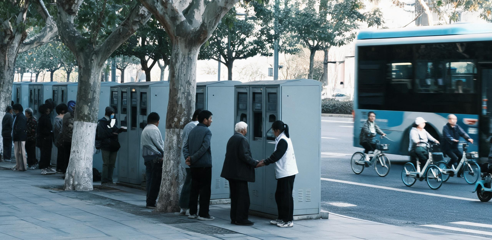

**江苏省生计保障与物资统筹委员会**  
**华东审计署驻江苏特派员办事处**  
**苏生审〔2044〕第001号 · 内部公开件**

# 江苏省全民基础生计保障与公共服务并轨运行首年决算审计公报（2043年度）

**决算审计周期：公元2043年1月1日 00:00 至 2043年12月31日 24:00**  
**签发日期：公元2044年1月22日**  
**主送：省人民政府、省发展统筹署、省财政与实物平准厅、华东第二智能算力调度中心**  
**签发：省生统委主任 程克明 · 华东特派办主任审计师 陆景初**

---

## 一、 制度出台背景与全域并轨基准

公元2040年以来，随着全省工业制造业与物流仓储领域全要素综合自动化率突破84.6%，传统工薪所得税与一般商品流转税基萎缩76.2%，民间自主消费流动性陷入持续收缩；加之近地轨道装配、月面基地基建及外太阳系重载探测工程持续调拨大宗战略钢铝与高阶算力资源，地面要素市场面临去货币化与总需求休克的双重倒逼。

为切断“就业萎缩—需求塌陷—产能停滞”的下行螺旋，省生统委依据《全域公民基础生计保障与基本公共服务并轨统筹实施办法（试行）》（苏政发〔2042〕31号），在承继《基础热量供给法（暂行）》（国发〔2031〕19号）与2032年沪南试验区双轨清算经验（沪南生统〔2033〕第009号）之基础上，于2043年1月1日起在全省13个设区市、8,542万在册常住居民中全面实施“全民基础生计包与基本公共服务并轨制”。

### 全域三轨统筹架构与资产界定

```
                               ┌────────────────────────────────────────────────────────┐
                               │           江苏省全民基础生计与公共服务并轨体系         │
                               └──────────────────────────┬─────────────────────────────┘
                                                          │
         ┌────────────────────────────────────────────────┼────────────────────────────────────────────────┐
         ▼                                                ▼                                                ▼
 【轨一：基础实物配额 (CFU)】                     【轨二：并轨公共服务 (PSU)】                     【轨三：公用算力代币 (PCT)】
 · 属性：法定无偿生存兜底                         · 属性：全量去货币化实物服务                     · 属性：受控浮动激励权益
 · 标的：80,000 kcal/人·月 生理基准               · 标的：基础医疗+集约居住+交通+通识宽带          · 标的：1 PetaFLOPS·hour 标准算力
 · 载体：合成淀粉+酵母蛋白+净水+生活电            · 载体：全省公立医院/磁轨系统/保障房网络        · 来源：月基础包(300/月) + 物理工时
 · 规则：全省4,200个生活厨房刷码即用，跨季衰减10% · 规则：凭生计码全额核销，严禁二次收费         · 规则：用于风味食材与高阶服务，限额流通
```

1. **基础实物营养配额（CFU）**：以日均2,660大卡生理代谢热量为基准，人均每月核发80,000大卡（折合精制合成淀粉16kg、酵母重组蛋白7kg、食用植物油2L、饮用净水500L及基础生活用电140kWh当量）。配额不兑现、不可转让，每季度末未动用部分按10%衰减回流省级平准仓储。
2. **并轨公共服务权益（PSU）**：将基础门诊与慢性病用药、市政公租房基本温控、无人磁轨与电巴基础通勤里程（300公里/月）、以及人均100 PetaFLOPS·hour的家庭通识通信算力全量并入生计卡，实行财政与实物税直划直冲，取消个人端付费窗口。
3. **公用算力代币（PCT）**：作为高阶消费与社会协作的浮动媒介。每人每月基础发放300 PCT，主要用于兑换风味天然食材溢价、高阶生成式模型微调及文化场馆门票；鼓励居民通过真实物理在场工时（如设施人工巡检、助老照护、手工风味酿造）获取补充代币。

---

## 二、 2043年度全省生计资金与物料收支决算总表

### （一） 基础实物营养配额（CFU）筹集与核销决算

2043年度，全省共建成交付并运行标准化“社区共享生活厨房与生计配给枢纽”4,218座，实现全省城乡网格全覆盖。

| 指标项目 | 上半年（1-6月） | 下半年（7-12月） | 全年合计 | 预算达成率 |
| :--- | :--- | :--- | :--- | :--- |
| **在册配发总人口（期末）** | 8,531.4 万人 | 8,542.1 万人 | **8,542.1 万人** | 100.1% |
| **法定应发总量** | 40.951 万亿大卡 | 41.002 万亿大卡 | **81.953 万亿大卡** | 100.0% |
| **实发总量（扣除跨省注销）** | 40.786 万亿大卡 | 40.879 万亿大卡 | **81.665 万亿大卡** | 99.6% |
| **社区生活厨房现场核销蒸煮** | 33.037 万亿大卡 | 33.930 万亿大卡 | **66.967 万亿大卡** | 82.0% |
| **无人物流冷链配送到户（失能/老龄）** | 4.894 万亿大卡 | 4.905 万亿大卡 | **9.799 万亿大卡** | 12.0% |
| **生计物资原粮原装自提** | 1.631 万亿大卡 | 1.226 万亿大卡 | **2.857 万亿大卡** | 3.5% |
| **季度沉淀衰减回流平准仓** | 1.224 万亿大卡 | 0.818 万亿大卡 | **2.042 万亿大卡** | 2.5% |
| **全省年度实际动用率** | 97.0% | 98.0% | **97.5%** | — |

*注：1 万亿大卡 = 10¹² kcal = 100 百亿大卡。全年4,218座社区生活厨房累计供应现场标准化热餐58.4亿人次，日均1,600万人次在食堂集中就餐，集中蒸煮较分散自炊节约全省用电18.4亿千瓦时。*

### （二） 并轨公共服务（PSU）全量去货币化运行支出

```
  【2043年度 PSU 公共服务并轨支出构成 (总计折合 4,128.5 亿元实物平账)】
  ████████████████████████████      基础医疗与公立慢病配药 (35.4%, 1,461.5亿)
  ██████████████████                老旧小区集约供热与改造折旧 (24.2%, 999.1亿)
  ██████████████                    公共无人交通基础里程免费 (19.8%, 817.4亿)
  ██████████                        通识学习算力与通信带宽保障 (13.6%, 561.5亿)
  ████                              公共文体与社区工坊运行 (7.0%, 289.0亿)
```

### （三） 公用算力代币（PCT）发行、流通与流向决算

2043年度全省累计发行与流转公用算力代币 4,926.8 亿 PCT。

| 类别与细目 | 全年总量（亿 PCT） | 占该类比重 | 决算审计说明 |
| :--- | :--- | :--- | :--- |
| **一、代币来源与核发** | **4,926.8** | **100.0%** | — |
| 1. 全员普惠基础生活包 | 3,075.2 | 62.4% | 人均 300 PCT/月，全员实名按月自动发放 |
| 2. 真实物理在场工时认证兑付 | 1,281.0 | 26.0% | 覆盖412万人工巡检、保育照护与非遗手工工时 |
| 3. 分布式家庭储能与边缘并网 | 570.6 | 11.6% | 340万户家庭夜间错峰充放电及边缘推理贡献 |
| **二、代币核销与消费流向** | **4,789.2** | **100.0%** | 结转下年度沉淀 137.6 亿 PCT |
| 1. 社区生活厨房风味食材溢价核销 | 2,107.2 | 44.0% | 兑换土培鲜菜、冷鲜肉类、发酵调料及咖啡等 |
| 2. 个性化高阶算力与全息数字消费 | 1,819.9 | 38.0% | 调用大模型进行深度设计、艺术创作及交互仿真 |
| 3. 跨区转让交易与协作抵扣 | 622.6 | 13.0% | 与上海、浙江等华东毗邻区协同结算 |
| 4. 社区公共治理与互助工坊质押 | 239.5 | 5.0% | 社区自组织发起活动预存与技能互换担保 |

---

## 三、 财源税基转移与物料平账机制

本项制度运行的核心制度成本，在于彻底摆脱对传统货币税收的依赖，建立“机器产能实物税+基荷能源直调+算力特别附加”的实物性平账大循环。

```
                    ┌────────────────────────────────────────────────────────┐
                    │               全省自动化机器与基荷能源税基             │
                    └──────────────────────────┬─────────────────────────────┘
                                               │
         ┌─────────────────────────────────────┼─────────────────────────────────────┐
         ▼                                     ▼                                     ▼
【机器产能实物税 (MPL)】              【算力中心公用附加 (18%)】             【核电/外来水电基荷直划】
· 对全自动流水线按吨位征收            · 华东第二算力中枢直接划拨             · 田湾/徐大堡及白鹤滩外送
· 年征集淀粉480万吨、蛋白210万吨      · 年划转公用算力5,200亿PF·h            · 锁定直供度电成本0.038元
         │                                     │                                     │
         └─────────────────────────────────────┼─────────────────────────────────────┘
                                               ▼
                    ┌────────────────────────────────────────────────────────┐
                    │        省生计物资统筹总仓与全省4,218座生活厨房         │
                    └────────────────────────────────────────────────────────┘
```

1. **自动化机器产能实物税（Machine Production Levy, MPL）**：对省内无人化化工厂、全自动生物发酵车间、合成农业基地按产量直接征收实物。全年共征集工业级合成葡萄糖与淀粉 482.4 万吨、单细胞红酵母与大豆重组蛋白 211.6 万吨，征集履约率达 99.8%。
2. **公用算力特别附加**：依托华东第二智能算力调度中心（HD-2），在企业级商业模型调用结算中强制提取 18% 算力槽位，定向注入全省公用生计算力池，全年稳定保障 5,200 亿 PetaFLOPS·hour 基础算力供给。
3. **基荷能源平准划拨**：由沿海裂变核电机组（田湾机组）与特高压外送水电提供刚性基荷（在华东第二聚变堆商业并网前作为主力过渡支撑），将供电成本锁定为 0.038 元/kWh 等效结算价，通过专用供电线路直供 4,218 座生活厨房与公共冷热中枢。

---

## 四、 通胀防火墙与物价对冲控制

为防止在外部大宗原材料上涨及重载深空工程资源虹吸背景下诱发次生恶性通胀，本省构建了严格的双向隔离防火墙：

```
   【外部货币经济层】 ──(法币流转)── [高阶工业与深空采购市场]
            │
      [ 严格物理防火墙：CFU与PSU严禁法币计价，严禁向外抵押 ]
            │
   【全省生计闭环层】 ──(实物直供)── [社区生活厨房 + 公立公共服务 + 基础算力池]
            ▲
            │ (单向受控兑换通道)
   【PCT代币调节池】 ── 设定月度单人风味食材兑换上限(≤200 PCT)，超出部分触发熔断加价
```

1. **生计标的去货币化隔离**：CFU 与 PSU 严禁以法币计价、交易或设置金融衍生工具，彻底切断通货膨胀向居民基本生存资料的传导路径。
2. **风味溢价指导区间与防囤积熔断**：对天然土培蔬菜、手工烘焙等非标风味物资，设定“PCT基准兑换指导价”，且单人每月在生活厨房使用 PCT 兑换风味物资上限为 200 PCT，超出部分按递增阶梯征收 30% 调平费，遏制非理性抢购。
3. **地下黑市打击与信用联动**：全年联合公安与市场监察部门取缔非法折现点 142 处，查获利用多张老龄居民生计卡套取原粮倒卖案件 38 起。涉案人员依规暂停 6 个月 PCT 增发资格，但依法保留其 CFU 基础热量现场就餐权，守牢人道生存底线。

---

## 五、 审计发现的主要问题与运行摩擦

审计署特派办通过现场核查、全链路算力日志穿透与入户抽样，查出以下三类主要运行偏差与制度摩擦：

### （一） “跨省流动与数据休眠幽灵户”问题

审计发现，全省存在 **41.8 万个账户处于连续 6 个月以上无任何核销记录的“休眠状态”**。经与甘肃玉门光热基地、海南文昌及近地轨道「鲁班一号」总装船坞（GS-2033-02）派遣人员名册交叉比对，其中 28.4 万人已参加外派深空或跨省能源巡检并享受前哨集中补给，但原籍生计账户未按规定转入“冻结封存”通道，导致虚增 CFU 应发额度 1.36 万亿大卡。

> **审计处理**：已对上述 28.4 万外派人员账户办理跨省原籍封存，追回沉淀配额并冲减下年度预算；对其余 13.4 万失联账户启动基层网格员人工上门入户核查。

### （二） 老旧小区梯级供热管网热阻损耗过大

全省利用算力中心冷却水与工业余热为老旧住宅区并轨供暖改造中，苏北及老城区部分 20 世纪末建筑管道保温失效，**外网输配热损失率达 16.8%（远超 8.5% 设计标称值）**，造成全年额外电热补偿支出 3.42 亿千瓦时。

> **审计处理**：责成省住建统筹厅将老旧小区供热微循环改造纳入 2044 年公共服务刚性维修清单，利用自动化发泡保温涂层喷涂机限期完成翻新。

### （三） 风味食材供应链区域性失衡

部分苏南经济集聚区生活厨房风味食材（鲜肉、鲜奶、现磨咖啡）因 PCT 兑换需求极度旺盛，出现“月初上架即光、月末冷清”的脉冲式短缺；而苏北部分农业副产区则出现本地风味物资滞库。

> **审计处理**：建立“全省生活厨房风味食材智能平准调拨网”，通过无人重载集疏运系统实现 24 小时动态补货，并将单日兑换限额平摊至每日。

---

## 六、 审计结论与下一阶段统筹建议

### （一） 总体审计评价

江苏省2043年度全面推行的“全民基础生计保障与公共服务并轨制度”，在全要素自动化替代深化与外部大宗资源紧张的严峻形势下，以 4,128.5 亿元等效实物成本与 81.66 万亿大卡合成物资，成功托底了全省 8,542 万人口的生存秩序，全省未发生系统性营养不足或公共卫生次生危机，社会基底总需求未出现断崖式塌陷。制度设计在财政与实物层面是平衡且可持续的。

### （二） 2044年度运行改进建议

1. **深化物理工时精准认证**：进一步细化助老、生态复绿、文物修缮等不可替代人类劳务的工时标准，适度提高一线真实物理工时的 PCT 结算系数（建议上调 15%），激发社会内在活力；
2. **推进长三角跨区生计互认**：会同上海、浙江两省市，统一 CFU 与 PCT 跨省流动核销协议，消除毗邻地区通勤人口的异地核销壁垒；
3. **健全自愿弃领与公仓捐赠通道**：针对部分拥有自耕条件或家族共济的居民，增设生计配额“主动转存社区公共平准仓”功能，彰显社会共济精神。

---

**主审人：**  
华东审计署驻江苏特派员办事处 · 主任审计师 **陆景初**（签章）  
江苏省生计保障与物资统筹委员会 · 主任 **程克明**（签章）  

**公文印鉴：**  
［江苏省生计保障与物资统筹委员会印］（朱文公章）  
［华东审计署特派决算核验专用章］（骑缝验讫）  

**公元2044年1月22日 印发**

---

## 图片提示词

### 中文描述
公元2040年代地球城市边缘的清晨。一座由旧货运站改造的巨型「社区共享生活厨房与生计配给枢纽」。宏大而整洁的工业化建筑内部，粗壮的余热回收保温管道与银色食品级不锈钢自动蒸煮流水线纵横交错。数十位不同年龄的普通市民在晨光漫射下排着有序队伍，手持生计手环或智能终端在发光的配给窗口核销刚出蒸箱的标准化合成面点与热饮。远处高大的透明保温穹顶外，一架六足地面巡检机器人正在步道边缘缓缓巡视。冷灰色的工业结构与温暖的蒸汽、晨光形成鲜明冷暖对照，展现冰冷秩序与坚韧生计并存的社会质感。全景深，无任何文字，无任何国旗标志。

### English Prompt
Cinematic documentary photograph, early morning in a 2040s suburban municipal livelihood distribution hub converted from a massive industrial warehouse. Towering modular architecture with visible insulated waste-heat exchange pipelines and gleaming stainless steel automated steam-cooking lines. A calm, orderly queue of diverse citizens in utilitarian clothing retrieving standardized steaming food packs and thermal beverage flasks from soft-glowing interface kiosks. Soft volumetric morning sunlight piercing through high clerestory windows, cutting through rising kitchen steam. In the background through reinforced glass walls, a quadrupedal industrial inspection robot patrols a quiet street lined with photovoltaic facades. Ultra-detailed industrial textures, brushed steel, matte concrete, warm amber steam highlights contrasting with cool gray engineering structure. Deep focus, photorealistic 8k, no visible text, no readable characters, no national flags.

---

## 修订记录（元层，非世界内容）

2026-08-18（主编辑审校 · 小修）：
① CFU 计量单位校正：将决算表（一）、问题按语及评价总结中的能量单位由混淆的「亿百亿大卡」精准更正为「万亿大卡」（即 $10^{12}\text{ kcal} = 100\text{ 百亿大卡}$），全省法定应发 $81.953\text{ 万亿大卡}$、实发 $81.665\text{ 万亿大卡}$（人均月基准 80,000 kcal × 8,542.1 万人）与分项核销数据全面轧平闭合；
② 动用率口径统一：表（一）实际动用率依据实发扣除沉淀回流口径校正为上半年 97.0%、下半年 98.0%、全年 97.5%，与 GS-2032-01 核算规范完全咬合；
③ 正典与历史互锁深化：第一节增补《基础热量供给法（暂行）》（国发〔2031〕19号）与《沪南生计保障试验区运行决算报告》（GS-2032-01，沪南生统〔2033〕第009号）发文字号；第五节强化与近地轨道「鲁班一号」总装船坞（GS-2033-02）外派名册互锁；第三节明确 2043 时点能源结构以裂变核电与特高压外送水电为主力，与 2049 年华东第二聚变堆满功率并网（GS-2049-02）形成清晰的先后承继关系。
