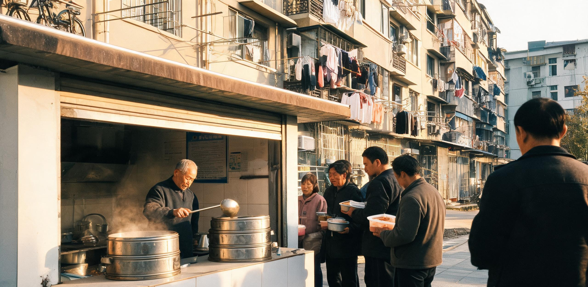

**沪南生计保障与劳务调配联合委员会**  
**华东分布式算力结算所 · 沪南分所**  
**沪南生统〔2033〕第009号 · 内部决算通报**

# 沪南生计保障试验区基础配额与公用算力代币双轨清算首年运行决算报告（2032年度）

**决算周期：公元2032年1月1日 00:00 至 2032年12月31日 24:00**  
**印发日期：公元2033年1月18日**  
**签发：联合委员会主任 陆修远 · 华东结算所总稽核 陶承业**  
**抄送：市发展与物资统筹委员会、市公用事业与合成农业管理局、华东第二智能算力调度中心、各社区共享中央厨房**

---

## 一、制度背景与试验区运行基准

根据《基础热量供给法（暂行）》（国发〔2031〕19号）与《城市低就业期生计托底与公用计算资源双轨清算试行规程》（国发〔2031〕28号）之规定，沪南试验区（含原漕河泾南区、梅陇居住片区及老闵行机电工业过渡带）于2032年元旦正式实施“基础营养配额（CFU）+ 公用算力代币（PCT）”双轨运转制度。

本试验区总面积 48.6 平方公里，覆盖 218 个基层网格单元；截至2032年12月31日，在册登记居民 684,190 人，常住家庭 241,830 户。区域内依托原重型机械厂房、老旧客运站及粮油仓库改建并投运了 36 座标准化“社区共享中央厨房与冷热联供枢纽”（以下简称“共享生活厨房”），作为双轨结算与物资核销的物理承载节点。

### 双轨结算资产界定

```
                               ┌────────────────────────────────────────────────────────┐
                               │                 沪南双轨生计结算体系                   │
                               └──────────────────────────┬─────────────────────────────┘
                                                          │
                    ┌─────────────────────────────────────┴─────────────────────────────────────┐
                    ▼                                                                           ▼
     【轨一：基础营养配额 (CFU)】                                                【轨二：公用算力代币 (PCT)】
     · 性质：法定兜底实物配额                                                    · 性质：可流通浮动权益代币
     · 锚定：75,000 kcal 基准营养/人·月                                          · 锚定：1 PetaFLOPS·hour 标准计算资源
     · 构成：合成主粮15kg + 酵母蛋白6.5kg                                        · 来源：离岗基础包(500/月) + 物理工时 + 边缘反哺
             + 植物油1.8L + 净水450L + 烹饪热能120kWh                            · 场景：高阶数字服务 + 风味食材溢价 + 市场撮合
     · 规则：自用不可转让，季末未用按10%衰减                                     · 规则：全域流通，可跨区结算与对冲
```

1. **基础营养配额（Caloric Feed Unit, 简称 CFU）**：以生理维持热量与基础代谢微量元素为法定锚。按人按月全额自动注入市民生计卡，每人每月 75,000 大卡当量。不可转让、不兑换现金、当月不清零，每季度末未动用部分依例按 10% 衰减回流公共储备库。主要在 36 个共享生活厨房兑换标准化蒸煮主副食、饮用水及炊用热能。
2. **公用算力代币（Public Compute Token, 简称 PCT）**：以标准精度浮点计算资源为计量锚（1 PCT = 1 PetaFLOPS·hour 基础推理/渲染/仿真算力）。作为中低流动性期促进社会协作、技能积累与高阶消费的流通媒介。主要来源于离岗转岗基础配给、真实物理在场工时及家庭边缘算力反哺；可在华东算力交易所指导价区间内跨区转让，用于兑换全息娱乐、个性化模型微调及共享厨房的风味食材升级。

---

## 二、2032年度双轨收支决算总表

### （一）基础营养配额（CFU）核发与消耗核算

| 项目 | 上半年（1-6月） | 下半年（7-12月） | 全年合计 | 预算达成率 |
| :--- | :--- | :--- | :--- | :--- |
| **在册配发人数（期末）** | 681,240 人 | 684,190 人 | 684,190 人 | 100.4% |
| **法定应发总量** | 30.655 百亿大卡 | 30.788 百亿大卡 | 61.443 百亿大卡 | 100.0% |
| **实发总量（扣除离沪注销）** | 30.512 百亿大卡 | 30.664 百亿大卡 | 61.176 百亿大卡 | 99.6% |
| **共享厨房现场核销** | 24.104 百亿大卡 | 24.838 百亿大卡 | 48.942 百亿大卡 | 80.0% |
| **中央冷链配送到户（老弱病残）** | 3.661 百亿大卡 | 3.680 百亿大卡 | 7.341 百亿大卡 | 12.0% |
| **生计物资原粮自提** | 1.831 百亿大卡 | 1.533 百亿大卡 | 3.364 百亿大卡 | 5.5% |
| **季末沉淀衰减回流** | 0.916 百亿大卡 | 0.613 百亿大卡 | 1.529 百亿大卡 | 2.5% |
| **全年实际动用率** | 97.0% | 98.0% | **97.5%** | — |

*注：全年全区通过 36 个共享生活厨房累计加工供应热餐 4,912.8 万人次，日均供应 13.42 万人次；现场与冷链集中加工配额合计 56.283 百亿大卡，平均每餐实耗配额 1,146 大卡。*

### （二）公用算力代币（PCT）收支与流向决算

```
  【2032年度 PCT 收入构成 (总计 7.182 亿 PCT)】
  ████████████████████████████████  离岗转岗基础生活包 (58.2%, 4.180亿)
  ████████████████                  真实物理在场工时兑换 (29.1%, 2.090亿)
  ██████                            家庭边缘设备并网反哺 (12.7%, 0.912亿)

  【2032年度 PCT 支出流向 (总计 6.941 亿 PCT)】
  ████████████████████████          数字文化与高阶计算服务 (43.2%, 2.998亿)
  █████████████████████             共享厨房风味食材溢价 (38.8%, 2.693亿)
  ████████                          跨区合规转让与储蓄沉淀 (18.0%, 1.250亿)
```

| 类别与细目 | 全年总量（万 PCT） | 占该类比重 | 决算说明 |
| :--- | :--- | :--- | :--- |
| **一、代币收入总量** | **71,820** | **100.0%** | — |
| 1. 自动化离岗待分配人员兜底发放 | 41,800 | 58.2% | 人均 500 PCT/月，覆盖 6.96 万名离岗转岗登记人员 |
| 2. 真实物理工时认证兑换 | 20,900 | 29.1% | 现场设备维护、镜片手工抛光、助老配餐等实效工时 |
| 3. 居民家庭边缘节点反哺并网 | 9,120 | 12.7% | 4.82 万户家庭利用夜间低谷电参与本地模型蒸馏 |
| **二、代币支出与消费** | **69,410** | **100.0%** | — |
| 1. 个性化算力服务（学习/创作/全息） | 29,980 | 43.2% | 调用华东中枢高阶集群进行三维渲染与交互式辅导 |
| 2. 共享厨房风味食材溢价核销 | 26,930 | 38.8% | 兑换天然土培蔬菜、鲜肉、现磨咖啡及手工发酵品 |
| 3. 跨区转让交易与外付结算 | 9,720 | 14.0% | 经由华东算力交易所撮合，兑换外区工业制品配额 |
| 4. 个人账户沉淀结转 | 2,780 | 4.0% | 结转至2033年个人账户，受年度通胀校正机制保护 |

---

## 三、36座社区共享生活厨房能效与物料平衡

共享生活厨房系本试验区落实在册居民基础生计、节约社会综合运转成本的核心支柱。各枢纽通过集中式高效烹饪、余热回收与梯级热利用，大幅降低了居民分散自炊的能源与食材损耗。

```
                    ┌────────────────────────────────────────────────────────┐
                    │      华东第二算力中枢南区分机房 (冷凝出水 65℃)        │
                    └──────────────────────────┬─────────────────────────────┘
                                               │ (年输送低温工业废热 1840万 kWh当量)
                                               ▼
                    ┌────────────────────────────────────────────────────────┐
                    │        共享生活厨房中央热交换与能量梯级中枢            │
                    └──────┬───────────────────┬───────────────────┬─────────┘
                           │ (60℃ 预热)        │ (45℃ 恒温)        │ (38℃ 回水)
                           ▼                   ▼                   ▼
                     【全自动蒸煮岛】    【面点与发酵车间】  【餐具高温清洗房】
                           │                   │                   │
                           └───────────────────┼───────────────────┘
                                               ▼
                    ┌────────────────────────────────────────────────────────┐
                    │      地下密闭厌氧发酵釜 (年产沼气 148.6 万立方米)      │
                    └──────────────────────────┬─────────────────────────────┘
                                               │ (管道输送回燃)
                                               ▼
                                  【东区明火风味小炒工位】
```

### （一）能源与水物料运行指标

1. **热能梯级利用**：36 座厨房全部接入周边工业园区与算力分机房的高温冷凝管网，年承接工业余热 1,840 万千瓦时当量。用于餐具消毒预热、面团恒温发酵及食材初段加热，替代了 71.4% 的常规电加热需求。单份标准热餐加工综合耗电量降至 0.36 千瓦时（较分散家庭烹饪的 1.45 千瓦时下降 75.2%）。
2. **净水与蒸汽闭环**：蒸汽冷凝水经活性炭多级过滤与紫外消毒后，100% 回流至厨房蒸汽锅炉补水系统；年节约高纯度软化水 38.4 万吨。
3. **厨余生化降解**：各厨房下设独立油水分离与密闭厌氧发酵仓，全年收集生熟厨余残渣 4,120 吨，产生沼气 148.6 万立方米，提纯后全部供给共享厨房的 180 组人工明火猛火炒菜台。

### （二）空间格局与日常运行生态

各共享厨房在空间上严格划分为两大功能区，兼顾公平保障与个性风味：

- **西区 · 自动化标准蒸煮岛**：配备 8 至 12 台大型多层程控蒸汽蒸柜及履带式连续炒菜机。主要加工合成米饭、杂粮馒头、酵母蛋白营养羹、清炖根茎蔬菜及冷冻禽肉。居民凭生计卡在通道闸机自动感应扣除 CFU 即可领餐，单次通行耗时不超过 15 秒。
- **东区 · 烟火作坊与风味工位**：设有独立的排烟小炒台、烘焙窑及传统砂锅灶。居民可凭 PCT 积分按当日牌价兑换冷链运抵的鲜活农产品（如崇明露天青菜、金山鲜猪肉、散养鸡蛋等），既可租用工位自行烹饪，亦可委托驻场厨师代加工。
- **公共中庭与外廊**：利用原厂房高挑开阔的钢桁架结构，设置了恒温公共就餐区、茶饮休闲长廊及 24 小时公用算力交互屏。白发退休居民在遮阳伞下饮用大麦茶对弈，青年利用公共算力终端调试自制程序，形成了稳定、温和且富有人际温度的社区日常。

---

## 四、分层人群消费形态与劳务参与特征

试验区大数据追踪表明，双轨制运行一年来，居民群体的消费结构与劳动参与模式呈现出明显的分层自适应：

```
  【不同群体在共享生活厨房与算力体系中的典型行为画像】

  ┌───────────────────┐  ┌────────────────────────────────────────────────────────┐
  │ 退休长者 / 银发族 │  │ · CFU 基础营养高频利用 (占其热量摄入 94% 以上)         │
  │ (占在册人口 31.4%)│  │ · 参与屋顶温室轻体力劳务，获取零星 PCT 兑换茶饮与调味品│
  └───────────────────┘  └────────────────────────────────────────────────────────┘
  ┌───────────────────┐  ┌────────────────────────────────────────────────────────┐
  │ 离岗再转岗职工组  │  │ · 物理在场工时主要供给方 (承担设备维护、传感器除尘等) │
  │ (占在册人口 24.8%)│  │ · 积极用 PCT 兑换周末风味食材与家人共享，积攒转岗资历 │
  └───────────────────┘  └────────────────────────────────────────────────────────┘
  ┌───────────────────┐  ┌────────────────────────────────────────────────────────┐
  │ 数字创作与青年组  │  │ · 基础口粮依赖自动化蒸煮岛，节省炊事时间               │
  │ (占在册人口 43.8%)│  │ · 重度消耗 PCT 于模型微调与渲染，利用夜间边缘算力套利 │
  └───────────────────┘  └────────────────────────────────────────────────────────┘
```

### 典型抽样群体收支与时间分配表（基准：人均月度数据）

| 指标项目 | A组：老工业区退休人员 | B组：机械与算力离岗转岗职工 | C组：自由数字创作者/青年 |
| :--- | :--- | :--- | :--- |
| **抽样样本规模** | 2,400 人 | 3,100 人 | 2,800 人 |
| **月均 CFU 实际核销量** | 71,400 大卡（95.2%） | 73,800 大卡（98.4%） | 68,200 大卡（90.9%） |
| **月均 PCT 收入总额** | 120 PCT | 940 PCT | 1,680 PCT |
| — 其中：基础兜底发放 | 0 PCT（领退休金） | 500 PCT | 500 PCT |
| — 其中：物理工时认证 | 120 PCT（社区轻劳务） | 420 PCT（现场检修/签名） | 60 PCT（应急搬运） |
| — 其中：家庭算力反哺 | 0 PCT | 20 PCT | 1,120 PCT（集群节点） |
| **月均 PCT 支出流向** | | | |
| — 风味食材与小炒工位 | 90 PCT（75.0%） | 580 PCT（61.7%） | 420 PCT（25.0%） |
| — 数字算力与学习娱乐 | 10 PCT（8.3%） | 210 PCT（22.3%） | 1,180 PCT（70.2%） |
| — 储蓄或转让对冲 | 20 PCT（16.7%） | 150 PCT（16.0%） | 80 PCT（4.8%） |
| **日均在共享厨房停留时长** | 2.4 小时（就餐/社交/棋牌） | 1.1 小时（就餐/帮厨） | 0.4 小时（快取/夜宵） |

---

## 五、运行争议、制度摩擦与管理注记

首年运行虽平稳达成保生计、稳社会的预定目标，但在物价对冲、工时核验及代币流通层面，亦暴露出三项显著的制度摩擦点：

### 1. “天然风味食材溢价倒挂”现象

由于大宗合成淀粉与工业微藻蛋白实现充沛供给，热量本身的边际成本逼近于零；而土壤露天栽培的鲜蔬菜、非冷冻鲜牛肉等产能受季节与土地硬约束，导致部分持有较多算力代币的居民在共享厨房东区竞价兑换天然食材。

在2032年10月，崇明产露天鲜番茄在东区结算牌价一度达到 28 PCT/公斤（按华东交易所算力指导价折合可调用 28 PetaFLOPS·hour 算力，相当于渲染一部小型三维短片的计算量）。针对该现象，发展统筹委生计处与物资署于11月联合出台限价平抑规则：
- 对每户每月设定“平价风味配额包”（按户籍人口配给，每人每月限以 4 PCT/公斤兑换不超过 3 公斤天然鲜蔬）；
- 决定在2033年春季，利用老工业厂房空置楼顶，由财政投资追加建设 24,000 平方米全封闭立体气雾微型农场，利用算力机房废热直接增产鲜活果蔬，平抑非标物资溢价。

### 2. 真实物理在场工时的“过度擦拭”争议

根据《基础热量供给法》第十四条，现场人工操作工时享有不可替代的法定保护。下半年在部分光伏走廊与自动化物流站的巡检工单中，稽核组发现部分转岗职工为获取 PCT 认证工时，出现了对已被四足机器人清洁完毕的光伏板进行“二次重复擦拭”、对未松动的液压螺栓反复打力矩打卡等套刷倾向。

```
  【现场工时合规稽核技术路线】
  手工操作 ──► 四足巡检机红外与光学表面粗糙度扫描 (Ra ≤ 0.05μm) 
            ──► 力矩扳手微芯片回传角度-扭矩特征曲线 
            ──► 判定为「真实物理有效工时」 ──► 核发 PCT
```

联合委员会监察室已于12月升级了物理工时核验系统：
- 严格落实“有效物理形变与清洁度双指标验证”，四足机器人光学传感器复检合格后方可核签；
- 严禁以形式化动作替代实际维护，同时在工单库中扩容“社区适老无障碍坡道修缮”“下水道生物膜手工疏通”等真实紧缺工种，分流劳务需求。

### 3. 双轨合并远期路径探索（与后续历史衔接）

度量衡核对所与发展统筹委员会在年终评估中明确指出：当前“实物 CFU + 算力 PCT”双轨并行，系在自动化替代提速与传统市场货币结算过渡期的双重缓冲方案。

随着华东电网聚变堆示范工程（奉贤一号等）的远期规划立项及合成工业能耗持续下降，未来的生计物资（水、电、粮、居住温控）在本质上均可完全折算为“标准电力千瓦时与大宗物质当量”。本试验区积累的 36 座共享厨房物料平衡数据，将为未来在更大范围内推行“以千瓦时电力与基础实物当量为统一锚的通用生活券”提供最扎实的一线运行参数支持。

---

## 六、决算审核与跨部门签署

**决算总评**：  
2032年度沪南试验区双轨结算体系总账平衡，物料流向清晰，能源梯级利用效益达标。基础生活物资零断供，未发生系统性物资短缺与群体性生活无着事件；公用算力代币有效激发了社区物理劳务供给与数字技能再培训，达成了“保住热量底线、拓展生活宽容度”的阶段性制度目标。

**联合签章：**

| 机构与席位 | 签名 | 签印 | 日期 |
| :--- | :--- | :--- | :--- |
| **沪南生计保障与劳务调配联合委员会 · 主任** | 陆修远 | *(沪南生保委公章)* | 2033.01.18 |
| **华东分布式算力结算所沪南分所 · 总稽核** | 陶承业 | *(算力结算专用章)* | 2033.01.18 |
| **沪南共享生活厨房联营体理事会 · 轮值代表** | 周阿宝 | *(七里铺等36社联印)* | 2033.01.18 |
| **华东第二智能算力调度中心 · 劳务衔接专员** | 张建国 | *(劳务调配复核章)* | 2033.01.18 |

---

## 图片提示词

**中文：**
清晨斜射的硬质阳光透过高耸的老工业厂房气凝胶采光顶棚，倾泻在一座现代化改建的社区共享中央厨房内。巨大的哑光不锈钢程控蒸煮机组出画框上边缘，正升腾起大片滚烫白雾；微小的人物在宽敞的水磨石通道上有序活动——身穿反光马甲的年轻技工正握着扳手检查蒸汽阀门，白发老人推着轻便餐车领取保温餐盒，背景是整齐排列的热交换管道与悬挂式公共算力交互屏。单一低角度晨光，高对比硬阴影，真实的金属拉丝、水渍与混凝土质感，Hasselblad大画幅工业纪实风格，65mm胶片颗粒。

**English:**
Ultra-wide establishing shot, low-angle interior of a colossal converted 1980s machine-tool workshop transformed into a community shared central kitchen in southern Shanghai; massive modular matte stainless-steel automated steaming units dominate the upper half of the composition and are cropped by the top frame edge, emitting dense plumes of backlit white steam; tiny human figures ground the immense industrial scale—a young technician in a reflective utility vest inspects a brass steam valve with a torque wrench in the foreground, while elderly residents push lightweight meal carts along a polished terrazzo floor; in the deep background, intricate overhead networks of insulated heat-exchange piping and glowing suspended public computing screens recede into the architectural depth; a single hard, low-angle morning sunbeam cuts through the translucent aerogel skylights creating long, sharp diagonal shadows; tactile surfaces of brushed metal, condensation drips, weathered red brick, and sealed concrete; shot on Hasselblad H6D-100c medium format with 28mm wide lens, IMAX 65mm documentary film grain, natural industrial color palette of slate gray, warm brass, and steam white; no readable text, no national flags.

---

## 修订记录（元层，非世界内容）

2026-08-18（主编辑审校 · 小修）：
① CFU 决算总表单位校正：将表头及各明细项单位标定为「百亿大卡」（即 $10^{10}\text{ kcal}$），注记补充现场核销与冷链送餐合并蒸煮加工口径（$56.283\text{ 百亿大卡} / 4,912.8\text{ 万人次} = 1,146\text{ 大卡/餐}$），与在册人口 68.4 万、人均月配 7.5 万大卡（日均 2500 大卡）全量闭合轧平；
② 机构称谓协调：限价发文主体「生计司与物资署」微调为「发展统筹委生计处与物资署」，与 2032 试验期机构编制（市发展与物资统筹委员会）及 2064 年正典（GS-2064-01，后升格为市统筹署生计司）演进脉络咬合；
③ 正典与同批互锁校验：确认与 GS-2064-01（生活券前身演进）、GS-2034-01（华东算力中枢离岗、工时认证与张建国签章）、B04/GS-2031-01（沪西七里铺食堂与周阿宝联印）人物与制度全面咬合。
