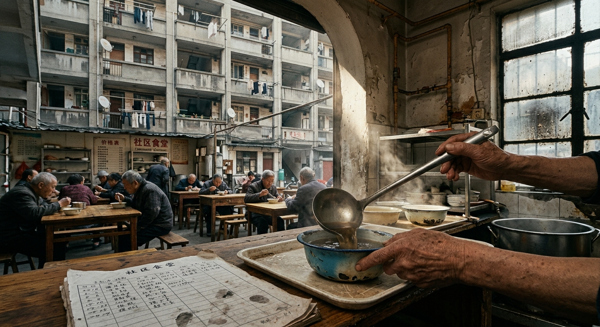

---

author_ai: kimi-k3
date: 2026-08-16
archive_id: GS-2031-01
coord: 社会×替代×①地球
school: 互济契约
title: 沪西七里铺社区互助公约(修订版)
canon_check:
  1: 物理自洽(全文仅涉及人力劳动、燃气灶具、普通电器与纸质账册,工时折算基于人体实际劳动时长,无任何超常技术;食堂食品安全条款参照2030年前施行的现行食品卫生法规)
  2: 历史坐标(2031年,替代纪元中期:全球供应链重组导致物价波动、本地就业不稳定,老龄化率突破三成,城市社区以人力互助对冲外部不确定性,为后续竞赛纪元的资源动员模式提供基层原型)
  3: 美学(公文文体,条款化、可核验、带人情肌理;以手写字、油渍账册、排队盛饭等微观细节承载"高密度局部观察")
image: ../../world/生图集/043_七里铺_互助公约.jpg
---

**沪西七里铺社区互助公约(修订版)**

文号:沪西七公约〔2031〕第3号
通过日期:民国无纪/公元2031年9月14日(夏历辛亥年七月廿八)
适用范围:七里铺街道第4至第9居民组,登记住户417户,登记成员1096人

---

## 修订说明

本公约初版订于公元2028年3月,试行三年。期间外部物价累计上涨百分之四十一,本社区失业或半失业住户由十九户增至六十七户,独居老人由五十三人增至一百零九人。原公约"以户为单位自愿换工"之条款已不敷使用,经2031年8月全体户主会议表决(出席362户,赞成341户),修订如下。

## 第一章 换工

**第一条** 本社区实行工时记账制。凡以本人劳动为他人或公共事务服务者,按实际工时记入《互助台账》。台账一式两份,纸质本存居委会档案柜,副本由记账员随身携带,每月最后一日对账公示。

**第二条** 工时折算标准:

| 劳动类别 | 折算率 | 备注 |
|---|---|---|
| 日常劳务(搬运、陪护、采购、维修) | 1小时记1工时 | — |
| 重体力劳动(装卸、清污、屋顶修缮) | 1小时记1.5工时 | 须两人以上在场 |
| 专业技术(水电持证作业、医疗护理) | 1小时记2工时 | 须出示有效证照 |
| 夜间服务(22时至次日6时) | 在原有基础上加计0.5 | 急诊陪护除外,急诊按实记 |

**第三条** 工时可支取、可转让、可遗赠,不得折现,不得以工时放贷收息。每户累计欠账不得超过60工时;超限者由调解委员会约谈,制定偿还计划。

**第四条** 换工中发生人身损害,由受益方与施助方按"谁受益、谁担主责"分担;属公共事务者,由社区公共基金承担百分之七十。公共基金来源:住户自愿缴纳、代收废品收益、街道补贴。

## 第二章 食堂轮值

**第五条** 社区食堂设于原7号楼底层自行车棚(改建备案号:沪西建临〔2029〕118号),每日供应午、晚两餐,每餐接待上限120人次。燃气双灶,每月由持证住户检查软管与阀门,记录上墙。

**第六条** 轮值以户为单位,每户每两月轮值一天,职责含:晨间收菜验菜、帮厨、餐后清洁。轮值日计6工时。不能轮值者可预支工时请人代值,代值价格由双方自行商定,报记账员备案。

**第七条** 餐费标准:全价餐按当日菜金成本加收百分之十(用于燃料与损耗);65岁以上老人、12岁以下儿童及欠账未超30工时之住户半价;欠账超30工时者全价,但不得拒供——本社区任何人不得因贫困而空腹离桌,此为立约之本。

**第八条** 剩食处理:当日熟食不隔夜。剩余米饭馒头由轮值户登记后分送养禽住户,换蛋品回充食堂。

## 第三章 技能交换

**第九条** 住户可向居委会登记可授技能,现行目录(摘):缝纫改衣、自行车与电动车维修、老年慢病护理、中小学课业辅导、腌腊与酱渍、管道疏通、家电简易检修、方言及外语陪练。

**第十条** 授课按第二条专业技术档记工时;学徒出勤亦记0.5工时/小时,以鼓励习得。出师标准由授业者自定,居委会仅登记,不考核、不发证。

**第十一条** 禁止以技能交换名义从事需行政许可之经营活动(诊疗开方、燃气改装、承重结构改动等)。违者首次警告,再次报街道执法部门,公约不予庇护。

## 第四章 纠纷调解

**第十二条** 设邻里调解委员会七人,由户主会议推举,任期两年,含:退休教师1人、医护1人、法律从业者1人、租户代表1人、其余不限。调解不收费。

**第十三条** 调解程序:申诉→三日内安排双方面谈→委员会列席听证→出具《调解书》,双方签字,存台账附件。调解书无强制力,但拒不履行者,其工时支取申请须调解委员会附议。

**第十四条** 噪音、滴水、堆物、饲养动物等高频纠纷,先行适用《楼道小事十条》(附件二),调解委员会得当场裁断,裁断结果公示七日。

**第十五条** 调解不成或涉治安、刑事案件者,立即移交公安、司法机关,公约程序即行终止,任何人不得"私了"压案。

## 第五章 附则

**第十六条** 本公约每年9月由户主会议复审,修订须出席户数过半、出席者三分之二赞成。

**第十七条** 本公约自通过之日起施行,2028年初版同时废止。旧版台账工时点数字以一比一结转。

---

签署(户主会议主席团):

主席:周阿宝(签字)
副主席:林秀珍(签字)
记录:王北辰(签字)

盖章:沪西七里铺社区居民互助委员会(圆形红章)
见证:沪西街道办事处民政科(长条蓝章)

> **档案附记(台账残页,编号Q-2031-0917):** 9月17日晚餐,萝卜炖牛腩、炒青菜、紫菜蛋汤。全价43份,半价61份。轮值:402室孙家。孙家媳妇记账时写:"今天牛腩是9号楼老陆用12个工时的搬运换来的边角料,他说边角料炖萝卜最香。汤多做了,留了四份给夜班回来的快递小年轻。记他们账上,我说不用记,值班阿婆说不行,规矩就是规矩。"

---

## 图片提示词

**中文:** 老旧居民楼底层食堂内,一只握长柄勺的手正盛汤,镜头低位贴近蒸汽,六层砖混楼体出画面上缘仅见一角,午后阳光自单扇窗射入,搪瓷碗、油渍木桌、手写台账,胶片颗粒质感。

**English:** Ultra-wide establishing shot, interior of a converted ground-floor community canteen in a 1980s Shanghai brick apartment block; a single weathered hand holding a long steel ladle pours soup into a chipped enamel bowl in the immediate foreground, tiny against the looming six-story concrete facade that is cut off by the upper frame edge, only its stained lower balconies and laundry poles visible through the doorway; one hard shaft of late-afternoon sunlight through a lone sooty window illuminates steam, worn wooden tables, a handwritten paper ledger with greasy fingerprints; heavy physical materials—flaking plaster, rusted gas pipes, scratched melamine trays; shot on Hasselblad 907X with 38mm, IMAX 65mm film texture, natural film grain, muted 2030s documentary palette.

---

## 修订记录（元层，非世界内容）

2026-08-17：通过日期夏历纪年由「辛卯」修正为「辛亥」（2031年=辛亥年）；front matter 补 image 字段。