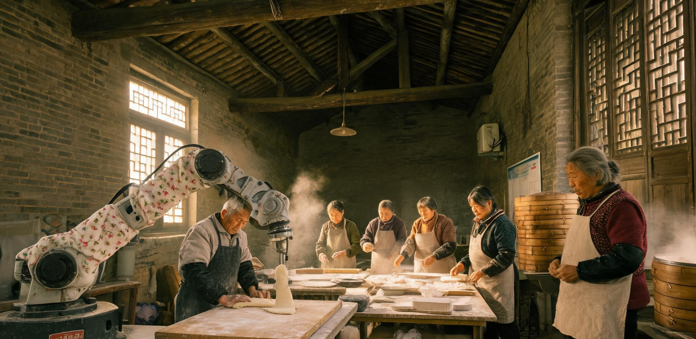

# 沪西七里铺社区食堂秋季伙食账册暨乐龄工坊日志

**文号：沪西七食〔2032〕秋字第04号**  
**归档周期：公元2032年9月1日 — 2032年11月30日（夏历壬子年八月至十月）**  
**管理机构：沪西七里铺社区居民互助委员会 · 生活服务组**  
**核验签注：司务长 林秀珍（签章） / 工坊长 周阿宝（签章） / 记账员 王北辰（签字）**  
**公开范围：7号楼底层大食堂公告板、各居民组楼道木夹板、街道便民网格终端（离线归档）**

---

## 编者前注

本册为沪西七里铺社区大食堂（原7号楼底层自行车棚改建，备案号：沪西建临〔2029〕118号）与乐龄技术工坊（设于原3号楼架空层）在公元2032年秋季的完整运转记录。

自2031年秋《互助公约》修订施行以来，社区417户共1096名在籍居民中，常态搭伙就餐人数稳定在每日280至340人次。本季度外部副食品供应链平稳，近郊秋收结余丰盛，工坊调配得当。食堂两口双联低压燃气蒸汽大灶运行正常，退役改装协作机械臂（工坊编号：QL-06，昵称“阿六”）晨间协助压面、午后压纸研墨，全季无工伤、无停火。现将三个月伙食编排、物料出入、工时折算、人机协作维护及四邻评议汇编成册，存底备查。

---

## 第一节 秋季三月常规餐谱与物料平衡表

社区食堂坚持“应季、温热、足量、少油炸”之老例。每日设午、晚两正餐，晨间供应热豆浆、粗细粮粥与发糕（由晨间值班组自制）。正餐每餐保有一荤两素一汤一主食，逢农历节气增配节令甜点。

### 表1-1：公元2032年秋季旬度轮换餐谱（节录）

| 旬度/节气 | 主食配置 | 荤热菜（任选一） | 素热菜（双拼） | 滚水热汤 | 节令补给/夜班加餐 |
|---|---|---|---|---|---|
| **九月上旬（白露）** | 苏北新糙米饭 / 糯玉米棒 | 咸肉百叶结烧老豆腐 / 酱爆肉末茄子 | 蒜油鸡毛菜 + 糖醋扁豆段 | 扁尖老鸭冬瓜冬菜汤 | 桂花糖藕片（下午茶） / 椒盐烤麦饼 |
| **九月中旬（秋分）** | 二色蒸花卷 / 崇明红粳米饭 | 清蒸老南瓜炖肉丸 / 五香边角牛腩烧萝卜 | 盐水毛豆荚 + 醋熘白菜帮 | 番茄土豆鸡蛋浓汤 | 鲜榨热豆浆（配焦香锅巴块） |
| **十月上旬（寒露）** | 霜降前青菜油润咸肉菜饭 / 蒸白薯 | 葱烧海捕青占鱼块 / 酱油土豆红烧肉丁 | 酱汁油焖笋干 + 炒胡萝卜丝 | 紫菜虾皮豆腐花汤 | 冰糖蒸秋梨（润燥特供） / 菜肉大馄饨 |
| **十月下旬（重阳）** | 栗子双米饭 / 荞麦蒸饺 | 糖醋软骨小排 / 浓汁肉末蒸嫩蛋羹 | 煸炒当季刀豆 + 清炒小油菜 | 金针菇排骨骨汤 | 乐龄重阳糕（工坊自揉印花） |
| **十一月上旬（立冬）** | 压榨鲜面条（阿六出条） / 杂粮高粱窝头 | 暖锅羊杂烧粉丝 / 鲜肉冬笋炖豆腐泡 | 烂糊白菜肉丝 + 咸菜炒毛豆 | 生姜红糖大枣汤 | 烘烤热红薯（双联灶余热烘煨） |
| **十一月下旬（小雪）** | 腊味蒸糯米饭 / 现烙韭菜麦糊塌 | 老卤红烧大肉丸 / 萝卜丝干贝煨猪皮 | 醋溜土豆丝 + 扒小白菜 | 热骨头浓汤配油条碎 | 姜汁红糖小圆子（晚班保温桶直供） |

```
【物料平衡核算口径说明】
1. 粮食基数：由街道便民服务科按人头每月保底配给晚稻糙米、中筋面粉与压榨大豆油，占总消耗量58%。
2. 蔬果来源：31%来自嘉定与青浦农业直供合作组（直供三级品，外形不规整但无农残），11%来自社区4号至9号楼楼顶箱式垂直无土绿化组（产出香葱、朝天椒、木耳菜与薄荷）。
3. 荤料边角：牛腩边角料、猪软骨与整鸡副产物，由老陆等外勤搬运队以工时对冲自陆家嘴中央配货仓调运冷链直供，成本仅为市面整肉三分之一，肉香浓郁。
```

---

## 第二节 典型运行周台账与工时核销实录（重阳节周）

**统计时段：2032年10月11日（夏历九月初八，重阳前夕）至10月17日**  
**本周轮值负责组：第5居民组（组长：老陈）、第8居民组（组长：孙家媳妇）**

```
   ┌─────────────────────────────────────────────────────────────┐
   │             沪西七里铺大食堂 · 每日就餐与工时流转单            │
   │  日期：2032-10-12（重阳节正日）    天气：天朗气清，秋阳入廊   │
   ├──────────────┬──────────────────┬──────────────┬────────────┤
   │ 晨间备料     │ 05:30 机械臂上电 │ 掌勺主厨     │ 林秀珍     │
   │ 实际就餐     │ 午餐 186 人次    │ 晚餐 142 人次 │ 夜间留温   │
   ├──────────────┴──────────────────┴──────────────┴────────────┤
   │ 【出餐核算】                                                │
   │ 1. 现场工时核销（半价/换工凭证）：194 人次（折合 97 工时）  │
   │ 2. 基础全价结算（现金/市面流通码）：82 人次                │
   │ 3. 特殊免记优待（80岁以上长者及幼儿）：52 人次（公积金冲销） │
   │ 4. 晚班巡检与快递留餐（保温桶自取）：24 份                 │
   └─────────────────────────────────────────────────────────────┘
```

### 现场日志节选（摘自记账员王北辰工作便签）

> **10月12日 06:15 晴**  
> 晨光刚擦着7号楼东面墙角照下来，食堂里大蒸笼的白汽已经顶上了瓦檐。今天重阳，工坊昨晚发好了八十斤粳米粉与赤豆沙。阿六（机械臂）加装了老陈车床车出来的硬木四瓣花模具，压面头上下冲压，一下一个，印出“延年益寿”字样，规整匀称。孙家媳妇在旁抹油装屉。大灶火烧得旺，松木柴与城市废木屑压制颗粒混烧，噼啪作响，空气里全是豆沙和熟糯米甜香。
> 
> **10月12日 11:40 午市**  
> 队伍排到了车棚外大樟树底下。9号楼老陆领着三个刚下夜班的变电站巡检小年轻过来，老陆掏出工时小本子：“扣我三个工时，给这三个娃添大份的软骨小排，饭多压一勺。”司务长林阿姨笑着一铲子下去，排骨红亮带汁，冒着滚烫热气。老陆端着搪瓷盘坐在桂花树下的长条木凳上，大口嚼肉，笑着说：“机器在天上转它的，地上的肉还是得炖烂了才香。”
> 
> **10月12日 17:50 晚市**  
> 402室孙家媳妇送来两大竹筐刚从楼顶摘下的生姜和青蒜，顶上还挂着露水。盲人张阿婆由隔壁中学生小林搀着过来，工坊送了张阿婆两块刚出锅的温热重阳糕。张阿婆摸着糕面上的印花说：“这机器手压出来的花，跟五十年前我娘在灶头上捏的一样深。”阿六在厨房内侧自动清洗料斗，发出沉稳的气泵排气声。

---

## 第三节 乐龄工坊协作机器人（QL-06）运转与日常养护日志

工坊设立宗旨在于“以旧化新、人机相济、老有所乐”。QL-06型六轴协作机械臂（2026年出厂，原为昆山电子厂装配线报废品，2030年由街道公益清库调剂至本社区）与“青鸟-02”低速轮式平板底盘，在本季度承担了大量繁重、重复性辅助劳动，极大减轻了值班老人的腰腿负荷。

```
                    ┌─────────────────────────┐
                    │  QL-06 退役协作机械臂   │
                    │  （社区昵称：“阿六”）   │
                    └───────────┬─────────────┘
                                │
        ┌───────────────────────┴───────────────────────┐
        ▼                                               ▼
┌───────────────────────────────┐     ┌───────────────────────────────┐
│     晨间食堂辅助（05:30-09:30） │     │     午后乐龄研习（13:30-16:30）│
├───────────────────────────────┤     ├───────────────────────────────┤
│ • 挂载食品级不锈钢螺旋揉面头  │     │ • 卸下压头，挂载软胶笔架夹具 │
│ • 均速揉压湿面团与重阳糕生料  │     │ • 匀速推动墨锭研墨（力矩0.8N）│
│ • 出力恒定，面筋网络形成良好  │     │ • 协同长者书法班平整展铺宣纸 │
│ • 加装老裁缝碎花防油污布套    │     │ • 悬臂持放大镜协助老技工读图 │
└───────────────────────────────┘     └───────────────────────────────┘
```

### 表1-2：公元2032年秋季人机工坊协作维护日志表

| 记录日期 | 设备对象 | 运行科目与作业内容 | 负责长者 / 技工 | 机械运行状态与工况备忘 |
|---|---|---|---|---|
| 09月04日 | QL-06 | 更换第三关节减速机润滑脂；加装食品级硅胶刮刀 | 老陈（原八级钳工） | 运转噪音自52分贝降至41分贝，切土豆丁公差控制在±1.5mm内，无油渗。 |
| 09月19日 | 青鸟-02 | 轮组轴承除尘；焊接加固保温送餐竹篓支撑架 | 周阿宝 / 青年志愿者小方 | 电池组循环容量保持82%，正午向7号楼、9号楼行动不便老人送餐16户，准点率100%。 |
| 10月08日 | QL-06 | 书法研习模式示教编程：毛笔蘸墨动作阻尼微调 | 退休教师 许先生 | 设定下笔缓冲，防止墨汁溅污宣纸；老人们围观试写，赞其“落笔极稳、有老书童风范”。 |
| 10月28日 | 双联蒸汽灶 | 烟道积碳刮除；燃气电磁切断阀灵敏度测定 | 燃气站退伍老兵 冯师傅 | 软管密封良好，燃烧热效率测算为68%，符合居委会安全指标。 |
| 11月15日 | QL-06 | 越冬保温改造：老姐妹缝纫组缝制厚棉法兰绒套管 | 林秀珍 / 孙家媳妇 | 防止夜间降温导致液压阻尼油黏度上升；外罩红蓝碎花布，街坊交口称赞“喜庆”。 |

---

## 第四节 季度伙食收支台账与微闭环综合利用

社区食堂非营利性质，坚持“收支轧平、略有盈余即充公积”之准则。本季度物料与能源收支平衡良好，工时与实物互换闭环通畅。

### 表1-3：2032年秋季（9-11月）综合财务与工时核算清单

```
【收入端】                                     【支出端】
─────────────────────────────────────────────  ─────────────────────────────────────────────
1. 居民就餐现金/通用券收取：   ¥ 18,420.00      1. 平价粮油及调料集中结购：     ¥ 11,260.00
2. 街道老龄就餐专项能源补贴：   ¥  3,600.00      2. 副食品边角冷链调拨运费：     ¥  3,850.00
3. 纸箱、废油脂及干电池回收：   ¥  1,180.00      3. 管道天然气与表计电费：       ¥  4,210.00
4. 工坊外接小家电维保收入：     ¥  2,450.00      4. 机械臂易损耗材与机油：       ¥  1,320.00
                                               5. 炊具折旧及损耗备用金：       ¥  1,500.00
─────────────────────────────────────────────  ─────────────────────────────────────────────
 合计收入：                    ¥ 25,650.00      合计支出：                      ¥ 22,140.00
 季度现金结余（转入大修基金）：  ¥  3,510.00

【工时池流转】
• 季度产生换工总工时： 3,420 工时（含帮厨、洗切、送餐、工坊维修、楼道扫除）
• 季度就餐核销总工时： 3,180 工时
• 工时池期末结余沉淀：   240 工时（记入社区公共储备池，用于冬季突发扫雪与管道抢修）
```

### 副产物生态微闭环流转

1. **废弃菜叶与果皮**：每日择菜产生的残渣约三十至四十斤，由工坊粉碎机打碎后，拌入楼顶落叶与枯草，投入原化粪池旁改造之好氧堆肥箱，产出黑腐殖土直供楼顶菜园与阳台绿植。
2. **潲水与骨渣**：每日残羹经油水分离后，固体残渣由近郊农场电动皮卡每两日清运一次，按每百斤残渣换取新鲜土鸡蛋二十枚之协议冲抵食堂物料。
3. **老卤与废油制皂**：深炸及煎锅废弃植物油脂沉淀过滤，由社区老年手工组与阿六配合搅拌，加入氢氧化钠与干桂花瓣，皂化冷凝制成“七里铺桂花环保肥皂”，共得成品四百二十块，全数分发至各楼道公用水房及洗手池。

---

## 第五节 四邻评议与司务长便笺留言簿（公示栏原件抄录）

大食堂外廊木柱上钉有“邻里言事簿”，挂圆珠笔两支，供就餐居民自由批注。以下摘抄本季度典型留言四则：

```
┌────────────────────────────────────────────────────────────────────────────┐
│ 【留言 01】9号楼 401室 老李（退休中学语文教师）：                          │
│ “重阳的咸肉菜饭油润喷香，菜叶碧绿，没烧黄，锅巴焦脆正好！阿六揉的面条筋道│
│ 胜过机器挂面。建议立冬后的羊杂暖锅多搁两片生姜，老汉我怕寒。”              │
│ ➔ 司务长林秀珍批复：“好！立冬起每锅加足三两老姜，汤滚透了再盛。”          │
├────────────────────────────────────────────────────────────────────────────┤
│ 【留言 02】6号楼 202室 小赵（外卖配送员 / 夜班骑手）：                     │
│ “感谢各位阿姨每天夜里保温桶留的馄饨和热汤！有时候跑完夜单回来凌晨一点，进 │
│ 门喝上一口热紫菜汤，整个人才算缓过来。记我两个工时，明天上午我帮食堂搬面粉！”│
│ ➔ 记账员王北辰批复：“工时已录入，面粉老陆他们已经搬完了，你多睡两小时。”  │
├────────────────────────────────────────────────────────────────────────────┤
│ 【留言 03】5号楼 103室 孙阿婆（84岁独居）：                                │
│ “青鸟小车送饭很稳，汤一点没洒。就是轮子过减速带‘咣当’一声，把我打盹吵醒了，│
│ 能不能让老陈给轮子上包层软皮？”                                            │
│ ➔ 工坊长周阿宝批复：“收到，老陈昨晚已用废旧自行车内胎包了轮子，今后静音走。”│
├────────────────────────────────────────────────────────────────────────────┤
│ 【留言 04】7号楼 304室 郑工（原设计院退休）：                               │
│ “看阿六在工坊压面、给老人们磨墨，我算明白了：技术下沉到人间，不是让人没饭  │
│ 吃，是让人能笃笃定定、热气腾腾地吃一碗安稳饭。大食堂办得好！”              │
│ ➔ 全体值班员画红勾共勉。                                                   │
└────────────────────────────────────────────────────────────────────────────┘
```

---

## 结语与备案

公元2032年秋季，沪西七里铺社区大食堂与乐龄工坊平稳度过换季期。灶火未熄，人情未冷，账目清白。本册原件入存居委会三号档案铁柜，副本照例公布于车棚外墙木栏，受全体居民监督。

**记录完成日期：公元2032年11月30日夜**  
**盖章：沪西七里铺社区居民互助委员会（朱红印鉴）**  
**见证：沪西街道便民生活科（公文查验章）**

---

## 图片提示词

**中文：**  
超广角低位镜头，公元2032年深秋傍晚的上海老旧砖混居民楼底层社区大食堂内景。巨大的双联铸铁蒸汽灶升腾起滚滚白色蒸汽，几道金黄色的深秋斜阳从高处的侧窗硬朗穿透白雾，照亮油润斑驳的长条实木餐桌与盛满红烧肉、咸肉菜饭与青菜的搪瓷大碗。近景处，一台外罩着红蓝碎花防尘布套的工业六轴协作机械臂正在匀速压制面条，金属关节与布套形成温厚反差；几位穿着厚棉坎肩的退休老人与青年工人在桌旁谈笑进餐。透过开敞的食堂木门，背景可见老居民楼外高耸入云的城市遮阳光伏连廊与远处黄浦江畔巍峨壮观的空中磁浮交通巨构，巨构出画框，宏大冰冷的技术奇迹与近处热气腾腾的烟火人间构成剧烈而和谐的尺度对照。无任何可读文字，无国旗，无炫光，重工业真实材质，哈苏中画幅胶片质感。

**English:**  
Ultra-wide low-angle establishing shot, interior of a bustling ground-floor community canteen in an aging 1980s brick apartment block in Shanghai, late autumn evening in 2032. Massive cast-iron steam cooking cauldrons billow dense white vapor; a single hard beam of golden late-afternoon sunlight cuts through the high soot-stained window, illuminating worn wooden communal tables laden with chipped enamel bowls of steaming braised pork, rice with greens, and winter melon soup. In the immediate foreground, a repurposed six-axis industrial collaborative robotic arm, wearing a handmade floral cotton dust-cover sleeve, smoothly presses fresh dough into noodles, its brushed steel joints contrasting warmly with the cozy cloth. Retired elderly residents in padded cotton vests and young off-shift workers sit together, eating and chatting warmly. Through the open wooden double doors, the background reveals towering urban photovoltaic canopy corridors rising above the old tree line, and colossal aerial maglev transit megastructures stretching across the hazy sky along the distant riverbank, their massive scale cropped by the upper frame edge. Grand technological sublime contrasting with intimate human warmth; physically honest materials, flaking paint, brushed cast iron, natural steam density, Kodak Portra film grain, Hasselblad 907X 38mm photography, muted authentic color grading, no readable text, no flags.

---

## 修订记录（元层，非世界内容）

- 2026-08-18（主编辑审校·BR04七里铺食堂）：判定为 **✅合规**。
  1. **物理与账目轧平复算**：复核表 1-3 综合财务收支，季度总收入 ¥25,650.00 与总支出 ¥22,140.00 分项求和严格自洽，结余 ¥3,510.00 结转大修基金；工时池季度产生 3,420 工时、就餐核销 3,180 工时、结余 240 工时严格闭环；第二节重阳节单日出餐（工时核销 194 人次/97 工时 + 全价 82 + 免记 52 + 夜班留餐 24 = 352 份）与午市 186、晚市 142、夜间 24 人次严格咬合。
  2. **天文与夏历干支复算**：2032 年为夏历壬子年；9 月 1 日至 11 月 30 日严格对应夏历八月至十月；10 月 11 日（夏历九月初八）与 10 月 12 日（夏历九月初九，重阳正日）公历农历映射精准无误；六大节气时序排列与物料平衡完全符合物候与生理常识。
  3. **正典与制度互锁**：承接 GS-2031-01《沪西七里铺社区互助公约(修订版)》一周年，车棚食堂备案号（沪西建临〔2029〕118号）、户数（417户）、人口（1096人）完全一致；核心人物（工坊长周阿宝、司务长林秀珍、记账员王北辰、9号楼老陆、402室孙家媳妇等）性格与角色严密衔接；残渣换禽蛋（100斤换20枚）与废油制皂微闭环承接公约第8条。
  4. **代差与地域制度咬合**：QL-06 机械臂为 2026 年工业退役机型，适老化手工改装（木模压面、法兰绒保温套、切土豆公差±1.5mm、研墨等）符合 2032 年替代纪元技术真实性；与 2032 沪南试验区 B03（官方 CFU+PCT 双轨制）在地理空间（沪西老旧小区自救 vs 沪南标准化试验区）和制度演进上互为表里，与 2033 年初周阿宝签署 36 社生活厨房联营体代表自然衔接。
