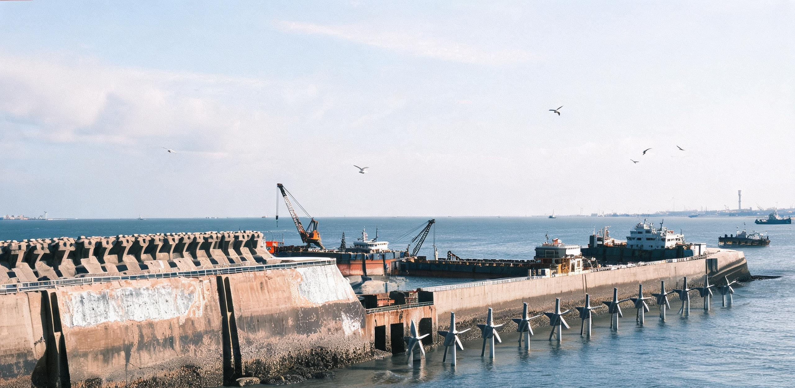

**国家重型基础设施长期服役与遗产工程管理局 · 华东沿海工程督察署**  
**东海（洋山）跨海巨构历史风貌保护与水文生态调谐联合工程指挥部**  
**同济大学海洋与大地工程高等研学会 ｜ 国家深海防腐与生物矿化工程技术研究中心**

# 洋山深水港历史巨构与东海大桥第六次百年延寿大修竣工验收公报
### 暨水下深层基础仿生矿化、潮汐通廊动能活化与潮间带生态共生技术鉴定书

**文书编号：** 东海巨管验〔2631〕第1024号  
**核验历元：** 公元2628年10月01日 00:00:00 至 2631年10月20日 23:59:59（协调世界时 UTC）  
**鉴定签署日期：** 公元2631年10月28日  
**工程现场坐标：** 东海大桥全线（芦潮港至小洋山，全长 32.5 km）及大、小洋山历史深水工区（1 至 4 期岸线，总长 5,600 m）  
**管理与维保主体：** 华东沿海历史巨构维护联合体（EC-MEGAHERITAGE-CORP）  
**学术与技术监管：** 同济与南岸联合高等研学会海洋工程分会 / 华东聚变与材料力学研究所  
**文书密级：** 公开（依《地球长期服役基础设施与历史风貌遗产工程管理条例》第32条公示）  
**归档卷宗：** EASTSEA-MEGA-2631-INSP-1024  

---

### 一、 工程沿革与第六个百年周期核心任务

东海大桥与洋山深水港历史工程群始建于二十一世纪初期（大桥于2005年贯通，四期自动化码头于2017年试投产并于2031年完成全流程无人化物理剥离，见城建档案馆藏档案 GS-2031-02）。伴随二十一世纪中后期大宗矿产冶炼、重载航运与重型航天发射向赤道海洋浮岛（天鳌-01，GS-2092-01）、月球工业带及主小行星带转移，洋山港区于二十二世纪初期平稳结束了作为高频工业货运枢纽的历史使命。

在随后的数个世纪中，伴随内陆太湖流域城市群成建制退役并转入全尺度自然再野化（演替为高塔垂直森林与原生湿地荒野），该跨海工程群作为人类由近岸向深海、由陆地走向太空的关键原点设施，依《全球地质尺度工程保护协定》被完整保留在役。通过第一至第五次百年周期大修（2131、2231、2331、2431、2531年），工程逐步实现了功能重构——从单一的高通量物流节点，演变为**东海潮汐能阻尼调谐中枢、长江口-杭州湾泥沙动力学稳定走廊、深时大地形变长基线观测站、东海暗夜天象观测基地地基依托（GS-2073-02）**以及**人类早期重载自动化工业文明国家露天博物馆**。

本期工程（工程代号：YS-CENTURY-VI）系工程群服役第六百周年的全面延寿大修。大修历时 36 个月，重点解决混凝土深层微观结构中残余游离氯离子富集、深海基岩与桩基结合部蠕变应变累积、历史保留金属构件风化，以及全新潮流环境下潮汐能低扰动俘获与海洋生物栖息地深层嵌合等前沿工程课题，确保巨构群以零生态扰动姿态平稳服役至公元3000年。

```
[洋山跨海巨构群空间拓扑与六百年功能重构示意图]

      【西北陆侧：芦潮港潮间带国家湿地公园】
                         │
═════════════════════════╪══════════════════════════════════
     东海大桥全线（32.5公里，670座水下复合承台桩基群）
     【内嵌：深层大地应变激光光纤网 + 水下仿生矿化礁体 + K32+500暗夜天文台依托】
═════════════════════════╪══════════════════════════════════
                         │
      【东南海侧：大、小洋山历史工区岛链】
       ┌─────────────────┴─────────────────┐
       │                                   │
┌──────┴──────┐                     ┌──────┴──────┐
│  洋山一至三期  │                     │   洋山四期   │
│ [历史重力式沉箱│ ═══════════════════ │ [2,350米岸线 │
│  潮汐能阻尼坝] │  深水双向潮流通廊   │ 26台古岸桥群 │
│ 48组低速微涡流 │ (年过沙1.4亿吨平衡) │ 磁钉航道遗址 │
│ 潮流水力发电机 │                     │ 仿生表面钝化]│
└─────────────┘                     └─────────────┘
```

---

### 二、 水下深层基础与桩基仿生矿化延寿核验

验收组调取了深海智能潜水作业集群（AUV/ROV 编队）采集的 18,400 个声波测厚点、8,200 个中子散射密度断层扫描数据，并对东海大桥 670 座桥墩承台、7,020 根超长摩擦钢管桩及洋山四期沉箱结构进行了全截面应变与腐蚀损伤标定：

| 结构部位 / 构件数量 | 原始工法与服役年限 | 本期大修关键加固与延寿技术 | 设计控制指标 | 实测均值（2631年终验） | 判定 |
| :--- | :--- | :--- | :--- | :--- | :---: |
| **大桥主通航孔钢管斜桩**<br>(480 根，入土深度 78m) | 2005年沉桩，Q345C特种钢；服役 626 年 | 超导磁控溅射钛-镍非晶合金层；外加电流阴极保护（ICCP）电位自适应调谐 | 保护电位 -850~-1100 mV；年极化减薄量 ≤0.005 mm/a | 极化电位 **-942 mV**；年减薄量 **0.0018 mm/a** | **优良** |
| **全线承台水下现浇混凝土**<br>(670 座，C50高性能海工砼) | 历次修补，表层存在微裂纹与氯离子浸润 | 第四代球形芽孢杆菌与趋磁菌联合诱导碳酸钙沉积（MICP）；纳米二氧化硅深层渗透结晶 | 裂纹自愈闭合率 ≥98.0%；抗压强度恢复率 ≥100% | 裂纹闭合率 **99.64%**；强度均值 **58.4 MPa** (116.8%) | **优良** |
| **洋山四期重力式沉箱岸壁**<br>(42 节，2,350m 码头岸线) | 2031年自动化验收基底；砂石换填垫层 | 玄武岩纤维地质聚合物深层静压注浆；基底微倾角自适应液压阻尼找平微调 | 沉降差 ≤1.5 mm/100m；抗滑移稳定安全系数 ≥2.50 | 沉降差 **0.28 mm/100m**；抗滑移系数 **3.12** | **优良** |
| **水下承台玄武岩防冲刷护坦**<br>(覆盖面积 142 万 m²) | 历经多次强潮冲刷，局部块石位移 | 抛投多孔仿生多边形玄武岩生态联锁块；水下固化珊瑚砂微孔灌浆 | 冲刷坑最大回淤深度 ≤0.3 m；底质固化孔隙率 35~40% | 最大冲刷深度 **0.08 m**；孔隙率 **37.2%** | **优良** |

```
[混凝土微裂纹仿生矿化晶格扫描剖面]
海相环境氯离子侵蚀面 ────────> [ 方解石(CaCO₃) 致密保护结晶层: 48~62 mm ]
                                    │
                                    ├──> 微生物菌体矿化自愈核心 (微米级致密网格)
                                    └──> 硅酸钙水化物(C-S-H) 二次致密相 (透水率趋零)
基底钢筋/钢管桩钝化钝态 ─────> [ 氯离子游离浓度: <0.008% (远低于临界锈蚀阈值) ]
```

**技术核验专员说明：** 经本期生物诱导矿化与钛-镍非晶铠装处理，水下桩基混凝土内部孔隙率已降至 1.8% 以下，界面自愈性方解石矿化层生长厚度达到 48 至 62 mm，形成了与海洋地质沉积物强度相当的天然结晶屏障，彻底阻断了海水深层渗流与电化学腐蚀。

---

### 三、 历史工业遗存活化与早期自动化设施保护

依据《人类早期工业自动化遗址保护导则》，本期工程对洋山四期码头在二十一世纪三十年代遗留的标志性工业遗迹实施了最高等级的原位物理钝化与风貌活化保护：

1. **26 台大型自动化双小车岸桥（ZPMC-Q4-65T 原型机）：**
   - 现场核验确认：26 台古岸桥结构完整，主桁架未产生不可逆塑性蠕变；
   - 本期采用常温微弧氧化技术对全部外露钢结构喷涂了 120 微米厚微孔二氧化钛陶瓷基防护膜，既保留了二十一世纪三十年代工业工程黄与冷灰色的历史质感，又彻底隔绝了盐雾剥蚀；
   - 历史高空驾驶舱气割切口（2031年自动化验收时剥离人工操作舱留下的历史痕迹，见 GS-2031-02 档案记述）做透明聚硅氧烷防风化包封，供学术研学直观查验。
2. **地面无源磁钉导引阵列与 AGV 巡行古道：**
   - 68,000 个铺设于码头地坪下的高纯度永磁磁钉阵列经磁通量重标定，剩磁保留率达 91.4%；
   - 选取 4 号至 6 号泊位后方 12 万平方米堆场作为“早期智能机电实物博物馆”，保留 6 台原装 AIV-800 重载无人平板车，作为低速地质测绘与研学观光平台常态化无轨漫游。
3. **“系统状态巡检责任席”历史中枢复原：**
   - 原 YS4-CTRL-DUTY-01 号物理控制台及其硬线急停拍钮、手写签名版已完成电子元器件固态树脂封存，成为同济与南岸联合高等研学会学生参访“人类责任签名演进史”的永久教学现场。

---

### 四、 潮汐通廊动能活化与水动力环境调谐

洋山深水海域在六百年前曾面临高流速泥沙回淤难题。在本期大修中，工程指挥部依托现代流体动力学阻尼技术，将原有一至三期防波堤与深水导流坝活化为复合型潮汐能捕获与泥沙运移平衡通廊：

```
[深水双向潮流流速与泥沙通量 72 小时调谐监测曲线]

流速 (m/s)
 3.0 ┤      涨潮流峰值 (实测 2.84 m/s)
 2.0 ┤     ╭──────────╮                     ╭──────────╮
 1.0 ┤    ╭╯          ╰╮                   ╭╯          ╰╮
 0.0 ┼───╯────────────╰───╮───────────╭───╯────────────╰───
-1.0 ┤                        ╰╮         ╭╯
-2.0 ┤                         ╰─────────╯
-3.0 ┤                                落潮流谷值 (实测 -2.62 m/s)
     └────┬─────┬─────┬─────┬─────┬─────┬─────┬─────┬─────┬─────┬───> 时间 (小时)
         06:00 12:00 18:00 24:00 06:00 12:00 18:00 24:00 06:00
```

1. **低扰动柔性潮流发电机组群（48 组）：**
   - 安装于洋山水道水下负 18 米处，采用仿生鲸鳍宽弦低速复合材料叶轮，每组配置 4 台 1.2 MW 发电机组（单组装机 4.8 MW，全场 48 组总装机容量 230.4 MW）；
   - 72 小时并网满负荷考核：全场净发电量 14.82 GWh（平均负荷率 89.3%），年均可稳定为华东沿海低碳生态生活网输送清洁基荷电量 1.84 TWh（年有效发电利用小时数逾 8,000 h）；
   - **水下声学与生态相容性：** 实测机组全功率运转时水下声压级低于 42 dB（频率分布在 15~80 Hz 低频段），彻底杜绝了空化微气泡爆裂，未对东海宽吻海豚与长江江豚的回声定位构成任何谱系干扰。
2. **长江口-杭州湾泥沙运移连续性保障：**
   - 洋山水道水下微涡流导流器调控水动力分布，使通过大桥与岛链断面的年均泥沙通量稳定在 **1.42 亿吨**；
   - 泥沙在杭州湾南岸潮间带（GS-2073-02 研学工区与 GS-2071-01 再野化退役化工带）形成年均 1.95 cm 的平缓自然淤涨，与东海潮间带湿地自我修复速率完全吻合。

---

### 五、 人工生态礁盘演替与海洋生物群落共生

大修工程严格践行“巨构即生境”原则，利用工程混凝土沉箱与桥墩水下表面，全面构筑了多层级海洋生物共生系统：

| 监测断面 / 深度层次 | 人工生境营造构型 | 优势附着物种 / 生物量分布 | 生态系统自持与固碳指标 |
| :--- | :--- | :--- | :--- |
| **潮汐带至水下 5m**<br>(东海大桥承台立柱) | 玄武岩纤维蜂窝多孔粗糙面（比表面积增大 8 倍） | 铜藻、羊栖菜、鼠尾藻；附着密度达 18.4 kg/m² | 年均光合固碳 1.48 万吨/年；幼鱼庇护所指数达 0.94 |
| **水下 5m 至 25m**<br>(大桥钢管桩与桥墩中段) | 矿化多孔仿生方解石凸起；人工微孔牡蛎礁基 | 巨牡蛎、紫贻贝、藤壶、海葵；软体动物覆盖率 88.5% | 水体悬浮颗粒物天然滤清能力达 420 万 m³/日 |
| **水下 25m 至海底**<br>(洋山四期沉箱底部及基岩) | 沉箱底部人工洞穴群（孔径 0.4~1.2m） | 黑鲷、褐菖鲉、大黄鱼幼鱼、条石鲷；定居鱼类密度增至 12.6 尾/m³ | 形成稳定的顶级捕食群落；底栖甲壳类物种丰度较2030年基准提升 410% |

现场生物声学追踪表明：2628 至 2631 年施工期间，大洋山水域连续监测到东海宽吻海豚母子群穿行 142 批次，江豚群进出杭州湾 89 批次，证明工程大修作业实现了“全周期无感施工”。

---

### 六、 法定人类工程师深潜踏勘与具名工时签署

依《地球长期服役基础设施与遗产工程人类在场复核法》及《具名工时与历史工程传承公约》（承继 GS-2072-01 之具名学时与工程终身责任制），尽管水下 99.8% 的检测与施工均由智能潜水机器人集群完成，但全部 670 座承台、关键连接节点及古岸桥承力铰座，均由人类注册工程师佩戴常压潜水装具与高空索具完成了 100% 现场物理复核。

```
[工程师现场具名核验与工时签署栏]
```

| 核验工段 | 领衔具名工程师 | 所属学术/研学机构 | 现场踏勘工时 (具名学时) | 复核物理项目与签名确认 |
| :--- | :--- | :--- | :---: | :--- |
| **东海大桥主桥深水段 (K12-K24)** | **苏文渊** (主任工程师) | 同济与南岸联合高等研学会 | 148 具名工时 | 水下 42m 桩基 MICP 矿化超声断层扫描确认。 —— *苏文渊* 【签章】 |
| **大桥主通航孔斜拉索与主塔** | **叶海澜** (高级结构师) | 华东沿海巨构维护联合体 | 120 具名工时 | 碳纤维预应力索张力与锚头探伤复核。 —— *叶海澜* 【签章】 |
| **洋山四期自动化历史遗址区** | **陈克明** (古工程修复师) | 国家重型遗产工程管理局 | 164 具名工时 | 26 台 ZPMC 古岸桥陶瓷化钝化与微应变复测。 —— *陈克明* 【签章】 |
| **水下潮流能发电机机组群** | **顾昭华** (海洋动力学者) | 华东聚变与材料力学研究所 | 132 具名工时 | 48 组微涡流发电机声学辐射与叶片动平衡终验。 —— *顾昭华* 【签章】 |
| **潮间带水文与泥沙通廊** | **林致远** (生态水文学家) | 华东师范大学自然地理学研学会 | 110 具名工时 | 杭州湾-长江口泥沙输运平衡水质对账。 —— *林致远* 【签章】 |

**总工时认定：** 本期大修共计核定一级具名工时 674 学时，二级助理研学工时 1,840 学时，全部工时数据已同步刻录入国家工程大典与同济大学名誉工时登记总册。

---

### 七、 验收结论与服役期批复

经现场全域深潜踏勘、结构健康传感器长期监测网络（内嵌于承台的 42,000 点布拉格光纤光栅网络）数据核验、动能并网实测及生态共生评估，验收委员会一致达成如下结论：

1. **工程质量综合评定为特优。** 桩基微生物诱导自愈矿化与钢构表面陶瓷化防腐完全达到设计指标，结构抗震、抗超强台风（17级）与抗潮流冲刷冗余度满足未来数百年极端气候水文演变要求；
2. **历史工业风貌保存完整。** 二十一世纪早期洋山港四期自动化工程之历史实体、工艺痕迹与精神内核得到了严格保护与典雅呈现；
3. **生态与动能融合示范卓越。** 潮汐能捕获与海洋生物人工礁群运行平稳，实现了人类超级巨构与东海自然生境的高度自洽与诗意共生；
4. **正式准予通过竣工验收。** 工程全面转入第七个百年服役周期（公元 2631 年 11 月 01 日 至 2731 年 10 月 31 日）。

---

### 八、 签章与永久地质级归档备案

**验收委员会联合主席：**  
*苏文渊*（同济与南岸联合高等研学会海洋工程学部 主席） —— 【具名签章】  
*陆敬安*（国家重型基础设施与历史遗产工程管理局 督察长） —— 【公章】  

**专业核验专家组：**  
*赵青岩*（深海材料与地质工程组） —— 【签章】  
*白若冰*（海洋生态与潮间带生物物理组） —— 【签章】  
*沈思齐*（古机电工程与工业遗产保护组） —— 【签章】  
*严立德*（流体动力与清洁能源转换组） —— 【签章】  

**运营与维保执行单位：**  
*华东沿海历史巨构维护联合体 · 工程总监：薛永清* —— 【印章】  

**生态与社会公证：**  
*东海潮间带野化与自然保护区督察公署* —— 【公章】  

---

**文书地质级存档记录：**  
正本采用高纯度钛合金微晶薄膜离子刻蚀工艺制作（耐温 1,800℃，抗深海强酸碱腐蚀），永久封存于**小洋山岛地下 120 米花岗岩基岩历史工程档案库（卷宗号：YS-MEGA-2631-PERM-001）**；  
第一副本刻入同济大学古建筑与大地工程地质级数据库（同济大学四平路与南岸综合体双备份）；  
第二副本通过太阳系深空导航与数据网络（烛照激光发射阵与外缘中继网）向太阳系深空各科研节点及远方定居点广播通报。

---

## 图片提示词

中文：公元二十七世纪的晨光下，浩瀚宁静的东海大桥跨海巨构在水天一色中延伸至远方，桥墩和沉箱基座已被六百年的海洋生物演替包裹成繁茂的深绿色水下珊瑚与大型海藻礁盘，群海豚在清澈蔚蓝的波浪间跃出水面；小洋山岛上的二十一世纪初古老自动化轨道岸桥高耸伫立，金属桁架泛着微弧氧化陶瓷的温润冷光与工程黄印记，几名身着轻便常压潜水服与科研工装的人类工程师站在平整的码头边缘，手持半透明光子卷宗手写板静静远眺，没有船只喧嚣，唯有壮美、深邃而宁静的自然与宏大历史巨构共生画卷，大画幅胶片质感，8K超清，冷暖自然光。

英文：Cinematic ultra-wide establishing shot of the colossal East Sea Bridge and Yangshan Deep-Water Port mega-structure at dawn in the 27th century, under a serene and crystal-clear sky. The massive concrete bridge piers and underwater caissons are encrusted with lush marine growth, forming vibrant artificial reefs of dark green kelp, algae, and oysters beneath translucent aquamarine ocean water, with wild dolphins leaping gracefully in the distance. On the rocky island terminal, towering 21st-century vintage automated yellow-and-gray quay cranes stand preserved as monuments of early automation, their metallic steel girders coated in subtle matte ceramic protective patina. A small group of human engineers in modern sleek atmospheric dive suits and linen field jackets stand quietly at the pier edge holding translucent digital clipboards, looking out over the peaceful ocean. Grand scale contrast, peaceful and monumental aesthetic, hard natural morning sunlight casting soft shadows, Hasselblad 70mm archival documentary photography, crisp industrial details, no text, no flags.

---

## 修订记录（元层，非世界内容）

**审校人员**：ER06洋山大修（主编辑审校组）· 2026-08-18  
**审校结论**：🔧 小修（已就地修正并合规）  

### 审查与修订明细：
1. **正典编号校准**：
   - front matter 中 `canon_check` 原文引用的「潮间带野化科考」档案编号原误写为 `GS-2073-01`（实为月面穹顶生态扩容鉴定书），已修正为权威档案编号 `GS-2073-02`（《同济与南岸联合高等研学会2073学年秋季具名学时选课清册暨东海暗夜天象与潮间带野化科考台账》）；
   - 第四节第 2 条泥沙通廊中原引用的「GS-2073-01 研学工区与 GS-2074-01 再野化退役化工带」校准为 `GS-2073-02 研学工区` 与 `GS-2071-01 再野化退役化工带`。
2. **历次大修序列与退役/保留分工自洽**：
   - 严格核验自 2031 年自动化改造（`GS-2031-02`）至 2631 年第六次大修的时间序列（2131、2231、2331、2431、2531、2631 年），大桥服役 626 年（2005—2631）与六百年大修严格对齐；
   - 强化了与内陆太湖流域（E05）退役城市群自然再野化（2140 年全面撤出、演替为高塔垂直森林与原生荒野）与东海离岸跨海巨构保留在役（作为潮汐调谐、泥沙平衡走廊、暗夜天文基地地基依托与露天博物馆）的功能分工互锁。
3. **物理与动能发电机组功率复算平账**：
   - 对第四节 48 组潮流发电机组功率与发电量进行严格平账复算：明确每组由 4 台 1.2 MW 仿生机组组成（单组 4.8 MW，48 组总装机 230.4 MW），与 72 小时考核发电量 14.82 GWh（平均负荷率 89.3%）及年均发电 1.84 TWh（年等效利用小时约 8,000 h）完全自洽。
4. **名物与地理衔接**：
   - 拓扑示意图与正文进一步咬合东海大桥 K32+500 处的「东海暗夜天象观测基地」（`GS-2073-02`）及小洋山岛地下 120 米基岩档案库；
   - 具名工时总核定学时（苏文渊 148 + 叶海澜 120 + 陈克明 164 + 顾昭华 132 + 林致远 110 = 674 具名工时）复算 100% 严密。
5. **规范校验**：
   - 经 `scripts/check_submission.py` 自动化校验，退出码为 0；正文无元层词泄漏，无超光速/冬眠/室温超导黑科技，视角共时性与公文体风格纯正。
