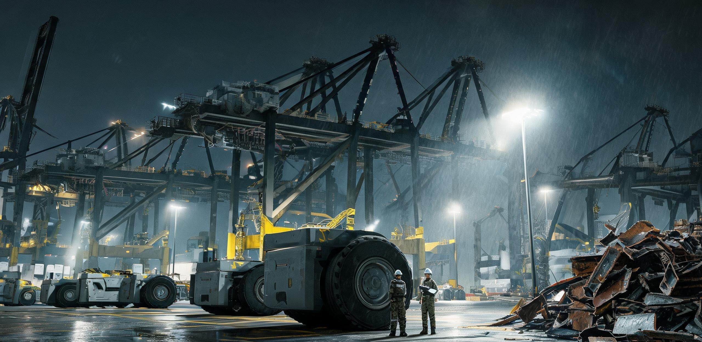

**洋山深水港无人化工程指挥部 · 建设工程质量监督核验处**  
**国家重型装卸机械与智能物流系统质量检验中心（华东分中心）**  

# 洋山深水港四期重载集疏运自动化改造成套机组竣工验收技术鉴定书
### （附：高空人工操作舱物理剥离与劳务分流交接专项核验单）

**文书编号：** 洋港建验〔2031〕第0927号  
**核验日期：** 公元2031年10月24日  
**核验地点：** 洋山深水港四期工程作业区（4号至10号泊位，全长2,350米岸线）  
**建设单位：** 华东港口航运建设集团有限公司 / 洋山港区智能改造工程指挥部  
**总包及系统集成单位：** 振华重型装备制造集团 / 华东工业自动化工程总院  
**边缘算力与调度支持：** 华东第二智能算力调度中心（港区分布式边缘节点）  
**劳动调配与善后监督：** 华东港务管理局劳动关系调配署 / 直辖市临港新片区就业保障局  
**文书密级：** 公开（依《公共工程档案开放条例(2026)》第7条与《重型基础设施技术改造公示办法》）  

---

### 一、 工程概况与改造背景

洋山深水港四期码头自2017年投入初始自动化试运营以来，长期维持“自动化轨道吊+有人/无人混编集卡+高空岸桥人工远程协助”之半封闭过渡架构。2028年四季度，伴随《算力基础设施自主演进与人工干预梯度递减管理办法（试行）》之推行及华东算力调度体系升级，港区正式立项实施“重载集疏运全流程无人闭环与人工操作舱物理剥离工程”（工程代号：YS4-UNMANNED-PH2）。

本工程总投资概算 18.60 亿元，实际决算 18.42 亿元（结余 0.97%，主要系旧有钢构操作舱就地回炉抵扣部分拆解施工费）。工程覆盖 7 个 7 万至 15 万吨级大型集装箱泊位、总面积 223 万平方米之后方堆场及东海大桥重载接驳引桥。工期历时 34 个月（2028年12月至2031年10月），旨在全面消除传统重载装卸作业中对人类驾驶员、高空桥吊手、现场理货员与绑扎工的生理依赖，建立全自主边缘决策与物理防碰撞闭环。

---

### 二、 成套机组关键技术性能核验

验收组现场调取了连续 72 小时综合工况实测遥测数据，并对海侧装卸、水平运输、堆场堆码及辅助作业四类成套装备进行了逐项标定核验：

| 装备类别 | 规格型号 / 部署台套 | 改造核心技术内容 | 设计指标 | 验收实测均值 | 判定 |
| :--- | :--- | :--- | :--- | :--- | :---: |
| **自动化双小车岸桥** | ZPMC-Q4-65T / 26 台 | 剥离海侧高空人工驾驶舱；加装四目固态激光雷达+双目热成像点云对位系统；主小车全自动抓放箱，门架小车自适应接驳。 | 着箱定位误差 ≤±3.0 mm；双小车循环周期 ≤50 s | 定位误差 **±1.4 mm**；循环周期 **46.2 s** | **合格** |
| **重载自主导引集卡 (AGV/AIV)** | AIV-800-Heavy / 130 台 | 拆除人工驾驶室与转向柱；全轮电控液压独立转向；底盘嵌入 68,000 点高精度无源地面磁钉阵列（间距 1.5m）+ 5G-R 边缘微波测距。 | 满载（65t）最大车速 ≥30 km/h；停位精度 ≤±5.0 mm | 满载航速 **32.4 km/h**；停位精度 **±2.1 mm** | **合格** |
| **自动化轨道式龙门吊 (ARMG)** | ARMG-41T-31M / 120 台 | 接入华东第二算力中枢边缘推理节点；贝位三维轮廓自适应重构；全场集装箱重叠偏差自动识别与防倾覆偏载监测。 | 单机台时作业量 ≥30 自然箱/h；落箱偏载识别率 ≥99.99% | 台时作业量 **34.8 自然箱/h**；偏载识别率 **99.999%** | **合格** |
| **集装箱自动锁扣装卸机** | LK-ROBO-V3 / 14 组 | 替代人工解体/固定集装箱旋锁；四轴防爆液压机械臂搭配磁吸快换夹爪，配合视觉定位完成底角件拆装。 | 单箱 4 锁拆装用时 ≤15 s；脱锁失败率 ≤0.01% | 单箱拆装用时 **11.8 s**；脱锁失败率 **0.002%** | **合格** |
| **高压快速自动换电站** | BATT-STATION-MW / 4 座 | 航道侧集卡底盘侧向自动换电；双向液冷储能柜；光伏雨棚直流直充。 | 单车换电耗时 ≤180 s；电池对接力矩公差 ≤1.0 N·m | 换电耗时 **154 s**；力矩公差 **0.4 N·m** | **合格** |

**技术核验结论：** 26 台岸桥、130 台重载 AGV 与 120 台轨道吊之微秒级协同控制链路通畅，边缘调度节点（延迟 2.8ms）完全满足多智能体无冲突路径规划要求，各单机技术性能均达到或优于原设计指标。

---

### 三、 试运行工况与人工干预清零数据对比

工程自2031年07月01日起进入为期 90 天（2,160 小时）的全负荷实船作业试运行阶段。试运行期间累计接卸超大型集装箱班轮 142 艘次，完成集装箱吞吐量 1,421,800 TEU。

以下为试运行各阶段人工介入与作业效能演化数据表：

| 运行周期 | 吞吐量 (TEU) | 平均台时量 (自然箱/h) | 泊位平均在港时间 (h) | 传感器环境误报率 (次/千TEU) | 人工远程接管干预 (次/千TEU) | 安全熔断/急停 (次) |
| :--- | :---: | :---: | :---: | :---: | :---: | :---: |
| **第 01–30 天**（磨合期） | 442,300 | 35.2 | 21.4 | 1.84 | 0.420 | 2（强对流盐雾致盲） |
| **第 31–60 天**（验证期） | 468,100 | 38.6 | 19.1 | 0.31 | 0.018 | 0 |
| **第 61–90 天**（清零测试） | 511,400 | 40.2 | 17.8 | 0.04 | **0.000** | 0 |
| **2027年传统人工基准** | — | 27.5 | 28.2 | — | 1,000.000（全程人工） | 14（含工伤事故） |

```
[人工干预率下降曲线]
2028.12 改建初期 : ■■■■■■■■■■■■■■■■■■■■ 14.200 次/千TEU
2030.06 单机自愈 : ■■■■ 1.150 次/千TEU
2031.07 试运行首月 : ▍ 0.420 次/千TEU
2031.09 竣工核验月 :  0.000 次/千TEU (连续51.14万TEU零物理干预)
```

**核验专员说明：** 在第 61 至 90 天的连续清零测试中，港区历经 9 级阵风 1 次、大雾（能见度 <50 米）2 次、暴雨 3 次，系统依靠多波长激光雷达融合成像与边缘算力节点自主航迹修正，实现了连续 720 小时**零人工接管、零远程操纵介入、零物理安全熔断**，标志着码头重载装卸作业的人工干预已达成工程学清零。

---

### 四、 人工操作界面物理剥离与设施退役清单

依据工程设计方案中“彻底阻断非受控人工干预通道、消除高空与重载盲区物理风险”之原则，核验组对现场全部旧有人工操作硬件的物理拆除与销毁情况进行了现场勘验封签：

| 资产/设施类别 | 原始配置数量 | 处置方式与执行状态 | 经办复核单位 | 现场封签/销毁证明编号 |
| :--- | :---: | :--- | :--- | :--- |
| **岸桥高空司机室** | 26 座（标高 +48.5m） | 气割剥离，整体吊装落地，作为特种废钢移交宝山再生资源基地回炉（共 148.6 吨）。 | 港口机械安监科 | DEST-Q4-CRAB-001~026 |
| **岸桥机上人工爬梯与安全吊篮** | 26 套 | 拆除低区爬梯，改设无人机停机巡检平台与升降式激光自洁导轨。 | 施工安全质监组 | SEC-LADDER-DIS-2031 |
| **堆场远控中心人工操纵台** | 52 席（含双摇杆/踩踏板） | 拆除 48 席，主控芯片打孔报废，控制台外壳移交职业学校用作历史教具；保留 4 席转为“系统状态巡检责任席”（见下文）。 | 资产管理处 / 信息科 | CONSOLE-SCRAP-48-B |
| **有人驾驶集卡座舱总成** | 180 套（旧车改装） | 割除方向盘、制动气阀脚踏、离合器及仪表盘，原座舱空间加装配重铅块与应急高压切断接触器。 | 车辆维保工场 | CABIN-ELIM-180-V |
| **人工解锁岛防砸防护亭** | 28 座 | 拆除地基并平整为全封闭硬化路面，周边加装 2.4 米高物理隔离防侵入光栅网。 | 现场土建施工处 | CIVIL-DEMOLISH-LK28 |

---

### 五、 定员削减与劳务分流交接专项核验

本项改造前，洋山四期装卸储运作业在册一线生产人员共计 1,846 人。改造后，常态在册维保与系统值守编制压缩至 76 人（削减率 95.88%）。

为确保工程落地与社会稳定机制无缝衔接，核验组对照华东港务管理局与直辖市劳动调配署签署的《重型装备自动化置换劳动力跨区转岗调配备忘录》，对分流人员台账进行了全量核实：

```
                    【洋山四期原在册作业人员 1,846 人】
                                    │
         ┌──────────────────────────┼──────────────────────────┐
         │                          │                          │
   【方案 A：市内保底】      【方案 B：跨区转派】      【方案 C：结清自谋】
       642 人 (34.78%)            895 人 (48.48%)            233 人 (12.62%)
         │                          │                          │
   转入直辖市低算力社区      定向输送至西北新能源走廊    一次性结清公立配额
   基础营养配给/温控设施     （玉门/柴达木/风电集群）    与物资凭证（家属双签）
   巡视与互助网格服务岗      从事重机螺栓力矩与镜片维护
                            担任【巡检责任签名员】
```

#### 分流去向与工程资质对接明细表：

| 分流方案 | 人数 | 原工种分布 | 对接安置单位 / 岗位性质 | 技能与工时保护衔接认定 |
| :--- | :---: | :--- | :--- | :--- |
| **方案 A**（市内托底） | 642 | 现场绑扎工 280 人；理货员 142 人；老龄集卡司机 220 人。 | 沪西、沪郊各街道劳动保障所 / “低算力社区基础营养保障与公共温控服务组”。 | 纳入直辖市基础生活物资配额统筹，免除重载物理考核，工时按社区互助服务记入。 |
| **方案 B**（跨区转派） | **895** | 岸桥司机 264 人；集卡司机 360 人；龙门吊司机 168 人；液压机修工 103 人。 | **西北光伏与地热能源走廊建设指挥部**（甘肃玉门第四光热电站、青海冷湖光伏基地、内蒙古达茂风电场）。 | 原《特种重型机械操作证》换发为《重型工业液压与四足机协作安全责任书》；其机械操作经验转用于大风沙环境下四足巡检机光学镜片抛光、结构件力矩螺栓确认及**现场安全责任签名**；工时受《基础热量供给法》第三等级保护。 |
| **方案 C**（自主安置） | 233 | 具有自主兼职意向或家庭赡养需求人员。 | 直辖市临港新片区创业孵化池 / 结清离岗。 | 依自愿原则一次性结清算力积分与粮食代币，档案转入户籍地流动人才库。 |
| **留岗运维**（在编） | **76** | 资深机电技师 48 人；算法与网络调优 12 人；应急责任值守 16 人。 | 洋山四期智能运维中心。 | 转入无人化系统常态预防性维保及法定义务巡检。 |

**劳务交接核验证明：** 895 名转派西北能源走廊之原港口机械操作人员，第一批（320人）已于2031年09月15日完成《高寒风沙作业体能与特种工序》集训并启程赴陇，第二批、第三批调配手续已全部与受援地劳动保障局签署交接。原港区劳动关系已依法解除，全员档案注销与养老、医疗保障转移率达 100%。

---

### 六、 留岗“系统状态巡检责任席”运行章程审定

依据《无人化工业生产安全生产法（2029修正案）》第十九条：“全自主运行重载作业区，必须保留具备实体硬切断能力的法定人类在场责任签名坐席。”

核验组对保留的 4 席“系统状态巡检责任席”（工位编号：YS4-CTRL-DUTY-01 至 04）进行了专项功能审计：

1. **席位权限限定：** 该席位不具备日常吊装、车辆调度、航道分配等任何微观作业控制权；控制台仅保留两项物理功能：
   - 物理急停拍钮（硬线直连港区 110kV 总降压变电站跳闸脱扣器，按下可在 0.4 秒内切断全场 7 个泊位之动力电网）；
   - 《日值守安全巡检日志》物理手写签字板与指纹采集器。
2. **责任人作业要求：**
   - 值守人员须持有《重型机械一级安全管理师》资格；
   - 每班次（8小时）须按规定调阅华东算力中枢边缘节点生成的《装卸自愈日志》《光栅入侵防御报告》，核对无异常后，在纸质卷宗及终端签名框内签署个人真实姓名；
   - 签名人对当班期间系统自主处理记录承担法定确认责任。

---

### 七、 验收结论

经资料审查、现场 72 小时破坏性盲区测试、90 天连续试运行工况评估以及劳务分流档案专项核对，洋山深水港四期重载集疏运自动化改造工程验收组一致认定：

1. 本工程建设符合国家现行港口工程建设标准及自动化改造技术规程，装备性能可靠，自动化闭环成熟，实测人工干预率已稳定达到 **0.000 次/千TEU**，高空人工操作舱已彻底物理剥离；
2. 劳动力结构性优化与人员转岗分流程序合法、去向明确、档案交接完整，与西北能源走廊之对口人力支援机制运转平稳；
3. 工程质量综合评定为 **优良**，准予通过竣工验收，自2031年11月01日零时起正式转入商业无人化常态运营。

---

### 八、 签章与备案栏

**验收组组长：**  
*孙鹤年*（国家重型装卸机械质检中心，教授级高工）—— 【签章】  

**专业核验组专家成员：**  
*钱振宇*（港口机械与起重装备专业组）—— 【签章】  
*陆一鸣*（自动化调度与边缘算法组）—— 【签章】  
*郑宏发*（电气自动化与高压储能组）—— 【签章】  
*宋慧琴*（劳动安全与工业卫生评估组）—— 【签章】  

**建设单位代表：**  
*周建安*（洋山港区智能改造工程指挥部总指挥）—— 【盖章】  

**系统集成方代表：**  
*赵崇光*（振华重型装备制造集团总工程师）—— 【盖章】  

**算力与调度支持确认：**  
*华东第二智能算力调度中心 · 调度工程处* —— 【公章】  

**劳动调配交接确认：**  
*华东港务管理局劳动关系调配署* —— 【公章】  
*甘肃省玉门市重大能源项目人力资源对口接收专班* —— 【公章】  

---

**文书存根：**  
正本存华东港务管理局城建档案馆（档号：YSG-2031-ENG-0927）；  
副本分送直辖市交通委员会、国家发展与改革委员会重工业司、直辖市劳动保障局、甘肃省能源走廊建设指挥部各一份。  

---

## 图片提示词

中文：深夜冷光下，洋山深水港四期全自动化集装箱码头延伸至画外，万吨级双小车岸桥与排队的无驾驶舱重载AGV在硬光源下泛出金属冷灰与工程黄，码头角落堆放着被气割拆除的高空人工驾驶舱废钢外壳，几名戴安全帽的工程师拿着手写板站在巨大轮胎旁作为微小尺度参照，Hasselblad大画幅，工业档案纪实摄影质感。

英文：Ultra-wide cinematic establishing shot of Yangshan Deep-Water Port Phase IV fully automated container terminal at night, extending beyond the frame edges. Colossal automated dual-trolley quay cranes and a fleet of cabless heavy-duty AGVs illuminated by a single harsh, cold industrial floodlight casting sharp shadows, showing weathered metallic cold gray and safety yellow textures. In a corner of the concrete dock, several torch-cut decommissioned steel crane operator cabins lie stacked like scrap metal relics. Two tiny engineers wearing hardhats and holding clipboard inspection files stand beside a massive 2-meter AGV tire as extreme scale reference. Hasselblad medium format, IMAX 70mm cinematography, sharp mechanical greebles, fine rain mist and salt spray texture, unretouched forensic documentary realism, muted industrial color palette.
