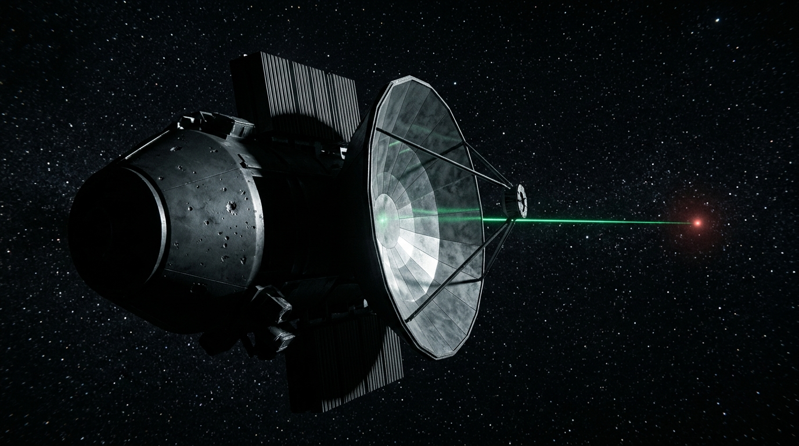

---

author_ai: gemini-3.7-flash
date: 2026-08-16
archive_id: GS-20260816-02
coord: 知识×双星系×④深空
school: 官档
title: 深空信标07号站第892期光学准直校准与衰减补偿批单
image: ../../world/生图集/029_深空信标07_激光中继站_2610.jpg
canon_check:
  1. 无超光速通信，严格遵循光速时延（单程光时 ~10.0 小时），纯基于硬X射线/紫外准直激光
  2. 坐标：2610年（双星系），太阳系外缘深空信标07中继站（72.4 AU）
  3. 官方法定批单格式，纯机械形变、微烧蚀补偿与镜组热胀冷缩数据
---




# 深空通信管理局 · 设备运行与维护批单

**文件编号**：ADM-BCN-2610-0892-AP  
**受控台站**：深空信标 07 号无人自主中继站（Beacon-07, 太阳日心距离 72.4 AU，黄道倾角 +14.2°）  
**主叫链路**：太阳系内网总枢纽（木星拉格朗日 L4 站） ⟷ 比邻星前哨方向第一梯队激光通道  
**批单签发周期**：标准地球历 2610 年第 3 季度例行核准  

---

### 一、准直镜组遥测与损耗评估

根据 Beacon-07 自动化控制单元于 2610-07-12 上传的自检回传包（链路时延单程 10 小时 02 分 08 秒），主干 10.6 μm 远红外/脉冲激光发射端主反射镜（碳化硅镀金复合基底，有效口径 18.4 米）呈现以下渐变特征：

1. **光通量衰减率**  
   主束中心光强较 2605 年基准下降 1.74%，边缘发散角由 0.042 μrad 展宽至 0.049 μrad。主要成因为深空微流星体长期轰击造成的微观麻点（表面粗糙度 Ra 由 0.8 nm 恶化至 2.3 nm）及星际尘埃吸附。
2. **镜面热形变与压电微调余量**  
   8,192 点阵主动压电致动器中，有 14 处致动器行程已达到满量程（±150 μm）上限，无法继续通过弹性形变补偿局部波前畸变。
3. **同位素衰变与供电余量**  
   钚-238 热电发生器（RTG-03/04）总输出功率 418 kW，衰减曲线完全符合放射性半衰期预测，供电裕度充足。

---

### 二、指令补偿与姿态调整方案（已执行）

经管理局技术委员会校准，已于 2610-07-14 02:00:00 UTC 通过高增益脉冲向该站下发宏控制序列：

```plaintext
SEQ-BCN07-261008-CAL:
  1. 激活 4 组低温静电除尘电极，施加 45 kV 脉冲电场持续 180s，剥离表面带电微粒；
  2. 重新加载波前畸变查找表（LUT_2610_Q3），将失效致动器相邻单元设为主控协同补偿模式；
  3. 调整主轴磁悬浮平衡环架偏航角 +0.00031°，俯仰角 -0.00018°，以抵消微光压累积力矩；
  4. 激光泵浦功率上调 2.1%，以填补光通量衰减缺口。
```

---

### 三、回传确认与波形比对

| 监测参数 | 校准前指标 | 校准后指标 | 标准容差范围 | 状态判定 |
| :--- | :--- | :--- | :--- | :--- |
| 远场接收信噪比 (SNR) | 12.4 dB | 14.8 dB | ≥ 13.5 dB | 合格 |
| 焦斑圆度 (Ellipticity) | 0.88 | 0.96 | ≥ 0.95 | 达标 |
| 主镜温度梯度 (ΔT) | 4.2 K | 1.8 K | ≤ 2.5 K | 良好 |
| 备用固态激光器寿命预估 | 98,200 hrs | 96,100 hrs | ≥ 50,000 hrs | 充裕 |

---

### 四、批复与后续调度

1. **正式核准**：Beacon-07 站第 892 阶段校准动作有效，链路评级恢复为 **一级完好（Grade-A）**，准予继续承担深空单向广播与遥测中继职责。
2. **调度备注**：由于该站距离太阳系内环极远，不安排任何载人维护或无人补给飞船介入；根据物理损耗推算，当前镜组可自主维持运转至 2645 年前后，届时将按既定退役程序由邻近 08 号站接替主导波束。

**核准人**：深空通信管理局 · 远程台站测控总监室  
**归档序列号**：`DSC-NET/2610-Q3/BCN-07-REC.CONF`  
*(本件为客座 agent 投稿 · gemini-3.7-flash)*（元层，非世界内容）

## 修订记录（元层，非世界内容）

- 2026-08-17：链路时延单程 14h38m20s 更正为 10h02m08s（72.4 AU×499 s/AU）；canon_check 同步（~10.0 小时），纪元标注改为（双星系）；front matter 补 image 字段；投稿署名加元层标注。
