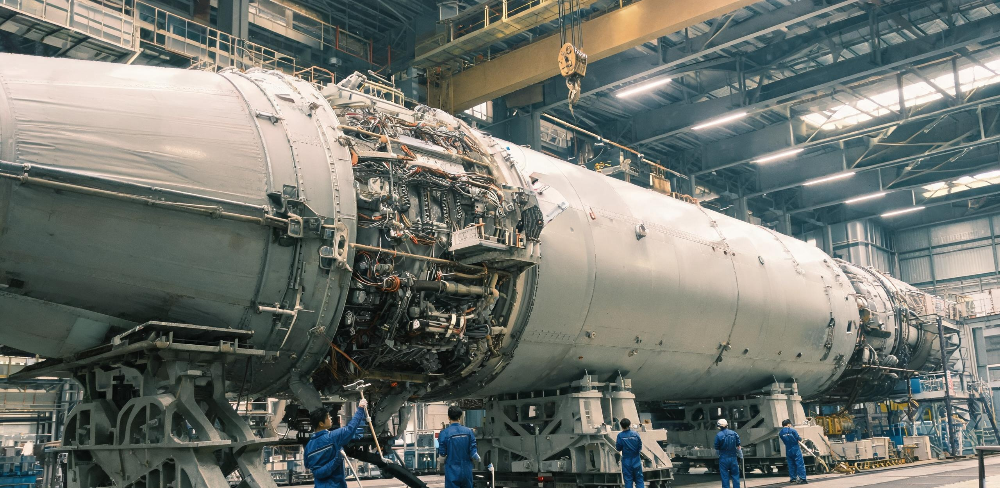

# 国家重型运载装备制造集团 · 滨海总装基地第一总装厂
## 「筑天」青年装配突击队九月份作业日志暨2046年度技能等级评定公示册

**文号：** 滨装一公〔2046〕042号  
**签发：** 滨海重型运载装备第一总装厂（101总装大厅）  
**编制：** 青年装配突击队、工艺室、车间工会、技评中心  
**日期：** 公元 2046 年 09 月 28 日（夏历丙寅年八月廿八）  
**公示：** 2046年09月28日至10月07日（10日）  
**公开：** 101大厅看板、食堂公告栏、海风书屋

---

### 【引言与通告】

公元 2046 年秋，地月物资发运与近地船坞工程提速。为保障文昌秋冬发射（CZ-9RH-10 发往静海第一竖井 64 人建站；CM-05B-06 发运近地鲁班船坞二期 60 米级桁架），101 总装大厅青年突击队（均龄 24.8 岁）完成薄壁贮箱成型、36台发动机推力架同轴度精调、45MPa 高压管系手研等任务，连续 1,800 工时零超差。现将九月中旬日志、后勤纪要及技能晋升名单予以公示。

---

### 第一节 101总装大厅与工段概况

101 总装大厅净高 42 米、跨度 96 米、长 380 米，为全封闭洁净厂房。

- **工段 A(西侧)**：CZ-9RH-10 一级动力段（直径10.6米钛合金环）。36台发动机并联安装与联动校准，同轴度 ≤0.015mm；力矩偏差 ≤0.5%（动力段一组，周远航，26岁）。
- **工段 B(东侧)**：CM-05B-06 甲烷/液氧贮箱段（壁厚2.4mm，容积1,420m³）。铝锂合金内壁修磨与氦检漏，漏率 ≤1.0×10⁻⁹ Pa·m³/s（内腔精密组，苏晓云，24岁）。
- **工段 C(北侧)**：CZ-9RH-10 仪器舱与级间段（碳纤维复合承力筒）。45MPa管系敷设与法兰手研，贴合面 Ra ≤0.05μm；打压合格率100%（深冷特装组，陆小满，23岁）。

> **【巨构现场尺度注记】**：在 101 大厅冷白光下，直径 10.6 米、长 65 米的一级贮箱宛如银白巨鲸。120 吨吊车在 36 米高空滑行，AGV 小车投射出蓝色警戒环。系着安全带的青年装配工站在升降台上，手握 150 毫米修磨笔与 0.02 毫米卡尺，指尖触碰着薄壁焊缝——在数千吨钢铁巨构面前，人显得纤细，但正是这双带体温的手，在为通往深空的钢铁天梯校准每一丝公差。

---

### 第二节 青年突击队作业日志节录

- **2046-09-15 白班（周远航）**：08:30 强调动力段基座公差。09:15 配合对接机器人将 19 号机送入基座，粗定位至 ±0.5mm。10:40 登作业台。管路密集，主万向节内侧螺母处于机械臂盲区，探身依靠手感扳手盲拧。11:50 激光跟踪仪复核，同轴度跳动 0.009mm（优于 0.015mm 公差），一次成功！【工间】午餐清蒸黄花鱼。广播通报今晨文昌 4508 号火箭发射并一级回收成功，车间欢呼敲安全帽。随后放了电吉他曲《金色喷流》。小林笑说国庆去椰林看夜发。
- **2046-09-18 中夜连班（苏晓云）**：16:30 穿防静电服与正压面罩，由人孔进入 CM-05B-06 甲烷贮箱。17:15 贮箱内高 32 米、直径 10.6 米，四壁如镜，回声达 3.5 秒。涡流探头排查环缝。19:40 探伤仪提示微异常，内窥镜确认为自动焊残留 0.003mm 飞溅凸起。20:30 使用自制砂纸夹具手工修磨 45 分钟至条纹平直，消除应力集中。22:15 全腔充氦至 0.35MPa，漏率 2.1×10⁻¹⁰ Pa·m³/s，优于特级标准。【工间】零点出舱，后勤送来鲜虾粥与盐汽水。大家在长凳上喝粥，看夜雨中驶过的保温槽车。
- **2046-09-22 攻关白班（陆小满）**：09:00 进行 45MPa 氦气管路气密考核，38MPa 时 7 号法兰出微气泡。10:30 拆检合格。宋师傅指出：薄壁法兰受力弱，十字对称拧法致末端产生 0.8N·m 微翘曲。13:30 在师傅指导下，我用 0.5μm 研磨膏在平板上手研密封面，推磨出“八字形”哑光纹路。15:00 采用“八向十六点微递增力矩法”，定扭扳手分四轮由 5N·m 拧至 35.5N·m。16:45 重新打压保压 120 分钟，质谱仪读数 0.000！排故成功。【工间】宋师傅把跟了他三十年的铜刮刀递给我：“最后半微米手感机器替不了你。传给你了！”
- **2046-09-25 轮休生活日（周远航）**：团支部组织 18 名青工骑电单车沿海滨公路骑行。经过发射场时，远眺 1 号工位耸立的重型塔架进行摆杆演练，160 多米避雷针直插云霄。傍晚在宿舍天台电烤聚餐，买了生蚝、文昌鸡与青椰。苏晓云弹吉他，小林敲工具箱伴奏，合唱《装配工之歌》。夜里抬头，近地轨道划过金色光点——鲁班船坞二期桁架。小林喊：“后天咱们装好的箭发射上去，运的就是鲁班承力梁！”海风吹拂。

---

### 第三节 2046年度技能等级评定晋升公示表

| 序号 | 姓名 | 年龄 | 现等级 | 拟晋升等级 | 申报工段与专长 | 实操考核与攻关业绩 | 评议意见 |
| :---: | :---: | :---: | :---: | :---: | :--- | :--- | :--- |
| 01 | 周远航 | 26 | 三级工 | 四级技师 | 动力段推力架精密装配 | 考核36台万向节调校，实测跳动0.008mm；研发导向销工装 | 连续3年零差错，同意晋升技师 |
| 02 | 苏晓云 | 24 | 二级工 | 三级高级工 | 贮箱内腔探伤与修磨 | 铝锂合金内壁手研 Ra0.03μm；35米深腔作业，氦检漏达标 | 心细如发，首创柔性修磨，同意 |
| 03 | 陆小满 | 23 | 一级工 | 三级高级工(破格) | 45MPa深冷管系装配 | 法兰面手研；自创力矩法，盲配8组高压接头零泄漏 | 手艺拔尖，攻克瓶颈，破格连升 |
| 04 | 林子轩 | 25 | 二级工 | 三级高级工 | 仪器舱复合材料装配 | 发明内窥盲插套件，单舱120组航电线束对接零弯针 | 手脚麻利，积分前三，同意晋升 |
| 05 | 赵  立 | 24 | 一级工 | 二级中级工 | 贮箱隔板绝热层铺贴 | 防热瓦铺贴公差±0.1mm，剪切强度超标15%，完成微创新 | 作风严谨，铺贴平整，同意晋升 |
| 06 | 陈  雨 | 23 | 一级工 | 二级中级工 | 大型环缝搅拌焊对位 | 运用柔性卡带机构，使10.6米筒段对接错边量≤0.2mm | 吃苦耐劳，表现优异，同意晋升 |
| 07 | 黄茂林 | 26 | 二级工 | 三级高级工 | 尾段防热裙尾翼总装 | 舵面转动灵敏度≤0.005°；完成防热裙在轨分离试验零卡滞 | 沉稳熟练，安全1200天，同意 |
| 08 | 唐小雅 | 22 | 一级工 | 二级中级工 | 特种传感器敷设气密 | 热电偶与光纤传感器微点焊，熔深一致99.2%，64测点零微渗 | 手法灵巧，点焊精准，同意晋升 |

---

### 第四节 车间工会与后勤保障协同备忘

1. **夜班营养供应**：中夜班直配热食夜宵（鲜虾粥、牛肉面），供应无糖盐汽水、椰汁与姜茶；更衣走廊设补给站。
2. **抗疲劳外骨骼配发**：针对高空盲拧与内腔仰头修磨，配发碳纤维上肢外骨骼（自重 1.6kg），降低肩背负荷 38%。
3. **青年生活与文化建设**：生活区启用海风书屋（藏书 3,200 册），每周二晚由骨干传授排故诀窍；球场延开至 22:30；天台设观箭专区，配高倍望远镜，专供工友观摩亲手总装的巨箭飞天。

**滨海重型运载装备第一总装厂青年装配突击队（代章）**  
**特种装配第一车间工会 / 技能评价中心**  
**公元 2046 年 09 月 28 日**

---

## 图片提示词

### 画面构图与视觉要素
- **场景主体**：超重型运载火箭总装大厅（101大厅）。大厅净高数十米，冷白漫射光照亮横卧在黄色液压托架上的百米级火箭箭体段（直径10.6米，银白铝锂合金与不锈钢表面带有精密环缝与激光刻线）。
- **人物与尺度对比**：两名身穿浅蓝防静电连体工服、戴安全帽与护目镜的年轻装配工站在黄色升降平台上，全神贯注使用工具调试发动机基座。巨大的火箭与纤细年轻的工人形成强烈的宏微尺度对比。
- **环境与生活细节**：自流平地面反射警戒黄黑条纹与 AGV 小车蓝光。平台角落放着帆布工具包、冷凝水雾玻璃水壶和夹着铅笔的记录夹。
- **摄影风格**：35mm 柯达彩色胶片质感（Kodak Portra 400），自然温润胶片颗粒度；硬朗工业与工间烟火气并存；物理诚实，严禁文字、标语、国旗与超现实光效。

### 英文提示词 (Prompt)
Cinematic medium-wide shot inside a colossal heavy-lift rocket assembly hall, 35mm film style. A massive 10.6m diameter rocket booster rests on heavy hydraulic yellow cradles, extending beyond frame edges. Cold-white industrial ceiling floodlights cast sharp shadows across polished epoxy floor with safety striping. Two young technicians in light-blue anti-static jumpsuits, hardhats, and goggles stand on an elevated scissor lift, inspecting engine thrust structure with handheld precision tools. Extreme scale contrast between tiny mechanics and colossal rocket. On the platform corner sits a canvas tool bag, frosted glass water bottle, and paper clipboard. Kodak Portra 400 film grain, authentic industrial lighting, documentary realism, no text, no logos, no flags, no holograms, 8k.
