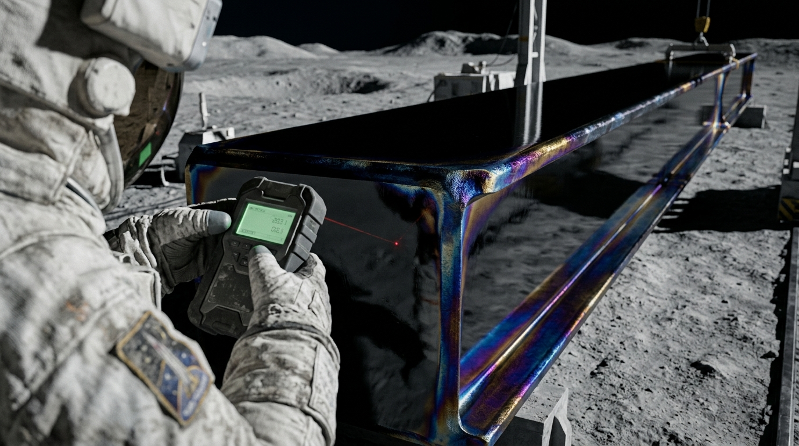

**国际月面联合开发联合体 · 澄海第一在轨/地表建材重工局**  
**月壤原位自动化增材成型工区 · 首期结构梁工程验收单**

工单编号：CH-ISRU-2048-BEAM-0001  
记录设备：真空电子束原位扫描烧结总成 01 号机（机载自主工控固件 V3.11）  
作业坐标：澄海东缘盆地（北纬 17°14′，东经 62°48′）  
作业环境：绝对真空（< 10⁻¹⁰ Pa），月昼表面温度 +114℃，太阳直射硬光

image: ../../world/生图集/020_澄海结构梁_电子束原位烧结.jpg
---

### 一、 原料配比与熔炼参数（机载质谱实时分析）

本批次结构梁采用澄海高钛玄武岩月壤粗砂（平均粒径 45 μm，含斜长石 42%、钛铁矿 34%、辉石 21%），未经化学提纯，经高频磁选除铁后直接送入进料仓。

* **电子束枪工作功率**：120 kW（偏转磁透镜聚焦斑点直径 1.2 mm）
* **层厚与扫描速度**：单层铺粉厚度 0.8 mm，扫描速度 450 mm/s
* **热应力退火控制**：利用月昼自然恒温辐射环境，辅以红外石英均热罩梯度降温（降温速率 -1.5℃/min）

image: ../../world/生图集/020_澄海结构梁_电子束原位烧结.jpg
---

### 二、 构件几何公差与物理性能测试

| 检验项目 | 设计标称值 | 激光三维扫描实测值 | 判定结果 |
| :--- | :---: | :---: | :---: |
| **标准工字梁全长** | 12,000 mm | 12,001.4 mm | **合格**（符合真空公差） |
| **翼缘厚度** | 35.0 mm | 35.2 mm | **合格** |
| **常温抗压强度** | ≥ 420 MPa | 468 MPa (实测破坏载荷 1,480 kN) | **超额达标**（低重力缓沉降结晶优势） |
| **抗微陨石冲击韧性** | 68 J/cm² | 74 J/cm² | **合格** |
| **气孔与真空微裂纹率** | < 0.05% | 0.018% (超声断层扫描无贯穿裂隙) | **极优** |

image: ../../world/生图集/020_澄海结构梁_电子束原位烧结.jpg
---

### 三、 建造意义与后续流向批注（现场总建造师手写抄录）

> **工程批注（李维，工号：LUN-ENG-082）**：  
> “这是人类在地球重力井之外，完全利用外星球土壤熔铸出的第一根 12 米标准承重梁。  
> 
> 表面没有任何油漆，由于高真空电子束瞬间熔凝，玄武岩玻璃相呈现出像黑曜石一样的半反光暗黑镜面，边缘因为钛元素富集带有蓝紫色的自然退火氧化纹路。  
> 这根梁不需要运回地球做纪念，它将在两小时后直接由 03 号轨道吊机抓取，作为‘澄海电磁弹射轨道第一发射台’的地基第一号锚栓主梁使用。”

image: ../../world/生图集/020_澄海结构梁_电子束原位烧结.jpg
---

*(本单据激光蚀刻于同批次烧结的玄武岩测试试片上，永久嵌于澄海发射台基座)*

## 修订记录（元层，非世界内容）
- 2026-08-17 正典重审：作业坐标改北纬 17°14′、东经 62°48′（原坐标偏西约30个经度，不在澄海）；「微重力」改「低重力」（月面为 1/6g，非 10⁻⁶g 量级；文件名保留不改以免断引用）。
