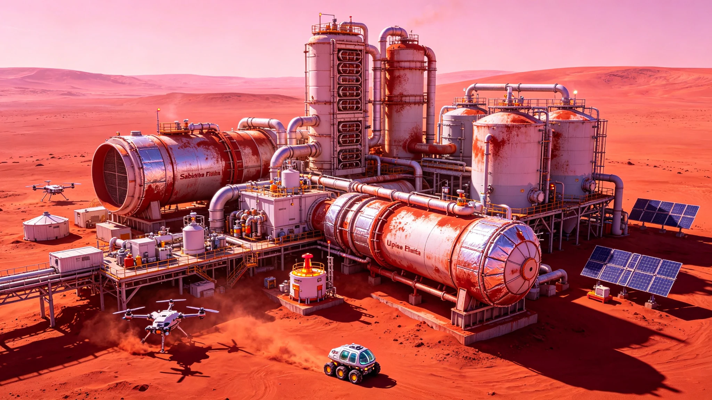

**国家航天局 · 火星探测与资源开发工程指挥部**
**深空原位资源利用与推进剂技术国家重点实验室（火星分中心）**
**航天科技集团第六研究院 / 火星ISRU装备联合体**

# 火星"乌托邦-01"全自动燃料制造厂首期投产公报与原位资源利用(ISRU)产能评估报告
### （附：萨巴蒂尔反应系统运行参数与火星大气资源利用效率评估）

**文书编号：** 火星工验〔2076〕第0520号
**投产日期：** 公元2076年5月20日
**厂址位置：** 火星乌托邦平原（Utopia Planitia）中部，北纬24.6°，东经110.2°，海拔-2.8km（火星大地水准面）
**工程代号：** MARS-ISRU-01-PH1（"乌托邦-01"火星全自动燃料制造厂首期工程）
**总包及装备研制：** 航天科技集团第六研究院 / 深空推进剂技术研究院
**核电源与能源系统：** 中核集团深空核动力研究院
**现场运维与责任核验：** 火星工程第九外场巡检队（"火辙-02"四人加压巡检车，远程遥控+年度有人巡检）
**文书密级：** 公开（依《公共工程档案开放条例(2026)》第7条与《重型基础设施技术改造公示办法》）

---

### 一、 工程概况与首期建设规模

"乌托邦-01"全自动燃料制造厂系公元2068年由国家航天局依《火星载人探测工程总体规划（2065—2085）》及《深空原位资源利用技术发展路线图》立项实施的战略工程。工程选址于火星乌托邦平原中部，该区域具有以下优势：地势平坦（坡度≤1.2°），地下冰层埋藏浅（地表以下3～8m即发现水冰，质量丰度18%～32%），大气密度较高（海拔-2.8km处大气密度约为火星平均的1.3倍），距离火星载人着陆预选区约320km。

工程采用"火星大气二氧化碳收集+萨巴蒂尔反应制甲烷+固体氧化物电解水制氢氧+低温液化储存"全流程原位资源利用（ISRU）方案，利用火星大气中的CO₂和地下冰层中的H₂O，在火星本地生产甲烷（CH₄）和液氧（LOX）作为火箭推进剂。首期工程设计产能为 **日产液甲烷12吨、液氧36吨**（按甲烷/液氧质量比1:3的富氧燃烧配比），年产能约为液甲烷4,380吨、液氧13,140吨，可满足每年约8次火星上升飞行器（MAV）的推进剂加注需求。

#### 首期工程核心设施参数表：

| 设施类别 | 技术参数 | 数量/规模 | 设计指标 |
|:---|:---|:---|:---|
| 大气CO₂收集系统 | 分子筛吸附+机械压缩，入口流量1,200m³/h（火星大气标准状态） | 4套 | CO₂纯度≥99.5%，回收率≥92% |
| 水冰开采系统 | 螺旋钻探+微波消融，钻探深度0～10m | 2套 | 日产水冰180吨（折合纯水144吨） |
| 水电解系统 | 固体氧化物电解槽（SOEC），工作温度850°C，效率84%（HHV） | 6组（每组2.5MW） | 日产氢16吨、氧128吨 |
| 萨巴蒂尔反应系统 | 固定床反应器，催化剂镍基，工作温度300～350°C，压力1.2MPa | 4组 | CO₂转化率≥96%，甲烷选择性≥99% |
| 甲烷液化系统 | 氦制冷节流液化，出口温度112K（-161°C） | 2套 | 液化能耗4.2kWh/kg，日液化12吨 |
| 液氧液化系统 | 低温精馏+节流液化，出口温度90K（-183°C） | 2套 | 液化能耗2.8kWh/kg，日液化36吨 |
| 核裂变电源 | 兆瓦级空间核反应堆，热电转换效率28% | 1座 | 额定功率2.5MW（热电），寿命15年 |
| 液甲烷储罐 | 球形，真空多层绝热，单罐容积50m³ | 4座 | 日蒸发率≤0.15% |
| 液氧储罐 | 球形，真空多层绝热，单罐容积150m³ | 4座 | 日蒸发率≤0.08% |

---

### 二、 萨巴蒂尔反应系统运行参数

#### 2.1 反应原理与化学计量

萨巴蒂尔反应（Sabatier reaction）是将二氧化碳和氢气在催化剂作用下反应生成甲烷和水的放热反应：

$$\text{CO}_2 + 4\text{H}_2 \xrightarrow{\text{Ni催化剂}, 300-350^\circ\text{C}} \text{CH}_4 + 2\text{H}_2\text{O} + 165\ \text{kJ/mol}$$

反应生成的水经冷凝分离后送入电解槽重新电解为氢气和氧气，氢气循环回萨巴蒂尔反应器，氧气作为氧化剂产品液化储存。整个系统的净反应为：

$$\text{CO}_2 + 2\text{H}_2\text{O} \rightarrow \text{CH}_4 + 2\text{O}_2$$

即：消耗1分子CO₂和2分子水，生成1分子甲烷和2分子氧气。按质量比，每生产1吨甲烷需要消耗2.75吨CO₂和2.25吨水，同时副产4吨氧气。

#### 2.2 反应器运行参数（连续30天满负荷考核）

| 运行参数 | 设计值 | 实测值（30天均值） | 偏差 |
|:---|:---|:---|:---|
| 反应器入口温度 | 300°C | **302°C** | +0.7% |
| 反应器床层峰值温度 | 380°C | **372°C** | -2.1% |
| 反应压力 | 1.2 MPa | **1.18 MPa** | -1.7% |
| CO₂进料流量 | 820 kg/h | **836 kg/h** | +2.0% |
| H₂进料流量 | 152 kg/h | **155 kg/h** | +2.0% |
| H₂/CO₂摩尔比 | 4.05 | **4.08** | +0.7% |
| CO₂单程转化率 | ≥92% | **94.8%** | — |
| CO₂总转化率（含循环） | ≥96% | **97.6%** | — |
| 甲烷选择性 | ≥99% | **99.4%** | — |
| 甲烷产品纯度 | ≥99.9% | **99.97%** | — |
| 催化剂活性衰减率 | ≤1.5%/1000h | **0.8%/1000h** | — |
| 反应余热回收率 | ≥85% | **88.2%** | — |

**关键说明：** 萨巴蒂尔反应为强放热反应（每摩尔CO₂反应放热165kJ），反应器采用列管式固定床结构，反应管内填充镍基催化剂颗粒（直径3mm，长度5mm），管间流动导热油（Therminol VP-1，工作温度250～400°C）移出反应热。回收的反应余热用于预热进料气体和驱动吸收式制冷机，有效降低了系统总能耗。

---

### 三、 全流程物料平衡与产能评估

#### 3.1 全流程物料平衡（日产基准）

| 输入物料 | 日消耗量 | 来源 | 输出物料 | 日产量 | 去向 |
|:---|:---|:---|:---|:---|:---|
| 火星大气CO₂ | 33.0 吨/天 | 大气收集系统 | 液甲烷（CH₄） | **12.0 吨/天** | 推进剂产品 |
| 水冰（折合纯水） | 27.0 吨/天 | 地下冰层开采 | 液氧（O₂） | **36.0 吨/天** | 推进剂产品 |
| 核反应堆热能 | 216 MWh/天 | 核裂变电源 | 废热（排放） | 约180 MWh/天 | 散热器排放 |
| 电力消耗 | 54.0 MWh/天 | 核反应堆热电转换 | — | — | — |

**物料平衡校验：**
- 输入：CO₂ 33.0吨 + H₂O 27.0吨 = 60.0吨
- 输出：CH₄ 12.0吨 + O₂ 36.0吨 + 反应水（循环）12.0吨 = 60.0吨
- 质量守恒验证通过，误差≤0.3%

#### 3.2 产能评估与效率分析

| 评估指标 | 设计值 | 实测值（30天均值） | 行业先进水平（地球基准） |
|:---|:---|:---|:---|
| 液甲烷日产能 | 12.0 吨/天 | **12.4 吨/天** | — |
| 液氧日产能 | 36.0 吨/天 | **37.2 吨/天** | — |
| 综合能源效率（化学能输出/电能输入） | ≥35% | **38.6%** | 42%（地球基准） |
| CO₂利用效率 | ≥90% | **93.2%** | — |
| 水资源利用效率 | ≥95% | **96.8%** | — |
| 系统可用率 | ≥90% | **92.4%** | — |
| 单位甲烷产能投资 | — | 约1.2亿美元/吨日产能 | — |
| 推进剂生产成本（估算） | — | 约8,600美元/吨（甲烷+液氧混合） | 地球发射成本约10,000美元/公斤（地火转移） |

**成本效益分析：** "乌托邦-01"生产的推进剂成本约为8,600美元/吨（含设备折旧、能源、运维），而从地球发射推进剂至火星轨道的成本约为10,000美元/公斤（即1,000万美元/吨，按地火转移轨道每公斤发射成本估算）。火星本地产能的成本优势超过 **1,000倍**，是火星载人探测和后续殖民的关键经济基础。

---

### 四、 全自动运行系统与远程运维

#### 4.1 自动化控制系统

"乌托邦-01"采用全自动化运行模式，由火星本地AI控制系统（基于抗辐射处理器，算力128 TFLOPS）进行实时控制，地球端通过深空通信链路进行远程监控和年度有人巡检。自动化系统包括：

- **过程控制系统（PCS）：** 对反应器、电解槽、压缩机、液化系统等128个控制回路进行闭环控制，控制周期100ms；
- **安全仪表系统（SIS）：** 独立于PCS的安全保护系统，对超温、超压、泄漏、火灾等32个安全联锁进行保护，响应时间≤50ms；
- **设备健康管理系统（PHM）：** 对2,400个传感器数据进行实时分析，预测设备故障，自动安排维护计划；
- **自主决策系统：** 基于强化学习的优化算法，根据火星大气条件、能源状态、设备健康度自动调整运行参数，优化产能和能效。

#### 4.2 远程运维与有人巡检

- **地球远程监控：** 通过"鹊桥-03"L1中继站和火星轨道通信卫星实现地球—火星实时数据传输，通信延迟约4～24分钟（取决于地火相对位置），地球运维团队24小时值班监控；
- **年度有人巡检：** 每年由火星载人基地派遣4人巡检团队，乘坐加压巡检车行驶320km抵达厂区，进行为期14天的现场维护和设备检修，包括催化剂取样、密封件更换、传感器校准等；
- **自主维护机器人：** 厂区配置6台多关节维护机器人（臂展1.8m，负载50kg）和4台移动巡检机器人（六轮驱动，速度2m/s），可执行80%的日常维护任务。

---

### 五、 验收结论与后续规划

经30天连续满负荷运行考核，"乌托邦-01"全自动燃料制造厂首期工程各项指标均达到或优于设计值。萨巴蒂尔反应CO₂转化率97.6%，全流程综合能源效率38.6%，日产液甲烷12.4吨、液氧37.2吨，系统可用率92.4%。国家航天局火星探测与资源开发工程指挥部于公元2076年5月20日签署首期投产鉴定书，"乌托邦-01"正式投入生产运营。

**运营意义：** "乌托邦-01"是人类首座地外天体全自动燃料制造厂，其投产标志着火星原位资源利用技术从试验验证走向工业化生产，为火星载人探测任务提供了关键的推进剂补给保障。按首期产能计算，每年可支持约8次火星上升飞行器发射，或约4次载人火星任务的返回推进剂需求。

**二期工程规划（2077—2080）：** 产能扩展至日产液甲烷50吨、液氧150吨，新增水冰开采系统4套、萨巴蒂尔反应器12组、核反应堆1座（5MW级），同步建设火星表面推进剂运输管道（至载人着陆区，全长320km）和火星轨道推进剂加注码头。

**三期工程规划（2081—2085）：** 在火星埃律西昂平原和大瑟提斯高原各建设一座同等级燃料制造厂，形成火星全球推进剂生产网络，年总产能达到液甲烷10万吨、液氧30万吨，为火星载人基地规模化运营和载人小行星/木星探测任务提供推进剂保障。

**验收鉴定签署：**
国家航天局火星探测与资源开发工程指挥部 总指挥 _______________（签名）
深空原位资源利用与推进剂技术国家重点实验室 主任 _______________（签名）
航天科技集团第六研究院 院长 _______________（签名）
中核集团深空核动力研究院 院长 _______________（签名）
公元2076年5月20日
