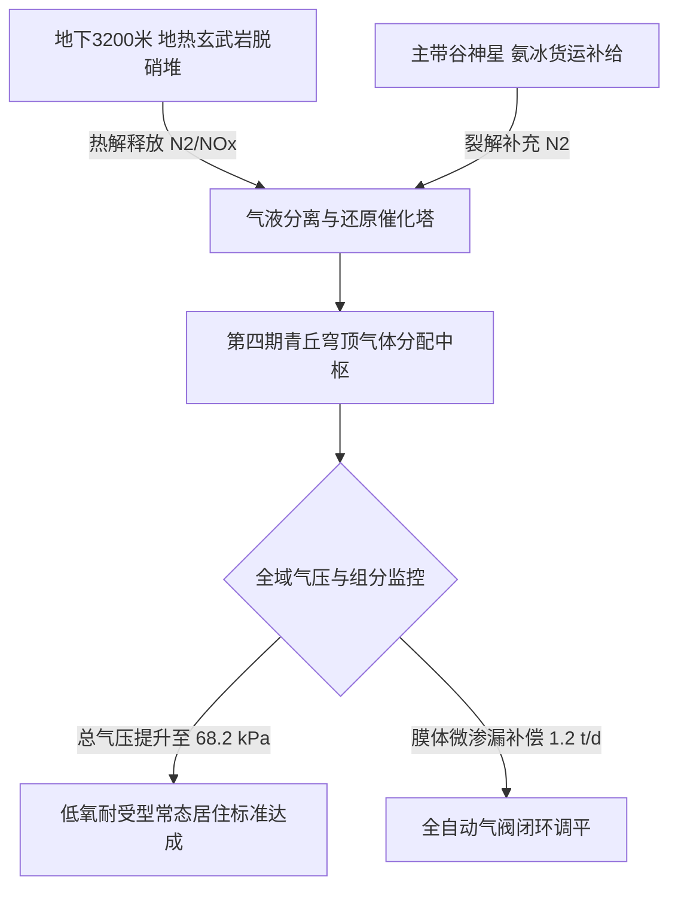

# 火星奥林帕斯穹顶第四期地热气压增补机组并网调试与首季氮气平衡公报

**公报文号**：MARS-OLY-ENG-2375-014  
**发文单位**：火星奥林帕斯山地热与大气工程联合体（OMEA）总工办  
**工程标的**：第四期「青丘」万米承压气膜穹顶地热氮气发生阵列与均压管网  
**核算周期**：火星公历 2374年秋分 — 2375年春分（首个完整调试运行季）  
**受控空间**：奥林帕斯东麓第 4 封闭生态城市带（覆盖面积：$48.5 \\,\\text{km}^2$，内部气容积：$4.2 \\times 10^9 \\,\\text{m}^3$）  

---

## 一、气压增补工程概况与工况参数

为将四期生态穹顶内部静气压由初始施工态（$32.0 \\,\\text{kPa}$）稳步提升至人类无面罩活动许可基线（$68.0 \\,\\text{kPa}$，相当于地球海拔 3,300 米气压），工程机组依托地下 $3,200 \\,\\text{m}$ 超深地热循环井，对富含硝酸盐玄武岩进行高温热解原位脱硝，并结合气相还原反应生成高纯分子氮（$\\text{N}_2$）。

### 1. 核心工况运行指标
- **地热催化发生塔运行温度**：$480^\\circ\\text{C} \\pm 15^\\circ\\text{C}$
- **高纯氮气产率**：$184.5 \\; \\text{t/d}$（标称设计值 $180.0 \\; \\text{t/d}$）
- **并网首季累计注入纯氮**：$16,840 \\; \\text{吨}$
- **穹顶平均静气压实测**：从 $41.2 \\,\\text{kPa}$ 线性爬升至 **$68.4 \\,\\text{kPa}$**（达成一阶段目标）。

---

## 二、首季气体组分与物料平衡结算表

| 气体组分 | 标称目标分压 (kPa) | 实测平均分压 (kPa) | 组分体积分数 | 物料来源渠道 | 纯度与毒理控制 |
|:---|:---:|:---:|:---:|:---|:---:|
| **分子氮 ($\text{N}_2$)** | $51.0$ | **$51.3 \pm 0.4$** | $75.0\%$ | 地热玄武岩热解 (68%) + 主带氨冰进口 (32%) | CO 浓度 $< 1.0 \text{ ppm}$ |
| **分子氧 ($\text{O}_2$)** | $14.5$ | **$14.2 \pm 0.2$** | $20.8\%$ | 水解制氢副产氧 + 农业藻塔光合排放 | 符合低氧适应标准 |
| **二氧化碳 ($\text{CO}_2$)** | $0.8$ | **$0.78 \pm 0.05$** | $1.14\%$ | 人员呼吸代谢 + 农业受控回补 | 维持作物高光合速率 |
| **稀有气体及水汽** | $2.0$ | **$2.12 \pm 0.15$** | $3.06\%$ | 浅层地热脱气回收 | 相对湿度稳定在 $42\%$ |

---

## 三、外膜微渗漏监测与主带冰氨外购结算

1. **超大跨度气膜结构气密性检测**：
   激光差分雷达全域扫描显示，第四期穹顶复合含氟聚合物气膜（总表面积 $72.4 \\,\\text{km}^2$）日均微渗漏量为 **$1.18 \\; \\text{吨/日}$**（渗漏率 $0.0028\\%/\\text{d}$），远优于地联深空工程一级气密标准（$\\le 0.005\\%/\\text{d}$）。
2. **主小行星带战略补货核销**：
   本季度为平衡快速增压亏空，自谷神星矿业商会采购并交割第二批液氨（$\\text{NH}_3$）共计 $5,400 \\; \\text{吨}$，已通过火星高轨动量捕获网全量受电解脱氢。产生之高纯氢气已注入奥林帕斯电网燃料电池，全部账目经火星大宗物资交易所结算平账。

---

**总工程师**：阿列克谢·莫罗佐夫（签字）  
**生态环控总监**：苏晓华（签字）  
**报备机构**：火星定居点自治联合工程委员会
