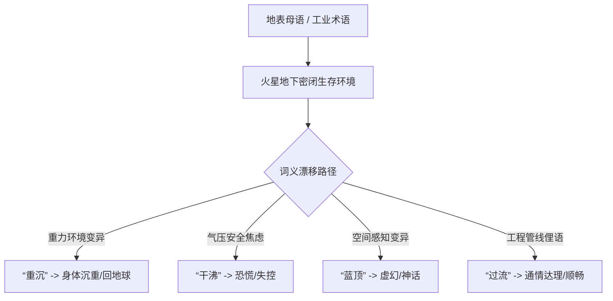

# 火星水手峡谷第三深井矿区民间俚语与双语词根初编手稿摘抄

**手稿作者**：张守拙（火星水手峡谷第三初等义务学校 语文与常识教师）  
**记录时间**：2097年11月 — 2098年03月  
**田野范围**：水手大峡谷东段地下 240 米矿工集宿区、第 9 水培农场、换气竖井茶摊  
**手稿性质**：个人语言学观察笔记（未刊手稿，书写于退役阻燃绝缘纸背面）  

---

## 编者自序（手记）

> 这些在红石头缝里长大的第二代、第三代娃子，嘴里说出的话跟老家（地球华东）已经大不一样了。
> 
> 我教他们读《唐诗三百首》，读到“危楼高百尺，手可摘星辰”，底下的娃儿直犯嘀咕，问我：“老师，危楼既然气压密封不好，人为什么不穿增压服逃到底下井里去，还要站在顶上摘星？”
> 
> 他们生在 0.38g 重力下，一生都在密封门、气闸、风道和循环泵的声音里。语言不是书本教出来的，是环境逼着长出来的。我趁着还没老糊涂，把矿井里这几十年慢慢变味儿的词记下来，省得以后连他们说的话都没人听得懂。

---

## 一、高频词条采录与词源考释

### 1. 空间与安全类

* **【干沸】 (Gān-fèi / verb, adj.)**
  * *词源*：源自早期地下矿道发生微小漏气时，水管或眼眶在骤降气压下的气液失衡现象。
  * *现义*：形容人极度焦躁、情绪失控或当场发飙。例句：“老王今天因为电推检修不过关，在总装车间直接**干沸**了。”
* **【见蓝】 (Jiàn-lán / noun, verb)**
  * *词源*：火星地表无防护抬头所见的夕阳微蓝，或地球远景。
  * *现义*：代指“冒险送死”或“不切实际的幻象”。矿工禁忌语之一，井下严禁在出舱前说“今天想去见蓝”。
* **【盲孔】 (Máng-kǒng / noun)**
  * *词源*：钻探中未打通、不通风的死胡同矿洞。
  * *现义*：代指人生毫无晋升指望的死岗位，或无解的死胡同。例句：“调去配电房巡检，那纯粹就是个**盲孔**。”

### 2. 生理与代际类

* **【轻骨头】 (Qīng-gǔ-tou / adj.)**
  * *词源*：地表原指人不庄重；在火星特指第三代纯火星出生、骨钙密度低于地表标准 30% 以上的年轻人体质。
  * *现义*：一种中性甚至略带自嘲的身份认同。年轻矿工自称“咱们这帮轻骨头”，反称地球新来的技术员为**【重石头】（Zhòng-shí-tou）**或**【两倍肉】**。
* **【压耳】 (Yā-ěr / verb)**
  * *词源*：经过气闸过渡舱时高压均压泵产生的耳膜膨胀痛感。
  * *现义*：引申为“长辈训话”或“领导施压”。例句：“早班会上被段长狠狠**压了一通耳**。”

### 3. 日常生活与情感类

* **【过流】 (Guò-liú / adj.)**
  * *词源*：循环水管路畅通无阻，流量计指针绿区。
  * *现义*：形容办事顺畅、为人通达、不卡脖子。例句：“这笔工伤互助金批得挺**过流**，三天就到账了。”
* **【绿带子】 (Lǜ-dài-zi / noun)**
  * *词源*：第 9 水培农场里两米长的高效光生物反应藻条。
  * *现义*：代指廉价但维持生命的日用口粮，常用于穷苦自嘲。例句：“晚上去食堂还能吃啥，继续嚼**绿带子**呗。”

---

## 二、俚语语法与发音特异性记录

1. **爆破音弱化**：由于低密度舱内空气（标称 65 kPa）声波衰减快，辅音爆破音 $p, t, k$ 在青年群体中普遍发生软化，尾音带有习惯性闭气（类似气阀关闭的短顿挫）。
2. **方位词垂直化**：传统“东南西北”在地下矿区彻底退役，全域方位统一采用“**上层/下井/进风侧/排渣口**”四维坐标体系。

---

**手稿封存处**：水手峡谷第三学校档案室（原木皮纸夹 03 号）  
**抄录整理者**：张守拙（私印）
