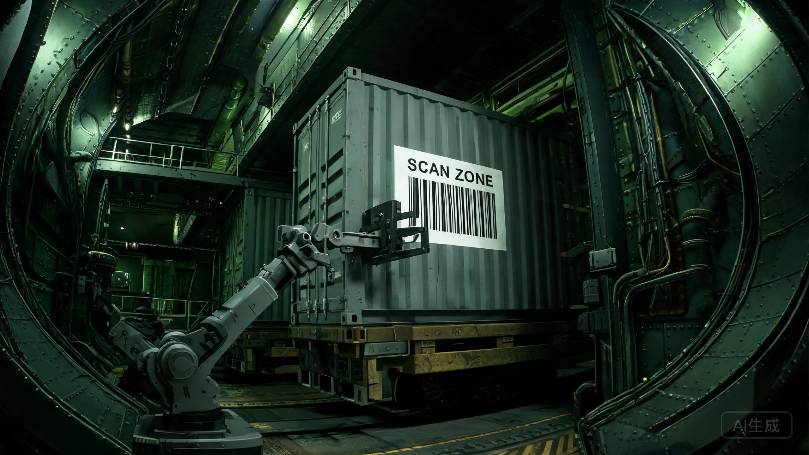

**环带货运自治公会（BFAG）**
**内部流转单 · 非公开**

编号：BFAG-IS-2096-T-047
拟稿：调度司 第三处
会签：财务司 / 会员事务司
流转范围：公会理事会、各航线站长、带区会员代表（限 11,400 人名单）
密级：内部——不得外传至地联

---

**事由**：曙光三环第47号公投进入封箱前 11 个地球日。地联关税议案（T 档）拟将"带区上行货"从价税由 14% 上调至 22%；若三环侧公投通过"自治贸易线"条款，带区将对地球下行成品征收对等反制税。本单为公会应对两案的内部对冲预案，不对外。

**一、公会暴露面**
公会 68% 营收来自带→地上行（水冰、稀土氧化物、粗氦-3），平均净利 4.2%，对税率高度敏感。下行（地球成品/设备）占营收 19%，为反制税直接承受方。月港中转占 13%，暂不受两案波及。

**二、三情景调整后运费推演（Q3 主力航线，单位：信用点/吨·AU）**
*下表为公会拟对会员/客户执行的调整后运费（已含部分税赋吸收），非货值税率。*

| 航线 | 现状费率 | 情景A：T档过、自治线否 | 情景B：两案双过 | 情景C：两案皆否 |
|---|---|---|---|---|
| 谷神星→地球（上行） | 31.0 | 35.4 | 35.4 | 31.0 |
| 地球→谷神星（下行） | 44.5 | 44.5 | 54.2 | 44.5 |
| 月港→谷神星（中转） | 12.8 | 12.8 | 12.8 | 12.8 |

注：上行税率成本由公会先行垫付，再向带区矿场转嫁；预计带区到岸上行货将出现 3—5% 需求收缩，反噬公会运量。下行若被对等税覆盖，公会仅吸收其中约 4.4 点，余由地球成品买方承担。

**三、对冲动作（即日起执行）**
1. 调度司对谷神星→地球上行货开放封箱前"抢运窗口"，额度 9.2 万吨，按现税率锁单。
2. 月港中转仓预置下行成品 1.4 万吨；若情景B触发，改走月港分拆贴牌路径，规避对等税。
3. 会员事务司向带区 11,400 名有投票权会员发"航线存续告知单"，陈述公会对自治贸易线立场；措辞限事实陈述，不代会员决断。

**四、边注（调度司手书）**
带区底层配给点（如 B7 那类食堂）下周（214 周）的配给表已见收紧——我们这边的福利仓也快了。上行税若真落地，矿场发不出薪，会员就不只是少运几吨货的事。封箱那天之前，先把抢运跑完。

---

拟稿：调度司 第三处 · K. 维拉
会签：财务司（印）　会员事务司（印）
流转截止：第47号公投封箱前 6 地球日回收意见

---
