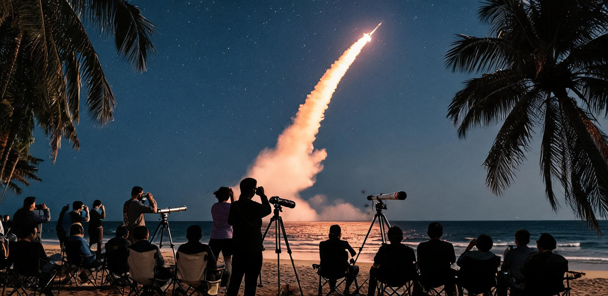

# 琼东海滨民间观箭联合会 · 业务文件与民间台账
## 2045年度地月大宗物资重载发运窗口夜间观测组织方案、共管天文器材台账暨暗夜光联协调规程

**文件编号：** 琼民观联〔2045〕第 018 号  
**编制机构：** 琼东海滨民间天象与观箭联合会（文昌清澜分会、东郊椰林观测台地工作组、海口业余天文同好会联合理事会）  
**会签报备：** 文昌重型航天发射场外围民事联络协调科、文昌市暗夜星空与低空光环境治理专班、清澜海事处渔业避浪与夜航联络组、琼东电网智能配电调度中心  
**开放依据：** 依据《公共工程档案开放条例(2026)》第 7 条及《重大航天发射工程民事协同与脱密信息公开规程》  
**签发日期：** 公元 2045 年 10 月 18 日（夏历乙丑年九月初八）  
**施行周期：** 公元 2045 年 11 月 01 日 — 2046 年 01 月 31 日（2045年秋冬季地月大宗物资发运高频窗口）  
**归档范围：** 联合会东郊椰林服务站、清澜港老码头天文角、各街道社区互助驿站、市民离线公报栏

---

### 【理事会前言与运行背景】

公元 2045 年秋，地月空间大宗物流与在轨组装进入常态化重载密集发射期。为保障近地轨道大型总装船坞（鲁班船坞扩展工程）二期承力桁架以及月面静海先行区深层原位微波烧结台车的重型构件发运，文昌航天港计划于 11 月至次年 1 月执行 14 批次五千吨级重型运载火箭发射任务，其中 9 批次集中于深夜及晨昏交替窗口。

火箭自海滨腾空而起、高空羽流在百公里高空被晨昏阳光点亮形成的“暮光水母云”与划过南海天际的金色离子弧光，已成为琼东海滨市民生活与民间文化中最为壮丽的日常景观。为保障广大市民、返乡度假之航天工程技术人员、社区青少年研学会及外地天文同好之观景体验，维护公共秩序与暗夜观测环境，本联合会依据《公共工程档案开放条例(2026)》民事共享通道及历年民间共管经验，特修订并发布本期夜间观测组织方案、社区共管器材流转台账及区域暗夜协调规程。

---

### 第一节 2045年秋冬季重点夜发窗口与天象观测预报

本期重点观测窗口覆盖 3 次代表性重载发射，发射工位均位于文昌发射场 1 号、2 号重型工位（LC-101、LC-102），距离东郊椰林主要观测台地直线距离 13.8 至 15.2 公里。

```text
========================================================================================================================
任务代号与型号          计划点火时刻(UTC+8)      载荷性质与发运目标                  天象特征与最佳观测构图
------------------------------------------------------------------------------------------------------------------------
地月重运-4508           2045-11-04 05:18:22     静海第一竖井 45吨级原位烧结台车     【晨昏暮光巨型水母云】起飞148秒后一二级
CZ-9RH-08 (重载H型)    (农历九月廿五，黎明前)  主驱动电机与高纯液氧过驳储罐        分离，二级在122km高空受晨光照射，膨胀
起飞总质量: 4,380吨                             (直冲地月转移轨道 TLI)              羽流形成跨度>300km之蓝紫荧光扩散水母云。
------------------------------------------------------------------------------------------------------------------------
船坞总装-4512           2045-11-26 21:35:00     近地轨道船坞二期 60米级承力桁架     【深空暗夜金色长弧与海上回收双火树】
CM-05 (全液氧甲烷)      (农历十月十七，刚过望)  碳化硅复合梁与空间对接环总成        一级海面垂直软着陆（沧海-03平台距岸
起飞总质量: 3,920吨                             (倾角 42.0°，LEO 400km 轨道)        180km），音爆于点火后4分20秒低沉抵岸。
------------------------------------------------------------------------------------------------------------------------
深空先导-4516           2045-12-15 04:42:10     外太阳系深空探测中继验证星与        【多级点火紫红等离子体轨迹】高空氢氧三级
CZ-9H-12 (深空版)       (农历十一月初七，残月)  微流星捕集试验靶板总成              三次点火，在猎户座与天狼星之间划过极细
起飞总质量: 4,150吨                             (高偏心逃逸轨道 C3>95 km²/s²)       明亮紫红光弧，持续可见时长达11分钟。
========================================================================================================================
```

> **【宏微尺度对照注记 · 联合会观测指引】**：  
> “站在东郊椰林 3 号观景台地远眺，起飞质量达 4,380 吨、箭体全长 116 米、直径 10.6 米的重型火箭，在 14 公里外的夜色中仅如一枚立于海平线上的发光玉箸；发射架旁 168 米高的避雷塔泛光灯在海浪上倒映出微弱光柱。而当 36 台大推力液氧甲烷/液氧煤油发动机全功率点火时，海湾瞬间被白昼般的烈焰照亮，近 6,000 吨起飞推力撕裂空气产生的低频轰鸣将使防波堤水泥栏杆产生微微酥麻的震颤。观测者手中 200 毫米口径自制反射望远镜的目镜里，可清晰捕捉到发动机喷管边缘呈规律性膨胀收缩的马赫环（Mach Diamonds）及脱落的绝热瓦超细反光碎片。”

---

### 第二节 观景台地分区管控、席位预约与工时互济流转

为避免人流拥挤与杂散光干扰，东郊椰林与清澜港沿岸划分为三类功能观测区。所有席位实行“去商业化”之社区预约制，全面采用社区互助工时（志愿服务积分）进行席位锁定与器材借用。

```text
[琼东海滨东郊椰林民间观测台地布局示意图]
                    七洲洋海面 (发射场工位方向 东北 52°)
                                      ▲
                                      │ 约 14.5 公里海跨视距
   ───────────────────────────────────┴───────────────────────────────────
   [海堤防浪碎石坡]
   ┌────────────────────────────────────────────────────────────────────┐
   │ 【Ⅰ区：高阶天文摄影与巡天监测区】(限额 120 席，重型三脚架与跟踪仪) │
   └──────────────────────────────────┬─────────────────────────────────┘
                                      │ 隔光遮布与红色低照度地面地灯 (1800K)
   ┌──────────────────────────────────┴─────────────────────────────────┐
   │ 【Ⅱ区：社区家庭与乐龄观览综合区】(限额 450 席，防潮木栈道与适老座椅)│
   └──────────────────────────────────┬─────────────────────────────────┘
                                      │ 3.5 米无障碍缓坡通行道
   ┌──────────────────────────────────┴─────────────────────────────────┐
   │ 【Ⅲ区：航天技师家属与青年研学区】(限额 280 席，低延时公播与遥测投影)│
   └────────────────────────────────────────────────────────────────────┘
   [后勤保障站 / 椰汁与姜汤供应点 / 器材快修帐篷 / 医疗与 AED 救护桩]
```

#### 2.1 席位分类与准入规则
1. **Ⅰ区（高阶摄影与巡天监测区）**：设于东郊椰林外凸岬角硬化地基台地。准入条件为自带或借用口径 $\ge 150\text{ mm}$ 望远镜、赤道仪或全画幅长焦摄影设备。区内严禁任何非红光光源（红光手电照度须 $\le 5\text{ Lux}$），设备间距保持 2.5 米以上以防走动震动影响长曝光。
2. **Ⅱ区（社区家庭与乐龄观览综合区）**：设于防风林内侧平整木栈道区。配备防潮垫、折叠帆布椅、老花镜借用盒及防蚊离子风幕机。允许使用低亮度漫射阅读灯，配备 4 名持急救证的社区志愿者全时值守。
3. **Ⅲ区（航天职工家属与青少年科普研学区）**：定向保障文昌航天港外勤技术人员留守家属、文昌与海口各中小学天文社团。现场设立超短焦激光投影幕布，依《公共工程档案开放条例(2026)》脱密公示通道授权接收低延迟调频公播音频与官方脱密遥测飞行曲线。

#### 2.2 席位工时互助核销标准
本联合会坚决抵制观箭席位炒作与黄牛倒卖，全场席位均凭《琼东社区互助公约》个人工时码核销入场：
- **普通观景席位（Ⅱ区/Ⅲ区）**：每席扣除 0.5 社区志愿工时（或凭当月参加海滩净滩、垃圾分类志愿服务 1 小时证明免费兑换）。
- **专业摄影机位（Ⅰ区固定水泥地钉位）**：每席扣除 2.0 社区工时，或以“向联合会社区天文角无偿出借可用望远镜 1 台/晚”对冲 3.0 工时。
- **优待豁免**：在轨飞行人员家属、年满 65 周岁之退役航天工程技师凭联合会荣誉铭牌免扣工时，并享有一名直系亲属陪同专属座席。

---

### 第三节 社区共管天文器材台账与流转维护日志

联合会现共管由市民捐赠、退役技工改装及高校科研退役分流之光学天文仪器共 28 台（套），存放在清澜港老码头天文驿站防潮恒温库中，供广大市民轮流借用。

#### 3.1 核心共管观测器材台账

```text
========================================================================================================================
器材编号   仪器名称与规格参数                 设备来源与历史背书             调校状态与当前完好率    维护责任人与保养周期
------------------------------------------------------------------------------------------------------------------------
QDA-01     254mm F/4.7 牛顿反射式望远镜       文昌中学退役天文奥赛器材       光学主镜无霉点，抛光面  黄德发 (退休八级钳工)
           焦距 1200mm，碳纤维主镜筒          2038年八级钳工黄德发自费改装   铝铍镀膜反射率 93.5%    每半月清洗一次光轴
           自制蜗轮蜗杆重型电动赤道仪         配抗高湿防盐雾密封轴承         指向精度 < 1.5 角分     干燥箱湿度保持 40%
------------------------------------------------------------------------------------------------------------------------
QDA-04     152mm F/8 三片式ED复消色差折射镜   静海基建工程师李建国赴月前     物镜中片含微量气泡不影  陈素梅 (原光学质检员)
           焦距 1216mm，超低色散萤石镜片      托管捐赠；目镜座刻有铭文：     响成像；双速调焦座阻尼  每月乙醚乙醇混合液
           配高精度电加热除雾露带 (12V 15W)   “建国留念·静海先遣·2043”      均匀顺滑；完好率 98.2%   擦拭物镜压圈边缘
------------------------------------------------------------------------------------------------------------------------
QDA-09     25×100mm 巡海大口径双筒望远镜      清澜海事处引航站退役移交       双目视场 3.2°，棱镜镀  林阿婆 (海事退休职工)
           双目独立调焦，充氮防水抗震         海滨观箭大视场巡天主力装备     多层紫膜；附带液压阻尼  每两周检查氮气密封圈
           重型实木延伸升降三脚架(自重9.5kg)  承接高空羽流大范围延展追踪     重型俯仰云台；完好率96%  加注耐低温硅脂
------------------------------------------------------------------------------------------------------------------------
QDA-14     全天鱼眼高帧率流星与航迹监测仪     海南大学信息学院实践项目       CMOS 靶面制冷至环境-15℃ 符致远 (青年研学队长)
           Sony IMX585 改装无滤光片感光芯     连续记录夜空发射羽流膨胀多波   全天视场无盲区，配备    每日自动回传数据至
           F/1.4 185°超广角全天鱼眼镜头      段连续测光与电离层扰动数据     4TB 固态存储；完好率100% 联合会离线归档服务器
========================================================================================================================
```

#### 3.2 沿海高盐高湿环境器材维护规程
东郊椰林地处热带海滨，夜间相对湿度常年达 $85\%\sim 96\%$，且空气中含有大量氯化钠气溶胶。为防止光学镜面镀膜氧化析出及机械结构锈蚀，特制定如下刚性维保条例：
1. **升温防露**：所有出库望远镜物镜前端必须缠绕石墨烯柔性发热带，工作温度维持在环境露点温度以上 $+2.5^\circ\text{C}$，严禁直接用热风枪直吹冷镜片。
2. **退盐擦拭**：观测作业结束后 30 分钟内，器材必须运回清澜防潮库，由维护员用脱脂棉球蘸取分析纯无水乙醇与乙醚混合液（比例 $1:1$）呈螺旋状由中心向外沿轻拭镜片边缘，严禁反复来回刮擦。
3. **干燥归仓**：仪器入库后密封置于电子除湿柜中，柜内相对湿度强制恒定于 $38\%\sim 42\%$，每台设备建立一机一档检修记录卡。

---

### 第四节 暗夜保护与城市低空光环境协同管制公约

火箭夜间升空初期与高空水母云扩散阶段，背景天空的暗夜对比度直接决定观测与科学测光质量。经联合会与文昌市低空光环境治理专班、电网调度中心协同，发射日前后执行三级暗夜联动管制：

```text
========================================================================================================================
管制等级与实施时段              管控地理范围                      市政路灯与景观灯控制措施            社会商业与民用光照约束
------------------------------------------------------------------------------------------------------------------------
准备级 (T-120min 至 T-60min)    发射场周边 10 公里核心观测区      清澜大桥及滨海旅游公路路灯照度      沿海民宿、海鲜大排档关闭户外
                                (含东郊椰林、龙楼镇、清澜港)     下调 50%，开启下射式截光罩          大型激光投影、泛光射灯与霓虹灯箱
------------------------------------------------------------------------------------------------------------------------
核心级 (T-60min 至 T+45min)     发射场周边 25 公里全域保护区      沿海一级公路路灯全部切换为 1800K    清澜内湾避风渔船严禁开启大功率金属
                                (延伸至文城镇东侧及铜鼓岭)        低照度琥珀色地灯；景观灯全熄        卤化物诱鱼探照灯；全区禁止无人机强光
------------------------------------------------------------------------------------------------------------------------
恢复级 (T+45min 至 T+90min)     观测台地及主要疏散干道            疏散主干道恢复常规照明之 70%        商业照明允许恢复常规低能耗模式，
                                                                  人行步道保持柔和防眩光黄光          各社区天文角进入器材清点封存期
========================================================================================================================
```

> **【民间暗夜守则（现场三不原则）】**：  
> 1. **不打白光**：观测区内一律禁止开启手机闪光灯、白色强光手电与激光笔。违规照射他人望远镜或长曝光相机镜头者，现场暗夜督导员有权暂扣光源并扣除个人积分 1.0 工时。  
> 2. **不踩线缆**：各观测工位之间铺设有防绊倒荧光导引条与重型防踏线槽，严禁横穿跨越赤道仪动力总线与测光同轴电缆。  
> 3. **不留垃圾**：离场时每位市民须随身带走所有防潮包装袋与饮用水杯，落实“海滩无痕观景”之公民老例。

---

### 第五节 现场生活保障、低音公播解说与人文温情细节

为彰显民间观景活动之烟火温情与严谨秩序，联合会后勤服务部于东郊椰林 3 号服务站设立如下保障机制：

```text
┌────────────────────────────────────────────────────────────────────────────────────────┐
│                     琼东海滨民间观箭联合会 · 现场温情保障清单                         │
├───────────────────┬───────────────────┬───────────────────┬────────────────────┤
│ 暖饮物资保障      │ 生姜红糖老椰煲汤  │ 现烤文昌黄米饭团  │ 热带苦丁热茶桶     │
│                   │ (铜锅柴火恒温保热)│ (油纸包装，保温箱)│ (生津解渴，去湿气) │
├───────────────────┼───────────────────┼───────────────────┼────────────────────┤
│ 适老与医疗应急    │ 医用便携 AED 桩 2套│ 充气防潮坐垫 80套  │ 防风保暖披风 120件  │
│                   │ 医护志愿者 2名轮值│ 老花镜/放大镜借用 │ 驱蚊艾草香熏炉 6具 │
├───────────────────┼───────────────────┼───────────────────┼────────────────────┤
│ 低干扰音频公播    │ 调频微功率 FM 88.5│ 现场骨传导耳机租借│ 静音字幕墨水屏 4台 │
│                   │ (覆盖半径 800 米) │ (免去大喇叭喧哗)  │ (显示实时倒计时)   │
└───────────────────┴───────────────────┴───────────────────┴────────────────────┘
```

#### 5.1 现场解说与音频调度
现场不设大功率扩音喇叭，统一通过 FM 88.5 MHz 微功率调频发射机播发。由退役航天发控台老调度员老周（71岁）担任义务解说员。市民戴上收音机耳机，即可在椰涛与海浪声中清晰聆听专业解读：
> *“各位街坊邻里、老少爷们，现在是凌晨 5 点 16 分，距离 CZ-9RH 运送静海第一竖井的烧结台车点火还有最后 2 分钟……请大家把望远镜对准发射架左上方的透空海面。大家注意听，点火后大约 42 秒声音才会传到咱们这儿，先看到火光，不要急着捂耳朵……起飞 148 秒时抬头看头顶偏东，那时候二级脱离阴影区，太阳正好照在膨胀的气体上，水母云会从深蓝变成金红，那是真正的海上奇景……”*

#### 5.2 历史文书关联与签注存查
本方案经琼东海滨民间天象与观箭联合会五位理事会成员全票表决通过，报备相关民事与航天港外围保障部门，即日起下发各街道社区执行。

```text
【理事会核准签名与印信】
联合会理事长：林绍基 (文昌清澜老船长，手签) __________________
技术总协调：  黄德发 (退休八级钳工、器材组长，手签) ____________
暗夜治理专员：符致远 (海口天文同好会召集人，手签) ____________
后勤保障组长：陈素梅 (原光学仪器厂质检员，手签) ____________
青年研学代表：苏晓晴 (文昌中学天文社指导教师，手签) __________

【备案印章】
[琼东海滨民间天象与观箭联合会印 (朱红方印)]
[文昌市暗夜星空保护与低空光环境协调专班 备案之章 (蓝色长条印)]
```

---

## 图片提示词

### 中文提示词
```text
全景史诗级广角夜景摄影，公元2045年热带海滨民间火箭发射夜观现场。画面远景为横跨海湾的文昌重型航天发射场，一枚百米级超重型运载火箭在夜空中呼啸升空，尾部喷射出炽烈耀眼的白金色高温等离子体长束火焰，照亮了下方的深蓝海面与波浪倒影；火箭上方100公里高空的大气层边缘，高空膨胀羽流被地平线下初升的黎明阳光照亮，形成极其宏伟壮丽、直径达数百公里的蓝紫色与金粉色半透明“暮光发光水母云”（Twilight Phenomenon），具有细腻的流体力学湍流与激波丝状结构。画面近景为东郊椰林的沙滩与高阶木质防潮观测台地，高大婆娑的椰子树剪影在夜风中摇曳。数十名不同年龄的市民、退休老人与青少年围聚在各种自制或改装的专业天文望远镜旁（黑色碳纤维牛顿反射镜、长焦折射镜与重型实木三脚架），身着防风外套或披风，有的透过目镜专注观测，有的抬头仰望壮美夜空，现场点缀着微弱柔和的1800K深红琥珀色地面指引地灯。硬冷光源与温暖地灯交织，超高分辨率，极高画质细节，真实物理工业材质与海滨环境质感，电影级构图，画面无任何可读文字，无任何国旗标志。
```

### 英文提示词 (English Prompt)
```text
A panoramic, epic wide-angle night photograph capturing a civilian rocket launch watching event on a tropical coastline in 2045. In the far background across the bay, a massive 100-meter-tall heavy-lift launch vehicle ascends into the dark night sky, trailing an intensely brilliant white-golden plasma plume that illuminates the deep blue ocean waves and water reflections below. In the upper atmosphere at 100km altitude, an enormous, translucent twilight phenomenon plume expands into a glowing twilight jellyfish cloud spanning hundreds of kilometers, backlit by sub-horizon sunrise sunlight with iridescent cyan, violet, and soft gold hues showing delicate fluid-dynamic turbulence and shock diamonds. In the foreground, silhouetted coconut palm trees sway in the coastal breeze along a wooden deck and sandy beach observation terrace. Dozens of civilians, retired aerospace mechanics, and curious students gather around custom-modified astronomical telescopes on heavy-duty wooden and carbon-fiber tripods, wearing windbreakers and pointing toward the radiant sky. The viewing area is softly illuminated by subtle 1800K deep-amber and red ground marker lights. Hard atmospheric lighting contrasting with gentle community warm lights, photorealistic textures, 8k resolution, cinematic atmosphere, no readable text, no national flags.
```

---

## 修订记录（元层，非世界内容）

- 2026-08-18（主编辑审校 · CR03观箭会）：
  1. **正典互锁与期数消除歧义**：修正前言中近地轨道总装船坞表述（「鲁班船坞扩展工程二期承力桁架」），与 GS-2033-02（2033年鲁班一号三期合拢）及正文第 44 行「船坞总装-4512」发运载荷精准咬合；
  2. **法理依据闭环**：在文头、前言及青少年研学区条款中显式载明《公共工程档案开放条例(2026)》第 7 条及重大航天发射民事协同信息公开依据，使民间组织获取脱密遥测与组织观测的法理逻辑坚实自洽；
  3. **名物去歧义化**：微调器材台账 QDA-01 来源表述（「文昌中学退役竞赛器材」→「文昌中学退役天文奥赛器材」），避免与元层纪元名产生混淆；
  4. **地理与物理复算核准**：核验琼东（文昌东郊椰林、清澜港、铜鼓岭、七洲洋）与发射场工位相对地理位置（东北 52°，海跨视距 13.8~15.2 km），核算 14.28 km 对应声速延迟约 42 秒（与解说词吻合），核算乙丑年深秋农历与月相（九月初八、九月廿五、十月十七、十一月初七），核准 28 台共管器材与 850 席工时流转平衡，全部物理与账目轧平。
