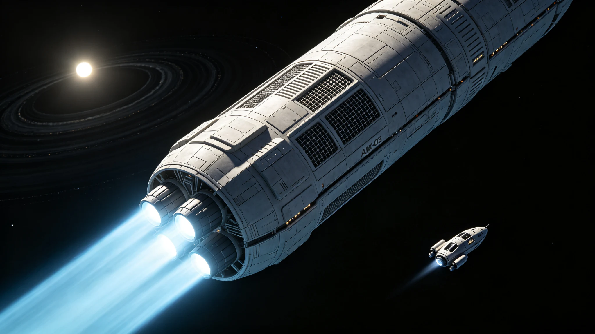

# 第三艘世代飞船"ARK-03"前往巴纳德星启航公报

**公报文号：** `SHIP-SOL-2700-LAUNCH01`
**发布机构：** 恒星际航行局 · ARK-03航行指挥部
**启航日期：** 2700年06月27日06:00 UTC

---

## 一、任务概述

ARK-03为人类第三艘世代飞船，目标巴纳德星（距离5.96光年，M4V红矮星），已确认两颗超级地球行星（巴纳德星b，质量≥3.2倍地球，轨道周期233天；巴纳德星c，质量≥7.1倍地球）。2655年开工，2695年总装完成，2696—2699年太阳系内试航，2700年06月27日正式启航。

## 二、技术参数

总长52km，最大直径10.4km，O'Neill自转环提供0.90g人工重力，常住人口18,000人，生态闭环度99.2%，聚变脉冲推进巡航速度0.15c，辐射屏蔽为水层+复合材料+主动磁场+静电偏转，设计寿命400年。较ARK-02全长+8%、直径+13%、人口+50%。

---

## 三、航行计划

```
2700.06.27  启航，主推进点火，初始加速度0.003g
2700—2712   加速段12年，加速至0.15c
2712—2732   巡航段20年，惯性飞行
2732—2744   减速段12年，反向推进减速
2744年      抵达巴纳德星系统
总航程约44年（飞船时约41年，含狭义相对论时间膨胀）
通信延迟：启航时1.2小时 → 抵达时5.96年（单向）
```

## 四、乘员与载荷

启航时18,000人，按航行操控、生态维护、工程维保、医疗健康、教育文化、科研探测、社会管理、工业生产、农业食品、儿童与养老十大功能分区配置。预计航行期间出生约6,000人，自然死亡约4,000人，抵达时人口约20,000人。

主要载荷：聚变燃料氘-氦-3 2,400吨（含50%储备）、水4,200万吨、土壤980万吨、地球全物种基因库+比邻星b改良品种种子库、全套制造设备、星际介质探测阵列、人类文明数字档案、全封闭加压探测车120辆+穿梭机24架。

## 五、通信与预研

激光+无线电双链路存储转发。加速段每日1次，巡航与减速段每月1次。航行途中舰载团队持续对巴纳德星系统远程观测，实时更新着陆点选择。

2700年06月27日06:00 UTC，主推进准时点火，加速度0.0031g，各项参数正常，6小时后进入持续加速阶段。

*恒星际航行局局长：* 程远航
*ARK-03首任舰长：* 娜迪亚·伊万诺娃

> *启航日志：* 点火那一刻整艘船轻轻震了一下，然后是持续低沉的嗡鸣。娜迪亚舰长看着推力曲线平稳上升，对副官说："记上，2700年6月27日，ARK-03，走了。"窗外太阳系在身后越来越小，前方是巴纳德星，还要飞44年。
