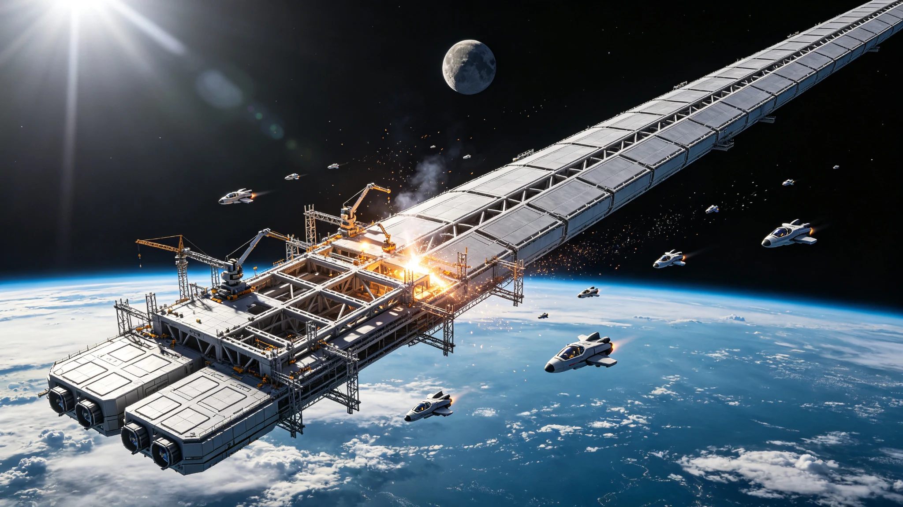

# 第二艘世代飞船"ARK-02"龙骨铺设工程启动公报

**公报文号：** `SHIP-SOL-2490-KEEL01`
**发布机构：** 恒星际造船局 · 建木-02船台工程指挥部
**龙骨铺设：** 2490年11月28日10:00 UTC

---

## 一、项目背景

ARK-01于2150年启航、2350年抵达比邻星b，已建立三个定居点，常住人口约42,000人。太阳系—比邻星b定期货运航线运行逾百年，累计往返37次。2475年太阳系联合议会与比邻星b最高评议会联合通过《第二艘世代飞船建造决议》，目标恒星为半人马座α星Bb，设计航程约190年。船台选址地月L1点"建木-02"设施，2489年完成首期工程。

## 二、总体设计

| 参数 | ARK-01 | ARK-02 | 改进 |
|:---|:---|:---|:---|
| 总长 | 42km | 48km | +14% |
| 最大直径 | 8km | 9.2km | +15% |
| 人工重力 | 0.65g | 0.80g | 更接近地球 |
| 常住人口 | 8,000 | 12,000 | +50% |
| 生态闭环度 | 92% | 97% | 物质循环提升 |
| 巡航速度 | 0.12c | 0.14c | 航程缩短约25年 |
| 设计寿命 | 250年 | 320年 | 冗余度提升 |

---

## 三、龙骨工程

龙骨由中央主轴（直径1.2km，长42km）+环形加强框（120道，间距400m）组成，材料为碳纳米管增强钛合金复合材料，主带工业群铸造。主轴分段铸造36个月、在轨焊接18个月，环形框制造24个月、安装张拉12个月，无损检测6个月，合计预计72个月。首段主轴（S-01，长1km，重120万吨）由8艘重型拖船从主带运抵船台，精准对接于中心定位架，误差0.3mm。

## 四、物资与排期

龙骨阶段需碳纳米管增强钛合金8,400万吨、聚变燃料120吨、水2,800万吨、土壤640万吨。建造高峰期常驻工人4,800人+自动化焊接机器人12,000台+管理与后勤1,000人。

建造排期：龙骨铺设2490—2496年，舱段组装2496—2504年，生态植入2504—2508年，设备调试2508—2512年，载人试航2512—2515年，计划2515年启航。比邻星b方面贡献总预算22%+地热技术转让+"天工-01"部分舱段预制。

*恒星际造船局局长：* 凌远航
*建木-02船台总工程师：* 田中健一

> *船台日志：* 首段主轴对接完成，船台上没有敲钟也没有彩带——真空里放不了彩带。凌局长看着屏幕上那根一公里长的金属圆柱缓缓落入定位架，签了份文件说："记上，2490年11月28日，ARK-02，龙骨第一根。"窗外地球在下方缓缓转动，蓝白相间，像一颗没被碰过的弹珠。
