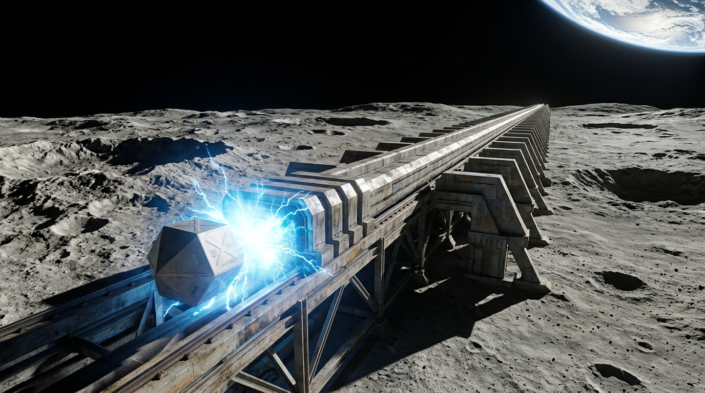

**泛地月系重工业物流与轨道清算总署 · 静海超导弹射站**  
**大宗物资轨道投射与跨轨道交割运单（商档类）**

运单流水号：TRANQ-MAG-2094-08821-T  
发货发射端：静海第一电磁质量投射阵列（轨道倾角 0.0°，出口真空初速 2,380 m/s）  
收货交割端：地月 L5 点 · 曙光三环空间栖息地在轨建造总装坞（三环本体预定部署日心轨道，此坞为建造总装设施；对接轨道捕获网-C）  
发货时间戳：2094年11月03日 04:12:00 UTC  
预计捕获窗口：2094年11月21日 22:12:00 UTC（无动力自由滑行耗时约 446 小时，合 18.6 地球日）

---

### 一、 投射载荷明细与工业分类

| 载荷箱编号 | 货物名称与规格 | 毛重 (t) | 包装形态与姿态微调配置 | 货主与结算方式 |
| :--- | :--- | :---: | :--- | :--- |
| **CNT-2094-0881** | 月球原位烧结六边形碳化硅防辐射装甲砖（1200块） | 42.0 | 标准八面体真空抛光铝合金集装箱；带冷气微推进调姿喷口 | 曙光工程建设总局（建设债券记账） |
| **CNT-2094-0882** | 月壤提取提纯气相沉积钛铝结构件 | 38.5 | 磁吸框架托盘打包；箱体贴附 RFID 测距应答机 | 环带货运联合体（能源券记账） |
| **CNT-2094-0883** | 南极永久阴影坑精炼水冰（工质级） | 50.0 | 多层真空隔热低温杜瓦罐（干冰冷屏保形） | L5 第三生态环控水务社（水权互换） |

---

### 二、 轨道弹道与电磁弹射安全校验

1. **出膛速度矢量**：$\Delta v = 2379.8 \text{ m/s}$，方位角误差 $< 0.0003 \text{ rad}$，已补偿月球自转线速度。
2. **微调工质储备**：各箱体自备 1.2 kg 液氮微推力工质，供飞行中段完成 3 次由 L5 自动射电阵列遥控的毫米级轨道微修正。
3. **捕获网安全协议**：若箱体到达 L5 减速区未能与捕获缆绳建立激光测距握手，集装箱将自动引爆内部冷气阀门实施轨道规避，严禁高速撞击曙光三环正在铺设的自转主环骨架。

---

### 三、 经办签章与轨道公证

**月面发射控制员（AI-Daemon-9 / 人工复核）**：*高健（LUN-LOG-314）*  
**L5 点接收端遥测确认哈希**：`0x7f88a91c...ee34`  

*(本单据为电子航行加密区块链凭证，副本由货运无人机载固态存储器随箱发射)*

## 修订记录（元层，非世界内容）
- 2026-08-17 正典重审：自由滑行 63.47 小时→约 446 小时（2,380 m/s 逃逸速度抛物线爬升 384,400 km 的物理真实值，捕获窗口顺移至 11-21 22:12 UTC）；删纪元名「离心」（2094 尚无公投）；干冰表述改为冷屏保形；L5 总装坞补「本体部署日心轨道」口径注。
