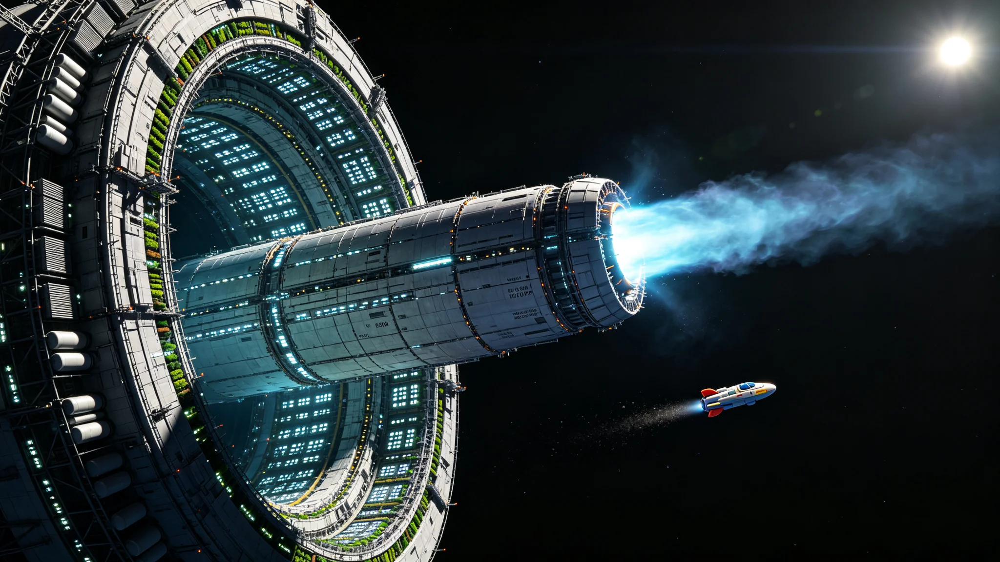

# 第四艘世代飞船"ARK-04"前往鲸鱼座τ星启航公报与远征乘员名册

**公报文号：** `SHIP-SOL-2720-LAUNCH04`
**发布机构：** 恒星际航行局 · ARK-04航行指挥部 · 远征乘员管理处
**启航日期：** 2720年09月30日

---

## 一、任务概述

ARK-04为人类第四艘世代飞船，目标鲸鱼座τ星（Tau Ceti，距离11.9光年，G8V型黄矮星，质量约0.78倍太阳，光度约0.52倍太阳）。鲸鱼座τ星已确认存在至少4颗行星，其中鲸鱼座τ星e（质量约3.9倍地球，轨道周期168天，位于宜居带内缘）与鲸鱼座τ星f（质量约3.5倍地球，轨道周期642天，位于宜居带外缘）为重点候选定居目标。

ARK-04于2670年开工，2712年总装完成，2713—2719年太阳系内试航与生态系统调试，2720年09月30日正式启航。本船为人类首艘目标距离超过10光年的世代飞船，航程与通信延迟均创历史纪录。

## 二、技术参数

ARK-04总长58km，最大直径11.2km，O'Neill自转环提供0.92g人工重力，常住人口24,000人，生态闭环度99.5%，聚变脉冲推进巡航速度0.18c，辐射屏蔽为水层+硼化复合材料+主动磁场+静电偏转四重防护，设计寿命500年。较ARK-03全长+12%、直径+8%、人口+33%、生态闭环度+0.3%。

主要改进：

- **推进系统**：采用新一代聚变脉冲推进器，比冲较ARK-03提升18%，燃料利用率提升22%
- **辐射屏蔽**：新增静电偏转层，对高能带电粒子的屏蔽效率提升35%
- **生态系统**：采用第三代闭环生态系统，物种多样性较ARK-03提升40%，稳定性显著增强
- **通信系统**：配备超大口径激光通信天线（直径300米），可在11.9光年距离上维持1kbps数据速率
- **导航系统**：接入三星系导航网，配备自主脉冲星导航系统，在脱离信标覆盖范围后可自主导航

## 三、航行计划

```
2720.09.30  启航，主推进点火，初始加速度0.0025g
2720—2732   加速段12年，加速至0.18c
2732—2774   巡航段42年，惯性飞行
2774—2786   减速段12年，反向推进减速
2786年      抵达鲸鱼座τ星系统
总航程约66年（飞船时约65年，含狭义相对论时间膨胀）
通信延迟：启航时0小时 → 抵达时11.9年（单向）
```

航行期间，ARK-04将在巡航段中段（约2753年，距太阳系约6光年）经过一片星际介质密度较高的区域（本地泡边缘），届时将进行星际介质原位探测与深空天文观测。

## 四、远征乘员名册

### 4.1 乘员编制

启航时乘员总数24,000人，按功能分区配置：

| 功能分区 | 人数 | 占比 | 主要职责 |
|---|---|---|---|
| 航行操控 | 1,800 | 7.5% | 飞船驾驶、导航、推进系统操作 |
| 生态维护 | 3,600 | 15.0% | 农业、水培、生态系统监控与维护 |
| 工程维保 | 3,000 | 12.5% | 船体维护、设备维修、制造加工 |
| 医疗健康 | 1,440 | 6.0% | 医疗、公共卫生、心理健康 |
| 教育文化 | 1,920 | 8.0% | 教育、文化、娱乐、档案管理 |
| 科研探测 | 2,160 | 9.0% | 科学研究、探测设备操作、数据分析 |
| 社会管理 | 960 | 4.0% | 行政管理、法律、安全、后勤 |
| 工业生产 | 2,400 | 10.0% | 制造、加工、原材料处理 |
| 农业食品 | 3,120 | 13.0% | 粮食生产、食品加工、配给管理 |
| 儿童与养老 | 3,600 | 15.0% | 儿童照护、养老服务、家庭支持 |

### 4.2 核心指挥团队

| 职务 | 姓名 | 年龄 | 专业背景 |
|---|---|---|---|
| ARK-04首任舰长 | 郑远航 | 52 | 恒星际航行，前"星槎-05"班轮船长 |
| 副舰长（航行） | 大卫·陈 | 48 | 推进系统工程，前ARK-03推进主管 |
| 副舰长（生态） | 林绿 | 45 | 闭环生态系统，前无极科学城生态所研究员 |
| 首席医疗官 | 玛丽亚·罗德里格斯 | 50 | 深空医学，前援手-01舰队医疗主管 |
| 首席科学官 | 王星辰 | 47 | 天体物理，前无极科学城引力波研究所副所长 |
| 总工程师 | 赵铁建 | 55 | 飞船工程，前ARK-03总工程师助理 |
| 生态总监 | 山田葵 | 44 | 农业生态，前绿原定居点农业主管 |
| 教育总监 | 苏文华 | 49 | 教育管理，前新海安第三综合学校校长 |

### 4.3 乘员人口结构

- 年龄分布：0-14岁 18%，15-30岁 22%，31-50岁 35%，51-65岁 18%，65岁以上 7%
- 性别比例：男性49.2%，女性50.8%
- 遗传多样性：乘员基因组经遗传多样性评估，确保24,000人基础上的长期种群健康（最小可存活种群评估通过，遗传漂变速率<0.1%/代）
- 出生地分布：太阳系（含轨道城）58%，比邻星b 28%，巴纳德星b 14%

### 4.4 预计航程人口变化

预计航行期间出生约8,400人，自然死亡约5,200人，抵达时人口约27,200人。航程中将经历约2.5代人的更替，第三代乘员（航程中出生的第二代子女）将成为抵达时的主要劳动力。

## 五、载荷清单

### 5.1 燃料与消耗品

- 聚变燃料氘-氦-3：3,200吨（含50%储备，用于加速、减速与途中机动）
- 水：5,800万吨（含生态循环用水与辐射屏蔽用水）
- 土壤：1,200万吨（水培与土培混合农业系统基质）
- 食品储备：12,000吨（够24,000人食用6个月，作为生态系统启动期的缓冲）

### 5.2 科学与技术载荷

- 地球全物种基因库（含870万物种的DNA样本）+ 比邻星b与巴纳德星b已编目物种基因库
- 全套制造设备（含3D打印机、数控机床、化学合成设备、生物培养设备）
- 星际介质探测阵列（含等离子体探测器、尘埃计数器、磁场传感器、宇宙射线望远镜）
- 深空天文观测设备（含光学望远镜、射电望远镜、引力波探测器原型）
- 行星探测设备（含轨道探测器、大气探测器、地表漫游车、全封闭加压登陆艇36架）

### 5.3 文化与档案载荷

- 人类文明数字档案（含全部已知文献、艺术作品、音乐、电影、软件源代码，总数据量约400YB）
- 实体文化遗产副本（含重要艺术品的高精度复制品、文物3D扫描数据与打印件）
- 语言与文化多样性档案（含7,000余种人类语言的语法词典与语料库）
- 种子库（含12万种地球植物种子 + 比邻星b与巴纳德星b已驯化作物种子）

### 5.4 载具

- 全封闭加压客运穿梭机：18架（用于轨道与行星表面间人员运输）
- 全封闭加压货运穿梭机：12架（用于货物运输）
- 全封闭加压登陆艇：36架（用于未知行星表面登陆探索）
- 全封闭加压EVA作业艇：24架（用于船外作业与维护）
- 全封闭加压探测车：180辆（用于行星表面探索）

## 六、通信与预研

### 6.1 通信方案

ARK-04与太阳系及已定居恒星系的通信采用激光+无线电双链路存储转发机制：

- 加速段与减速段：每72小时发射一次数据舱，数据速率约10kbps
- 巡航段：每30天发射一次数据舱，数据速率约1kbps（距离增大导致速率下降）
- 紧急通信：可随时发射高功率激光脉冲，数据速率约100bps，仅用于紧急事件
- 接收：持续监听来自太阳系、比邻星b、巴纳德星b的激光通信信号，数据速率随距离变化

通信延迟：启航时即时 → 1光年后延迟1年 → 抵达时11.9年（单向）。往返通信延迟在巡航段中段达到约12年，意味着一次问答需要12年才能完成。

### 6.2 远程预研

航行途中，舰载科研团队将持续对鲸鱼座τ星系统进行远程观测：

- 利用舰载大口径望远镜对鲸鱼座τ星e与f进行高分辨率光谱观测，分析大气成分与表面特征
- 持续监测鲸鱼座τ星的恒星活动（耀斑、黑子、恒星风），评估定居辐射环境
- 利用引力波探测器原型进行深空引力波观测，利用ARK-04的长基线（与太阳系探测器的距离达12光年）进行超高精度引力波测量
- 航行途中每10年发布一次鲸鱼座τ星系统预研报告，更新着陆点选择与定居方案

## 七、启航确认

2720年09月30日06:00 UTC，ARK-04主推进准时点火，加速度0.0026g，各项参数正常。8小时后脱离船坞结构，12小时后进入持续加速阶段。舰载生态系统运行正常，24,000名乘员全部登船完毕，生命维持系统稳定。

预计抵达鲸鱼座τ星系统时间：2786年（飞船时）。

---

*恒星际航行局局长：* 陆远航（第二任，任期2698—2730）
*ARK-04首任舰长：* 郑远航
*远征乘员管理处处长：* 李名册

> *启航日志摘录：* 点火的那一刻，整艘船轻轻震了一下，然后是持续的低沉嗡鸣。郑远航舰长看着推力曲线平稳上升，对大副说："记上，2720年9月30日，ARK-04，走了。"窗外太阳系在身后越来越小，前方是鲸鱼座τ星，还要飞66年。66年。比ARK-01的整个航程还长。船上最年长的乘员已经78岁了，他看不到抵达的那一天。船上最小的乘员才3个月，她抵达时已经66岁了。这就是世代飞船——你出发的时候，就知道自己可能到不了。但你还是要走。因为总有人要到。
