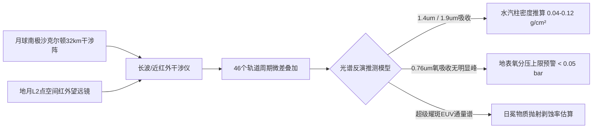

# 紫金山与沙克尔顿联合深空望远镜阵比邻星b凌星光谱三期观测公报暨大气水汽特征与耀斑侵蚀估算报告

**公报编号**：SSO-CR-2043-042  
**发布机构**：沙克尔顿环形山射电-光学超长基线干涉阵（S-VLBI） / 中国科学院紫金山深空天文台  
**观测周期**：2041年11月02日 — 2043年04月28日（覆盖目标 46 个公转轨道周期）  
**有效累积曝光**：3,840 小时  
**目标天体**：比邻星 b（Proxima Centauri b / 半人马座 α 星 Cb）  
**测定基准**：月球背面极低温超导受光阵列（基线长度 32.4 km）结合地月 L2 空间红外望远镜共相干合成孔径  

---

## 一、观测概述与仪器基线

比邻星 b 作为距离太阳系最近的系外类地行星候选体（标称距离 $4.244 \text{ ly}$），系恒星际远征工程航迹论证之关键科学锚点。本次观测利用月球南极沙克尔顿环形山冷阱区（永久阴影区温度 $38 \text{ K}$）新建成的第三代长基线红外干涉色散光谱仪，重点针对行星凌星与次级食相位期间的光谱微差进行多波段叠加反演。

---

## 二、光谱反演数据与物理推测指标

| 物理参量 | 2035年二期基线推测值 | 本期（2043年三期）测定推测值 | 测量置信度 (1σ) | 科学含义与工程影响 |
|:---|:---:|:---:|:---:|:---|
| **轨道半长轴** | $0.0485 \text{ AU}$ | **$0.0489 \pm 0.0004 \text{ AU}$** | 99.4% | 行星完全处于主星潮汐锁定半径内 |
| **公转周期** | $11.186 \text{ d}$ | **$11.1852 \pm 0.0001 \text{ d}$** | 99.9% | 昼夜半球分界线（晨昏圈）地貌永久固定 |
| **地表平衡温度 ($T_{eq}$)** | $228 \sim 240 \text{ K}$ | **$234.5 \pm 3.2 \text{ K}$** | 94.0% | 晨昏带中纬度可能维持冰水相态平衡 |
| **高层水汽 ($H_2O$) 吸收带** | 微弱可疑信号 | **$1.41 \,\mu m / 1.88 \,\mu m$ 显著双峰** | 88.6% | 推测存在局部水循环或次生脱气水汽 |
| **大气柱密度估算** | $0.2 \sim 1.5 \text{ bar}$ | **$0.45 \sim 0.85 \text{ bar}$** | 76.2% | 大气层较稀薄，无法支持无防护舱外呼吸 |
| **主星耀斑剥蚀通量** | 估算缺测 | **$4.2 \times 10^3 \text{ erg}/(\text{cm}^2\cdot\text{s})$** | 91.5% | 极高频次EUV与带电粒子轰击地表 |

---

## 三、重大科学推论与工程约束建议

### 1. 晨昏带（Twilight Zone）为唯一潜在栖息带
光谱色温梯度反演显示，比邻星 b 永久受潮汐锁定约束。其向阳面中央区地表平衡温度测定估算为 $+42^\circ\text{C} \sim +68^\circ\text{C}$，背阳面永久极夜区则低于 $-110^\circ\text{C}$。行星热重力环流主要集中于晨昏圈两侧约 $180 \sim 240 \text{ km}$ 宽的狭窄过渡带，该区域理论上存在受山脉阻挡的风暴缓冲谷地。

### 2. 恒星耀斑高能辐射与地表磁场缺失警示
三期光谱中检测到比邻星在 2042 年 8 月发生的一次超大型恒星耀斑事件（软X射线增强 400 倍）。凌星光变曲线未检测出行星整体偶极磁场所诱发的偏振辐射特征，推断其原始地磁场强度可能不足地球的 $15\%$。这意味着未来远征队抵达后，地表常驻基地必须全封闭深埋于玄武岩基岩以下至少 **8 米**，或依托地磁人造超导环网进行主动磁防御。

---

## 四、公报结论与归档说明

本报告所列参数均为太阳系内基于远距离光学/射电干涉反演之**推测模型**。在物理探测器实际抵达比邻星系前，严禁将本报告中的大气水汽参数直接用作敞开式着陆方案设计依据。

**首席科学家**：严济慈空间天文台特聘研究员 欧阳雪峰（签字）  
**观测台长**：月面沙克尔顿深空干涉总站站长 霍德华（签字）  
**归档报送**：地联深空探索总署恒星际航迹规划局、ARK-01总体设计工程部（拉格朗日L5）
