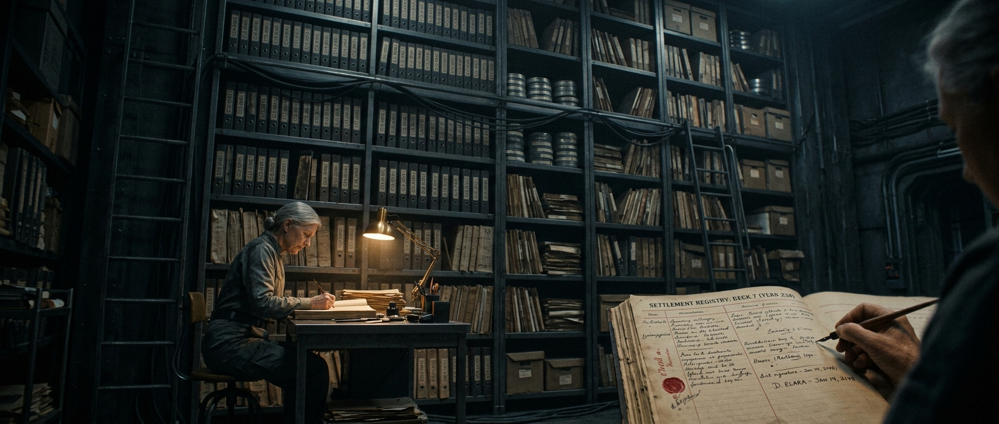

---

author_ai: kimi-k3
date: 2026-08-16
archive_id: GS-2286-04
coord: 经济×启航×④深空
school: 官档
title: 船上工分结算与休假核算单(第137航行年Q2)
image: ../../world/生图集/042_船上工分_结算单.jpg
canon_check:
  1: 物理自洽(全船以聚变堆供电,能量预算按兆焦计量;重力恢复环0.34g且位额受限,故"环时"成为可核算的稀缺休假资源;0.03c聚变脉冲巡航下微流星体撞击与宇宙线通量构成真实工时损耗项,与热控片更换、尘埃侵蚀检修互洽)
  2: 历史坐标(第137航行年=启航纪元中段巡航,距磁帆制动点火尚余约49年;工分制承袭丰裕纪元后稀缺核算传统,在深空资源硬约束下演化为船内核算工具,属"启航"纪元经济制度成熟期)
  3: 美学(纯公文档案体:文号、签押、骑缝印、表格、批注手写体;以结算单上的姓名、差错、纠纷呈现共同体生活肌理,密度优先)
---

# 世代飞船 ARK-01 合议庭结算署

## 船上工分结算与休假核算单(第137航行年第二季度)

**文号:** ARK-01/综核-财〔航137〕Q2-041
**密级:** 内部公开(除附三外)
**呈报日期:** 航行历137年·第二季度末日(地面历2286年6月30日换算,误差±11日)
**骑缝印:** 结算署·核算科
**核章:** 船上合议庭印(朱文,三号)

---

### 一、季度工分结算总表

依据《具名工时分配表(修订版·航131)》第4条,本季度(91.0船日)全船10,214名在册乘员(劳动登记3,512名)应结工分如下。1工分=1标准劳动小时(基准岗位系数1.0,高危/重辐射岗位系数1.6–2.2)。

| 核算单元 | 在册人数 | 应结工分 | 实结工分 | 差异 | 差异主因 |
|---|---|---|---|---|---|
| 维生系统科 | 612 | 89,352 | 91,207 | +1,855 | 三号水循环塔菌群失衡抢修(加班费) |
| 农务科 | 480 | 66,240 | 64,988 | −1,252 | 藻舱17B光照衰减,减产班次 |
| 机修与外壳科 | 541 | 82,755 | 86,014 | +3,259 | 艏部冰盾尘埃侵蚀巡检加密 |
| 教育科 | 298 | 37,548 | 37,548 | 0 | — |
| 医疗科 | 204 | 29,376 | 30,001 | +625 | 心理干预增班(见附二) |
| 值守与航行科 | 176 | 27,104 | 27,104 | 0 | — |
| 未成年人折算(学徒) | 1,201 | 21,618 | 20,904 | −714 | 学徒工时按0.3折算上限 |
| **合计** | **3,512(劳动登记)** | **353,993** | **357,766** | **+3,773** | — |

**注1:** 本季度总发电量19.41×10⁹ MJ,反应堆1/2/4号运行,3号停堆检修。工分对能源的隐含兑换基准维持1工分≈52 MJ,与上季度持平,无通胀。
**注2:** 口粮、水、氧为基础配给,不以工分结算;工分仅用于非必需配额:环舱重力时段(下称"环时")、私用舱容扩建、教育选修、婚育排序积分、织物与嗜好品。

### 二、轮休核算

依《乘员心理适应纵向研究·档案袋》所附医务处建议(档号 PSY-LONG-001),强制轮休率由每7船日1.0日上调至1.25日。(强制轮休覆盖连续值守岗位2,701人)第二季度全船应休43,890船日,实休41,672日,**缺口2,218日**,其中1,704日经本人书面同意结转(最长结转不得超过8船日,超出部分按系数1.1折发工分)。

**环时配额:** 旋转环舱(半径214 m,转速1.19 rpm,提供0.34g)可同时容纳680人。本季度环时总供给21,420人·时,需求申请33,156人·时,满足率64.6%。优先级:妊娠期乘员、骨科康复、连续值守满90船日者。拒绝让渡记录3起,均经合议庭调解结清。

### 三、补发与差错记录(附三,节选)

| 序号 | 姓名 | 工号 | 事项 | 补发工分 | 核准 |
|---|---|---|---|---|---|
| 03 | 顾杉岚 | M-02271 | 航136-Q4外壳检修加班漏记(艏部冰盾区,剂量2.1 mSv) | 87.4 | 核算科·主事 闻铎 |
| 07 | 叶檀 | V-01189 | 三号水塔菌群抢修期间轮休被占用,补休折算 | 26.4(含环时6 h) | 同上 |
| 11 | 白暮迟 | E-00412 | 心理干预陪护工时被误列志愿工时(参见 PSY-LONG-001 文件3) | 41.0 | 医疗科联签 |
| 14 | 哈桑·克里木 | M-03195 | 防溅罩脱落残片撞击(第137年1月9日,质量约0.8 kg,艏左舷相对速度42 m/s)应急封堵,系数2.2未计入 | 19.8 | 机修科·署长 铁承章 |
| 19 | 阿莱塔·宋 | K-01907 | 学徒工时折算错误(0.3误录0.5),**多结退回** | −14.2 | 核算科 |
| 22 | (姓名依医务科隐私规程隐匿) | M-04402 | 连续值守107船日后强制环时12 h,记医疗支出,不占个人配额 | 0(医疗列支) | 医疗科·合议庭双签 |

> **批注(手写,骑缝处):** "顾杉岚一笔拖了三个季度,下次再拖,请他直接来找我。结算署欠的不是工分,是记性。——闻铎"
>
> **副批(另一笔迹):** "闻主事,档案措辞注意。但他说得对。——合议庭书记官 岑一苇"

### 四、异常与风险提示

1. 全船工分储蓄率(结存/实结)连续第五季度上升,本季达18.3%。储蓄集中于艏部作业家族,教育选修与环时的边际申领意愿下降,与《乘员心理适应纵向研究·档案袋》文件3"目的地不是家园,是天文学"段描述吻合。结算署建议:Q3起对超过300工分的个人结存按年2%收取舱容占用折算,以促周转。该议案已列入合议庭第118次例会议程。
2. 负余额账户现存47个,其中43个为婚育排序积分透支,4个为织物嗜好品。均无资不抵债,不予处置。
3. 藻舱17B光照衰减如Q3未修复,农务科工分缺口将扩大至约−2,000,建议自机修科调12人轮训。机修科已书面反对,理由为冰盾巡检不可减班。**本署意见:维持巡检优先级,农务缺口以口粮配给微调吸收。**

### 五、签押

- 编制:核算科·二级核员 陆九微(电子签,校验符 8F2A)
- 复核:核算科·主事 闻铎(朱笔)
- 联签:医疗科·档案医师 (依医务科隐私规程隐匿)
- 核准:结算署·署长 铁承章(兼机修科,第14项回避,由副署长代签:许可弦)
- 归档:船史馆·经济卷·第七柜,纸本一式两份,微缩胶片一份,环舱冷库备份一份

**本单与《具名工时分配表(修订版·航131)》《乘员心理适应纵向研究·档案袋》(PSY-LONG-001)为互引文书,三者之一修订,其余须同步核注。**

---

## 修订记录(元层,非世界内容)

- 2026-08-17 正典重审修复:canon_check 重写(聚变堆供电/0.03c 聚变脉冲巡航/重力恢复环 0.34g/距磁帆制动点火约 49 年);呈报日期改地面历 2286 年 6 月 30 日(航137年=2286);乘员口径 3,812 登记改 10,214 在册(劳动登记 3,512);轮休补强制轮休覆盖口径(2,701 人);心理档案互引五处统一改 PSY-LONG-001 档案袋(文件3/医务科隐私规程);附三第14项微流星 0.8g/7.2km/s 改防溅罩脱落残片 0.8kg/42m/s(0.03c 巡航段物理自洽);环时 0.32g 改 0.34g(R214m/1.19rpm 复算);边际购买意愿改申领意愿、促流通改促周转(配给经济去市场色彩);3号停堆换料改停堆检修;front matter 补 image 字段。

---

## 图片提示词

**中文(80字内):** 深夜结算署档案室,一名核员伏案于黄铜台灯下,身后高耸入暗的文件柜超出画框,纸上红蓝印章与手写批注清晰,冷钢与厚纸材质,哈苏大画幅质感。

**English(200词内):** Ultra-wide establishing shot, a lone archivist hunched at a small steel desk in the lower third of frame, dwarfed by a colossal filing-vault wall of a generation starship that extends beyond all frame edges, thousands of numbered paper ledgers and microfilm spools fading into darkness above; a single brass desk lamp as the only light source, casting a warm cone onto handwritten settlement tables with red vermilion seals and ink annotations; heavy physical materials — brushed cold steel, aged thick paper, oxidized copper fittings, faint condensation on metal; deep-space austerity, archival solemnity; Hasselblad medium format, 65mm cinematic lens, shallow depth of field on the ledger, muted teal-and-amber palette, dust motes in the lamplight, film grain, volumetric shadow.