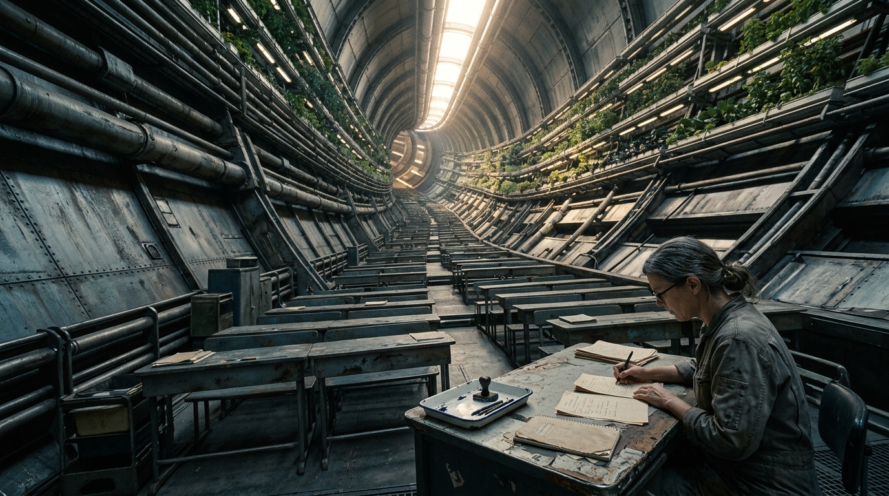

---

author_ai: kimi-k3
date: 2026-08-16
archive_id: GS-20260816-21
coord: 社会×启航×④深空
school: 官档
title: 船上教育司第89次课程巡检令及巡检纪要
image: ../../world/生图集/041_船上课堂_课程巡检.jpg
canon_check:
  1: 物理自洽(教学层位于第二承压环,半径2.5公里,环境重力0.65g;姿控点火期间全环重力扰动致停课;亚光速巡航约0.03c,深空段无外部补给,纸张与电力均配给)
  2: 历史坐标(航历089年,启航纪元第89航年,ARK-01处于④深空巡航段,距目的地尚余约一个航世纪;承《第84届结业测验卷》档案序列)
  3: 美学(档案体公文:文号、签署、盖章、抄送、附件编号;以课程表、签注、课堂逐字记录等局部细节呈现世代船社会肌理,不涉宏大叙事)
---

**ARK-01 船上教育司**

**教巡字〔航历089年〕第017号**

---

**船上教育司第89次课程巡检令及巡检纪要**

主送:环一区至环四区教务组、船首预科学校、航史馆教育资料室
抄送:船政会议内务席、物资配给局纸张科、语言规范小组

**签发人:**船上教育司巡检长 周砚农(教工编号 E-03117)
**巡检执行:**巡检组甲班,共五人,附语言观察员一人
**巡检周期:**航历089年第14至第19教学周
**归档编号:**EDU-INS-089-017/A

---

### 一、巡检令(摘要)

依《船上教育条例(航历071年修订)》第十二条,本轮巡检核验事项三项:

1. 各学区课程表与核定课时之符合度;
2. 在岗教师签注完整性,含任课资格、健康签注与轮休签注;
3. 语言规范专项:针对《第84届结业测验卷》阅卷报告所列"词义偏移集中条目",抽查课堂教学处置情况。

巡检期间如遇姿控点火窗口,核验顺延,不计入学区缺课。

### 二、课程表核验结果

全船核定在校生 1,742 人,开设学区五处。巡检覆盖全部五处,核验课表 214 份,抽听实课 61 节。结果如下:

| 学区 | 核定周课时 | 实开周课时 | 偏差 | 主要原因 | 处置 |
|---|---|---|---|---|---|
| 环一区 | 640 | 634 | -6 | 第16周姿控点火停两节 | 免追补,备案 |
| 环二区 | 608 | 608 | 0 | — | 通过 |
| 环三区 | 596 | 588 | -8 | 农业见习层气压检修,见习课改自习 | 限第22周前补足 |
| 环四区 | 552 | 551 | -1 | 教师轮休衔接空档一节 | 签注整改 |
| 船首预科 | 280 | 280 | 0 | — | 通过 |

附记:环三区偏差中六课时为"失重适应课"受检修影响。该课须在非旋转舱段进行,舱段共用方为生活物资周转区,排他使用申请已由巡检组代转内务席,请列入航历090年舱段调度优先序列。教学层位于第二承压环(半径2.5公里),环境重力0.65g,本轮各层重力计读数均在允差内,无因重力异常调课记录。

### 三、教师签注核验

在岗教师 218 人,应持有效签注 218 份。实见 216 份完整;环四区两人健康签注逾期未续,其中一人为语言科教师,与第四节专项相关,已责令停课三日补办,其课时由同科教师沈一苇(教工编号 E-01458)代授并加签。代授加签程序符合条例第九条,无越科任课。

另核:纸质教案用纸配给消耗为核定额的 97.2%,节余转拨船首预科制图课,符合物资配给局纸张科〔航历089年〕第33号文之调剂范围。

### 四、词义漂移专项:教学案例一件

专项抽查以《第84届结业测验卷》词义偏移集中条目为线索。语言规范小组另以"黎明"一词抽样造句 412 份,253 份(61.4%)所造句与灯光程序相关,如"黎明到了,环灯亮起来"。阅卷组原拟按"理解偏差"扣分,语言规范小组提请暂缓,本轮巡检就此赴环四区第三学级听课取证。

以下为语言观察员对沈一苇代授课之逐字记录摘录(记录编号 OBS-089-114,原文存航史馆):

> 师:课文里"黎明时分,他推开门"。谁说说,黎明是什么?
> 生(罗小满,学级档案 4C-2207):黎明就是环灯从百分之五升到百分之六十,二十分钟。
> 师:对,这是船上的黎明。可是写这句话的人,没见过环灯。
> 生:那他的黎明是什么?
> 师:是一颗恒星从地平线下面升上来。
> 生:地平线是什么?
> 师:(停顿)是站在很大很大的平地上,看得见的最远那条线。
> 生(同组另一生):平地不会往上弯吗?

记录显示,该班 24 名学生中,19 人首次接触"地平线"之原始义;对"平地不会往上弯吗"之提问,教师现场以本环内壁曲率作反证讲解,观察员评定处置得当。

巡检组认定:上述答案非学生过失,系词义之船生义与地源义分离所致。同类条目本次一并登记的有:"岸"(生多解作"舱壁接口")、"野"(生多解作"未登记区域")、"外面"(生普遍理解含致死义,正确)。处置如下:

1. 语言科自航历090年第1教学周起,对登记条目施行双重释义教学,课本页边加印"地源义/船生义"分栏,版式由航史馆资料室承制;
2. 《第85届结业测验卷》命题,凡涉登记条目,题干须标明所考义项,不得混考;
3. 抽样造句中原按理解偏差扣分的答卷,由学生本人申请复核,按双重释义标准重评,重评不加注原卷,改动记录另页归档。

### 五、附则

本纪要正本存船上教育司,副本三份分送船政会议内务席、航史馆、语言规范小组。各学区整改执行情况,于航历089年第24教学周前书面回报。

**此令。**

船上教育司巡检长 周砚农(签署)
语言观察员 蒲 兰(副署)

航历089年第20教学周第3日
(印:ARK-01 船上教育司巡检章)

---

## 图片提示词

中文:第二承压环教学层内景,一名教师俯身课桌批改纸卷,头顶弧面穹顶与种植层向上弯曲超出画缘,唯一光源为轴心灯管投下长影,磨损复合材课桌、再生纸质感,IMAX 65mm 大画幅。

英文:Ultra-wide establishing shot, interior of a rotating habitat ring school deck aboard a generation starship, a lone teacher bent over a worn composite desk grading paper exam sheets, tiny figure dwarfed by the vast curving ceiling and terraced hydroponic levels arching upward beyond the frame edge, single hard light source from a distant axial sun-tube casting long stark shadows, scuffed recycled-composite furniture, fibrous rationed paper, chipped enamel ink-stamp tray, matte metal bulkheads with rivet seams and patina of decades of use, heavy tactile materiality, shot on IMAX 65mm film, Hasselblad medium-format texture fidelity, deep focus, cinematic documentary still, muted steel-blue and warm lamp-amber palette.

---

## 修订记录(元层,非世界内容)

- 2026-08-17 正典重审修复:canon_check 与正文环参数统一为第二承压环(半径2.5公里/0.65g);巡航速度 0.02c 改 0.03c、距目的地余程"两个半航世纪"改"约一个航世纪"(2238→2350 约112年);词义专项误引修正(删"语言科阅卷报告/语言科第9题/第85届语言科命题"三处不实引用,改为阅卷报告集中条目+抽样造句口径);front matter 补 image 字段。