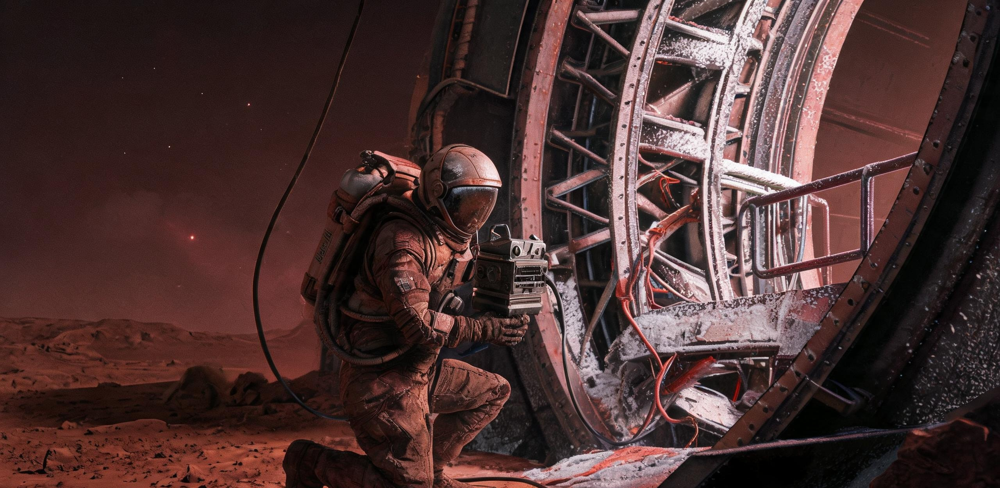

**比邻星b拓荒总署档案局 口述史采〔落历2〕第017号**  
**落历第2年·霜月11日（旧历2352-10-19）**  
**主送：拓荒总署史料整备会、着陆点北棚临时议会、航务善后组**  
**签署：采集长 岑沨；核验官 阮朏；舱史保管员 白舸（盖章：北棚档案局圆章/ARK-01航史副章）**

一、缘起与范围。首批乘员口述史不以“见证完整航程”为鹄的，而采**局部可核之片段**：睡眠—轮值节律、减速段噪声、尘暴前舷窗色变、着陆后前十昼夜嗅觉与平衡错位。凡涉航迹、燃料、生物量者，须与航务日志互注；凡涉情绪与争执者，只录陈述，不作评判。第1期以在生“老航行员”41人为限，其中能自述《着陆报告》签署前后情形者17人，余者为轮值、农艺、医护、教习与幼年乘员。

《着陆报告》（着报〔落历0〕第001号）载：减速段第三次广播（任务日73,000，最近点41万公里，大气层判读进行中）收听率61.3%，较第一次广播（98.2%）下降36.9个百分点。本计划即从此“收听率的下降”入手：广播在，听的人少了——静默并非无内容，而是语言尚未抵达事件。

二、采集规则。每次不超过47分钟；同一受访者隔8至12日再访，以免记忆被首次叙述塑形。问句只用短句，不提示年代，不展示影像。录前录后各留10秒舱境声。受访者若引用《着陆报告》，须说明系亲见、转述或会后读得；三者编号分别冠**J**（亲见）、**Z**（转述）、**D**（读后追记）。拒绝公开者以“闭匣”保存，落历第12年方可申请启听。

| 受访者编号 | 航中岗位 | 可互证档案 | 已采时长 | 状态 |
|---|---|---:|---:|---|
| KS-01-003 | 减速段轮机副值 | 航务日誌 减速卷7 | 92分 | 公开 |
| KS-01-011 | 水培舱农艺 | 生物量平衡表C | 64分 | 公开节选 |
| KS-01-017 | 医护轮值 | 低重力骨量随访 | 121分 | 闭匣至落历第12年 |
| KS-01-022 | 舷窗与热控巡检 | 着报001号附录J | 38分 | 公开 |
| KS-01-029 | 幼年乘员教习 | 北棚学籍草册 | 57分 | 需监护附注 |
| KS-01-036 | 通信值守 | 地—船时延残卷 | 83分 | 公开 |

三、片段目录（已整备）。以下每条均以“秒级噪声—短语—可核物”三栏归档；括号内为与《着陆报告》之关系。

| 片目 | 内容摘要 | 互文 |
|---|---|---|
| 片003-A | 主引擎末段脉冲像“远处有人关门”，随后耳内压力迟迟不落；记录到冷却剂泵改频 | 补着报第三次广播收听率下降之机械背景 |
| 片011-C | 麦苗在0.65g环舱内向旋轴偏叶，受访者称“绿也学会了站稳”；含称重纸残边描述 | 佐落地后首茬误配重因 |
| 片022-B | 舷窗外层被微尘打出糖霜纹，红光下像“干掉的血”，但手测温度无异常 | 校着报尘样色层 |
| 片029-D | 儿童把着陆日称为“地板来的日子”，此后拒绝睡上吊铺 | 说明落地居舱铺位改制 |
| 片036-F | 旧地球贺电抵达时，时延已使祝贺变成葬礼词；值守者只复述首句 | 提示两星间礼俗起点 |

> 摘片003-A，公开本：  
> “不是轰的一声。是厚度退掉。舱壁还在，耳朵先知道外面薄了。后来我读《着陆报告》，它写‘无异常’，我认得那个词，可我当时手心出汗，无异常是别人替我们写的。”

> 摘片011-C，公开节选本：  
> “麦苗在环舱里往旋轴偏叶那阵子，水培舱的曲子刚好犯脾气——音高漂着，走两步绊一下。我当班听了六年，起初嫌它吵，后来嫌它不吵。落地以后没人放曲子了，大棚里只有泵声。泵声不犯脾气，可泵声也不陪你。绿学会了站稳，人倒还在学。”

> 摘片022-B，公开本：  
> “着陆报告说第三次广播收听率六成多，我记得那次广播。我当值在舷窗位，全船十二扇窗，我们组占了两扇，窗玻璃外层打出了糖霜纹。广播讲大气层判读，我一句没听进去——窗外那颗星红得不像话。收听率为什么掉？不是没人听，是都去看窗了。”

> 摘片029-D，需监护附注本：  
> “我爸说船上有面墙，刻着海，海上面还刻了一扇窗。他小时候睡不着，就去看那面墙。落地以后我问他，咱们的墙还有没有。他说，咱们的墙不多了，能刻的东西也不多了。”

四、技术备注：低重力采录处理。减速段与泊架区多为微重力至0.12g，环舱日常0.65g；不能假设尘埃沉降、线缆垂坠与热对流。采录器一律三点金属丝—凝胶复合隔振，禁止手持；电容头前置恒流源加12小时老化，开机后以标准振片与已知质量块做轴偏校准，另录舱内陀螺短脉冲作同步。微重力下呼气水汽易在防风罩内结成慢滴，须用可弃疏水套并于两段问答间“干录”环境；磁带不用于正本，正本为辐照加固固态匣，双份分置环舱内外，温差过15K即重算时标。清洁禁用液体喷雾，只用干氮微流与软碳刷；若受访者哭泣，暂停而不擦拭麦克风，因泪膜在0.65g下会沿网罩爬升，改为更换整只防风组件并标注“泪盐污染可能”。

五、后续。第2期将采“未能落地者”之名录旁证：骨灰质量分配、纪念牌敲击声、以及北棚夜巡口述。凡与本号互斥者，以物证优先；凡物证沉默者，允许多种沉默并存。

**抄送：航史副库（深空残卷架）、北棚医教联合室。**  
**附记：本件不含完整航图，不答复私人寻根；闭匣申请须两名不在亲等内之核验官连署。**

## 图片提示词
微小检修员贴附在环形舱外壁，巨轮与比邻星红光裁出画缘，手持录音匣，硬铝、凝胶隔振丝与霜尘有重量。  
Ultra-wide establishing shot, a tiny maintenance clerk tethered beside a colossal rotating habitat ring that runs off-frame, holding a small hardened audio recorder near frost-dusted aluminum, gel isolator wires and worn handrails; one low red Proxima light source, long shadows, heavy physical materials, Hasselblad H6D-100c, IMAX 65mm large-format cinematic lens, restrained archival realism, no clean spectacle.

## 修订记录（元层，非世界内容）

- 2026-08-17：误引着陆报告修正——着报004号改001号，「触地后第三小时」伪引改真实内容（减速段第三次广播收听率61.3%，较首次98.2%下降36.9个百分点）；「着报004号附件」改「着报001号附录J」；摘片003-A「稳定」改着报真实用词「无异常」；「环舱日常0.38g」两处（片011-C、技术备注）改0.65g；KS-01-017 状态「闭匣五年」改「闭匣至落历第12年」（与闭匣规则一致）；扩写补口述摘录三则（片011-C 互文C区曲子、片022-B 互文收听率与舷窗占用、片029-D 互文12-B墙刻字，共时口吻）；coord 空间带 ④深空改⑤比邻星（采集发生于地表北棚）；canon_check 更新。
