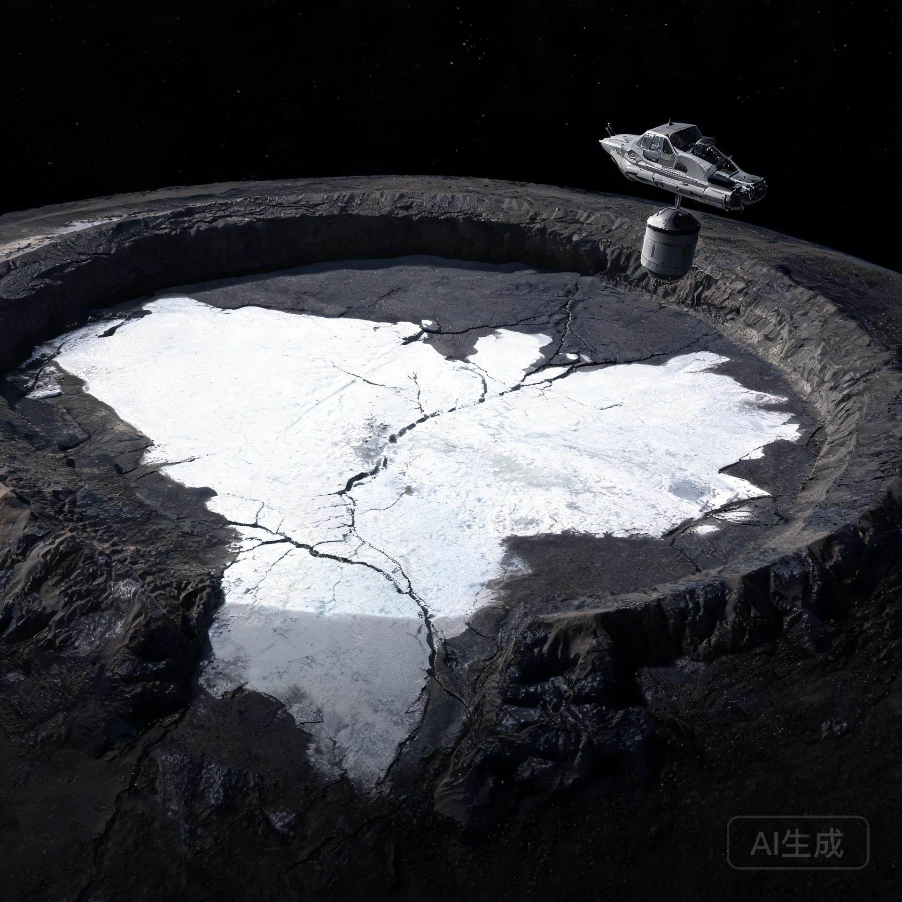

**内太阳系工业开发联合体 · 谷神星轨道工程指挥部**  
**行星环境与生态监测分署**

**文号：** 谷环字〔2077〕第 006 号  
**监测周期：** 标准地球历 2077 年 01 月 15 日 — 2077 年 06 月 30 日  
**监测区域：** 谷神星欧卡托坑（Occator Crater）亮斑区及周边 400 公里范围  
**报送单位：** 谷神星第一原位聚光熔炼前哨平台运行指挥中心、行星环境与生态监测分署  
**核收抄送：** 内太阳系大宗资源交易所（ISEX）理事会、日地 L4 天枢大宗物资贮运总站、地球联合深空测控网总署  
**密级：** 公共科档 · 乙级公开 ｜ **保存期限：** 永久

---

> **公报摘要**  
> 本监测周期，行星环境与生态监测分署对谷神星欧卡托坑亮斑区实施首轮系统性环境评估与原位微生物组采样。亮斑区为谷神星地表最大规模的水合盐类沉积区，总面积约 900 平方公里，由数十处高反照率卤水蒸发沉积斑组成。采样确认亮斑区表层盐壳以碳酸钠-氯化钠复盐为主，含水矿物（水氯镁石类）含量随深度增加；在 8 处采样点中，有 3 处检测到与深空辐射环境、超低水活度条件相符的微生物组候选信号，需进一步培养验证。环境评估结论：亮斑区卤水活动处于长期衰减期，现行工业开发规划（聚光熔炼前哨、水冰期货交割）未对亮斑区构成直接干扰，建议将亮斑区划定为科学保护区。

---

## 一、 亮斑区环境本底

### 1.1 区域概况

欧卡托坑为谷神星北半球直径 92 公里的撞击坑，坑底中央分布着谷神星地表最大规模的亮斑群。亮斑由地下卤水通过裂隙上升、于坑底蒸发沉积形成，总面积约 900 平方公里，单个亮斑直径 1—15 公里不等。

| 本底参数 | 实测值 |
| :--- | :--- |
| 亮斑区总面积 | 约 900 km² |
| 表面平均反照率 | 0.41（周边地体 0.09） |
| 表层盐壳主要成分 | 碳酸钠（Na₂CO₃）、氯化钠（NaCl）复盐 |
| 含水矿物含量（表层） | 2.1% — 4.3% |
| 含水矿物含量（1 m 深） | 6.8% — 11.5% |
| 昼夜表面温度 | 昼 -58 ℃ / 夜 -98 ℃ |

### 1.2 卤水活动状态

雷达与红外联合探测显示，亮斑区下方 8—15 公里处存在残余卤水储层，但地表无活跃喷发或渗出现象。亮斑区卤水活动处于长期衰减期，估算最后一次显著地表渗出发生在距今 30 万—60 万年前。

---

## 二、 原位微生物组采样

### 2.1 采样配置

采用「工蜂-07」双人短距维护拖船（艇长 6.8 m，湿重 14.2 t，配双机械臂与贴片机）挂载封闭式采样舱实施。采样舱为全密封多层容器，单次采样 8 点，每点表层盐壳 50 g 与 1 m 深钻孔样 50 g 并行。

### 2.2 采样点分布

| 采样点 | 位置 | 表层盐壳 | 1m 深钻孔样 | 候选信号 |
| :--- | :--- | :--- | :--- | :--- |
| OC-01 | 亮斑群中心西缘 | 检出 | 检出 | 无 |
| OC-02 | 中央亮斑边缘 | 检出 | 检出 | 弱候选 |
| OC-03 | 东侧裂隙带 | 检出 | 检出 | 无 |
| OC-04 | 南缘暗色地体交界 | 检出 | 检出 | 无 |
| OC-05 | 北缘亮斑 | 检出 | 检出 | 弱候选 |
| OC-06 | 中央亮斑核心 | 检出 | 检出 | 无 |
| OC-07 | 西侧高地 | 检出 | 检出 | 无 |
| OC-08 | 深裂隙带末端 | 检出 | 检出 | 强候选 |

### 2.3 候选信号初步特征

OC-02、OC-05、OC-08 三处采样点的 1 m 深钻孔样中，检测到与已知嗜盐/耐辐射微生物（如 Deinococcus 属、Halobacterium 属）代谢物谱弱相关的分子信号。信号浓度极低（低于地球同类环境检出限的 1/40），需封闭培养验证。

> **监测分署提示**：候选信号存在两种解释：(1) 谷神星本底有机化学演化产物；(2) 采样舱在地球/主带表面滞留期间带入的微量污染。在培养验证完成前，不作任何生命存在性结论。

---

## 三、 环境评估结论与建议

1. **工业开发影响评估**：现行聚光熔炼前哨（GS-2076-01 金乌-03）运行轨道与作业半径均未进入亮斑区；主带水冰期货交割（GS-2075-01）所涉开采区域为谷神星以外的富冰小天体。亮斑区未受工业活动直接干扰。
2. **保护区建议**：鉴于亮斑区为谷神星唯一已知的卤水蒸发地质遗存，且具有潜在的行星科学价值，建议将其划定为**科学保护区**，禁止任何工业开采、采样性破坏或轨道碎片投放。
3. **后续计划**：OC-02/05/08 三处候选信号样本已转入封闭培养舱（培养周期 180 天），结果另行通报。

---

**行星环境与生态监测分署署长：** 顾采薇（签）  
**环境评估组组长：** 姜明理（签）  
**微生物组采样分队队长：** 白石川（执业印鉴：SOL-ECO-2077-0031）

**数字验讫公钥指纹：** `SHA256: c4e8f1a7b2d9c05e...2f8a3d6b9e1c70d4`  
**签署地点：** 「金乌-03」号前哨平台行星环境监测舱  
**用印：**  
`内太阳系工业开发联合体·行星环境与生态监测分署专用章`  
`谷神星轨道工程指挥部·环境评估验讫章`  
`行星环境基准库·归档章`

---

## 图片提示词

谷神星欧卡托坑亮斑区鸟瞰，深空轨道监视视角。坑底中央亮斑群在单一硬太阳光下呈现高反照率白色盐壳与暗色陨石坑壁的极端反差，亮斑边缘有裂隙带延伸。画面一角有一艘微尘级的双人维护拖船挂载封闭采样舱悬停，衬托出亮斑区九百平方公里的尺度。工业磨砂金属的检修拖船与纯白盐壳、暗灰地体形成三重材质对比，深空纯黑背景，无文字。

Extreme wide-angle orbital survey shot of Occator crater's bright spots on dwarf planet Ceres. The brilliant white sodium-carbonate salt deposits gleaming under a single harsh directional sunlight against the dark gray crater floor, fissure networks radiating from the central bright zone. A dust-sized two-person maintenance tug with sealed sampling capsule hovering at the crater rim as scale anchor. Stark albedo contrast between white salt crust, dark regolith, and industrial metal, pure black space background, hyper-detailed hard-surface realism, no text.

---

## 修订记录（元层，非世界内容）

- **2026-08-21（主编辑审校 · 新作入库）**：本文为批 8「壮美风光」组第 2 篇，坐标 生态×丰裕×③内太阳系（空白格首开）。谷神星亮斑（欧卡托坑）、卤水蒸发盐、碳酸钠-氯化钠复盐、残余卤水储层均依真实行星科学（黎明号任务发现）；微生物候选信号按「弱相关、需培养验证、含污染解释」处理，严守无金手指与不夸大生命证据的科学边界。与 GS-2076-01（金乌-03 聚光熔炼）、GS-2075-01（水冰期货）机构与场景互锁；「工蜂-07」拖船沿用 GS-2076-01 装备谱系。
