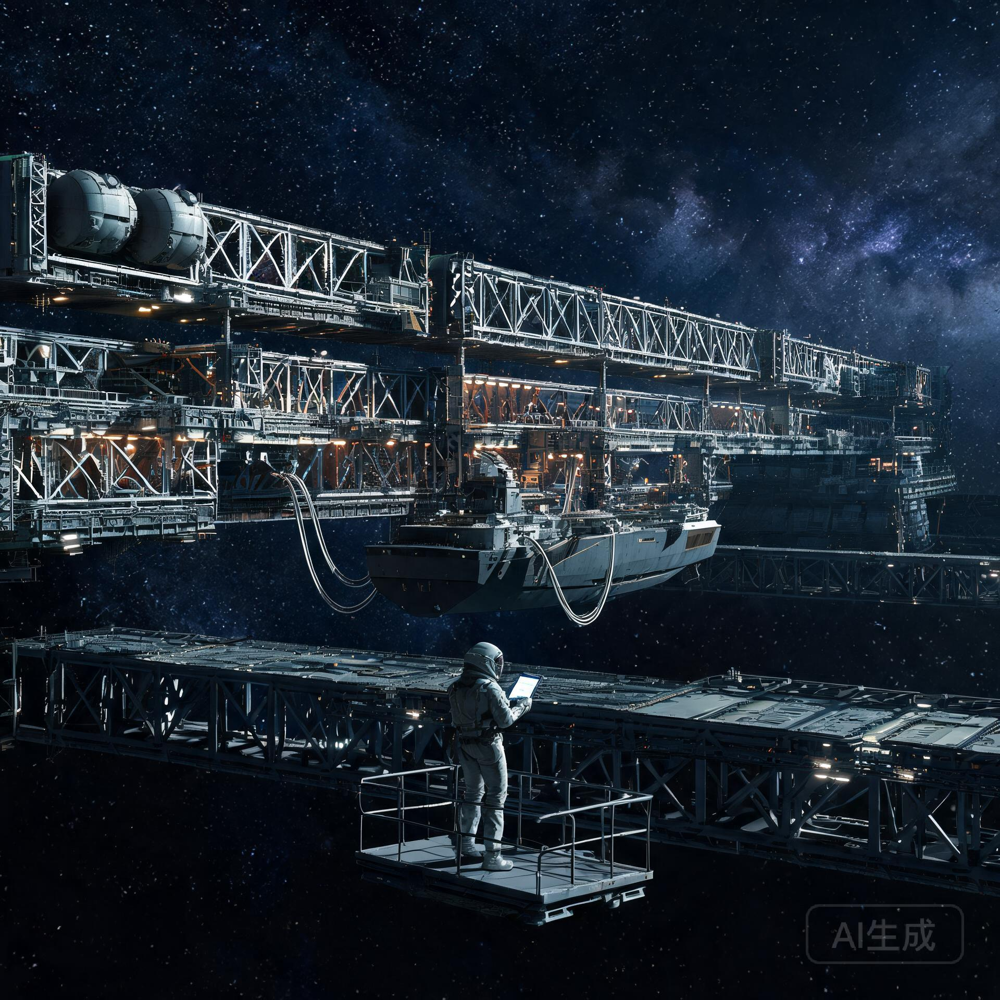

## 一、 背景与通告主旨

公元 2152 年 6 月 11 日，恒星际拓荒舰 **ARK-01（方舟一号）** 自天梭-01 锚地前沿 800 公里处点火启航，本锚地历时十二年的总装使命正式结束。按《谷神星外轨天梭-01深空锚地启航季观礼组织方案与商服区歇业清册暨送行驳运编队调度规程》（谷锚管联字〔2152〕第 044 号）既定安排，锚地自 2152 年 6 月 17 日起转入 **二期降级拆解与深空物流中继港改造** 阶段。

截至本通告发布，前期拆解评估已完成：01 号重载深坞总装配套设备（12.8 km 主桁架吊装系统、电子束冷焊工作站等）中，约 62% 的固定资产经评估可转入物流中继港继续服役，38% 进入报废拆解清单。为保障过渡期秩序、明确留守与转岗政策，经锚地管委会与环带货运自治公会谷神星分会联席会议议决，发布本通告。

---

## 二、 过渡期管理总则

### 2.1 职能调整

1. **锚地管理委员会** 自本通告生效之日起增设 **物流中继港筹建办公室**，统筹改造工程；
2. **启航后勤与转场清算联合工作组** 职能延续至 2153 年 12 月 31 日，负责歇业清册收尾、人员安置与固定资产移交；
3. 锚地日常安保、维生、轨道维持职能不变。

### 2.2 区域管制

| 区域 | 原用途 | 过渡期状态 |
| :--- | :--- | :--- |
| 01 号重载深坞 | ARK-01 总装坞 | 拆解作业区（管制） |
| 第七生活自转环 | 建造人员居住 | 正常运行（留守人员居住） |
| 03/04 号工装泊位 | 工程驳船停泊 | 物流改造先行试点泊位 |
| 7-12 号退役储罐区 | 液氢储罐/观礼台 | 转冷储与物流仓储规划区 |

### 2.3 过境与物流业务

自 2153 年 4 月起，锚地试运行深空物流中继业务，首批服务对象为经停谷神星轨道的深空航线货船与地月-主带往返船队，提供：停泊、补给（水/氧/氮）、小型维修、货物转运与通信中继服务。试运行期内费率按环带货运自治公会 2153 年春季基准价执行。

---

## 三、 留守人员安置办法

### 3.1 留守意愿登记（2153 年 3 月 15 日—4 月 15 日）

原在册建造与保障人员（含启航季歇业商服人员），可选择：

| 选项 | 内容 | 安置去向 |
| :--- | :--- | :--- |
| **甲·留守转岗** | 转入物流中继港运营编制 | 港务操作/维修/补给/通信岗，签订 3 年期合同 |
| **乙·调回地月系** | 由管委会统一安排返程舱位 | 静海第五城市带、地月 L5 枢纽、天鳌-01 港等 |
| **丙·就地自主** | 保留锚地居住资格，自主择业 | 需按月缴纳居住与维生服务费（标准见附表一） |

### 3.2 优先条件

1. 原 72,000 余人次建造周期内累计工时满 8 年者，转岗优先；
2. 原商服区歇业店主（如"最后一滴氘"酒吧、半人马座邮亭等 38 处网点经营者），给予物流港内商铺租赁优先权及首年租金减免；
3. 有深空作业资质者（焊工、机修、巡检）转岗可免试直入。

### 3.3 未登记人员处理

未在规定期限内完成登记的在册人员，视为默认选择乙项（调回地月系），由管委会于 2153 年 5 月起分批安排返程。

---

## 四、 附表一：自主居住维生服务费标准（2153 年度）

| 项目 | 月费（标准能量券，锚地结算） | 备注 |
| :--- | :---: | :--- |
| 居住舱位（第七环·单人间） | 480 | 含水/氧/氮基础配额 |
| 饮食补贴额度 | 320 | 按集体食堂标准 |
| 通信中继服务 | 90 | 至地月系/主带常规链路 |
| 医疗与保险 | 160 | 锚地医疗站+深空保险联合体 |

**合计：1,050 标准能量券/月**（约合地月系同等生活标准 78%）

---

## 五、 附则

本通告自 2153 年 3 月 15 日 00:00（锚地标准时）起生效。过渡期管理细则（设施拆解清单、物流业务规程、安全作业守则）另行发布。对本通告有异议者，可于 30 日内向锚地管委会申诉仲裁室书面提出。

**签发：**  
谷神星外轨天梭-01深空总装锚地管理委员会主任：万海清（签）  
环带货运自治公会谷神星分会执委：达尼埃尔·巴索（签）  
启航后勤与转场清算联合工作组组长：程远图（签）  

**核准签章：**  
`谷神星外轨天梭-01深空总装锚地管理委员会（印）`  
`环带货运自治公会谷神星分会调度专用章（印）`  

**分发：** 锚地各工装生活区、驻泊船队、谷神星极区前哨调度中心、静海基建联络处、地月 L5 枢纽站

---

## 图片提示词

中文：深空工业港改造现场，公元2153年，巨大的12.8公里桁架船坞结构横贯星空，部分区段已拆除吊装设备、暴露着切断的桁架断面与封装中的储罐，其余区段仍亮着工业照明；一艘小型货运船正停靠在新改造的泊位上，船侧伸出的补给管线连接着港口设施；前景一位身着工装的人漂浮在检修平台上核对数据板；单一硬质太阳光，冷调金属，宏大而秩序井然，无文字。

English: Deep-space industrial port retrofit scene, 2153. The colossal 12.8-kilometer truss shipyard stretches across the starfield, some sections with crane systems removed exposing severed truss ends and sealed tanks, others still lit with industrial lighting; a small cargo vessel docks at a newly converted berth, supply lines connecting to port facilities; in the foreground a worker in utilitarian suit floats on a maintenance platform checking a data pad. Single hard sunlight, cold metal tones, monumental yet orderly, no text.

## 修订记录（元层，非世界内容）

- 2026-08-20 批 7 创作入库（GS-2153-01）。直接承接 GS-2152-02（观礼方案·二期转港计划/万海清/巴索/程远图署名延续）；"最后一滴氘"酒吧、半人马座邮亭等商服网点呼应 GS-2152-02 歇业清册；与 GS-2155-01（中继港试运行后经济结算）同轴互锁。正文无纪元名/元层词。