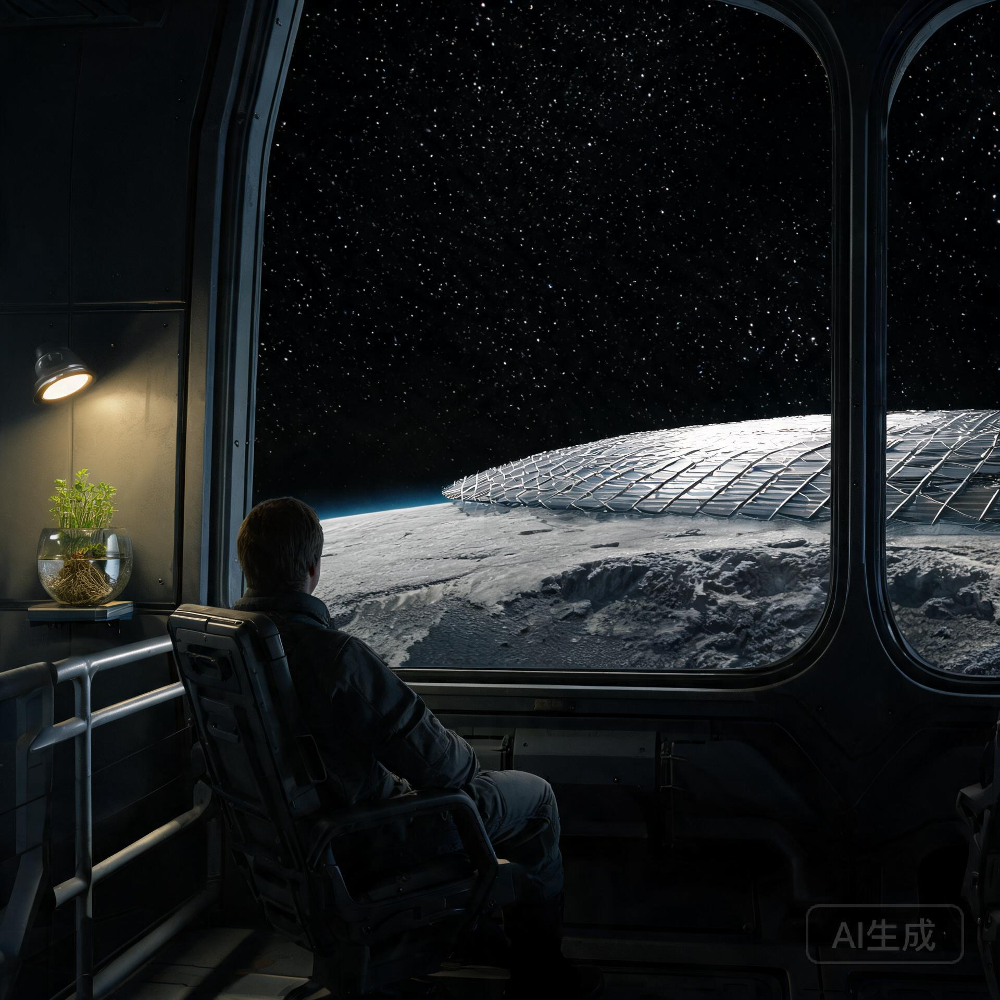

**内太阳系工业开发联合体 · 谷神星轨道工程指挥部**  
**前哨乘员保障处**

**文号：** 谷保字〔2076〕第 018 号  
**安排周期：** 标准地球历 2076 年 07 月 01 日 — 2077 年 06 月 30 日  
**适用对象：** 「金乌-03」聚光熔炼前哨平台全体在册乘员  
**报送单位：** 谷神星轨道工程指挥部  
**核收抄送：** 深空货运相互保赔协会、前哨乘员心理监测站、地月工程建材供应链调度署  
**密级：** 内部工档 · 乙等 ｜ **保存期限：** 永久

---

> **安排主旨**  
> 「金乌-03」聚光熔炼前哨平台为距地球 2.77 AU 的深空工业前哨，在册乘员 148 人（含驻场工程师、热工测控员、维护机械师、医勤与行政）。乘员以 6 个月为一轮换周期，两班轮替；本安排为 2076 年度下半年至 2077 年度上半年轮换期内的休整规划。深空驻留的长期心理与生理负荷管理，是前哨可持续运行的核心保障之一。

---



## 一、 轮换与休整制度

1. **轮换班次**：每班在岗 6 个月，休整期 3 个月（返回地球/地月系休整）；两班轮替，全年保持平台满员；
2. **在岗休整**：在岗期间每月享有 4 天休整日，可预约休整舱；
3. **休整舱配置**：前哨设休整舱 12 间（含睡眠舱、运动舱、影音舱、园艺角、舷窗观景席）；
4. **心理监测**：每季度完成一次心理适应评估，评估结果仅用于休整安排调整，不作考核。

---

## 二、 休整舱配置与预约

| 舱室 | 配置 | 单次预约时长 | 说明 |
| :--- | :--- | :--- | :--- |
| 睡眠舱 A1-A4 | 全遮光、重力床（0.3 g 离心） | 8 小时 | 深空驻留期间维持骨肌负荷 |
| 运动舱 B1-B2 | 弹力带、固定单车、微重力体操区 | 2 小时 | 每日开放，无需预约 |
| 影音舱 C1-C2 | 全息投影、影音库 | 3 小时 | 含地球实景影像库 |
| 园艺角 D | 水培架、小型温室 | 2 小时 | 种植观赏植物与香料 |
| 舷窗观景席 E1-E4 | 全景观景舷窗 | 2 小时 | 面向谷神星北极与主带星野 |

---

## 三、 轮换休整预约清册（节选）

本年度下半年轮换班次（第 14 班）休整安排节选如下：

```
━━━━━━━━━━━━━━━━━━━━━━━━━━━━━━━━━━━━━━━━━━━━━━━━━━━━━━━━━━━━━━━━━━━━━━━━━━
【金乌-03 · 第14班轮换休整预约清册（节选）】
━━━━━━━━━━━━━━━━━━━━━━━━━━━━━━━━━━━━━━━━━━━━━━━━━━━━━━━━━━━━━━━━━━━━━━━━━━
工号/姓名      岗位              休整日期          预约舱室    备注
JW-2076-013    热工测控员        07月03-06日      睡眠舱A2+   本班次首次休整
石明轩                           （4天）          观景席E1
JW-2076-027    维护机械师        07月10-13日      运动舱B1+   足底肌力训练计划
段铁衣                           （4天）          园艺角D     执行中
JW-2076-041    医勤              08月01-04日      影音舱C1    家属影像预载
苏晚晴                           （4天）
JW-2076-058    驻场工程师        08月15-18日      睡眠舱A4+   入舱前完成心理
洛云舟                           （4天）          观景席E3     评估
JW-2076-076    维护机械师        09月02-05日      园艺角D+    香料作物采收
闻人野                           （4天）          影音舱C2
──────────────────────────────────────────────────────────────────────────
*注：全册 148 人，本表节选 5 人。轮换休整预约按工龄、心理评估结果与个人申请综合排序。*
```

---

## 四、 轮换班次交接与返程

1. **交接规程**：轮换班次返程前须完成岗位交接（工单、设备状态、安全记录），交接文档存档；
2. **返程安排**：休整班次乘员搭乘深空货运船团返程（与 GS-2076-02 深空货运相互保赔协会航线衔接），航程约 265—340 天；
3. **休整期保障**：休整期乘员在地球/地月系享有全额配给与医疗支持，岗位保留，无待遇损失。

---

## 五、 附则

本安排自发布之日起施行，由前哨乘员保障处负责执行与解释。

---

**前哨乘员保障处处长：** 苏远山（签）  
**轮换休整协调员：** 韩静仪（签）  
**前哨乘员心理监测站站长：** 白景行（执业印鉴：SOL-CREW-2076-0044）

**数字验讫公钥指纹：** `SHA256: 5c8a2e7d9b1f6403...2e9d5c8b4a7f1d06`  
**签署地点：** 「金乌-03」号前哨平台 · 乘员保障处  
**用印：**  
`内太阳系工业开发联合体·前哨乘员保障处专用章`  
`谷神星轨道工程指挥部·轮换验讫章`

---

## 图片提示词

深空工业前哨「金乌-03」的舷窗观景席内部，一位穿深色工装的乘员坐在观景席上，透过全景观景舷窗眺望谷神星北极与主带星野。舷窗外是巨大的聚光熔炼反射膜阵边缘与谷神星的弧形地平线，远处是密布星光的深空；观景席侧有工业磨砂金属扶栏与一盏暖黄色阅读灯，一株小型水培植物在灯下。人与宏大深空的安静对峙，单一光源，重工业质感，纪实摄影风格，无文字。

Interior of a deep-space industrial outpost observation seat: a crew member in dark workwear sitting quietly before a panoramic viewport, gazing at the northern polar region of dwarf planet Ceres and the star field of the main asteroid belt. The edge of the enormous focusing mirror array and Ceres' curved horizon visible through the glass, deep space dense with stars beyond. Industrial brushed-metal handrail, a warm reading lamp, a small hydroponic plant on the sill. Quiet human scale against cosmic scale, single light source, heavy industrial texture, documentary photography, no text.

---

## 修订记录（元层，非世界内容）

- **2026-08-21（主编辑审校 · 修订）**：首发版本人物名与批 8 第 3 篇（2158 年船上文化项目）高度重合，跨 82 年构成同一人矛盾风险，已全部替换为独立人名（石明轩/段铁衣/苏晚晴/洛云舟/闻人野），消除跨纪元人物冲突。休整制度（睡眠舱 0.3g 重力床、心理监测、轮换交接）依真实航天医学。
