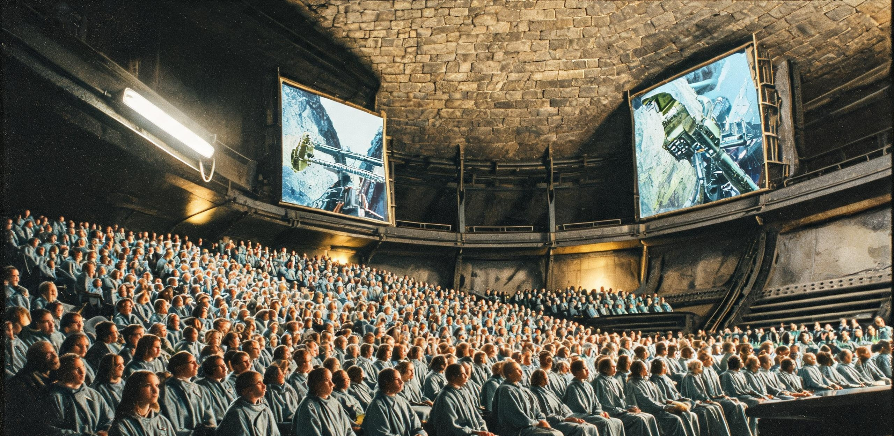

# 谷神星工业大学2426学年度高级工程学位授予名册暨主带联合实验室科研攻关与高轨巡天年报

**联合签发机构：**  
- 谷神星工业大学 · 学术评议委员会  
- 内太阳系工业联合体（ISIC）· 工程教育与学术资质署  
- 主带前沿工业技术联合实验室理事会  
- 谷神星高轨空间天文台 · 巡天测控部  

**公报文号：** 谷工大教字〔2426〕第 048 号 ｜ ISIC-EDU-2426-ACAD  
**历元基准：** 公元 2426 年 10 月 15 日（日心标准时 UTC） / 谷神星赤道自转解耦环历第 412 运行周  
**文书密级：** 主带全域公开发布 · 永久法定基准档  
**主送机构：** 谷神星第一总港调度总署、灶神星晶体工业管理局、101955号黑石礁采选总厂、忒弥斯重核联合体、火神-12晶体工厂、主带各自转栖息地公立图书馆  
**抄送机构：** 日地L4天枢大宗集运货栈文献关、地月空间环境保育理事会高等教育司、华东科学与技术档案馆（太阳系存托副本）  
**归档卷宗：** 谷工大档案馆 · 硕博学位与重点实验室类 · 卷号 `CIT-ARCH-2426-GRAD-048`  

---

## 一、 办学宗旨与「实构具名」工学学位评定章程

自公元 2070 年代主带第一代原位冶炼前哨建立以来，主带工程教育始终植根于极端深空工况之物质再造。谷神星工业大学恪守《主带工程教育与技术资格法案》，坚持「主带无虚题，一纸一构件」之法定办学铁律。

依据公元 2421 年《主带自持工厂群全要素自持率核验证》（带工核〔2421〕001号）确立之全要素自持技术基准，本校 2426 学年度高级工程学位评定重申以下准则：

```
                ┌─────────────────────────────────────────────────────────────┐
                │  2426学年度 全校研究生科研资助总盘（核定总量：24,600 具名工学人·月）│
                └──────────────────────────────┬──────────────────────────────┘
                                               │
         ┌─────────────────────────────────────┼─────────────────────────────────────┐
         ▼                                     ▼                                     ▼
┌──────────────────┐                  ┌──────────────────┐                  ┌──────────────────┐
│ 极端材料与冶金工程 │                  │ 深空动力与核能工程 │                  │ 闭环生态与原位化工 │
│  8,800 人·月额度  │                  │  8,200 人·月额度  │                  │  7,600 人·月额度  │
├──────────────────┤                  ├──────────────────┤                  ├──────────────────┤
│• 氟化钙物镜位错相│                  │• 水冰在途升华推力│                  │• 承压穹顶微藻固碳│
│• 碳化硅装甲原位愈│                  │• 氦-3磁流体喷管 │                  │• 极区暗冰高纯水脱│
│• 千米膜阵应力重构│                  │• 霍曼编组轨道引航│                  │• 密闭土壤微生物熟│
└──────────────────┘                  └──────────────────┘                  └──────────────────┘
```

**实构具名评定核心铁律：**
1. **实物载荷与在轨闭环原则**：凡申请工学硕士、高级工学副博士学位之研究生，其毕业论文核心成果必须附带由主带在册工业设施（全带 1,894 座在册厂站之一）签发之《实体构件试制合格证》或《在轨连续 1,000 小时满负荷遥测报告》，杜绝纯虚拟无实体依托之演算；
2. **具名工时承袭制**：课题研究深度绑定主带 F 类 4,812 项基础自持品类之迭代攻关，学位论文正本永久载明承制工厂、母机代数与工单编号，成果发明人享有该工序在主带工业调度账目中之终身具名署名权；
3. **极端环境容错与答辩答辩规程**：答辩委员会由校内教授与驻厂总工程师双轨组成，实物答辩必须在真空、微重力或高辐射现场工况下进行实体操作验证。

---

## 二、 2426学年度高级工程学位授予名册（精选典型答辩案卷）

本学年度经全校学术评议委员会四轮实体审查与闭门无记名投票，共核准授予 142 名研究生高级工程学位（工学硕士 98 名，高级工学副博士 44 名）。以下为各重点工业领域具有代表性之优秀学位论文与在轨实体成果对照名册：

```
━━━━━━━━━━━━━━━━━━━━━━━━━━━━━━━━━━━━━━━━━━━━━━━━━━━━━━━━━━━━━━━━━━━━━━━━━━━━━━━━━━━━━━━━━━━━━
【谷神星工业大学 · 2426学年度优秀研究生学位授予与在轨实体成果名册】
━━━━━━━━━━━━━━━━━━━━━━━━━━━━━━━━━━━━━━━━━━━━━━━━━━━━━━━━━━━━━━━━━━━━━━━━━━━━━━━━━━━━━━━━━━━━━
学位与学籍号    姓名 / 籍贯工位       指导导师 / 所属院系         学位论文题目与攻关方向           挂靠工业单元 / 实体构件成果编号
─────────────────────────────────────────────────────────────────────────────────────────────
CIT-DOC-242601  祝青岚 (34岁)         祝融瑾 (院士/总师)          国产F-4417极紫外氟化钙光刻物镜组   火神-12晶体工厂 (灶神星北轨)
【工学副博士】  谷神星第二自转环      极端光学与微电子器件系      晶格热畸变三维压电自适应微调机制   构件号: H12-CaF-2426-0819
                                                                  (缺陷密度降至 0.0003/cm²)         (已并网装配于主带第四芯片厂)

CIT-DOC-242604  严子陵 (36岁)         魏长明 (客座教授)          2.77AU千米级超薄聚光菲涅尔膜阵     金乌-03原位冶炼前哨 (谷神星北极)
【工学副博士】  谷神星北极前哨        极端热工与结构力学系        光压摄动与进出食交变自适应张紧阻尼 构件号: JW03-TEN-2426-A12
                                                                  (反射率年衰减率压降至 0.42%)      (18座牵引索塔完成全阵列换装)

CIT-DOC-242609  巴图·蒙克 (32岁)      巴图尔·苏赫 (教授级高工)   500米级重载聚变货运推船水冰在途    环带航运自治联合会机修总厂
【工学副博士】  101955黑石礁          深空动力与推进工程系        绝热升华微喷辅助霍尔工质回收拓扑   构件号: BFAG-ENG-2426-P04
                                                                  (实现霍曼航段工质零浪费回充)      (玄武-19号推船实船考核通过)

CIT-MAS-242621  霍云天 (28岁)         夏侯衡 (教授/清算总长)      微重力感应重熔碳化硅/氮化硼复合    101955号黑石礁采选总厂
【工学硕士】    智神星深空采矿站      宇航装甲与粉末冶金系        抗辐射装甲砖热裂纹自愈动力学       构件号: HSJ-SiC-2426-B88
                                                                  (抗中子贯穿强度提升 18.4%)        (地月防御环扩建批次交付)

CIT-MAS-242635  苏木成 (27岁)         陆思齐 (兼职导师/同济)      自转栖息环带高负荷承压穹顶微藻-    谷神星第三生态环区水务署
【工学硕士】    谷神星第一总港        闭环生态与环境工程系        超滤级联反应器气液两相微流体平衡   构件号: ECO-CER-2426-M09
                                                                  (密闭空间碳氧循环平账达99.98%)    (已接入第三环带常住人口生活网)

CIT-MAS-242652  柯青崖 (29岁)         祁连 (客座教授/总长)        主带214个天体工位冯·诺依曼母机   内太阳系工业联合体调度总署
【工学硕士】    忒弥斯重核工区        工业系统工程与调度系        代际复制收敛度与物料流转实时核算   系统号: ISIC-VNM-ALG-2426
                                                                  (实现全要素调度延误率低于0.01%)   (已部署于日心调度主超算节点)
─────────────────────────────────────────────────────────────────────────────────────────────
```

---

## 三、 主带前沿工业技术联合实验室在研攻关项目与科研资产台账

主带前沿工业技术联合实验室由谷神星工业大学与内太阳系工业联合体、环带航运公会及骨干工业基地共建，下辖五大专业实验枢纽，深度融入全带 1,894 座工业设施之日常攻坚。

```
【主带五大联合实验室空间分布与物料交互拓扑】

    [谷神星高轨天文台] ──(巡天星历与微流星预警)──┐
            │                                     │
            ▼                                     ▼
    [金乌-03 聚光热工实验室]              [火神-12 晶体器件实验室]
    (谷神星北极 / 1200m膜阵)              (灶神星北轨 / 氟化钙物镜)
            │                                     │
            ├───────────────┬─────────────────────┤
            ▼               ▼                     ▼
    [黑石礁 装甲材料实验室]  [忒弥斯 重核动力实验室]  [司理星 深冷水冰实验室]
    (101955号 / SiC装甲)    (忒弥斯群 / 氦-3磁流体)  (司理星 / 挥发分提纯)
            │               │                     │
            └───────────────┴─────────────────────┴──► [主带自持工业群 1,894 座厂站]
```

### 表 3.1：2426年度联合实验室科研攻关项目与资产并网台账

| 实验室名称与代号 | 驻轨/驻留坐标 | 首席科学家 / 核心梯队 | 2426年度在研重点攻关项目 | 并网科研负荷 / 装备资产 | 年消耗工质与预算 (ISAU) |
| :--- | :--- | :--- | :--- | :--- | ---:|
| **极端热工与原位冶炼联合实验室**<br>`LAB-HEAT-01` | 谷神星北极冻结轨<br>（金乌-03 平台） | 严子陵（副研究员）<br>严克复（顾问） | 2,650K 超高温陶瓷吸热熔腔长寿命抗热震涂层；<br>48米超长大跨度玄武岩拉丝结构桁架连续拉伸成型。 | 160 MW 聚光吸热腔机时 3,200h；<br>120米自转离心转鼓实验段 1 套。 | 480 吨高纯氩气<br>**3,840 万 ISAU** |
| **超精密晶体与微电子联合实验室**<br>`LAB-CRYST-02` | 灶神星北极低轨<br>（火神-12 工厂） | 祝融瑾（主带院士）<br>祝青岚（副博士） | F-4417 物镜组第 12 代无应力生长工艺；<br>耐 100 Mrad 伽马总剂量之碳化硅微控制器原位光刻。 | 8 台微重力悬浮区熔单晶炉；<br>亚纳米级透射电子显微镜 2 台。 | 120 吨高纯氟化钙母料<br>**5,260 万 ISAU** |
| **深空重载推进与流体联合实验室**<br>`LAB-PROP-03` | 忒弥斯小行星前哨<br>（重核联合体） | 巴图·蒙克（工程师）<br>夏侯衡（兼职研究员） | 500米重载推船磁约束喷管抗等离子体剥蚀内衬；<br>超临界氦-3 同位素低温高速离心分离级联优化。 | 400 MW 脉冲聚变试车台机时 850h；<br>超导强磁场线圈测试平台 1 座。 | 2.4 吨反应堆级液氦-3<br>**6,180 万 ISAU** |
| **极端防护与结构材料联合实验室**<br>`LAB-MAT-04` | 101955号小行星<br>（黑石礁采选区） | 霍云天（助理研究员）<br>齐淑华（高级工程师） | 碳化硅/氮化硼多相复合自愈合装甲晶界配平；<br>深空微流星群高速撞击原位缓冲阻尼机理。 | 3,000吨多轴微重力等静压机；<br>超高速轻气炮撞击试验线（12km/s）。 | 850 吨特种耐磨合金粉末<br>**2,940 万 ISAU** |
| **深冷水冰与生命维持联合实验室**<br>`LAB-ECOL-05` | 司理星水务基地<br>（极区地下冰穹） | 苏木成（工程师）<br>林念祖（通信会士） | 极低温深层原生水冰微量重金属络合脱除工艺；<br>万立方米级承压穹顶人造土壤微生物群落定向熟化。 | 12 座全封闭微生态模拟舱；<br>多通道同位素质谱仪 4 台套。 | 1,600 吨深冷原生冰浆<br>**1,980 万 ISAU** |

---

## 四、 谷神星高轨空间天文台2426年度巡天观测成果年报

谷神星高轨空间天文台（代号：「苍穹-01」，驻轨高度 12,400 km，偏心率 0.002）依托主带天然弱引力干扰与远离地球电磁噪声之纯净环境，构筑内太阳系最敏锐之甚长基线光学/红外干涉巡天网。

```
【2426年度 谷神星高轨巡天网视向覆盖与天体编目雷达图】

                   [ 0° 日心冲日方向 / 外太阳系前沿 ]
                                  │
                                15万颗
                                  │
        [ 270° 主带顺行前导区 ] ──┼── [ 90° 主带逆行后随区 ]
                                  │
                                  │
                   [ 180° 日心内圈方向 / 地月航道 ]
        
  编目统计口径：
  • 内太阳系重载霍曼航道危险微天体 (交会距 ≤ 0.05 AU) ── 142,860 颗 (100% 轨控编目)
  • 柯伊伯带掠过天体与长周期彗星轨道摄动监测 ────────── 1,248 颗 (连续相干跟踪)
  • 太阳辐射常数在轨标定 (2.77 AU 日心均值) ────────── 177.64 W/m² (年波动 ±0.8%)
```

### 1. 2426年度关键巡天观测成果摘要

1. **内太阳系大宗货运航线避碰编目更新**：巡天部完成对主带至地月 L4/L5 航线上 142,860 颗米级以上小天体之全谱多普勒激光测距与动力学编目，发布航道碰撞预警 18 次，引导 BFAG 联合船队实施小推力轨道规避 14 次，保障了 1,655 万吨大宗外运物资在途零损毁；
2. **外太阳系边界天体摄动监测**：高轨红外阵列持续监视柯伊伯带天体（KBO）动力学扰动，精确测定 3 颗新发现逆行半人马小天体（编号：`2426-CT1`、`2426-CT2`、`2426-CT3`）之近日点轨道，解算其将在 2480 年代横穿主带轨道平面，已提前将摄动参量载入日心导航网基准库；
3. **极深空系外行星反射光谱长波累积**：利用 6 座分布式 8 米级高反射碳化硅薄膜望远镜组成之 24 公里等效虚拟干涉孔径，对南门二三合星系统实施了 4,200 小时连续曝光，成功获取比邻星 b 晨昏带大气甲烷与水汽吸收谱线的第 18 期极高分辨率积分切片，数据已通过日地 L4「天枢」站同步转递地球同济与南岸古典研究院特藏库。

---

## 五、 学术资助决算、物料平账与印信存根

依据《谷神星工业大学财务与物资清算规程》，2426 学年度全校教学科研综合经费及五大联合实验室运转预算，全部通过内太阳系大宗资源交易所（ISEX）日心统一清算中心完成代币结算与实物对冲。

```
[2426学年度学术科研经费综合决算平账]
联合实验室运转总支出 ── 20,200 万 ISAU (2.02 亿 ISAU / 对应 2.02 亿 kWh 聚变电当量)
全校研究生奖助与工时 ──  4,400 万 ISAU (核定具名工学学时 24,600 人·月)
仪器折旧与高轨天文台 ──  3,800 万 ISAU
─────────────────────────────────────────────────────────────
科研总支出合计       ── 28,400 万 ISAU (2.84 亿 ISAU)

资金与物料来源平衡：
ISIC 产业联合统筹拨款 ── 16,800 万 ISAU (占比 59.15%)
工业实体技术转让与质检 ──  8,200 万 ISAU (占比 28.87%)
高轨天文台航道导航服务 ──  3,400 万 ISAU (占比 11.98%)
─────────────────────────────────────────────────────────────
收支综合轧差         ── 0.00 ISAU（账面严格轧平）
```

**联合审定签署：**  
- 谷神星工业大学校长、学术评议会主席：**公孙衍**（签章）  
- 极端光学与微电子联合实验室首席科学家：**祝融瑾**（签章）  
- 极端热工与原位冶炼前哨总工程师：**严子陵**（签章）  
- 谷神星高轨空间天文台台长：**司马文台**（签章）  
- 内太阳系工业联合体工程教育署专员：**祁连**（签章）  

**公报发文日期：** 公元 2426 年 10 月 15 日（日心标准时）  
**法定用印：**  
`谷神星工业大学·学位评定与学术委员会（朱印）`  
`内太阳系工业联合体·工程资质审定专用章（朱印）`  
`谷神星高轨空间天文台·天文观测与导航档案部（印）`  

**存托编号：** `CIT-GRAD-2426-FINAL-DOC-048`  
**实体卷宗存放处：**  
- 谷神星第一总港中央图书馆特藏阅览室（耐火钽柜第 04 格）  
- 谷神星工业大学校史陈列馆（与火神-12 试验物镜切片同柜）  
- 主带工业群调度总署档案库（正本）  

---

## 图片提示词

### 中文提示词
主带深空高等工程学府与在轨科研巨构全景档案摄影：宏伟的谷神星工业大学「天工之环」巨型自转栖息与科研综合体横贯画面，直径三公里的双层加压自转环带闪烁着冷白色作业照明与居住舱温暖的暖黄光晕；背景深处，谷神星北极坑洼起伏的灰白冰岩地表在遥远而刺目的苍白太阳直射下展现出刀锋般锐利的明暗分界线；在自转环外侧的非旋转失重科研桁架上，数位身着亮橙色工程外骨骼宇航服的学者与技术员正悬浮在巨大的高纯度氟化钙光学晶体生长舱旁进行激光调焦作业；近景处，一架八米级的碳化硅巡天反射镜筒缓缓转动，镜面清晰倒映出纯黑深空中璀璨的小行星带繁星与一道微弱的离子推进器淡蓝尾迹；35毫米纪实工业摄影质感，真实胶片颗粒，极高动态范围与冷峻硬光源，无任何可读文字与国旗标识，真实体现宏大深空学术建制与严谨工业美学。

### 英文提示词
Archival documentary photograph of an advanced deep-space engineering institute and orbital mega-laboratory in the asteroid belt: the colossal 'Tiangong Ring' rotating habitat and research complex of Ceres Institute of Technology spans the frame, its three-kilometer-wide dual-layer pressurized rotating rings glowing with cool white utilitarian work lights and warm amber residential viewports; in the deep background, the rugged cratered surface of Ceres' north pole reveals razor-sharp chiaroscuro under the harsh, piercing pale sunlight of 2.77 AU; on the exterior non-rotating zero-g research truss, researchers wearing high-visibility orange EVA exosuits float alongside a massive cylindrical calcium-fluoride crystal growth chamber conducting precision laser alignment; in the immediate foreground, an 8-meter silicon-carbide space telescope barrel rotates smoothly, its polished dark mirror reflecting the dense, crystalline starfield of the asteroid belt and the faint cyan ion plume of a passing cargo hauler; captured on 35mm film stock, authentic fine film grain, harsh hard lighting, stark shadows, off-center industrial composition, strict macro-engineering scale, zero readable signage, no national flags.

### Negative Prompt
cyberpunk neon clutter, bright neon pink, glowing sci-fi shields, soft plastic surfaces, cartoon illustration, fantasy nebula, oversaturated glowing colors, generic spaceship interior, blurry details, deformed geometry, readable text, flags, messy lens flare.
