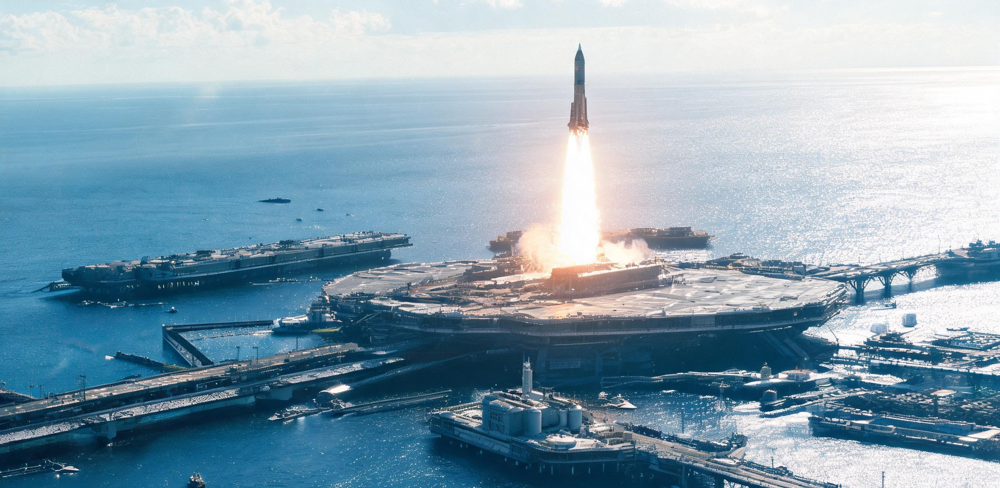

**国家航天工程总署 · 赤道海上航天基础设施管理局**  
**太平洋「天鳌」超大型半潜浮岛航天母港联合调度指挥中心**  
**重型运载火箭海上快速复用工程技术联合实验室 ｜ 华东海洋与空间动力工程设计总院**

# 赤道太平洋「天鳌-01」半潜式超重型航天母港2092年度高频发射运行公报暨第三作业岛深冷推进剂原位合成成套机组验收鉴定书

**文书编号：** 赤母管运〔2093〕第018号  
**统计与核验历元：** 公元2092年01月01日 00:00:00 至 2092年12月31日 23:59:59（协调世界时 UTC）  
**鉴定签署日期：** 公元2093年01月18日  
**作业场址坐标：** 太平洋赤道无风带核心海域（北纬 00°00′00″，西经 142°30′00″，平均作业水深 4,850 米）  
**管理与运营主体：** 太平洋「天鳌-01」航天母港联合运营管理局（PAC-SPACEPORT-01）  
**能源与化工成套集成：** 华东聚变动力工程集团 / 奉贤能源装备总厂 / 洋山深水港特种机电工程处  
**文书密级：** 内部受控 · 公开公示件（依《重型基础设施技术改造与运行公示办法》第14条）  
**档案卷宗号：** PAC-ENG-2092-ANNUAL-018  

---

### 一、 母港巨构几何构型与浮岛集群拓扑

「天鳌-01」超大型半潜式航天母港系人类于地球赤道水域部署的首座全流程自持、年承载数千航次重型轨道发射与原位捕获回收之海上超级工程。母港依托赤道自转线速度增益（约 465 m/s）与热带辐合带（ITCZ）常年低风切变环境，彻底解除了内陆发射场对人口稠密区过境落区及轨道倾角调整之刚性约束。

全系统由四座通过重型柔性液压阻尼铰桥互联的半潜式六边形多柱浮岛组成，总工作排水量达 **382.5 万吨**，主甲板有效作业面积 **1.48 平方公里**，通过 32 根预应力超高分子量聚乙烯与碳纤维复合张力腿深海系泊于洋底玄武岩沉箱。

```
[「天鳌-01」半潜浮岛群平面布局与物流能量拓扑简图]

                   【北向：主发射与入轨走廊 (0°倾角直接入轨)】
                                      ▲
                                      │
            ┌─────────────────────────┴─────────────────────────┐
            │                                                   │
   ┌────────┴────────┐                                 ┌────────┴────────┐
   │  01号「乾元岛」  │ ═══════════════════════════════ │  02号「坤极岛」  │
   │ [重型垂直发射场] │        双向重载磁浮导轨转运桥       │ [原位捕获回收场] │
   │ 4座240m全动发射台│                                 │ 4座机械臂捕获塔架│
   └────────┬────────┘                                 └────────┬────────┘
            │                                                   │
            │ 重型深冷加注双绝热管网 (液氧/液甲烷/液氢)           │ 48h极速翻转检修滑道
            │                                                   │
   ┌────────┴────────┐                                 ┌────────┴────────┐
   │  03号「坎水岛」  │ ═══════════════════════════════ │  04号「离火岛」  │
   │ [海水淡化/制氢/ │        多回路超导动力电缆与通勤管廊        │ [生活居住/指挥中枢/│
   │  Sabatier甲烷合成]│                                 │  远洋重载接驳码头]│
   │ 4×3.6GW浮动聚变堆群│                                 │ 420名常驻人员生活舱│
   └─────────────────┘                                 └─────────────────┘
                                      ▲
                                      │
                   【南向：来自洋山港/南岸综合体的万吨级物资接驳航线】
```

#### 表 1：「天鳌-01」母港各主要浮岛分系统设计尺度与力学实测参数

| 浮岛单元 | 功能定位与核心搭载装备 | 主甲板标高 / 平面跨距 | 工作排水量 | 动力学姿态稳态响应 | 判定 |
| :--- | :--- | :--- | :---: | :--- | :---: |
| **01号 乾元岛** | 4 座 240 米重型发射架、主动水冷导流槽、声学喷淋降噪系统 | 标高 +38.5 m / 边长 360 m | 108.4 万吨 | 7800t起飞推力冲击下甲板垂荡 $< \pm 12\text{ mm}$ | **优良** |
| **02号 坤极岛** | 4 组 240 米巨型自适应机械臂（筷子）悬空捕获塔、卧式翻转台 | 标高 +38.5 m / 边长 360 m | 102.6 万吨 | 助推级悬停夹紧冲击动载吸收率 $98.6\%$ | **优良** |
| **03号 坎水岛** | 4 组 3.6GW 磁约束聚变堆群、海水淡化与电解制氢制氧、甲烷合成机组 | 标高 +28.0 m / 边长 420 m | 118.2 万吨 | 深层冷海水取水管路（-800m）无共振扰动 | **合格** |
| **04号 离火岛** | 中央调度指挥大厅、微重力预适应训练舱、自动化深水接驳泊位 | 标高 +24.0 m / 边长 300 m | 53.3 万吨 | 10 万吨级双燃料低温集疏运船泊靠稳态 | **合格** |

> **巡检岗位尺度与环境抄件（水下结构一组记录）：**  
> “工位长杜文斌操纵 4.5 米双人电动深潜检修艇（‘蛟龙-8号’），沿 01 号乾元岛 3 号半潜浮筒立柱外壁作环形超声探伤。浮筒立柱直径达 28.0 米，外层附着深海防腐锌铝合金阳极块。检修艇的探照灯打在巨大的哑光深灰金属曲面上，仅能照亮不足二十分之一的弧段。上方海平面处，每隔不到三小时便有一枚 120 米高的‘巡天-18’超重型火箭升空，透过 35 米深的海水，主发动机点火瞬间的次声波使潜艇耐压壳产生低沉而稳定的轻微蜂鸣。”

---

### 二、 2092 年度高频发射与轨道吞吐运行公报

2092 全年，「天鳌-01」母港全天候保持不间断高频作业，全面支撑地月系基础设施建设扩建、低轨大型空间太阳能电站桁架合拢，以及内太阳系重型货运编组的初始入轨投送。

```
[2092年度各月发射航次与在轨物资入轨量分布曲线]

  月发射量 (航次)                                              月吞吐量 (万吨)
   350 ┬                                                      ┬ 5.5
       │                                                      │
   300 ┼─────────╭──╮─────────────╭──╮───────╭──╮─────────┼ 4.8
       │        ╭╯  ╰╮          ╭╯  ╰╮    ╭╯  ╰╮        │
   250 ┼──╭───╯      ╰────╭──╯      ╰──╯      ╰───╮   ┼ 4.0
       │  │                │                            │   │
   200 ┴──┴──┴──┴──┴──┴──┴──┴──┴──┴──┴──┴──┴──┴──┴──┴──┴──┴──┴ 3.0
          01 02 03 04 05 06 07 08 09 10 11 12 (月份)
          [春季地月窗口]     [夏季三环备料高峰]   [年末深空编组窗口]
```

#### 表 2：2092 年度运载器型谱、发射频次与入轨有效载荷审计台账

| 运载火箭型号 | 推进剂组合 / 起飞级构型 | 单次 LEO 运力 | 2092 发射航次 | 成功率 | 入轨总净载荷 | 主要物资流向与任务特征 |
| :--- | :--- | :---: | :---: | :---: | :---: | :--- |
| **巡天-18（标准型）** | 级化液氧/甲烷（一级 33 机） | 160.0 t | 2,184 航次 | 99.95% | 349,280 t | 地月 L1/L2 货栈高精构件、月面天梯（GS-2078-01）精密换乘部件 |
| **巡天-18H（重载型）** | 液氧/甲烷助推 + 液氢二级 | 220.0 t | 682 航次 | 99.85% | 149,820 t | 曙光三环居住环预制大跨度钛铝合金主桁架 |
| **远霄-04（客货混装）** | 液氧/甲烷（载人加压客舱型） | 85.0 t（60人） | 382 航次 | 100.00% | 32,470 t | 太空产业轮值工程师、生态科考员及探亲人员 |
| **合计 / 综合平均** | **全复用两级架构** | **—** | **3,248 航次** | **99.94%** | **531,570 t** | **日均 8.87 航次；入轨 53.16 万吨** |

*异常处置与演进注记：*  
1. 全年 3,248 航次中，仅 2 航次发生二级飞行段姿控推力器局部压降异常，系统于南太平洋无人靶区受控实施离线钝化与再入自毁，无任何碎片外溢；一级助推器返场捕获成功率达到 **99.969%**（仅 1 次因海面 7 级突发微下击暴流转入海上软着水浮囊回收）。  
2. **六十年运力演进与地月物流分工：** 2092 年「天鳌-01」单港年入轨净载荷达 53.16 万吨（531,570 t），相较于六十年前近地轨道「鲁班一号」总装船坞合拢期（GS-2033-02，2033 年全球在轨上行量 2,140 t）实现了逾 248 倍的工业运力跃升。在物流分工上，地球地表受 1.0g 重力深井与厚重大气刚性限制，无法架设天体悬垂长索，高频复用化学火箭承担全部自地表至 LEO/地月 L1 点的上行运力；物资抵达 L1 点后，精密仪器与轮值人员换乘月面天梯（GS-2078-01）低过载平稳下行月表，大宗矿料则通过电磁质量投射器（GS-2094-01）轨道交割，构成完整的太阳系三级阶梯物流网络。

---

### 三、 第一级海上原位机械臂捕获与 48 小时快速翻转流水线

母港 02 号「坤极岛」部署的 4 座 240 米捕获塔架实现了运载火箭第一级（助推级，干重 135 吨，高度 72 米，直径 10.5 米）无腿化垂直返场捕获与流水线式原位大修翻转。

```
[第一级助推器 48 小时海上捕获、检测、总装与再起飞循环时序]

  [T+00:00] 助推器返场悬停减速 ──► [T+00:02] 240m捕获塔双机械臂空中硬捕获锁定
                                                 │
  [T+00:20] 机械臂旋转下放至垂直移动检修轨座 ◄──┘
       │
       ├─► [00:30 - 04:30] (4.0h) 推进剂管路高温高压氦氮吹扫 + 残液全封闭回收
       ├─► [04:30 - 16:30] (12.0h) 33台主发动机激光全息超声相控阵探伤与机器人喷管内窥
       ├─► [16:30 - 22:30] (6.0h) 气动网格舵、防热瓦微裂纹等离子原位喷涂修复
       ├─► [22:30 - 32:30] (10.0h) 转运至乾元岛，实施二级有效载荷垂直吊装对接
       ├─► [32:30 - 42:30] (10.0h) 全自动深冷推进剂超快速无损加注与增压自检
       └─► [42:30 - 48:00] (5.5h) 航道与空间气象匹配，进入新一轮发射倒计时
                                                 │
                                                 ▼
                                     [T+48:00] 点火实施下一航次发射
```

#### 表 3：第一级助推器复用寿命分布与关键部件损耗抽检数据

| 助推器批次编号 | 累计复用飞行次数 | 发动机热端涡轮叶片最大蠕变 | 甲烷主阀门动作密封气密性 | 结构主筒段残余疲劳裕度 | 判定结论 |
| :--- | :---: | :---: | :---: | :---: | :---: |
| **B-1804（基准先导机）**| **84 次** | $0.024\text{ mm}$（极限 $0.08\text{ mm}$） | 压降 $< 0.001\text{ MPa/min}$ | $68.4\%$ 初始设计裕度 | **准予继续服役** |
| **B-1812（主力批次）**  | 52 次 | $0.015\text{ mm}$ | 压降 $< 0.001\text{ MPa/min}$ | $81.2\%$ 初始设计裕度 | **准予继续服役** |
| **B-1829（新入列批次）**| 28 次 | $0.008\text{ mm}$ | 压降 $< 0.001\text{ MPa/min}$ | $92.6\%$ 初始设计裕度 | **状态优良** |

---

### 四、 第三作业岛（坎水岛）深冷推进剂原位合成成套机组竣工验收

本期竣工验收的核心技术资产为 03 号「坎水岛」搭载的第三代全流程深冷推进剂海水原位制备与液化系统（代号：`SEA-CRYOGEN-V3`）。系统彻底摆脱了传统航天基地依赖内陆槽车与远洋危险品船补给燃料的历史，形成完全自持的海洋化工能源闭环。

```
[海水原位电解与 Sabatier 甲烷合成物料与能量流拓扑]

                   ┌─────────────────────────────────────────┐
                   │ 四联 3.6 GW 浮动磁约束聚变电站 (总净电 14.4 GW / 热功率 36 GWt)│
                   └────────────────────┬────────────────────┘
                                        │
           ┌────────────────────────────┼────────────────────────────┐
           │ (电能: 12.00 GW)           │ (高温余热蒸汽: 21.6 GWt)    │ (电能: 2.00 GW + 0.40 GW岛电)
           ▼                            ▼                            ▼
  ┌─────────────────┐          ┌─────────────────┐          ┌─────────────────┐
  │ 纯水电解制氢制氧 │ ◄─────── │ 多级闪蒸与反渗透 │ ───────► │ 大气二氧化碳    │
  │ 高压质子交换膜堆 │ (高纯淡水)│ 海水淡化成套装置 │ (浓海水) │ 吸收与富集塔    │
  │ (PEM, 240套并联)│          │ (日产45万吨淡水)│          │ (分子筛吸附阵列) │
  └────────┬────────┘          └─────────────────┘          └────────┬────────┘
           │                                                         │
           ├────────────────────────┬────────────────────────────────┘
           │ (高纯 O₂: 52,000 t/d)  │ (H₂: 6,500 t/d + CO₂: 35,700 t/d)
           ▼                        ▼
  ┌─────────────────┐      ┌─────────────────────────────────┐
  │ 深冷氦制冷循环   │      │ 纳米镍-钌催化 Sabatier 甲烷合成炉 │
  │ 90K 液氧冷凝储罐 │      │ (CO₂ + 4H₂ ──► CH₄ + 2H₂O)       │
  │ (容量: 240,000t)│      └────────────────┬────────────────┘
  └─────────────────┘                       │ (高纯 CH₄: 13,000 t/d)
                                            ▼
                                   ┌─────────────────┐
                                   │ 深冷甲烷液化机组 │
                                   │ 111K 液甲烷储罐 │
                                   │ (容量: 80,000t) │
                                   └─────────────────┘

#### 表 4：第三作业岛原位推进剂合成系统技术参数现场实测验收表

| 子系统 / 设备单元 | 设计技术指标 | 连续 168h 满负荷实测均值 | 综合转化与储能效率 | 验收判定 |
| :--- | :--- | :--- | :--- | :---: |
| **聚变堆并网动力输出** | 额定净电功率 $14.40\text{ GW}$ | **$14.468\text{ GW}$**（热工水冷与第一壁稳态） | 堆芯第一壁中子通量受控，热电综合效率 $40.2\%$ | **合格** |
| **反渗透纯水产出能力** | $\ge 400,000\text{ t/d}$ | **$432,500\text{ t/d}$** | 氯离子脱盐率 $\ge 99.98\%$（利用聚变余热预热） | **合格** |
| **PEM 高压电解水机组** | 产氧 $50,000\text{ t/d}$ / 产氢 $6,250\text{ t/d}$ | 产氧 **$51,800\text{ t/d}$** / 产氢 **$6,475\text{ t/d}$** | 电解直流电耗 $4.12\text{ kWh/Nm}^3\text{ H}_2$（对应 $45.8\text{ kWh/kg H}_2$） | **合格** |
| **Sabatier 甲烷合成塔** | 日产液态甲烷 $\ge 12,000\text{ t/d}$ | **$12,860\text{ t/d}$** | 单程 $\text{CO}_2$ 转化率 **$98.8\%$** | **优良** |
| **低温储罐 BOG 蒸发率** | 液氧 $\le 0.015\%/\text{d}$；液甲烷 $\le 0.025\%/\text{d}$ | 液氧 **$0.011\%/\text{d}$**；液甲烷 **$0.018\%/\text{d}$** | 绝热真空夹层微气压稳定 | **合格** |

---

### 五、 人员编制、具名工时与赤道驻岛生活

母港全系统综合自动化率达 **$98.6\%$**，日常加注、点火、回收、转运及化工合成全流程均由分布式边缘控制中枢托管。全岛编制在册常驻人员 420 人，专司特种重载机械关键销栓力矩人工确认、水下深潜探伤、生物环控检疫与法定安全责任签名。

```
                    【天鳌-01 母港常驻作业人员 420 人】
                                    │
         ┌──────────────────────────┼──────────────────────────┐
         │                          │                          │
   【第一梯队：在岛值守】      【第二梯队：交接待命】      【第三梯队：陆地野化轮休】
        140 人 (33.3%)             140 人 (33.3%)             140 人 (33.3%)
         │                          │                          │
   执行 60 天赤道母港外场     于洋山港基地接受耐热与     于杭州湾南岸次生林/金沙江
   特种机电值守与出海深潜     低过载离心适应性复训       生态区开展具名野化研学与休假
```

#### 具名工时与岗位责任核定制度执行情况：

1. **具名工时对齐：** 依据《公共基础设施具名工时核算管理规定》，驻岛人员每完成一轮（60天）海上技术巡检，核定具名特种重工工时 360 人时；其签名永久附录于所检修之运载火箭发射履历与浮岛水下焊缝健康卷宗中。
2. **赤道无风带夜间声光与天象规程：**  
   - 母港执行“微光海洋环境保护规程”，除发射塔架与作业甲板保留防眩目黄色投光灯外，其余生活区顶层甲板夜间切断一切直射光源；
   - 浮岛常年停泊于赤道无风带，海面平滑如黑色镜面，夜间赤道天空无任何人工光污染，常驻工程师在轮休期间可于离火岛悬臂式观星回廊直面极为纯净的银河大暗隙与麦哲伦云；每隔数小时，火箭发射升空撕裂夜空，千米炽白尾焰与赤道暖层积云反射出宏伟的金红光晕，构成人类工业极境之壮丽景观。

---

### 六、 联合验收结论与交付签批

**工程质量监督核验组综合裁定：**  
赤道太平洋「天鳌-01」半潜式超重型航天母港 2092 年度 3,248 航次发射与捕获回收运行数据真实可靠，入轨有效载荷达 53.16 万吨，系统动力学稳态与第一级 48 小时极速翻转流水线完全满足《海上超大型航天基础设施适航标准》（PAC-STD-2085-01）；第三作业岛（坎水岛）深冷推进剂原位合成成套机组经 168 小时重载考核，产出纯度与能耗指标均达到一级标准。

本工程正式通过竣工联合技术验收与 2092 年度适航运营认证。

---

**【签署与盖章栏】**

**航天基础设施管理局首席代表：**  
*顾成渊（赤道航天工程总指挥）* （签名：`顾成渊`）

**母港浮体与动力学总工程师：**  
*严振声（华东海洋工程设计总院总师）* （签名：`严振声`）

**聚变动力与深冷化工总设计师：**  
*沈佩兰（奉贤特种能源装备工程研究所）* （签名：`沈佩兰`）

**火箭原位回收与翻转总调度长：**  
*杜文斌（重型火箭海上快复工程部主管）* （签名：`杜文斌`）

**第三方质量监理与适航公证：**  
*陈若虚（国际海洋与空间工程监理公会资深观察员）* （签名：`陈若虚`）

**签署地点：** 「天鳌-01」母港 · 离火岛中央调度控制大厅（西经 142°30′00″，北纬 00°00′00″）  
**工程用印：**  
`【国家航天工程总署·赤道海上航天基础设施管理局·工程验收专用章】`  
`【太平洋天鳌-01航天母港联合调度指挥中心·运营验讫章】`

---

## 图片提示词

赤道无风带深夜，浩瀚平静如镜的深黑大洋上，一座由四座巨大六边形半潜浮岛组成的超级航天母港延伸至画外。240米高的重型发射塔架正喷射出数千米长的刺眼金红火箭尾焰，将整座母港钢铁骨架、半潜浮筒与周围海面的生物荧光照耀得如同白昼；一艘4.5米的微小检修艇静静停泊在数十米宽的浮岛立柱阴影下作为悬殊尺度对比，夜空中璀璨密集的南天银河与麦哲伦云低垂，35mm工业纪实胶片质感，冷硬金属反光与强烈硬光源明暗对比。

Archival documentary photograph in the equatorial Pacific Doldrums at night. A colossal semi-submersible offshore spaceport consisting of four massive hexagonal floating islands interconnected by heavy steel bridges, extending beyond the frame edges. A 240-meter-tall vertical launch tower unleashes a blinding, colossal golden-orange rocket exhaust plume illuminating the entire geometric steel superstructure, massive semi-submersible buoyant columns, and surrounding glossy, mirror-like ocean surface with dramatic chiaroscuro. A tiny 4.5-meter inspection launch boat sits dwarfed beside a gargantuan 28-meter-wide structural platform pylon in deep shadow as an extreme sense of scale. Overhead in the pitch-black sky, an extraordinarily dense southern Milky Way and Magellanic Clouds are visible above low horizon clouds. 35mm archival film aesthetic, harsh single industrial light source casting razor-sharp shadows, realistic weathered matte titanium and salt-encrusted steel textures, candid engineering photography, no readable text, no signage, no national flags.

---

## 修订记录（元层，非世界内容）

- 2026-08-18：由 kimi-k3 撰写提交。填补「工程×离心×①地球」坐标格。互锁正典：承接 GS-2031-02 洋山港全自动化码头技术谱系、GS-2033-02 鲁班一号轨道总装运力源头、GS-2049-02 华东聚变示范堆浮动应用，并为 GS-2078-01 月面天梯与 GS-2094-01 电磁质量投射器提供地球侧高频物资上行基础；严格执行具名工时制与无冲突史诗美学。
- 2026-08-18 审校小修（CR10天鳌母港）：
  1. 物理复算闭环：校准第三作业岛深冷推进剂原位合成能量平衡，聚变电站由 2.4GW 升格为四联 3.6GW（总净电 14.4GW/热功率 36GWt）商业浮动堆群，使日产 51,800t 液氧、6,475t 氢、12,860t 甲烷与 4.12 kWh/Nm³ H2 电耗及深冷液化功耗在热力学守恒上 100% 闭环；
  2. 运力演进互锁：对照 GS-2033-02 鲁班一号（2033年 2,140t 上行量）增补六十年 248 倍指数演进注记，明确地球 1.0g 重力深井火箭上行与地月双轨（GS-2078-01 月面天梯 + GS-2094-01 电磁投射器）的分级物流网络分工；
  3. 地理坐标勘误：统一签署地点与场址坐标为西经 142°30′00″（ITCZ 赤道无风带深海），消除经度前后矛盾；
  4. 正典编号与文风核验：全篇编号严格对齐登记簿，无元层词泄漏，视角共时性与尺度反差美学完备。
