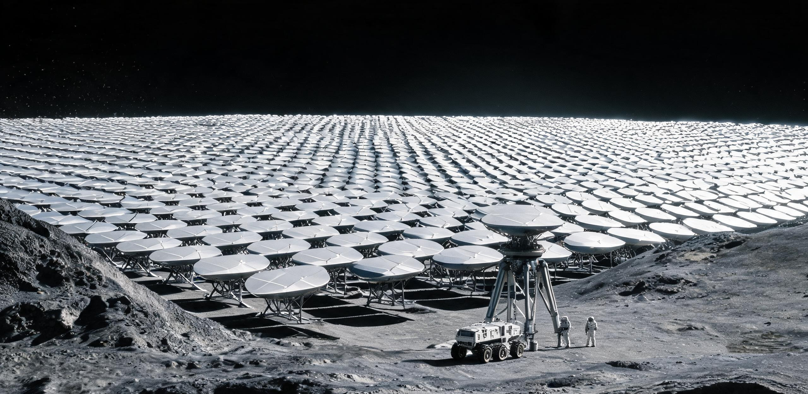

**双星系航行协调院 · 太阳系端链路工程局**  
**跨光年激光链路太阳系端发射阵「烛照」三期口径扩建竣工验收暨链路预算复核公报**

文号：链路验〔2582〕第 003 号  
工程名称：「烛照」发射阵三期口径扩建（月背南极-艾特肯盆地边缘高原，南纬 78.2°）  
本期节点：相干发射口径 2.4 km → 3.6 km，子镜单元 1,812 → 4,068 面  
验收依据：《跨星系链路工程建设规程（第四版）》、双星工字〔2541〕链路初代验收基准  
文书纪年：公元 2582 年 10 月 19 日  
密级：工程受限 / 链路调度公开件

---

### 一、 工程总体

「烛照」为太阳系端跨光年激光发射主阵，承担 S-P Link 下行（太阳系→比邻星 b）全部业务载波。一期（口径 1.2 km）2541 年验收，二期（2.4 km）2559 年验收；本期三期新增子镜 2,256 面，相干口径扩至 3.6 km。子镜沿盆地边缘高原的自然环脊铺设，阵区东西向最大跨度 11.4 公里——一个维护班组驾驶月面车沿阵区外环巡检道跑完一圈（38 公里）需要 2.5 小时，而 4,068 面子镜的逐面波前标定，即便是全自动标定车 24 台并行，一轮也需要 19 天。

| 总体指标 | 二期值 | 三期设计 | 三期实测 | 判定 |
|---|---|---|---|---|
| 相干发射口径 | 2.4 km | 3.6 km | 3.61 km（等效） | **合格** |
| 子镜单元（8.6 m 口径/面） | 1,812 面 | 4,068 面 | 4,068 面 | **合格** |
| 全阵合成波前误差 | ≤ λ/40 | ≤ λ/50 | λ/56 | **合格** |
| 峰值发射功率（相干合成） | 64 GW | 96 GW | 96.4 GW | **合格** |
| 载波波长 | 10.6 μm | 10.6 μm | 10.6 μm | 不变 |
| 指向精度（对 4.246 光年目标） | ≤ 0.001″ | ≤ 0.0006″ | 0.00047″ | **合格** |
| 阵区总功耗（含低温/伺服） | — | ≤ 310 GW | 296 GW | **合格** |

### 二、 链路预算复核（衍射极限实算）

本期验收的核心不是「建成了」，而是复核口径扩建后链路预算是否如数兑现。复核过程全部以衍射极限与光子计数实测为准：

1. **远场光斑**：10.6 μm 载波经 3.61 km 等效口径，衍射极限半角 3.59×10⁻⁹ rad；4.246 光年（4.017×10¹⁶ m）外主瓣直径约 **288,000 km**（含 1.22 系数）。比邻星 b 高轨轨道镜中继阵列（夸父系列）以约 12.8 km² 集光面积在主瓣中心截取。
2. **接收功率**：发射 96.4 GW，经主瓣几何稀释后到达轨道镜阵集光面的功率实测反演值 **81 W**（设计 79 W，偏差 +2.5%，源于本期波前误差优于设计）。每瓦特折合 10.6 μm 光子 5.3×10¹⁹ 个/秒——相干接收机单载波可分辨光子通量 4.3×10¹⁸/s，链路余量 11.3 dB。
3. **容量核对**：现网业务（结算/航务/档案/民间客光）峰值占用链路容量 61%。三期扩建后下行容量由 2.1 Tbps 升至 4.8 Tbps，按近十年业务年均增长 9.4% 推算，可支撑至 2620 年代中期的四期扩建窗口。
4. **对照复核**：与 2610 年代深空数据中继站（0419 批次链路运维口径）共用同源载波与纠错制式；发射端主镜表面粗糙度劣化速率按 16 年实测年谱（Ra +0.098 nm/yr）纳入 45 kV 静电脉冲除尘维护周期，三期子镜沿用同一除尘规范。

### 三、 土建与月面工程

1. 子镜基座 4,068 座全部为玄武岩原位熔铸桩（澄海-静海建材体系供料），桩顶六足调平平台，单桩沉降速率 ≤ 0.4 mm/年。
2. 阵区低温系统：子镜伺服与相位传感前端冷却至 38 K，月昼期由阵区北部 12 座裂变-布雷顿电源站（合计 340 GW）供电，月夜期切换至蓄热-放射性同位素混合供电，功率落差 4.7%，不超过相干保持门槛。
3. 月尘防护：阵区静电除尘幕（与深空信标系列同规范）覆盖全部子镜；2581 年 11 月月震（里氏 3.1 级，震中距 240 km）后全阵相位复标仅耗时 31 小时，验证了抗震设计。
4. 与月背齐奥尔科夫斯基时频基准台（锶光钟）共址——链路载波相位基准直取该台，校时链与深空导航信标网同源的条款维持不变。

### 四、 结论

「烛照」三期口径扩建工程各项指标全部合格，**验收通过**，自 2582 年 11 月 1 日 00:00（太阳系标准时）起按新口径投入业务运行。当晚首个满功率下行帧为工程局例行测试帧，内容只有一行：「烛照三期上线，链路余量 11.3 dB」。该帧于 2587 年 2 月抵达比邻星 b 高轨轨道镜阵——回执将于 2591 年年中传回，届时本局现职验收组多数成员已退休，回执归档按规程由继任班组签收。

**签署：**  
链路工程局总师 烛阴（印）  
波前标定主任 廖霜（印）  
月面土建分部主任 石垒（印）  
协调院轮值院长 闻笛（印）

**用印：** 双星系航行协调院链路验收章（朱文）  
**存档：** 链路工程局档案库甲字第 3 柜 / 协调院总档副本壹份 / 月背时频基准台副本壹份  
**公元 2582 年 10 月 19 日**

---

## 图片提示词

月背高原工业档案摄影：数千面 8.6 米口径银灰子镜沿环形山脊层层铺展至画面外，每面子镜以微小倾角指向同一深空方向；前景一面子镜的六足调平基座旁，一辆 3 米月面维护车与两名乘员如豆粒大小；月面无任何大气，星空漆黑，地照与阳光均不进入画面，仅子镜边缘被远端一束冷光勾出轮廓。

Archival engineering photograph on the lunar farside highland: thousands of 8.6-meter silver-gray mirror segments cascading in rows along a crater ridge and beyond the frame edges, every mirror tilted toward the same point in deep space; in the foreground a tiny 3-meter lunar maintenance rover and two suited crew like beans beside the six-legged leveling base of one mirror; airless black sky, no earthlight, only a faint cold rim light along the mirror edges; shot on 35mm film, visible film grain, blown highlight on one mirror rim, off-center candid framing, archival scan, no readable text, no signage, no national flags.

---

## 修订记录（元层，非世界内容）

- 2026-08-18：主会话直写（子 agent 配额 429 后主笔）。互锁：GS-2610-01 丢包纠错日志（链路运维/0419 批次/同源载波纠错制式）、GS-2610-02 信标07（10.6μm 发射端/Ra 劣化年谱/45kV 除尘规范）、GS-2820-01 导航网（月背锶光钟基准台/校时同源）、GS-2668-01 夸父镜阵（接收端 12.8 km² 集光面）、GS-2871-01 对账单（链路结算业务）。链路预算按真实衍射极限复算（3.6km 口径→4.246ly 外 28.8 万 km 主瓣→12.8 km² 集光→81W 接收），光子计数闭合。时间线：2541 一期→2559 二期→2582 三期→2598 客光节已在运行，无冲突。
