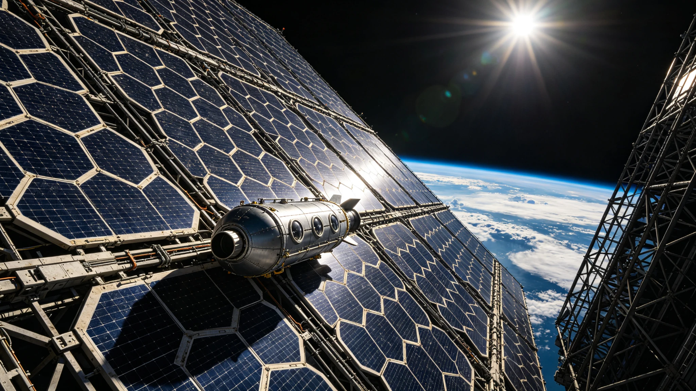

# 近地轨道太阳能电站首组阵列并网运行公报

**签发单位**：国家空间能源工程指挥部 · 近地轨道太阳能电站项目办
**公报编号**：SPS-LEO-2030-001
**签发日期**：2030年6月15日

---

## 一、项目概况

近地轨道太阳能电站（Space Power Satellite-Leo，简称SPS-LEO）首组阵列于2030年6月12日04时17分（UTC）完成最后一组光伏模块展开，6月14日22时03分通过微波无线输电通道向地面接收站（海南文昌整流天线场）首次输送有效电力。经72小时连续考核运行，首组阵列于6月15日18时正式宣布并网。

| 项目参数 | 数值 |
|---|---|
| 阵列轨道高度 | 1,200 km（太阳同步轨道） |
| 首组阵列展开面积 | 0.8 km² |
| 光伏模块总数 | 12,480块 |
| 设计发电功率（阳面） | 480 MW |
| 微波输电频率 | 2.45 GHz |
| 地面整流天线场面积 | 3.2 km² |
| 端到端输电效率（实测） | 41.7% |
| 地面净输出功率 | 约200 MW |

## 二、并网考核运行数据

考核期内（6月12日—6月15日），阵列经历6个轨道周期的阳面—阴影交替，累计发电时长42.3小时。关键运行指标如下：

| 监测项 | 设计阈值 | 实测均值 | 偏差 | 判定 |
|---|---|---|---|---|
| 光伏转换效率 | ≥28.5% | 29.1% | +0.6% | 合格 |
| 微波发射天线指向精度 | ≤0.02° | 0.014° | -0.006° | 合格 |
| 地面接收场功率密度峰值 | ≤2.4 mW/cm² | 2.1 mW/cm² | -0.3 | 合格 |
| 阵列热控温差 | ≤85 K | 79 K | -6 K | 合格 |
| 微流星撞击告警次数 | — | 3次（均<1mm） | — | 记录在案 |

## 三、人员与物资

| 类别 | 数量 | 备注 |
|---|---|---|
| 在轨运维乘员 | 14人 | 分两班7人轮值，每班6小时 |
| 地面接收站值守 | 47人 | 含电磁安全巡检12人 |
| 在轨补给（首季度） | 推进剂4.2吨、备件3.8吨 | 由"长征-9B"第17次货运任务送达 |
| 累计入轨发射次数 | 23次 | 2028年11月—2030年5月 |

## 四、存在问题与后续安排

1. **第7-B号光伏模块输出偏低**：实测效率26.8%，低于阵列均值2.3个百分点，初步判定为展开过程中微流星擦痕导致栅线损伤。已列入下一次舱外巡检（计划7月3日）更换清单。
2. **微波输电通道电离层闪烁**：考核期内出现2次持续约90秒的信号衰落，与赤道电离层不规则体活动相关。项目办已与国家空间天气监测中心建立联动预警机制。
3. **后续阵列建设**：第二组阵列（1.2 km²，设计功率720 MW）模块已在地面总装，计划2030年9月起分8次发射入轨，预计2031年第二季度并网。全部六组阵列建成后总装机容量预计达3.6 GW。

## 五、电磁安全声明

本电站微波输电通道经国家无线电管理委员会频率指配（2.45 GHz ISM频段扩展授权），地面接收场外围设置500米电磁安全隔离带，场界功率密度低于0.1 mW/cm²，符合国际非电离辐射防护委员会（ICNIRP）2025年修订标准。隔离带内禁止未经审批的航空器飞越。

---

**签发人**：项目办主任 周明远（电子签名）
**抄送**：国家能源局、国家航天局、海南省政府、文昌接收站运维公司
**归档**：国家空间能源工程档案库 · 卷号SPS-LEO-2030-A01
