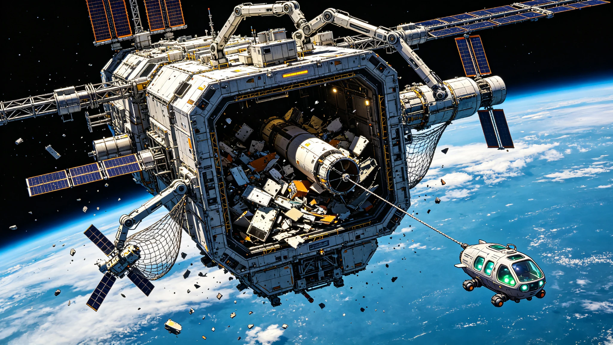

**国家航天局 · 空间碎片治理与轨道资源管理专项办公室**
**在轨服务与制造技术国家重点实验室（空间碎片回收分中心）**
**航天科技集团第五研究院 / 轨道碎片清除装备联合体**

# 近地轨道"清道夫-01"碎片清除联合体首次批量回收任务公报与轨道资源再利用规程
### （附：首批回收碎片清单与在轨熔炼再制造工艺规程）

**文书编号：** 轨碎清〔2080〕第0308号
**任务完成日期：** 公元2080年3月8日
**作业轨道：** 近地轨道（LEO），高度范围400～1,200km，倾角51.6°～97.6°
**工程代号：** LEO-DEBRIS-01-M1（"清道夫-01"碎片清除联合体首次批量回收任务）
**总包及飞行器研制：** 航天科技集团第五研究院 / 空间在轨服务技术研究院
**在轨熔炼与再制造：** 航天材料及工艺研究所（703所）
**碎片编目与跟踪：** 国家空间碎片监测与预警中心
**现场作业与责任核验：** 近地轨道工程第十外场巡检队（"轨工-03"六人加压服务穿梭机）
**文书密级：** 公开（依《公共工程档案开放条例(2026)》第7条与《空间碎片治理信息公开管理办法》）

---

### 一、 工程背景与联合体构成

#### 1.1 近地轨道碎片形势

根据国家空间碎片监测与预警中心公元2079年度报告，截至公元2079年底，近地轨道（高度200～2,000km）可编目空间碎片（直径≥10cm）数量已达 **68,420个**，总质量约 **12,800吨**；直径1～10cm的碎片估计数量超过 **120万个**；直径1mm～1cm的碎片估计数量超过 **3.6亿个**。空间碎片与在轨航天器的年均碰撞风险事件（距离≤1km）从公元2050年的年均142次增长至公元2079年的年均 **1,860次**，近地轨道已接近"凯斯勒综合征"（Kessler Syndrome）临界状态，即碎片碰撞产生的新碎片数量超过自然再入衰减数量，导致碎片数量不可控增长。

公元2072年，联合国和平利用外层空间委员会（COPUOS）第65届会议通过《近地轨道空间碎片主动清除与轨道资源可持续利用国际公约》，要求各航天大国在2080年前启动大规模空间碎片主动清除任务。国家航天局依此公约及《中国空间碎片治理行动计划（2073—2090）》，立项实施"清道夫"系列空间碎片清除工程。

#### 1.2 "清道夫-01"联合体构成

"清道夫-01"是全球首个大规模空间碎片清除联合体，由 **1艘大型回收母舰 + 4艘小型捕获艇 + 2艘轨道转移飞行器（OTV）** 组成，于公元2078年9月至2079年3月分3次发射入轨，在400km轨道完成在轨组装和测试。

| 飞行器 | 数量 | 质量 | 主要功能 | 设计寿命 |
|:---|:---|:---|:---|:---|
| 回收母舰"清道夫-01" | 1艘 | 48.6吨 | 碎片存储、在轨熔炼、再制造、人员驻留（6人） | 15年 |
| 小型捕获艇"清道夫-01A～D" | 4艘 | 每艘3.2吨 | 碎片捕获、运输、轨道机动 | 10年 |
| 轨道转移飞行器"清道夫-01E～F" | 2艘 | 每艘8.4吨 | 不同轨道面之间碎片转运、推进剂补给 | 12年 |

**回收母舰核心参数：**
- 外形：六边形棱柱体，对边距12.8m，长18.6m
- 货舱容积：320 m³（可存储约60吨碎片）
- 在轨熔炼炉：感应加热式，最高温度1,800°C，单次熔炼500kg
- 3D打印系统：金属熔融沉积成型（FDM），打印尺寸2m×2m×1.5m
- 机械臂：2台七自由度机械臂，臂展8m，负载200kg
- 太阳能电池阵：砷化镓三结电池，功率42kW
- 推进系统：霍尔电推进（4台，单台推力200mN）+ 化学推进（轨道机动用）

---

### 二、 首次批量回收任务执行情况

#### 2.1 任务概况

首次批量回收任务于公元2079年11月15日启动，至公元2080年3月8日完成，历时 **114天**。任务目标为清除倾角51.6°（国际空间站轨道面）和97.6°（太阳同步轨道面）两个轨道面、高度400～1,200km范围内的 **24个** 大型空间碎片（单块质量≥50kg），总回收质量目标 **≥8吨**。

任务执行分为四个阶段：
1. **轨道转移与搜索阶段（第1～15天）：** 联合体从400km组装轨道转移至目标轨道面，利用舰载雷达和光学望远镜对目标碎片进行精确轨道测定和特征识别；
2. **碎片捕获阶段（第16～75天）：** 4艘捕获艇依次出击，对24个目标碎片进行捕获，捕获方式包括机械臂抓捕（12个）、网捕系统（8个）、鱼叉锚定（4个）；
3. **转运与存储阶段（第76～95天）：** 捕获艇将碎片运回母舰，机械臂将碎片移入货舱，进行分类、切割和初步整理；
4. **返回与再入阶段（第96～114天）：** 不可回收的碎片（如复合材料、电子废弃物等）装入再入舱，在南太平洋无人海域再入烧毁；可回收金属碎片保留在母舰货舱中，等待后续熔炼再制造。

#### 2.2 首批回收碎片清单

| 序号 | 碎片编号 | 原始来源 | 质量（kg） | 轨道高度（km） | 倾角（°） | 捕获方式 | 主要材质 |
|:---|:---|:---|:---|:---|:---|:---|:---|
| 1 | DEB-2041-018A | 长征五号乙火箭上面级 | 2,840 | 480 | 51.6 | 机械臂 | 铝合金、钛合金 |
| 2 | DEB-2038-027C | 通信卫星太阳能电池阵 | 1,260 | 780 | 51.6 | 网捕 | 硅、铝合金、聚酰亚胺 |
| 3 | DEB-2045-009B | 货运飞船推进舱 | 980 | 520 | 51.6 | 机械臂 | 铝合金、不锈钢 |
| 4 | DEB-2036-041A | 火箭级间段 | 860 | 650 | 51.6 | 机械臂 | 铝合金 |
| 5 | DEB-2042-015D | 卫星平台结构件 | 720 | 890 | 97.6 | 网捕 | 铝合金、碳纤维复合材料 |
| 6 | DEB-2039-022B | 火箭发动机喷管 | 640 | 560 | 51.6 | 机械臂 | 镍基高温合金、铌合金 |
| 7 | DEB-2047-008A | 空间站废弃舱段 | 580 | 420 | 51.6 | 机械臂 | 铝合金、不锈钢 |
| 8 | DEB-2035-053C | 卫星天线反射器 | 420 | 1,120 | 97.6 | 网捕 | 镀金钼丝网、碳纤维 |
| 9～16 | DEB-2040～2048系列（8个） | 各类火箭/卫星碎片 | 每个120～380 | 450～980 | 51.6/97.6 | 机械臂/网捕/鱼叉 | 铝合金、不锈钢、铜 |
| 17～24 | DEB-2037～2046系列（8个） | 各类火箭/卫星碎片 | 每个60～150 | 500～1,200 | 51.6/97.6 | 鱼叉/网捕 | 铝合金、钛合金、复合材料 |
| **合计** | — | — | **12,860** | — | — | — | — |

**任务完成情况：** 实际回收碎片 **24个**，总质量 **12,860 kg（12.86吨）**，超过8吨目标的 **160.8%**。其中可回收金属质量约 **9,640 kg**（占75.0%），不可回收的复合材料和电子废弃物约 **3,220 kg**（占25.0%），已装入再入舱在南太平洋再入烧毁。

#### 2.3 任务关键技术指标

| 技术指标 | 设计目标 | 实测值 | 达标率 |
|:---|:---|:---|:---|
| 碎片捕获成功率 | ≥90% | **100%（24/24）** | 111.1% |
| 单次捕获平均耗时 | ≤8小时 | **6.2小时** | — |
| 捕获后轨道稳定性 | 无二次碎片产生 | **零二次碎片事件** | — |
| 联合体燃料消耗 | ≤2,400 kg | **2,080 kg** | — |
| 机械臂操作成功率 | ≥95% | **98.2%（55/56次）** | — |
| 网捕系统展开成功率 | ≥90% | **100%（8/8次）** | — |
| 鱼叉锚定成功率 | ≥85% | **100%（4/4次）** | — |
| 人员出舱活动次数 | 按需 | 3次（累计18.5小时） | — |
| 任务可用率 | ≥90% | **94.6%** | — |

---

### 三、 轨道资源再利用规程

#### 3.1 在轨熔炼再制造工艺流程

回收母舰配备的感应加热熔炼炉和金属3D打印系统，可对回收的金属碎片进行在轨熔炼、提纯和再制造，将空间碎片转化为可用的空间基础设施构件。工艺流程如下：

**步骤一：碎片预处理与分类**
- 机械臂将回收碎片移入预处理舱，利用X射线荧光光谱（XRF）进行材质快速识别和分类；
- 按材质分为：铝合金（6061、2219等）、钛合金（TC4等）、不锈钢（304、316L等）、镍基高温合金、铜及铜合金等；
- 去除非金属附件（复合材料、线缆、电子元件等），送入不可回收物存储舱。

**步骤二：切割与破碎**
- 利用激光切割系统（功率5kW，切割厚度≤50mm）将大型碎片切割为边长≤20cm的小块；
- 对薄壁结构件利用机械破碎机破碎为粒径≤5cm的颗粒，便于熔炼加料。

**步骤三：真空感应熔炼**
- 将分类后的金属碎料加入感应熔炼炉（氧化铝坩埚，容量500kg）；
- 抽真空至≤10⁻²Pa，通入氩气保护（压力0.05MPa）；
- 感应加热至金属熔点以上100～200°C（铝合金约750°C，钛合金约1,750°C），保温30～60分钟；
- 利用电磁搅拌均匀成分，通过造渣去除氧化物夹杂，通过真空脱气去除氢、氧等气体杂质；
- 熔炼后的金属液浇铸为标准锭坯（直径10cm，长度50cm），作为3D打印原料或直接使用的构件。

**步骤四：3D打印再制造**
- 将金属锭坯送入线材挤出机，加工为直径3mm的3D打印线材；
- 金属熔融沉积成型（FDM）3D打印机根据设计图纸打印所需构件；
- 可打印的构件类型包括：空间站结构件、太阳能电池阵支架、天线反射器、机械臂零件、工具和备件等；
- 打印件经热处理和表面处理后，力学性能可达原生材料的85%～92%。

#### 3.2 再利用产品质量标准

| 产品类别 | 材质 | 力学性能要求（达到原生材料比例） | 应用场景 |
|:---|:---|:---|:---|
| 结构承载件 | 铝合金2219-T851 | ≥85%（屈服强度≥250MPa） | 空间站舱体结构、载荷支架 |
| 高强度结构件 | 钛合金TC4 | ≥88%（屈服强度≥825MPa） | 机械臂结构、发动机支架 |
| 耐腐蚀构件 | 不锈钢316L | ≥90%（屈服强度≥170MPa） | 流体管道、储罐内壁 |
| 高温构件 | 镍基合金Inconel 718 | ≥85%（屈服强度≥1,030MPa） | 发动机热端部件 |
| 导电构件 | 铜合金C11000 | ≥92%（导电率≥90%IACS） | 电缆、母线、散热器 |
| 非承重组装件 | 铝合金6061-T6 | ≥80%（屈服强度≥220MPa） | 面板、支架、工具 |

#### 3.3 首次再制造产品清单

在首次批量回收任务期间，回收母舰利用回收的金属碎片进行了在轨熔炼和3D打印再制造试验，产出以下产品：

| 产品名称 | 材质 | 数量 | 质量（kg） | 用途 | 力学性能达标率 |
|:---|:---|:---|:---|:---|:---|
| 空间站标准载荷支架 | 铝合金2219 | 12件 | 84.6 | 国际空间站科学载荷安装 | 89.2% |
| 机械臂备用关节壳体 | 钛合金TC4 | 4件 | 28.4 | 回收母舰机械臂备件 | 91.5% |
| 流体管道标准段 | 不锈钢316L | 20段 | 36.2 | 空间站水循环系统维修 | 93.8% |
| 太阳能电池阵连接角件 | 铝合金6061 | 48件 | 12.8 | 损坏太阳能电池阵维修 | 86.4% |
| 标准工具套装（扳手、钳子等） | 不锈钢304 | 6套 | 18.6 | 航天员出舱活动工具 | 92.1% |
| **合计** | — | — | **180.6** | — | — |

再制造产品经地面远程检测和航天员现场检验，全部达到质量标准，已交付国际空间站和回收母舰使用。这是人类历史上首次实现空间碎片的在轨回收—熔炼—再制造全流程闭环，标志着"轨道资源循环利用"从概念走向工程实践。

---

### 四、 验收结论与后续规划

经114天任务执行和在轨再制造验证，"清道夫-01"首次批量回收任务圆满完成，各项指标均达到或优于设计目标。成功回收空间碎片24个、总质量12.86吨，捕获成功率100%，零二次碎片事件，在轨再制造产品180.6kg全部达标。国家航天局空间碎片治理与轨道资源管理专项办公室于公元2080年3月8日签署首次批量回收任务鉴定书，"清道夫-01"正式转入常态化运营。

**运营效益：**
- **轨道安全效益：** 清除24个大型碎片后，该轨道面的碎片碰撞风险降低约 **12.4%**，预计未来30年内可避免约 **86次** 潜在碰撞事件；
- **资源循环效益：** 回收金属9.64吨，按地轨道发射成本约2,000美元/公斤计算，等效节约发射成本约 **1,928万美元**；
- **技术验证效益：** 验证了碎片捕获、在轨熔炼、3D打印再制造等关键技术，为后续大规模空间碎片治理和轨道资源开发奠定了技术基础。

**后续任务规划：**
- **"清道夫-01"常态化运营（2080—2085）：** 每年执行4次批量回收任务，每次回收碎片约15吨，5年累计清除碎片约300吨；
- **"清道夫-02"联合体（2082—2085）：** 建造第二座更大规模的碎片清除联合体（母舰质量85吨，配备电弧炉和更大尺寸3D打印系统），年回收能力提升至100吨；
- **轨道资源开发商业化（2085—2095）：** 建立空间碎片回收—再制造—销售的商业化产业链，回收金属和再制造产品向全球航天用户销售，预计2095年实现轨道资源开发年产值超过50亿美元；
- **主动清除国际合作（2080—2090）：** 与欧盟、俄罗斯、日本、印度等航天机构开展空间碎片主动清除国际合作，共同应对近地轨道碎片危机，力争在2095年前将近地轨道可编目碎片数量削减30%。

**验收鉴定签署：**
国家航天局空间碎片治理与轨道资源管理专项办公室 主任 _______________（签名）
在轨服务与制造技术国家重点实验室 主任 _______________（签名）
航天科技集团第五研究院 院长 _______________（签名）
国家空间碎片监测与预警中心 主任 _______________（签名）
公元2080年3月8日
